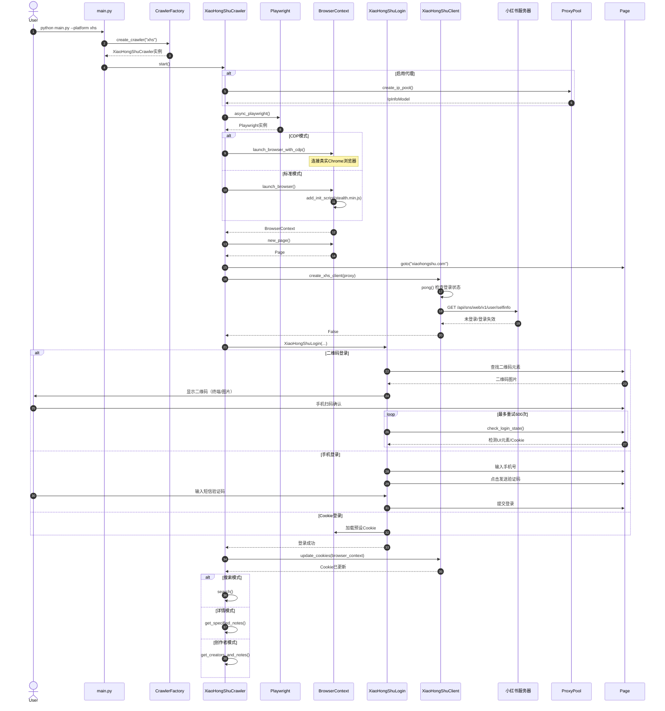
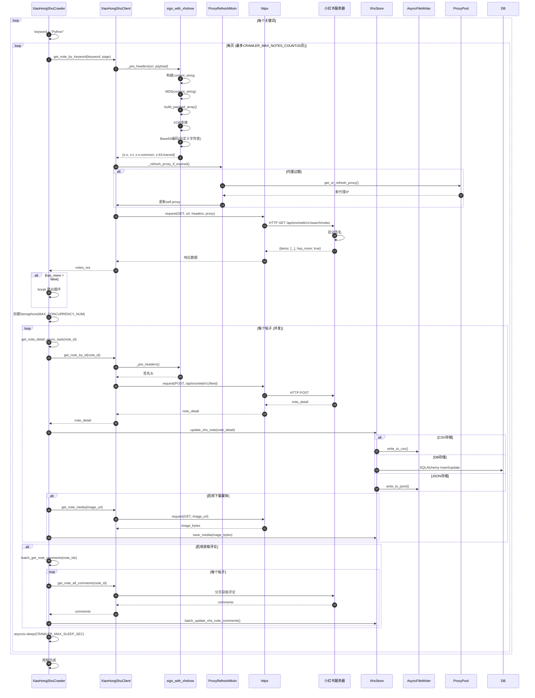
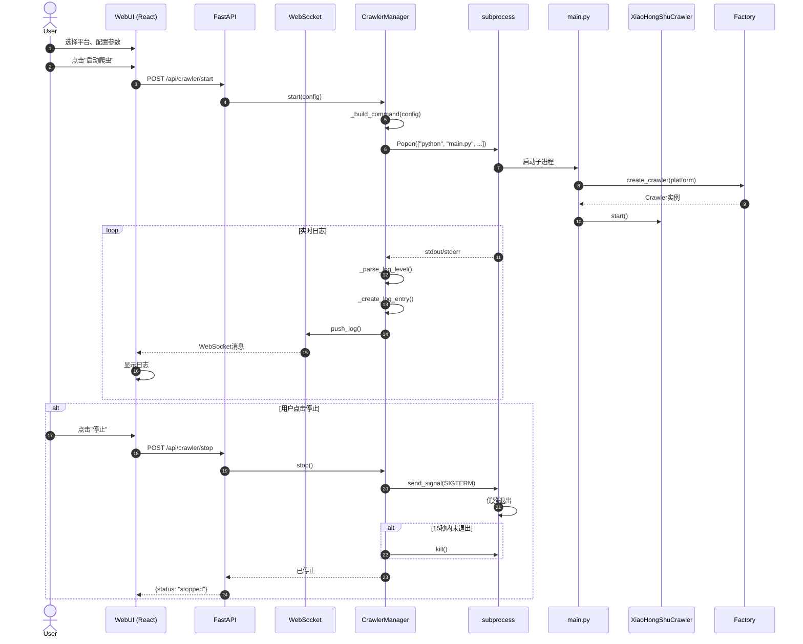
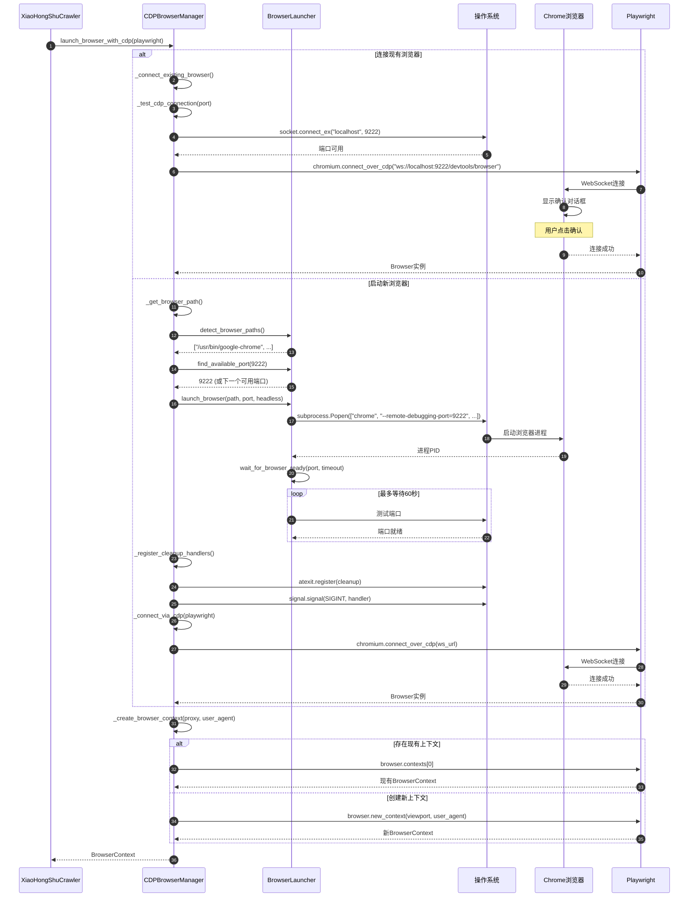
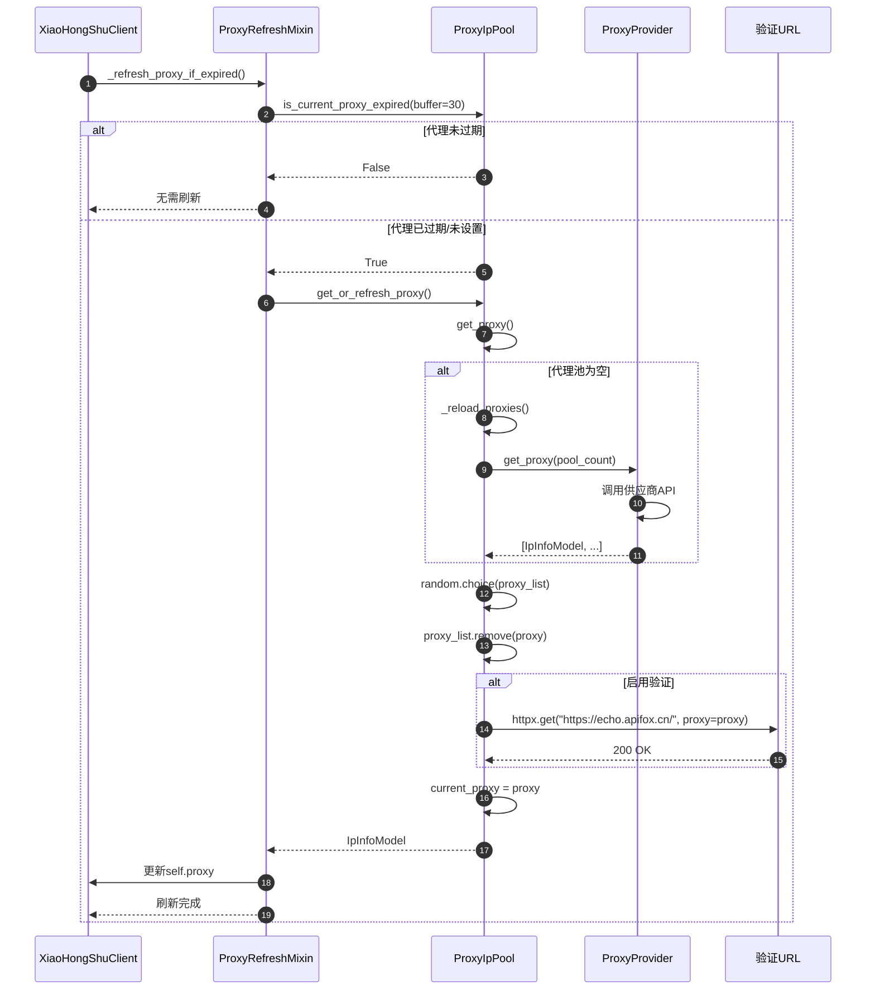

# MediaCrawler 时序图 (Sequence Diagram)

## 1. 爬虫启动与登录时序图

```mermaid
sequenceDiagram
    autonumber
    actor User
    participant Main as main.py
    participant Factory as CrawlerFactory
    participant Crawler as XiaoHongShuCrawler
    participant Playwright as Playwright
    participant Browser as BrowserContext
    participant Login as XiaoHongShuLogin
    participant Client as XiaoHongShuClient
    participant XHS as 小红书服务器

    User->>Main: python main.py --platform xhs
    Main->>Factory: create_crawler("xhs")
    Factory-->>Main: XiaoHongShuCrawler实例
    Main->>Crawler: start()

    alt 启用代理
        Crawler->>ProxyPool: create_ip_pool()
        ProxyPool-->>Crawler: IpInfoModel
    end

    Crawler->>Playwright: async_playwright()
    Playwright-->>Crawler: Playwright实例

    alt CDP模式
        Crawler->>Browser: launch_browser_with_cdp()
        Note over Browser: 连接真实Chrome浏览器
    else 标准模式
        Crawler->>Browser: launch_browser()
        Browser->>Browser: add_init_script(stealth.min.js)
    end
    Browser-->>Crawler: BrowserContext

    Crawler->>Browser: new_page()
    Browser-->>Crawler: Page
    Crawler->>Page: goto("xiaohongshu.com")

    Crawler->>Client: create_xhs_client(proxy)
    Client->>Client: pong() 检查登录状态
    Client->>XHS: GET /api/sns/web/v1/user/selfinfo
    XHS-->>Client: 未登录/登录失效
    Client-->>Crawler: False

    Crawler->>Login: XiaoHongShuLogin(...)
    alt 二维码登录
        Login->>Page: 查找二维码元素
        Page-->>Login: 二维码图片
        Login->>User: 显示二维码（终端/图片）
        User->>Page: 手机扫码确认
        loop 最多重试600次
            Login->>Page: check_login_state()
            Page-->>Login: 检测UI元素/Cookie
        end
    else 手机登录
        Login->>Page: 输入手机号
        Login->>Page: 点击发送验证码
        User->>Login: 输入短信验证码
        Login->>Page: 提交登录
    else Cookie登录
        Login->>Browser: 加载预设Cookie
    end
    Login-->>Crawler: 登录成功

    Crawler->>Client: update_cookies(browser_context)
    Client-->>Crawler: Cookie已更新

    alt 搜索模式
        Crawler->>Crawler: search()
    else 详情模式
        Crawler->>Crawler: get_specified_notes()
    else 创作者模式
        Crawler->>Crawler: get_creators_and_notes()
    end
```

## 2. 搜索爬取时序图

```mermaid
sequenceDiagram
    autonumber
    participant Crawler as XiaoHongShuCrawler
    participant Client as XiaoHongShuClient
    participant Sign as sign_with_xhshow
    participant Proxy as ProxyRefreshMixin
    participant Httpx as httpx
    participant XHS as 小红书服务器
    participant Store as XhsStore
    participant File as AsyncFileWriter

    loop 每个关键词
        Crawler->>Crawler: keyword = "Python"
        loop 每页 (最多CRAWLER_MAX_NOTES_COUNT/20页)
            Crawler->>Client: get_note_by_keyword(keyword, page)
            
            Client->>Sign: _pre_headers(uri, payload)
            Sign->>Sign: 构建content_string
            Sign->>Sign: MD5(content_string)
            Sign->>Sign: build_payload_array()
            Sign->>Sign: XOR变换
            Sign->>Sign: Base64编码(自定义字符表)
            Sign-->>Client: {x-s, x-t, x-s-common, x-b3-traceid}
            
            Client->>Proxy: _refresh_proxy_if_expired()
            alt 代理过期
                Proxy->>ProxyPool: get_or_refresh_proxy()
                ProxyPool-->>Proxy: 新代理IP
                Proxy->>Client: 更新self.proxy
            end
            
            Client->>Httpx: request(GET, url, headers, proxy)
            Httpx->>XHS: HTTP GET /api/sns/web/v1/search/notes
            XHS->>XHS: 验证签名
            XHS-->>Httpx: {items: [...], has_more: true}
            Httpx-->>Client: 响应数据
            Client-->>Crawler: notes_res
            
            alt has_more = false
                Crawler->>Crawler: break 跳出循环
            end
            
            Crawler->>Crawler: 创建Semaphore(MAX_CONCURRENCY_NUM)
            loop 每个帖子 (并发)
                Crawler->>Crawler: get_note_detail_async_task(note_id)
                Crawler->>Client: get_note_by_id(note_id)
                Client->>Sign: _pre_headers()
                Sign-->>Client: 签名头
                Client->>Httpx: request(POST, /api/sns/web/v1/feed)
                Httpx->>XHS: HTTP POST
                XHS-->>Httpx: note_detail
                Httpx-->>Client: note_detail
                Client-->>Crawler: note_detail
                
                Crawler->>Store: update_xhs_note(note_detail)
                alt CSV存储
                    Store->>File: write_to_csv()
                else DB存储
                    Store->>DB: SQLAlchemy insert/update
                else JSON存储
                    Store->>File: write_to_jsonl()
                end
                
                alt 启用下载媒体
                    Crawler->>Client: get_note_media(image_url)
                    Client->>Httpx: request(GET, image_url)
                    Httpx-->>Client: image_bytes
                    Crawler->>Store: save_media(image_bytes)
                end
            end
            
            alt 启用获取评论
                Crawler->>Crawler: batch_get_note_comments(note_ids)
                loop 每个帖子
                    Crawler->>Client: get_note_all_comments(note_id)
                    Client->>XHS: 分页获取评论
                    XHS-->>Client: comments
                    Client-->>Crawler: comments
                    Crawler->>Store: batch_update_xhs_note_comments()
                end
            end
            
            Crawler->>Crawler: asyncio.sleep(CRAWLER_MAX_SLEEP_SEC)
        end
    end
    Crawler->>Crawler: 爬取完成
```

## 3. WebUI启动爬虫时序图

```mermaid
sequenceDiagram
    autonumber
    actor User
    participant WebUI as WebUI (React)
    participant API as FastAPI
    participant WS as WebSocket
    participant Manager as CrawlerManager
    participant Process as subprocess
    participant Main as main.py
    participant Crawler as XiaoHongShuCrawler

    User->>WebUI: 选择平台、配置参数
    User->>WebUI: 点击"启动爬虫"
    WebUI->>API: POST /api/crawler/start
    API->>Manager: start(config)
    Manager->>Manager: _build_command(config)
    Manager->>Process: Popen(["python", "main.py", ...])
    Process->>Main: 启动子进程
    Main->>Factory: create_crawler(platform)
    Factory-->>Main: Crawler实例
    Main->>Crawler: start()
    
    loop 实时日志
        Process-->>Manager: stdout/stderr
        Manager->>Manager: _parse_log_level()
        Manager->>Manager: _create_log_entry()
        Manager->>WS: push_log()
        WS-->>WebUI: WebSocket消息
        WebUI->>WebUI: 显示日志
    end
    
    alt 用户点击停止
        User->>WebUI: 点击"停止"
        WebUI->>API: POST /api/crawler/stop
        API->>Manager: stop()
        Manager->>Process: send_signal(SIGTERM)
        Process->>Process: 优雅退出
        alt 15秒内未退出
            Manager->>Process: kill()
        end
        Manager-->>API: 已停止
        API-->>WebUI: {status: "stopped"}
    end
```

## 4. CDP模式浏览器启动时序图

```mermaid
sequenceDiagram
    autonumber
    participant Crawler as XiaoHongShuCrawler
    participant CDP as CDPBrowserManager
    participant Launcher as BrowserLauncher
    participant OS as 操作系统
    participant Chrome as Chrome浏览器
    participant Playwright as Playwright

    Crawler->>CDP: launch_browser_with_cdp(playwright)
    
    alt 连接现有浏览器
        CDP->>CDP: _connect_existing_browser()
        CDP->>CDP: _test_cdp_connection(port)
        CDP->>OS: socket.connect_ex("localhost", 9222)
        OS-->>CDP: 端口可用
        CDP->>Playwright: chromium.connect_over_cdp("ws://localhost:9222/devtools/browser")
        Playwright->>Chrome: WebSocket连接
        Chrome->>Chrome: 显示确认对话框
        Note over Chrome: 用户点击确认
        Chrome-->>Playwright: 连接成功
        Playwright-->>CDP: Browser实例
    else 启动新浏览器
        CDP->>CDP: _get_browser_path()
        CDP->>Launcher: detect_browser_paths()
        Launcher-->>CDP: ["/usr/bin/google-chrome", ...]
        CDP->>Launcher: find_available_port(9222)
        Launcher-->>CDP: 9222 (或下一个可用端口)
        CDP->>Launcher: launch_browser(path, port, headless)
        Launcher->>OS: subprocess.Popen(["chrome", "--remote-debugging-port=9222", ...])
        OS->>Chrome: 启动浏览器进程
        Chrome-->>Launcher: 进程PID
        Launcher->>Launcher: wait_for_browser_ready(port, timeout)
        loop 最多等待60秒
            Launcher->>OS: 测试端口
            OS-->>Launcher: 端口就绪
        end
        CDP->>CDP: _register_cleanup_handlers()
        CDP->>OS: atexit.register(cleanup)
        CDP->>OS: signal.signal(SIGINT, handler)
        CDP->>CDP: _connect_via_cdp(playwright)
        CDP->>Playwright: chromium.connect_over_cdp(ws_url)
        Playwright->>Chrome: WebSocket连接
        Chrome-->>Playwright: 连接成功
        Playwright-->>CDP: Browser实例
    end
    
    CDP->>CDP: _create_browser_context(proxy, user_agent)
    alt 存在现有上下文
        CDP->>Playwright: browser.contexts[0]
        Playwright-->>CDP: 现有BrowserContext
    else 创建新上下文
        CDP->>Playwright: browser.new_context(viewport, user_agent)
        Playwright-->>CDP: 新BrowserContext
    end
    CDP-->>Crawler: BrowserContext
```

## 5. 代理池工作时序图

```mermaid
sequenceDiagram
    autonumber
    participant Client as XiaoHongShuClient
    participant Mixin as ProxyRefreshMixin
    participant Pool as ProxyIpPool
    participant Provider as ProxyProvider
    participant Validate as 验证URL

    Client->>Mixin: _refresh_proxy_if_expired()
    Mixin->>Pool: is_current_proxy_expired(buffer=30)
    
    alt 代理未过期
        Pool-->>Mixin: False
        Mixin-->>Client: 无需刷新
    else 代理已过期/未设置
        Pool-->>Mixin: True
        Mixin->>Pool: get_or_refresh_proxy()
        Pool->>Pool: get_proxy()
        
        alt 代理池为空
            Pool->>Pool: _reload_proxies()
            Pool->>Provider: get_proxy(pool_count)
            Provider->>Provider: 调用供应商API
            Provider-->>Pool: [IpInfoModel, ...]
        end
        
        Pool->>Pool: random.choice(proxy_list)
        Pool->>Pool: proxy_list.remove(proxy)
        
        alt 启用验证
            Pool->>Validate: httpx.get("https://echo.apifox.cn/", proxy=proxy)
            Validate-->>Pool: 200 OK
        end
        
        Pool->>Pool: current_proxy = proxy
        Pool-->>Mixin: IpInfoModel
        Mixin->>Client: 更新self.proxy
        Mixin-->>Client: 刷新完成
    end
```
