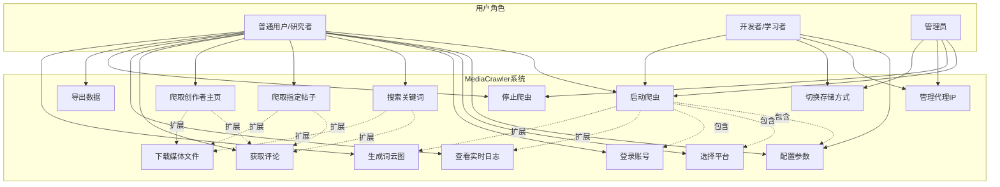
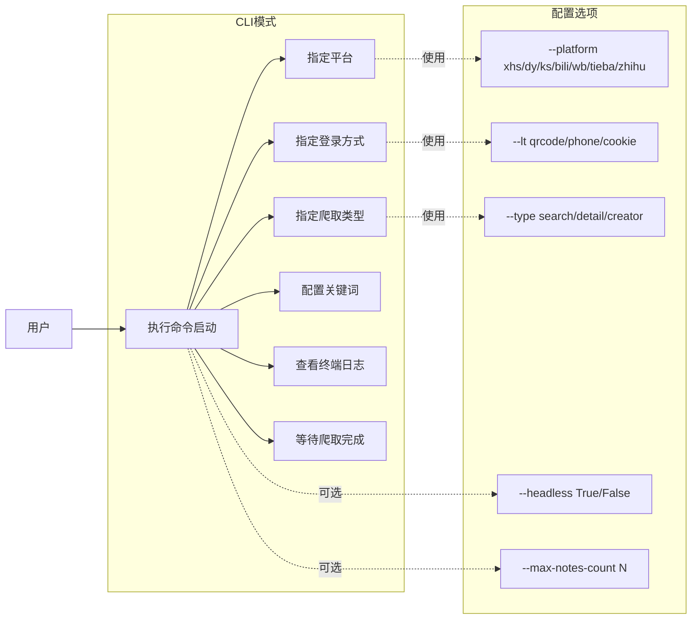
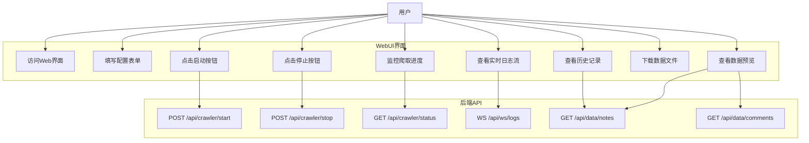
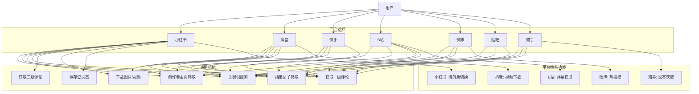
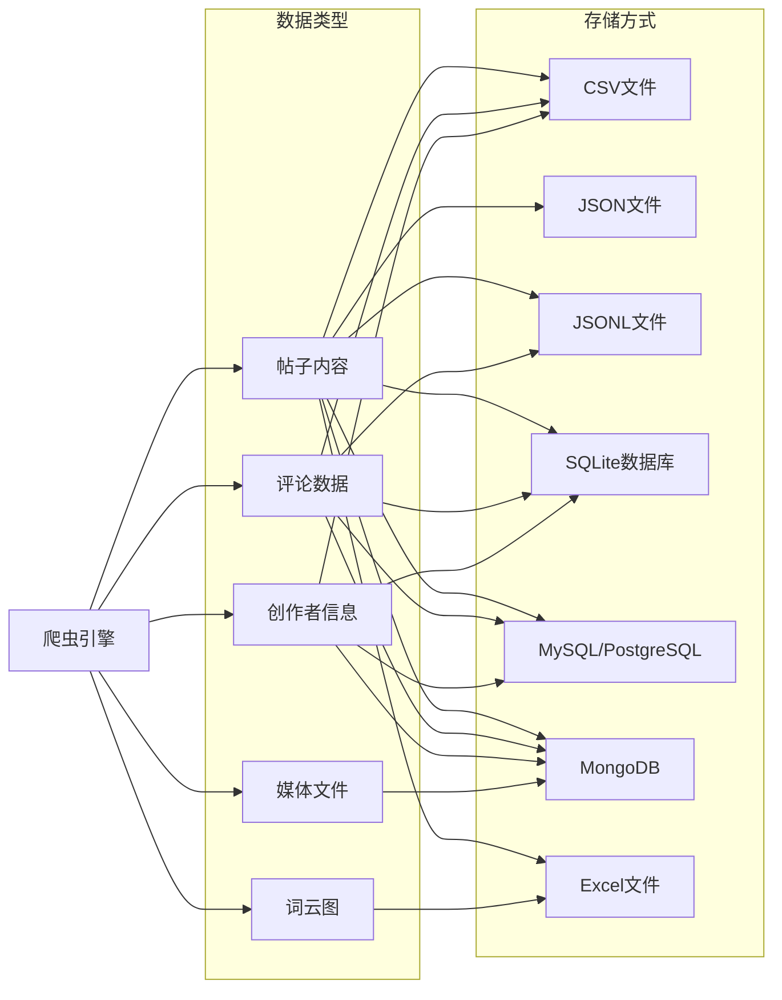
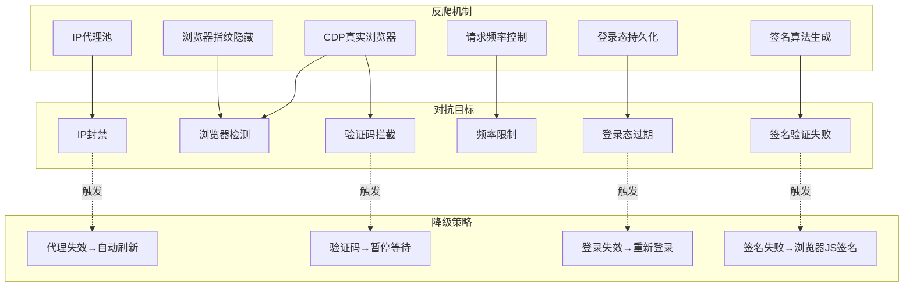
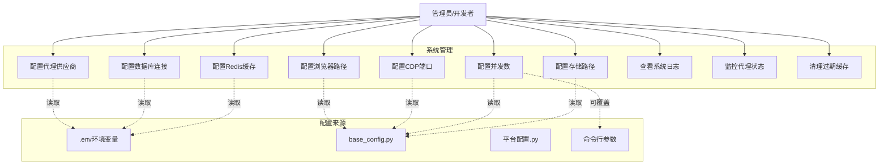

# MediaCrawler 用例图 (Use Case Diagram)

## 1. 系统整体用例图

```mermaid
graph TB
    subgraph 用户角色
        U1[普通用户/研究者]
        U2[开发者/学习者]
        U3[管理员]
    end

    subgraph MediaCrawler系统
        UC1[启动爬虫]
        UC2[配置参数]
        UC3[选择平台]
        UC4[登录账号]
        UC5[搜索关键词]
        UC6[爬取指定帖子]
        UC7[爬取创作者主页]
        UC8[获取评论]
        UC9[下载媒体文件]
        UC10[查看实时日志]
        UC11[停止爬虫]
        UC12[导出数据]
        UC13[生成词云图]
        UC14[管理代理IP]
        UC15[切换存储方式]
    end

    U1 --> UC1
    U1 --> UC2
    U1 --> UC3
    U1 --> UC4
    U1 --> UC5
    U1 --> UC6
    U1 --> UC7
    U1 --> UC8
    U1 --> UC10
    U1 --> UC11
    U1 --> UC12
    U1 --> UC13

    U2 --> UC2
    U2 --> UC14
    U2 --> UC15
    U2 --> UC1

    U3 --> UC1
    U3 --> UC11
    U3 --> UC14
    U3 --> UC15

    UC1 -.包含.-> UC2
    UC1 -.包含.-> UC3
    UC1 -.包含.-> UC4
    UC5 -.扩展.-> UC8
    UC6 -.扩展.-> UC8
    UC7 -.扩展.-> UC8
    UC5 -.扩展.-> UC9
    UC6 -.扩展.-> UC9
    UC7 -.扩展.-> UC9
    UC1 -.扩展.-> UC10
    UC1 -.扩展.-> UC13
```

## 2. CLI模式用例图

```mermaid
graph LR
    User[用户]

    subgraph CLI模式
        UC1[执行命令启动]
        UC2[指定平台]
        UC3[指定登录方式]
        UC4[指定爬取类型]
        UC5[配置关键词]
        UC6[查看终端日志]
        UC7[等待爬取完成]
    end

    subgraph 配置选项
        OPT1[--platform xhs/dy/ks/bili/wb/tieba/zhihu]
        OPT2[--lt qrcode/phone/cookie]
        OPT3[--type search/detail/creator]
        OPT4[--headless True/False]
        OPT5[--max-notes-count N]
    end

    User --> UC1
    UC1 --> UC2
    UC1 --> UC3
    UC1 --> UC4
    UC1 --> UC5
    UC1 --> UC6
    UC1 --> UC7

    UC2 -.使用.-> OPT1
    UC3 -.使用.-> OPT2
    UC4 -.使用.-> OPT3
    UC1 -.可选.-> OPT4
    UC1 -.可选.-> OPT5
```

## 3. WebUI模式用例图

```mermaid
graph TB
    User[用户]

    subgraph WebUI界面
        UC1[访问Web界面]
        UC2[填写配置表单]
        UC3[点击启动按钮]
        UC4[查看实时日志流]
        UC5[监控爬取进度]
        UC6[点击停止按钮]
        UC7[查看历史记录]
        UC8[下载数据文件]
        UC9[查看数据预览]
    end

    subgraph 后端API
        API1[POST /api/crawler/start]
        API2[POST /api/crawler/stop]
        API3[GET /api/crawler/status]
        API4[WS /api/ws/logs]
        API5[GET /api/data/notes]
        API6[GET /api/data/comments]
    end

    User --> UC1
    User --> UC2
    User --> UC3
    User --> UC4
    User --> UC5
    User --> UC6
    User --> UC7
    User --> UC8
    User --> UC9

    UC3 --> API1
    UC6 --> API2
    UC5 --> API3
    UC4 --> API4
    UC7 --> API5
    UC9 --> API5
    UC9 --> API6
```

## 4. 爬虫核心用例图（按平台）

```mermaid
graph TB
    User[用户]

    subgraph 平台选择
        P1[小红书]
        P2[抖音]
        P3[快手]
        P4[B站]
        P5[微博]
        P6[贴吧]
        P7[知乎]
    end

    subgraph 通用功能
        UC1[关键词搜索]
        UC2[指定帖子爬取]
        UC3[创作者主页爬取]
        UC4[获取一级评论]
        UC5[获取二级评论]
        UC6[下载图片/视频]
        UC7[保存登录态]
    end

    subgraph 平台特有功能
        S1[小红书: 海外版切换]
        S2[抖音: 视频下载]
        S3[B站: 弹幕获取]
        S4[微博: 热搜榜]
        S5[知乎: 回答获取]
    end

    User --> P1
    User --> P2
    User --> P3
    User --> P4
    User --> P5
    User --> P6
    User --> P7

    P1 --> UC1
    P1 --> UC2
    P1 --> UC3
    P1 --> UC4
    P1 --> UC5
    P1 --> UC6
    P1 --> UC7
    P1 --> S1

    P2 --> UC1
    P2 --> UC2
    P2 --> UC3
    P2 --> UC4
    P2 --> UC6
    P2 --> S2

    P3 --> UC1
    P3 --> UC2
    P3 --> UC3
    P3 --> UC4

    P4 --> UC1
    P4 --> UC2
    P4 --> UC3
    P4 --> UC4
    P4 --> S3

    P5 --> UC1
    P5 --> UC2
    P5 --> UC4
    P5 --> S4

    P6 --> UC1
    P6 --> UC2
    P6 --> UC4

    P7 --> UC1
    P7 --> UC2
    P7 --> UC4
    P7 --> S5
```

## 5. 数据存储用例图

```mermaid
graph LR
    Crawler[爬虫引擎]

    subgraph 存储方式
        S1[CSV文件]
        S2[JSON文件]
        S3[JSONL文件]
        S4[SQLite数据库]
        S5[MySQL/PostgreSQL]
        S6[MongoDB]
        S7[Excel文件]
    end

    subgraph 数据类型
        D1[帖子内容]
        D2[评论数据]
        D3[创作者信息]
        D4[媒体文件]
        D5[词云图]
    end

    Crawler --> D1
    Crawler --> D2
    Crawler --> D3
    Crawler --> D4
    Crawler --> D5

    D1 --> S1
    D1 --> S2
    D1 --> S3
    D1 --> S4
    D1 --> S5
    D1 --> S6
    D1 --> S7

    D2 --> S1
    D2 --> S3
    D2 --> S4
    D2 --> S5
    D2 --> S6

    D3 --> S1
    D3 --> S4
    D3 --> S5
    D3 --> S6

    D4 --> S6
    D5 --> S7
```

## 6. 反爬策略用例图

```mermaid
graph TB
    subgraph 反爬机制
        A1[IP代理池]
        A2[浏览器指纹隐藏]
        A3[CDP真实浏览器]
        A4[请求频率控制]
        A5[登录态持久化]
        A6[签名算法生成]
    end

    subgraph 对抗目标
        T1[IP封禁]
        T2[浏览器检测]
        T3[验证码拦截]
        T4[频率限制]
        T5[登录态过期]
        T6[签名验证失败]
    end

    A1 --> T1
    A2 --> T2
    A3 --> T2
    A3 --> T3
    A4 --> T4
    A5 --> T5
    A6 --> T6

    subgraph 降级策略
        F1[签名失败→浏览器JS签名]
        F2[代理失效→自动刷新]
        F3[登录失效→重新登录]
        F4[验证码→暂停等待]
    end

    T6 -.触发.-> F1
    T1 -.触发.-> F2
    T5 -.触发.-> F3
    T3 -.触发.-> F4
```

## 7. 系统管理用例图

```mermaid
graph TB
    Admin[管理员/开发者]

    subgraph 系统管理
        M1[配置代理供应商]
        M2[配置数据库连接]
        M3[配置Redis缓存]
        M4[配置浏览器路径]
        M5[配置CDP端口]
        M6[配置并发数]
        M7[配置存储路径]
        M8[查看系统日志]
        M9[监控代理状态]
        M10[清理过期缓存]
    end

    subgraph 配置来源
        C1[.env环境变量]
        C2[base_config.py]
        C3[平台配置.py]
        C4[命令行参数]
    end

    Admin --> M1
    Admin --> M2
    Admin --> M3
    Admin --> M4
    Admin --> M5
    Admin --> M6
    Admin --> M7
    Admin --> M8
    Admin --> M9
    Admin --> M10

    M1 -.读取.-> C1
    M2 -.读取.-> C1
    M3 -.读取.-> C1
    M4 -.读取.-> C2
    M5 -.读取.-> C2
    M6 -.读取.-> C2
    M7 -.读取.-> C2
    M6 -.可覆盖.-> C4
```
