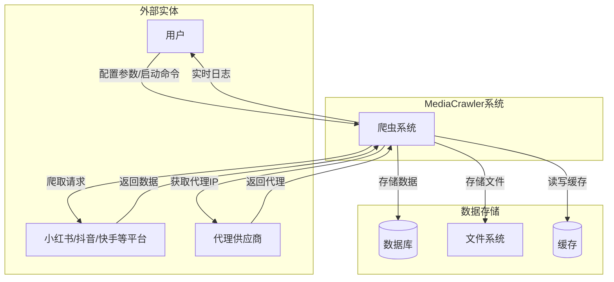
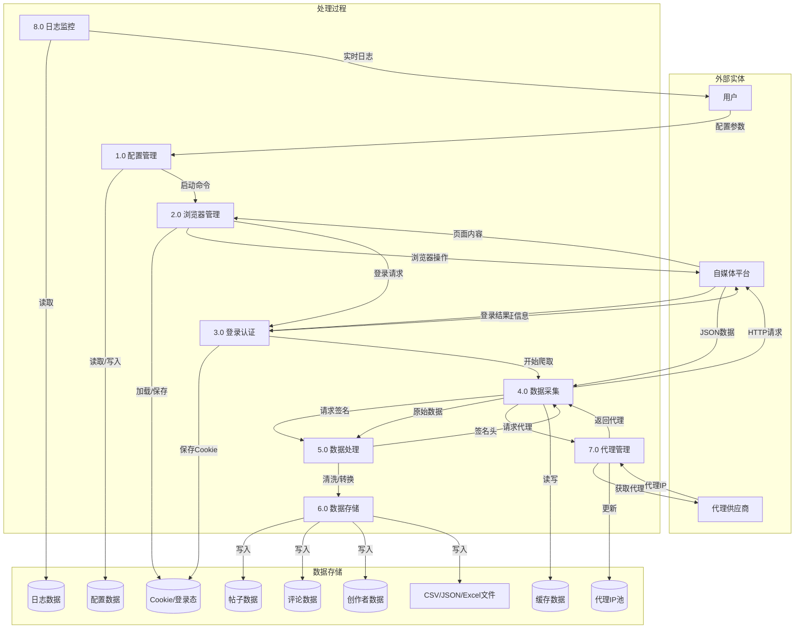
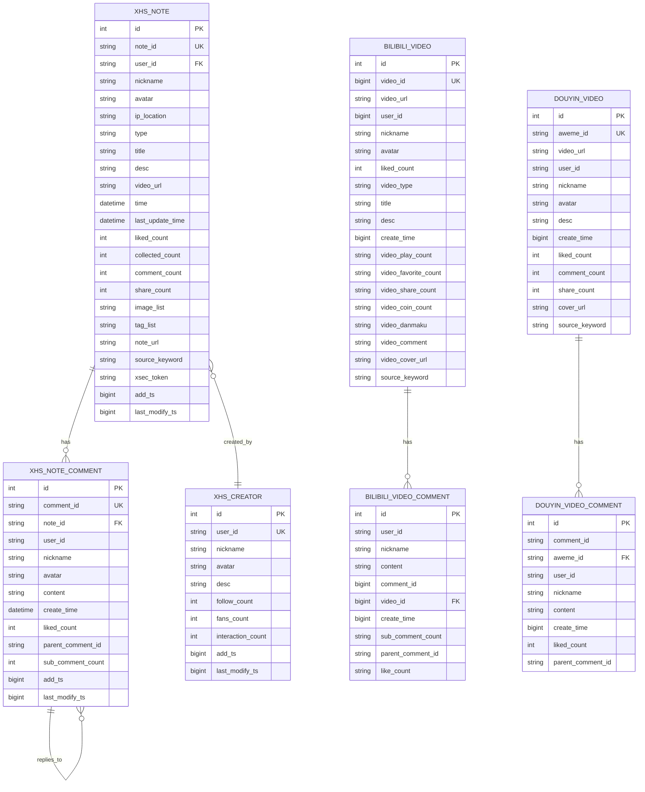
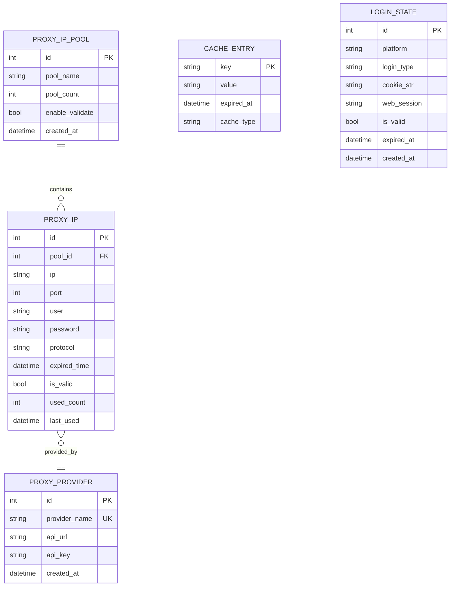
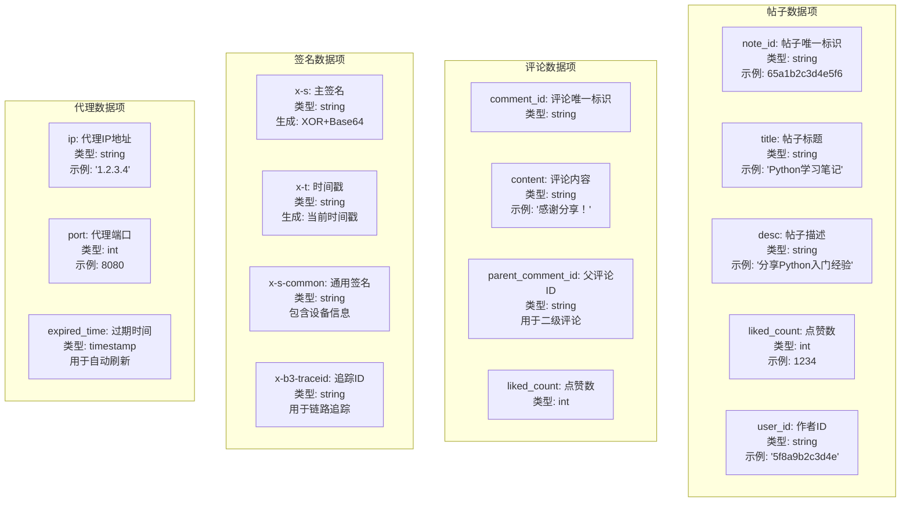
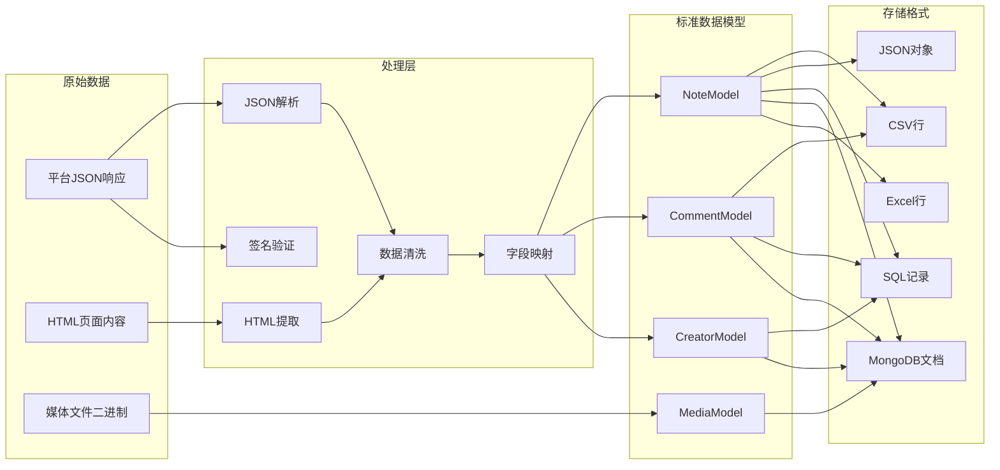
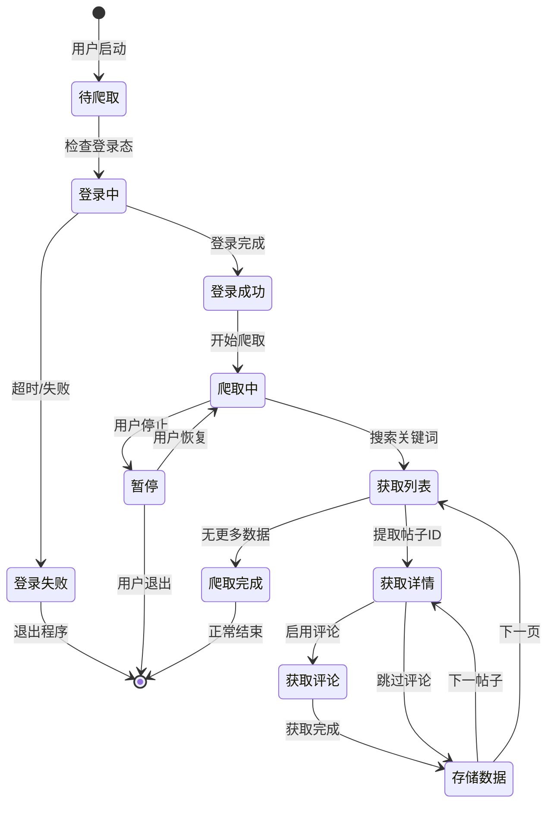

# MediaCrawler 数据流E-R图 (Data Flow & E-R Diagram)

## 1. 系统数据流图 (DFD Level 0 - 上下文图)



## 2. 系统数据流图 (DFD Level 1)



## 3. 数据流详细图 - 搜索爬取流程

```mermaid
graph LR
    subgraph 输入
        I1[关键词: "Python"]
        I2[页码: 1,2,3...]
        I3[最大数量: 100]
    end

    subgraph 处理
        P1[构建搜索请求]
        P2[生成签名头]
        P3[发送HTTP请求]
        P4[解析响应JSON]
        P5[提取帖子ID列表]
        P6[并发获取帖子详情]
        P7[获取评论]
        P8[数据清洗]
    end

    subgraph 输出
        O1[帖子数据]
        O2[评论数据]
        O3[媒体URL]
    end

    I1 --> P1
    I2 --> P1
    P1 --> P2
    P2 --> P3
    P3 --> P4
    P4 --> P5
    P5 --> P6
    P6 --> P7
    P7 --> P8
    P8 --> O1
    P8 --> O2
    P6 --> O3
```

## 4. E-R图 - 数据库实体关系



## 5. E-R图 - 代理与缓存实体



## 6. 数据字典 - 核心数据项



## 7. 数据转换流程图



## 8. 数据状态转换图


