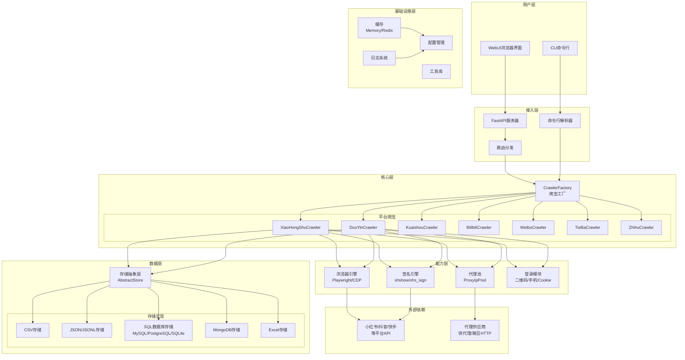
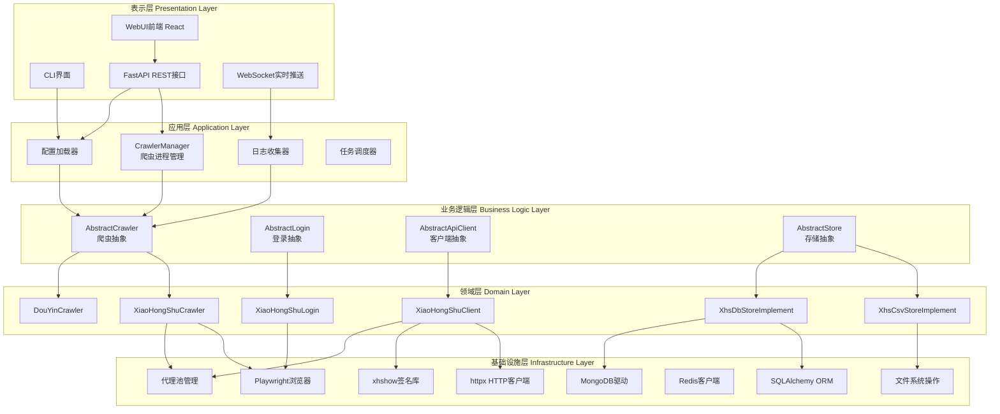
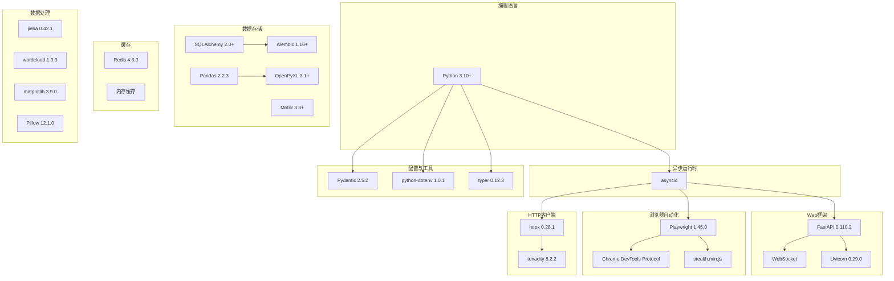
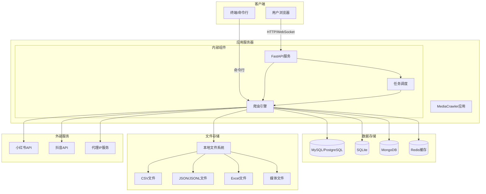
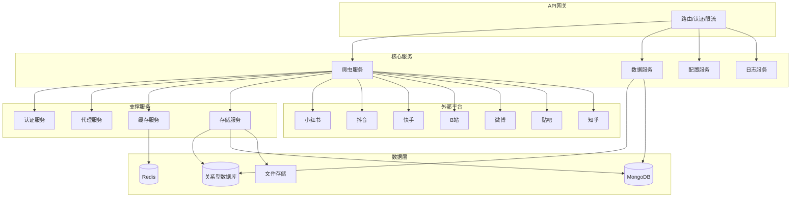
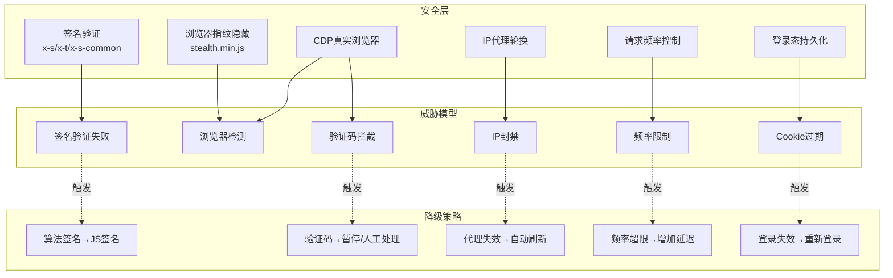
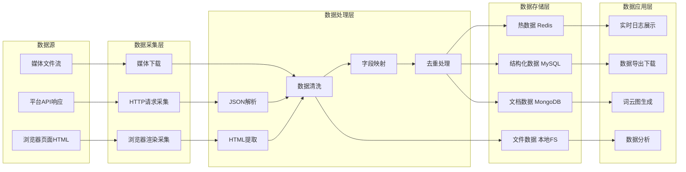
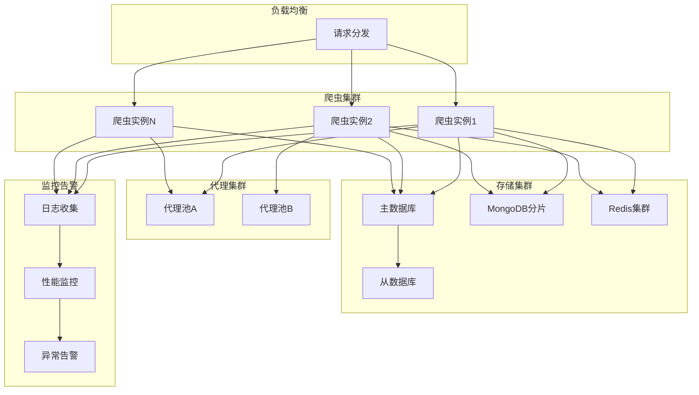

# MediaCrawler 系统架构图 (System Architecture Diagram)

## 1. 整体系统架构图

```mermaid
graph TB
    subgraph 用户层
        CLI[CLI命令行]
        WebUI[WebUI浏览器界面]
    end

    subgraph 接入层
        Router[路由分发]
        APIServer[FastAPI服务器]
        CmdParser[命令行解析器]
    end

    subgraph 核心层
        Factory[CrawlerFactory<br/>爬虫工厂]
        subgraph 平台爬虫
            XHS[XiaoHongShuCrawler]
            DY[DouYinCrawler]
            KS[KuaishouCrawler]
            BILI[BilibiliCrawler]
            WB[WeiboCrawler]
            TB[TieBaCrawler]
            ZH[ZhihuCrawler]
        end
    end

    subgraph 能力层
        Browser[浏览器引擎<br/>Playwright/CDP]
        Sign[签名引擎<br/>xhshow/xhs_sign]
        Proxy[代理池<br/>ProxyIpPool]
        Login[登录模块<br/>二维码/手机/Cookie]
    end

    subgraph 数据层
        Store[存储抽象层<br/>AbstractStore]
        subgraph 存储实现
            CSV[CSV存储]
            JSON[JSON/JSONL存储]
            DB[SQL数据库存储<br/>MySQL/PostgreSQL/SQLite]
            Mongo[MongoDB存储]
            Excel[Excel存储]
        end
    end

    subgraph 基础设施层
        Cache[缓存<br/>Memory/Redis]
        Config[配置管理]
        Logger[日志系统]
        Utils[工具库]
    end

    subgraph 外部依赖
        Platform1[小红书/抖音/快手<br/>等平台API]
        Platform2[代理供应商<br/>快代理/豌豆HTTP]
    end

    CLI --> CmdParser
    WebUI --> APIServer
    APIServer --> Router
    Router --> Factory
    CmdParser --> Factory

    Factory --> XHS
    Factory --> DY
    Factory --> KS
    Factory --> BILI
    Factory --> WB
    Factory --> TB
    Factory --> ZH

    XHS --> Browser
    XHS --> Sign
    XHS --> Proxy
    XHS --> Login
    DY --> Browser
    DY --> Sign
    DY --> Proxy
    DY --> Login

    XHS --> Store
    DY --> Store
    Store --> CSV
    Store --> JSON
    Store --> DB
    Store --> Mongo
    Store --> Excel

    Browser --> Platform1
    Sign --> Platform1
    Proxy --> Platform2

    Cache --> Config
    Logger --> Config
```

## 2. 分层架构图

```mermaid
graph TB
    subgraph 表示层 Presentation Layer
        P1[CLI界面]
        P2[WebUI前端 React]
        P3[FastAPI REST接口]
        P4[WebSocket实时推送]
    end

    subgraph 应用层 Application Layer
        A1[CrawlerManager<br/>爬虫进程管理]
        A2[配置加载器]
        A3[日志收集器]
        A4[任务调度器]
    end

    subgraph 业务逻辑层 Business Logic Layer
        B1[AbstractCrawler<br/>爬虫抽象]
        B2[AbstractLogin<br/>登录抽象]
        B3[AbstractApiClient<br/>客户端抽象]
        B4[AbstractStore<br/>存储抽象]
    end

    subgraph 领域层 Domain Layer
        D1[XiaoHongShuCrawler]
        D2[DouYinCrawler]
        D3[XiaoHongShuClient]
        D4[XiaoHongShuLogin]
        D5[XhsCsvStoreImplement]
        D6[XhsDbStoreImplement]
    end

    subgraph 基础设施层 Infrastructure Layer
        I1[Playwright浏览器]
        I2[httpx HTTP客户端]
        I3[xhshow签名库]
        I4[SQLAlchemy ORM]
        I5[MongoDB驱动]
        I6[Redis客户端]
        I7[代理池管理]
        I8[文件系统操作]
    end

    P1 --> A2
    P2 --> P3
    P3 --> A1
    P3 --> A2
    P4 --> A3

    A1 --> B1
    A2 --> B1
    A3 --> B1

    B1 --> D1
    B1 --> D2
    B2 --> D4
    B3 --> D3
    B4 --> D5
    B4 --> D6

    D1 --> I1
    D1 --> I7
    D3 --> I2
    D3 --> I3
    D3 --> I7
    D4 --> I1
    D5 --> I8
    D6 --> I4
    D6 --> I5
```

## 3. 技术栈架构图

```mermaid
graph TB
    subgraph 编程语言
        Lang[Python 3.10+]
    end

    subgraph 异步运行时
        Async[asyncio]
    end

    subgraph Web框架
        Web[FastAPI 0.110.2]
        WS[WebSocket]
        Uvicorn[Uvicorn 0.29.0]
    end

    subgraph 浏览器自动化
        PW[Playwright 1.45.0]
        CDP[Chrome DevTools Protocol]
        Stealth[stealth.min.js]
    end

    subgraph HTTP客户端
        Httpx[httpx 0.28.1]
        Retry[tenacity 8.2.2]
    end

    subgraph 数据存储
        SQL[SQLAlchemy 2.0+]
        Alembic[Alembic 1.16+]
        Motor[Motor 3.3+]
        Pandas[Pandas 2.2.3]
        OpenPyXL[OpenPyXL 3.1+]
    end

    subgraph 缓存
        Redis[Redis 4.6.0]
        Memory[内存缓存]
    end

    subgraph 数据处理
        Jieba[jieba 0.42.1]
        WordCloud[wordcloud 1.9.3]
        Matplotlib[matplotlib 3.9.0]
        Pillow[Pillow 12.1.0]
    end

    subgraph 配置与工具
        Pydantic[Pydantic 2.5.2]
        DotEnv[python-dotenv 1.0.1]
        Typer[typer 0.12.3]
    end

    Lang --> Async
    Async --> Web
    Async --> PW
    Async --> Httpx

    Web --> Uvicorn
    Web --> WS

    PW --> CDP
    PW --> Stealth

    Httpx --> Retry

    SQL --> Alembic
    Pandas --> OpenPyXL

    Lang --> Pydantic
    Lang --> DotEnv
    Lang --> Typer
```

## 4. 部署架构图

```mermaid
graph TB
    subgraph 客户端
        Browser[用户浏览器]
        Terminal[终端/命令行]
    end

    subgraph 应用服务器
        App[MediaCrawler应用]
        subgraph 内部组件
            API[FastAPI服务]
            Crawler[爬虫引擎]
            Scheduler[任务调度]
        end
    end

    subgraph 数据存储
        MySQL[(MySQL/PostgreSQL)]
        SQLite[(SQLite)]
        Mongo[(MongoDB)]
        Redis[(Redis缓存)]
    end

    subgraph 文件存储
        FS[本地文件系统]
        CSV[CSV文件]
        JSON[JSON/JSONL文件]
        Excel[Excel文件]
        Media[媒体文件]
    end

    subgraph 外部服务
        XHS[小红书API]
        DY[抖音API]
        Proxy[代理IP服务]
    end

    Browser -->|HTTP/WebSocket| API
    Terminal -->|命令行| Crawler

    API --> Crawler
    API --> Scheduler
    Scheduler --> Crawler

    Crawler --> XHS
    Crawler --> DY
    Crawler --> Proxy

    Crawler --> MySQL
    Crawler --> SQLite
    Crawler --> Mongo
    Crawler --> Redis

    Crawler --> FS
    FS --> CSV
    FS --> JSON
    FS --> Excel
    FS --> Media
```

## 5. 微服务视角架构图

```mermaid
graph TB
    subgraph API网关
        Gateway[路由/认证/限流]
    end

    subgraph 核心服务
        CrawlerService[爬虫服务]
        DataService[数据服务]
        ConfigService[配置服务]
        LogService[日志服务]
    end

    subgraph 支撑服务
        AuthService[认证服务]
        ProxyService[代理服务]
        CacheService[缓存服务]
        StorageService[存储服务]
    end

    subgraph 外部平台
        P1[小红书]
        P2[抖音]
        P3[快手]
        P4[B站]
        P5[微博]
        P6[贴吧]
        P7[知乎]
    end

    subgraph 数据层
        DB1[(关系型数据库)]
        DB2[(MongoDB)]
        DB3[(Redis)]
        FS1[文件存储]
    end

    Gateway --> CrawlerService
    Gateway --> DataService
    Gateway --> ConfigService
    Gateway --> LogService

    CrawlerService --> AuthService
    CrawlerService --> ProxyService
    CrawlerService --> CacheService
    CrawlerService --> StorageService

    CrawlerService --> P1
    CrawlerService --> P2
    CrawlerService --> P3
    CrawlerService --> P4
    CrawlerService --> P5
    CrawlerService --> P6
    CrawlerService --> P7

    DataService --> DB1
    DataService --> DB2
    StorageService --> DB1
    StorageService --> DB2
    StorageService --> FS1
    CacheService --> DB3
```

## 6. 安全架构图

```mermaid
graph TB
    subgraph 安全层
        S1[签名验证<br/>x-s/x-t/x-s-common]
        S2[浏览器指纹隐藏<br/>stealth.min.js]
        S3[CDP真实浏览器]
        S4[IP代理轮换]
        S5[请求频率控制]
        S6[登录态持久化]
    end

    subgraph 威胁模型
        T1[IP封禁]
        T2[浏览器检测]
        T3[签名验证失败]
        T4[频率限制]
        T5[验证码拦截]
        T6[Cookie过期]
    end

    subgraph 降级策略
        F1[算法签名→JS签名]
        F2[代理失效→自动刷新]
        F3[登录失效→重新登录]
        F4[频率超限→增加延迟]
        F5[验证码→暂停/人工处理]
    end

    S1 --> T3
    S2 --> T2
    S3 --> T2
    S3 --> T5
    S4 --> T1
    S5 --> T4
    S6 --> T6

    T3 -.触发.-> F1
    T1 -.触发.-> F2
    T6 -.触发.-> F3
    T4 -.触发.-> F4
    T5 -.触发.-> F5
```

## 7. 数据架构图

```mermaid
graph LR
    subgraph 数据源
        Source1[平台API响应]
        Source2[浏览器页面HTML]
        Source3[媒体文件流]
    end

    subgraph 数据采集层
        Collect1[HTTP请求采集]
        Collect2[浏览器渲染采集]
        Collect3[媒体下载]
    end

    subgraph 数据处理层
        Process1[JSON解析]
        Process2[HTML提取]
        Process3[数据清洗]
        Process4[字段映射]
        Process5[去重处理]
    end

    subgraph 数据存储层
        Store1[热数据 Redis]
        Store2[结构化数据 MySQL]
        Store3[文档数据 MongoDB]
        Store4[文件数据 本地FS]
    end

    subgraph 数据应用层
        App1[实时日志展示]
        App2[数据导出下载]
        App3[词云图生成]
        App4[数据分析]
    end

    Source1 --> Collect1
    Source2 --> Collect2
    Source3 --> Collect3

    Collect1 --> Process1
    Collect2 --> Process2
    Collect3 --> Process3
    Process1 --> Process3
    Process2 --> Process3
    Process3 --> Process4
    Process4 --> Process5

    Process5 --> Store1
    Process5 --> Store2
    Process5 --> Store3
    Process3 --> Store4

    Store1 --> App1
    Store2 --> App2
    Store3 --> App3
    Store4 --> App4
```

## 8. 高可用架构图

```mermaid
graph TB
    subgraph 负载均衡
        LB[请求分发]
    end

    subgraph 爬虫集群
        C1[爬虫实例1]
        C2[爬虫实例2]
        C3[爬虫实例N]
    end

    subgraph 代理集群
        P1[代理池A]
        P2[代理池B]
    end

    subgraph 存储集群
        S1[主数据库]
        S2[从数据库]
        S3[MongoDB分片]
        S4[Redis集群]
    end

    subgraph 监控告警
        M1[日志收集]
        M2[性能监控]
        M3[异常告警]
    end

    LB --> C1
    LB --> C2
    LB --> C3

    C1 --> P1
    C2 --> P2
    C3 --> P1

    C1 --> S1
    C2 --> S1
    C3 --> S1
    S1 --> S2
    C1 --> S3
    C2 --> S3
    C1 --> S4
    C2 --> S4

    C1 --> M1
    C2 --> M1
    C3 --> M1
    M1 --> M2
    M2 --> M3
```
