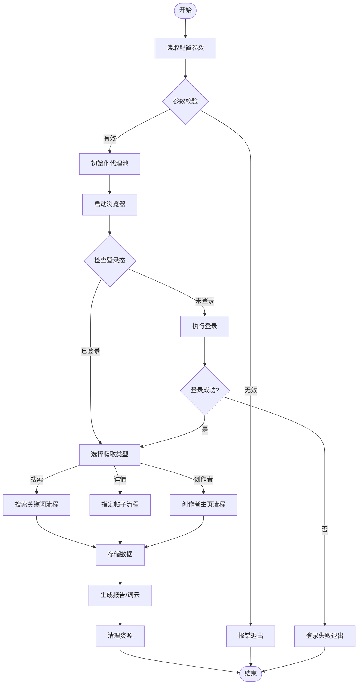
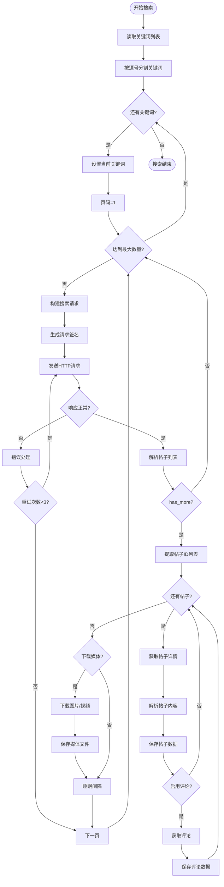
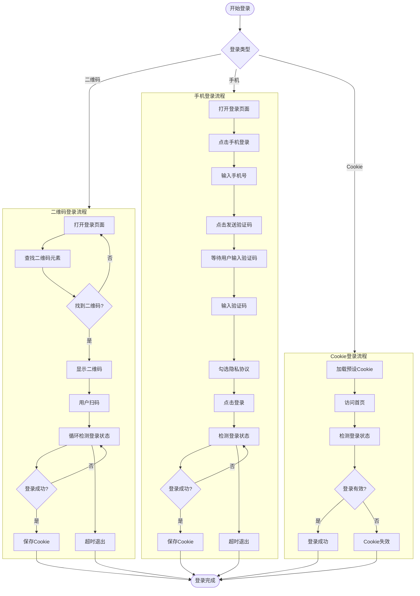
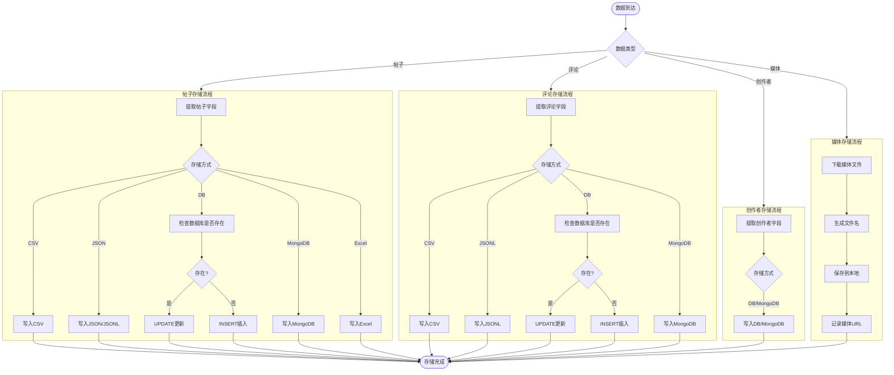
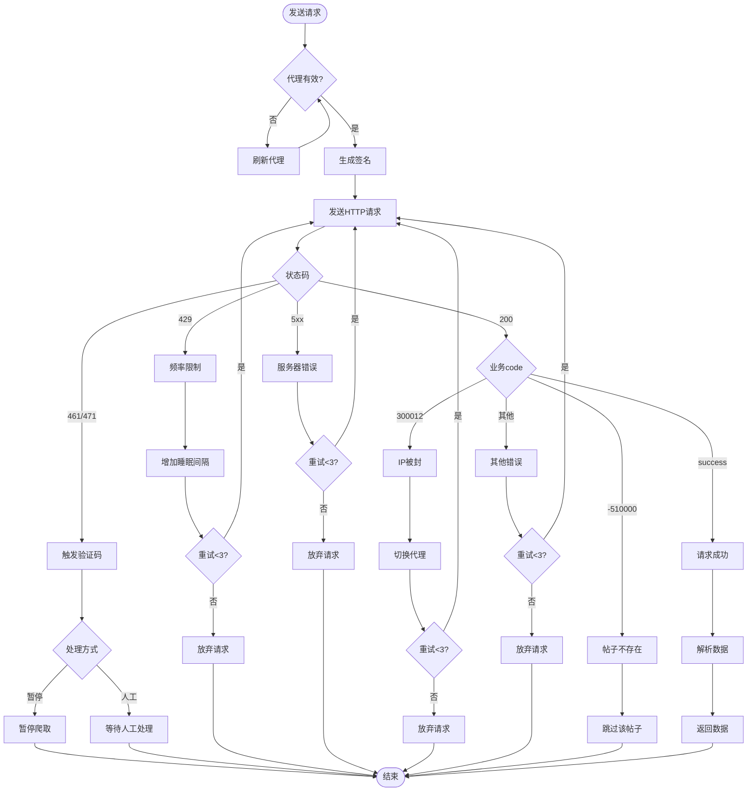
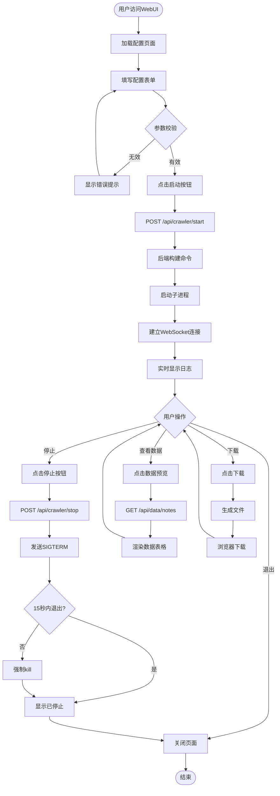
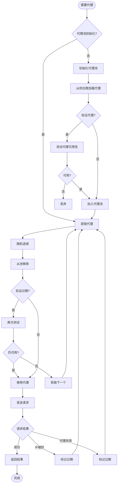
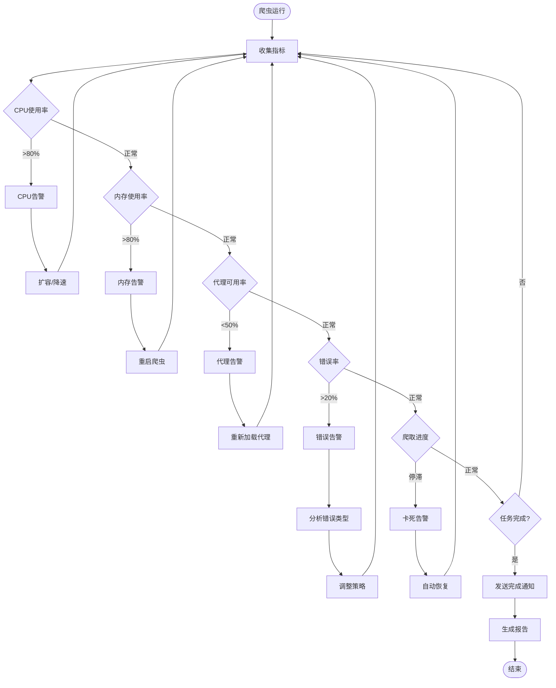

# MediaCrawler 业务流程图 (Business Process Diagram)

## 1. 整体业务流程图

```mermaid
graph TB
    Start([开始]) --> Config[读取配置参数]
    Config --> Validate{参数校验}
    Validate -->|无效| Error1[报错退出]
    Validate -->|有效| InitProxy[初始化代理池]
    
    InitProxy --> InitBrowser[启动浏览器]
    InitBrowser --> CheckLogin{检查登录态}
    
    CheckLogin -->|已登录| SelectType[选择爬取类型]
    CheckLogin -->|未登录| Login[执行登录]
    Login --> LoginSuccess{登录成功?}
    LoginSuccess -->|否| Error2[登录失败退出]
    LoginSuccess -->|是| SelectType
    
    SelectType -->|搜索| SearchProcess[搜索关键词流程]
    SelectType -->|详情| DetailProcess[指定帖子流程]
    SelectType -->|创作者| CreatorProcess[创作者主页流程]
    
    SearchProcess --> StoreData[存储数据]
    DetailProcess --> StoreData
    CreatorProcess --> StoreData
    
    StoreData --> GenReport[生成报告/词云]
    GenReport --> Cleanup[清理资源]
    Cleanup --> End([结束])
    
    Error1 --> End
    Error2 --> End
```

## 2. 搜索关键词业务流程

```mermaid
graph TB
    Start([开始搜索]) --> ReadKeywords[读取关键词列表]
    ReadKeywords --> Split[按逗号分割关键词]
    Split --> LoopKeyword{还有关键词?}
    
    LoopKeyword -->|是| SetKeyword[设置当前关键词]
    SetKeyword --> InitPage[页码=1]
    InitPage --> LoopPage{达到最大数量?}
    
    LoopPage -->|否| BuildRequest[构建搜索请求]
    BuildRequest --> GenSign[生成请求签名]
    GenSign --> SendRequest[发送HTTP请求]
    SendRequest --> CheckResponse{响应正常?}
    
    CheckResponse -->|否| HandleError[错误处理]
    HandleError --> Retry{重试次数<3?}
    Retry -->|是| SendRequest
    Retry -->|否| NextPage[下一页]
    
    CheckResponse -->|是| ParseList[解析帖子列表]
    ParseList --> HasMore{has_more?}
    HasMore -->|否| LoopPage
    HasMore -->|是| ExtractIds[提取帖子ID列表]
    
    ExtractIds --> LoopNote{还有帖子?}
    LoopNote -->|是| GetDetail[获取帖子详情]
    GetDetail --> ParseDetail[解析帖子内容]
    ParseDetail --> SaveNote[保存帖子数据]
    
    SaveNote --> NeedComment{启用评论?}
    NeedComment -->|是| GetComments[获取评论]
    GetComments --> SaveComments[保存评论数据]
    SaveComments --> LoopNote
    NeedComment -->|否| LoopNote
    
    LoopNote -->|否| NeedMedia{下载媒体?}
    NeedMedia -->|是| DownloadMedia[下载图片/视频]
    DownloadMedia --> SaveMedia[保存媒体文件]
    SaveMedia --> Sleep1[睡眠间隔]
    NeedMedia -->|否| Sleep1
    
    Sleep1 --> NextPage
    NextPage --> LoopPage
    LoopPage -->|是| LoopKeyword
    LoopKeyword -->|否| End([搜索结束])
```

## 3. 登录认证业务流程

```mermaid
graph TB
    Start([开始登录]) --> CheckType{登录类型}
    
    CheckType -->|二维码| QrcodeFlow
    CheckType -->|手机| PhoneFlow
    CheckType -->|Cookie| CookieFlow
    
    subgraph QrcodeFlow [二维码登录流程]
        Q1[打开登录页面]
        Q2[查找二维码元素]
        Q3{找到二维码?}
        Q4[显示二维码]
        Q5[用户扫码]
        Q6[循环检测登录状态]
        Q7{登录成功?}
        Q8[保存Cookie]
        Q9[超时退出]
        
        Q1 --> Q2
        Q2 --> Q3
        Q3 -->|否| Q1
        Q3 -->|是| Q4
        Q4 --> Q5
        Q5 --> Q6
        Q6 --> Q7
        Q7 -->|否| Q6
        Q7 -->|是| Q8
        Q6 --> Q9
    end
    
    subgraph PhoneFlow [手机登录流程]
        P1[打开登录页面]
        P2[点击手机登录]
        P3[输入手机号]
        P4[点击发送验证码]
        P5[等待用户输入验证码]
        P6[输入验证码]
        P7[勾选隐私协议]
        P8[点击登录]
        P9[检测登录状态]
        P10{登录成功?}
        P11[保存Cookie]
        P12[超时退出]
        
        P1 --> P2 --> P3 --> P4 --> P5 --> P6 --> P7 --> P8 --> P9 --> P10
        P10 -->|否| P9
        P10 -->|是| P11
        P9 --> P12
    end
    
    subgraph CookieFlow [Cookie登录流程]
        C1[加载预设Cookie]
        C2[访问首页]
        C3[检测登录状态]
        C4{登录有效?}
        C5[登录成功]
        C6[Cookie失效]
        
        C1 --> C2 --> C3 --> C4
        C4 -->|是| C5
        C4 -->|否| C6
    end
    
    Q8 --> End([登录完成])
    P11 --> End
    C5 --> End
    C6 --> End
    Q9 --> End
    P12 --> End
```

## 4. 数据存储业务流程

```mermaid
graph TB
    Start([数据到达]) --> CheckType{数据类型}
    
    CheckType -->|帖子| NoteProcess
    CheckType -->|评论| CommentProcess
    CheckType -->|创作者| CreatorProcess
    CheckType -->|媒体| MediaProcess
    
    subgraph NoteProcess [帖子存储流程]
        N1[提取帖子字段]
        N2{存储方式}
        N3[写入CSV]
        N4[写入JSON/JSONL]
        N5[检查数据库是否存在]
        N6{存在?}
        N7[UPDATE更新]
        N8[INSERT插入]
        N9[写入MongoDB]
        N10[写入Excel]
        
        N1 --> N2
        N2 -->|CSV| N3
        N2 -->|JSON| N4
        N2 -->|DB| N5
        N5 --> N6
        N6 -->|是| N7
        N6 -->|否| N8
        N2 -->|MongoDB| N9
        N2 -->|Excel| N10
    end
    
    subgraph CommentProcess [评论存储流程]
        C1[提取评论字段]
        C2{存储方式}
        C3[写入CSV]
        C4[写入JSONL]
        C5[检查数据库是否存在]
        C6{存在?}
        C7[UPDATE更新]
        C8[INSERT插入]
        C9[写入MongoDB]
        
        C1 --> C2
        C2 -->|CSV| C3
        C2 -->|JSONL| C4
        C2 -->|DB| C5
        C5 --> C6
        C6 -->|是| C7
        C6 -->|否| C8
        C2 -->|MongoDB| C9
    end
    
    subgraph CreatorProcess [创作者存储流程]
        R1[提取创作者字段]
        R2{存储方式}
        R3[写入DB/MongoDB]
        
        R1 --> R2
        R2 -->|DB/MongoDB| R3
    end
    
    subgraph MediaProcess [媒体存储流程]
        M1[下载媒体文件]
        M2[生成文件名]
        M3[保存到本地]
        M4[记录媒体URL]
        
        M1 --> M2 --> M3 --> M4
    end
    
    N3 --> End([存储完成])
    N4 --> End
    N7 --> End
    N8 --> End
    N9 --> End
    N10 --> End
    C3 --> End
    C4 --> End
    C7 --> End
    C8 --> End
    C9 --> End
    R3 --> End
    M4 --> End
```

## 5. 反爬对抗业务流程

```mermaid
graph TB
    Start([发送请求]) --> CheckProxy{代理有效?}
    
    CheckProxy -->|否| RefreshProxy[刷新代理]
    RefreshProxy --> CheckProxy
    CheckProxy -->|是| GenSign[生成签名]
    
    GenSign --> SendReq[发送HTTP请求]
    SendReq --> CheckStatus{状态码}
    
    CheckStatus -->|200| CheckCode{业务code}
    CheckStatus -->|461/471| Captcha[触发验证码]
    CheckStatus -->|429| RateLimit[频率限制]
    CheckStatus -->|5xx| ServerError[服务器错误]
    
    CheckCode -->|success| Success[请求成功]
    CheckCode -->|300012| IPBlocked[IP被封]
    CheckCode -->|-510000| NotFound[帖子不存在]
    CheckCode -->|其他| OtherError[其他错误]
    
    Captcha --> HandleCaptcha{处理方式}
    HandleCaptcha -->|暂停| Pause[暂停爬取]
    HandleCaptcha -->|人工| Manual[等待人工处理]
    
    RateLimit --> IncreaseSleep[增加睡眠间隔]
    IncreaseSleep --> Retry1{重试<3?}
    Retry1 -->|是| SendReq
    Retry1 -->|否| Error1[放弃请求]
    
    ServerError --> Retry2{重试<3?}
    Retry2 -->|是| SendReq
    Retry2 -->|否| Error2[放弃请求]
    
    IPBlocked --> SwitchProxy[切换代理]
    SwitchProxy --> Retry3{重试<3?}
    Retry3 -->|是| SendReq
    Retry3 -->|否| Error3[放弃请求]
    
    NotFound --> Skip[跳过该帖子]
    OtherError --> Retry4{重试<3?}
    Retry4 -->|是| SendReq
    Retry4 -->|否| Error4[放弃请求]
    
    Success --> ParseData[解析数据]
    ParseData --> ReturnData[返回数据]
    
    Pause --> End1([结束])
    Manual --> End1
    Error1 --> End1
    Error2 --> End1
    Error3 --> End1
    Error4 --> End1
    Skip --> End1
    ReturnData --> End1
```

## 6. WebUI控制业务流程

```mermaid
graph TB
    Start([用户访问WebUI]) --> LoadPage[加载配置页面]
    LoadPage --> FillForm[填写配置表单]
    FillForm --> Validate{参数校验}
    
    Validate -->|无效| ShowError[显示错误提示]
    ShowError --> FillForm
    Validate -->|有效| ClickStart[点击启动按钮]
    
    ClickStart --> SendAPI[POST /api/crawler/start]
    SendAPI --> BuildCmd[后端构建命令]
    BuildCmd --> SpawnProcess[启动子进程]
    SpawnProcess --> ConnectWS[建立WebSocket连接]
    
    ConnectWS --> ShowLog[实时显示日志]
    ShowLog --> CheckStatus{用户操作}
    
    CheckStatus -->|停止| ClickStop[点击停止按钮]
    ClickStop --> SendStop[POST /api/crawler/stop]
    SendStop --> KillProcess[发送SIGTERM]
    KillProcess --> WaitExit{15秒内退出?}
    WaitExit -->|否| ForceKill[强制kill]
    WaitExit -->|是| ShowStopped[显示已停止]
    ForceKill --> ShowStopped
    
    CheckStatus -->|查看数据| ClickData[点击数据预览]
    ClickData --> FetchData[GET /api/data/notes]
    FetchData --> RenderTable[渲染数据表格]
    RenderTable --> CheckStatus
    
    CheckStatus -->|下载| ClickDownload[点击下载]
    ClickDownload --> GenerateFile[生成文件]
    GenerateFile --> Download[浏览器下载]
    Download --> CheckStatus
    
    CheckStatus -->|退出| ClosePage[关闭页面]
    ShowStopped --> ClosePage
    ClosePage --> End([结束])
```

## 7. 代理管理业务流程

```mermaid
graph TB
    Start([需要代理]) --> CheckPool{代理池初始化?}
    
    CheckPool -->|否| InitPool[初始化代理池]
    InitPool --> LoadProxy[从供应商加载代理]
    LoadProxy --> ValidateProxy{验证代理?}
    ValidateProxy -->|是| TestProxy[测试代理可用性]
    TestProxy --> Valid{可用?}
    Valid -->|是| AddPool[加入代理池]
    Valid -->|否| Discard[丢弃]
    ValidateProxy -->|否| AddPool
    
    CheckPool -->|是| GetProxy[获取代理]
    AddPool --> GetProxy
    
    GetProxy --> RandomSelect[随机选择]
    RandomSelect --> RemovePool[从池移除]
    RemovePool --> CheckExpired{验证过期?}
    
    CheckExpired -->|是| TestAgain[再次测试]
    TestAgain --> StillValid{仍可用?}
    StillValid -->|是| UseProxy[使用代理]
    StillValid -->|否| GetAnother[获取下一个]
    GetAnother --> GetProxy
    
    CheckExpired -->|否| UseProxy
    UseProxy --> SendRequest[发送请求]
    SendRequest --> CheckResult{请求结果}
    
    CheckResult -->|成功| ReturnResult[返回结果]
    CheckResult -->|IP被封| MarkExpired[标记过期]
    MarkExpired --> GetProxy
    CheckResult -->|代理失效| MarkExpired2[标记过期]
    MarkExpired2 --> GetProxy
    
    ReturnResult --> End([完成])
```

## 8. 爬虫监控告警业务流程

```mermaid
graph TB
    Start([爬虫运行]) --> CollectMetrics[收集指标]
    
    CollectMetrics --> CheckCPU{CPU使用率}
    CheckCPU -->|>80%| AlertCPU[CPU告警]
    CheckCPU -->|正常| CheckMemory
    
    AlertCPU --> ScaleUp[扩容/降速]
    ScaleUp --> CollectMetrics
    
    CheckMemory{内存使用率}
    CheckMemory -->|>80%| AlertMemory[内存告警]
    CheckMemory -->|正常| CheckProxyStatus
    
    AlertMemory --> Restart[重启爬虫]
    Restart --> CollectMetrics
    
    CheckProxyStatus{代理可用率}
    CheckProxyStatus -->|<50%| AlertProxy[代理告警]
    CheckProxyStatus -->|正常| CheckErrorRate
    
    AlertProxy --> ReloadProxy[重新加载代理]
    ReloadProxy --> CollectMetrics
    
    CheckErrorRate{错误率}
    CheckErrorRate -->|>20%| AlertError[错误告警]
    CheckErrorRate -->|正常| CheckProgress
    
    AlertError --> AnalyzeError[分析错误类型]
    AnalyzeError --> AdjustStrategy[调整策略]
    AdjustStrategy --> CollectMetrics
    
    CheckProgress{爬取进度}
    CheckProgress -->|停滞| AlertStuck[卡死告警]
    CheckProgress -->|正常| CheckComplete
    
    AlertStuck --> Recover[自动恢复]
    Recover --> CollectMetrics
    
    CheckComplete{任务完成?}
    CheckComplete -->|否| CollectMetrics
    CheckComplete -->|是| SendNotify[发送完成通知]
    SendNotify --> GenerateReport[生成报告]
    GenerateReport --> End([结束])
```
