# MediaCrawler 模块结构图 (Module Structure Diagram)

## 1. 整体模块结构图

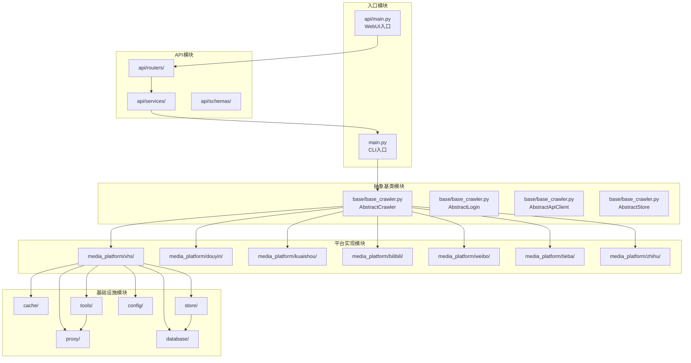

## 2. 小红书平台模块详细结构

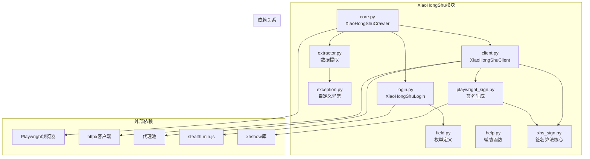

## 3. 存储模块结构图

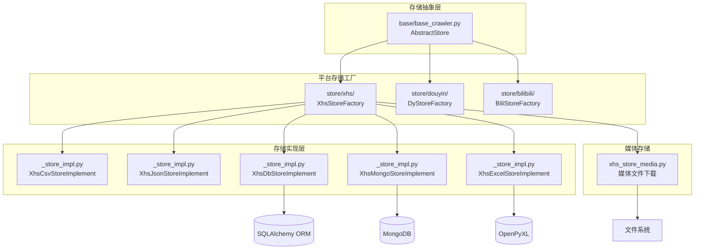

## 4. 代理模块结构图

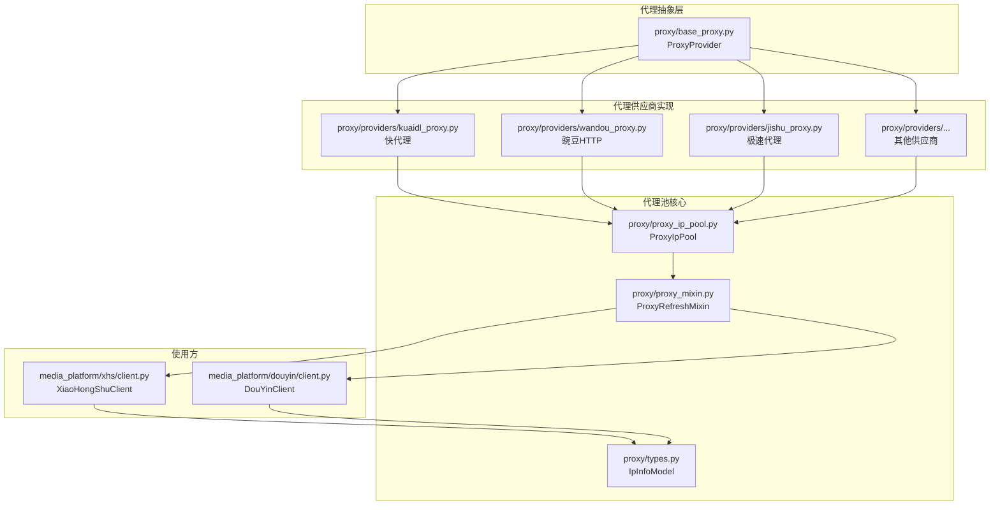

## 5. 缓存模块结构图

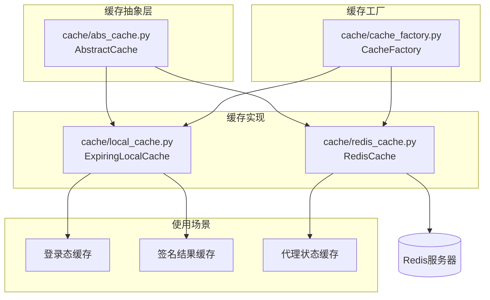

## 6. 数据库模块结构图

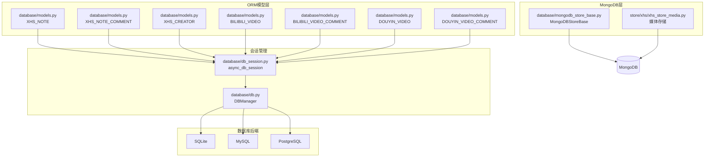

## 7. 工具模块结构图

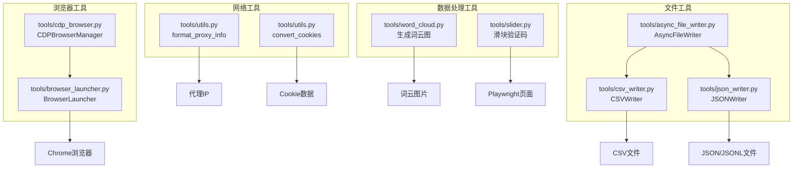

## 8. API模块结构图

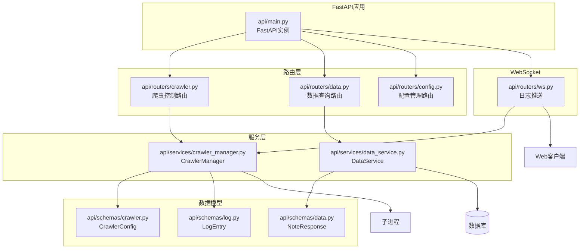

## 9. 配置模块结构图

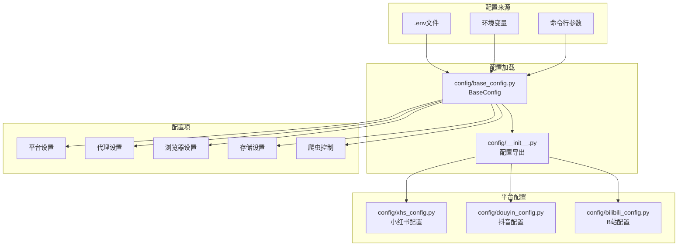

## 10. 模块依赖关系图

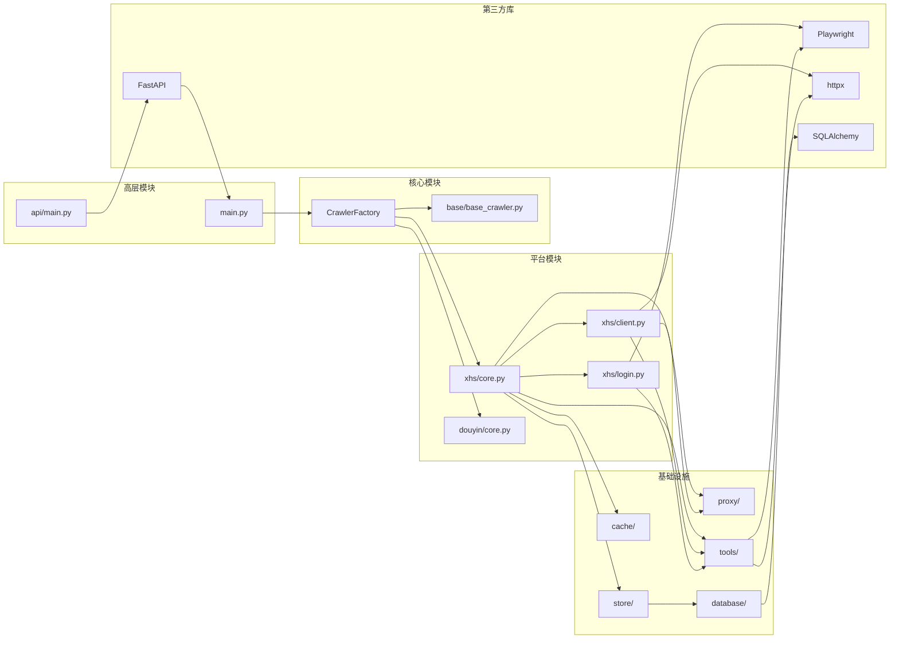

## 11. 类继承关系图

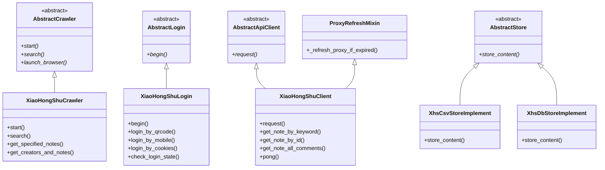

## 12. 包结构树状图

```mermaid
graph TD
    Root[MediaCrawler/]
    
    Root --> Base[base/]
    Base --> BC[base_crawler.py]
    
    Root --> MP[media_platform/]
    MP --> XHS[xhs/]
    XHS --> XHS1[core.py]
    XHS --> XHS2[client.py]
    XHS --> XHS3[login.py]
    XHS --> XHS4[field.py]
    XHS --> XHS5[exception.py]
    XHS --> XHS6[extractor.py]
    XHS --> XHS7[help.py]
    XHS --> XHS8[playwright_sign.py]
    XHS --> XHS9[xhs_sign.py]
    
    MP --> DY[douyin/]
    DY --> DY1[core.py]
    DY --> DY2[client.py]
    DY --> DY3[login.py]
    
    MP --> KS[kuaishou/]
    MP --> BILI[bilibili/]
    MP --> WB[weibo/]
    MP --> TB[tieba/]
    MP --> ZH[zhihu/]
    
    Root --> Store[store/]
    Store --> SX[xhs/]
    SX --> SX1[__init__.py]
    SX --> SX2[_store_impl.py]
    SX --> SX3[xhs_store_media.py]
    
    Root --> Cache[cache/]
    Cache --> CA1[cache_factory.py]
    Cache --> CA2[local_cache.py]
    Cache --> CA3[redis_cache.py]
    Cache --> CA4[abs_cache.py]
    
    Root --> Proxy[proxy/]
    Proxy --> P1[proxy_ip_pool.py]
    Proxy --> P2[proxy_mixin.py]
    Proxy --> P3[base_proxy.py]
    Proxy --> P4[types.py]
    Proxy --> PP[providers/]
    PP --> PP1[kuaidl_proxy.py]
    PP2[wandou_proxy.py]
    
    Root --> DB[database/]
    DB --> DB1[models.py]
    DB --> DB2[db_session.py]
    DB --> DB3[db.py]
    DB --> DB4[mongodb_store_base.py]
    
    Root --> Tools[tools/]
    Tools --> T1[cdp_browser.py]
    Tools --> T2[browser_launcher.py]
    Tools --> T3[async_file_writer.py]
    Tools --> T4[utils.py]
    Tools --> T5[word_cloud.py]
    
    Root --> API[api/]
    API --> A1[main.py]
    API --> AR[routers/]
    AR --> AR1[crawler.py]
    AR --> AR2[data.py]
    API --> AS[services/]
    AS --> AS1[crawler_manager.py]
    API --> ASC[schemas/]
    
    Root --> CFG[config/]
    CFG --> C1[base_config.py]
    CFG --> C2[xhs_config.py]
    
    Root --> Model[model/]
    Root --> Test[test/]
    Root --> Tests[tests/]
    Root --> Var[var.py]
    Root --> Main[main.py]
    Root --> Req[requirements.txt]
    Root --> PP2[pyproject.toml]
```
