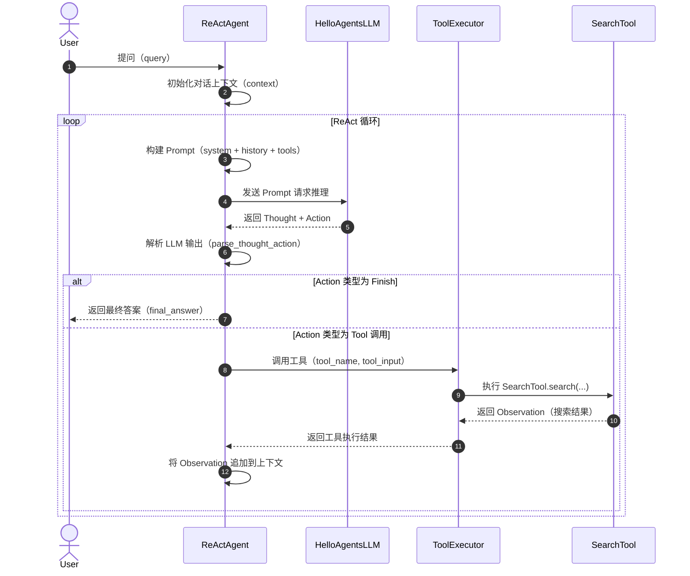
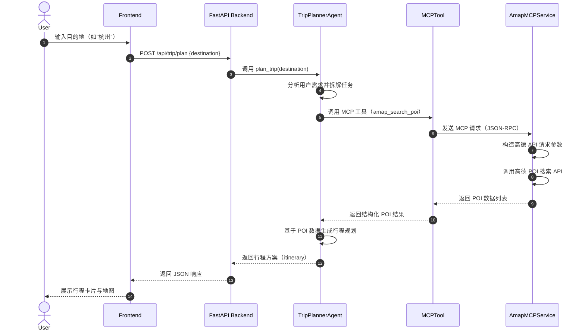
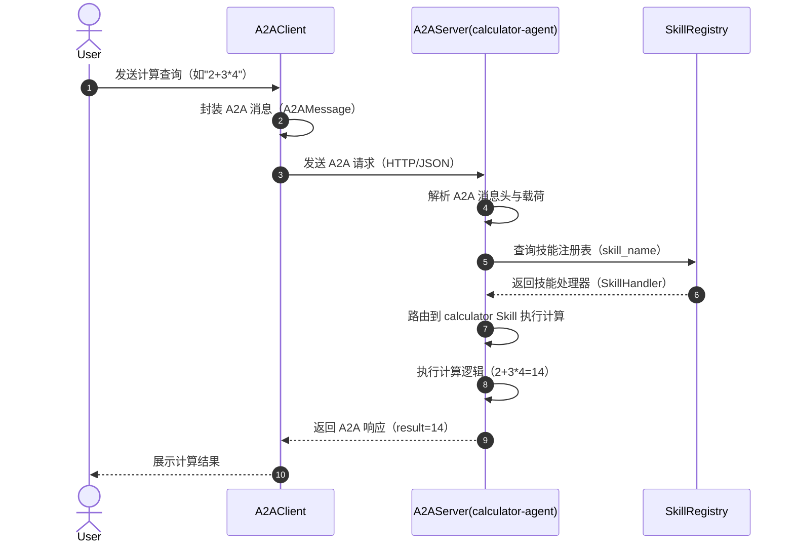

# Hello-Agents 时序图

## 1. ReAct Agent 执行时序

### 解释

**触发阶段**：用户向 ReActAgent 发起提问，Agent 首先初始化当前的对话上下文，包括系统提示词、历史对话记录以及可用工具的 Schema 描述。这一步为后续的推理循环奠定基础。

**推理阶段**：ReActAgent 将上下文构建成完整的 Prompt 并发送给 HelloAgentsLLM。LLM 基于 ReAct 范式生成包含 Thought（思考过程）和 Action（行动指令）的结构化输出，体现了"先思考再行动"的核心理念。

**解析阶段**：Agent 对 LLM 的原始输出进行解析，提取 Thought 和 Action 的内容，并判断 Action 的类型。如果是 Finish 类型，说明 LLM 认为已经得到最终答案，循环终止；否则进入工具执行阶段。

**执行阶段**：当 Action 为 Tool 调用时，Agent 将工具名称和参数传递给 ToolExecutor。ToolExecutor 负责路由到具体的 SearchTool 并执行搜索操作，获取外部知识或数据作为 Observation。

**循环阶段**：工具执行返回的 Observation 被追加到上下文中，Agent 再次构建 Prompt 进入下一轮 ReAct 循环，直到 LLM 输出 Finish 动作为止，最终向用户返回答案。

---

## 2. MCP 工具调用时序（旅行助手场景）

### 解释

**触发阶段**：用户在旅行助手前端界面输入目的地（如"杭州"），Frontend 将用户输入封装为 HTTP POST 请求发送到 FastAPI Backend 的 `/api/trip/plan` 接口，携带目的地参数。

**分析阶段**：Backend 将请求转发给 TripPlannerAgent，Agent 首先分析用户的出行需求，将整体任务拆解为多个子任务，例如搜索景点、餐厅、酒店等 POI（兴趣点）信息。

**调用阶段**：TripPlannerAgent 通过 MCPTool 接口发起工具调用，使用 `amap_search_poi` 工具名称和相应参数。MCPTool 作为 MCP 协议的客户端，将请求序列化为 JSON-RPC 格式发送给 AmapMCPService。

**服务阶段**：AmapMCPService 接收到 MCP 请求后，构造对应的高德地图开放平台 API 请求，调用高德 POI 搜索接口获取实时数据，并将原始 API 响应解析为结构化数据返回给 MCPTool。

**生成阶段**：TripPlannerAgent 获得 POI 数据后，结合时间、距离、用户偏好等因素生成完整的行程规划方案（itinerary），经 Backend 返回给 Frontend，最终以行程卡片和地图的形式展示给用户。

---

## 3. A2A 多智能体通信时序

### 解释

**触发阶段**：用户向 A2AClient 发送一个计算查询请求，例如数学表达式"2+3*4"。A2AClient 作为多智能体通信的客户端入口，负责接收用户输入并准备后续的消息封装。

**封装阶段**：A2AClient 将用户的原始查询按照 A2A（Agent-to-Agent）协议规范封装为 A2AMessage 对象，包含消息头（metadata、sender、receiver）和载荷（payload），确保消息格式符合 A2A 标准。

**通信阶段**：封装好的 A2A 消息通过 HTTP/JSON 传输到 A2AServer，Server 端首先解析消息头和载荷，提取目标技能名称（如 calculator），然后向 SkillRegistry 查询对应的技能处理器。

**路由阶段**：SkillRegistry 根据技能名称返回对应的 SkillHandler，A2AServer 将请求路由到 calculator-agent 的计算技能模块执行具体的计算逻辑，得到结果 14。

**返回阶段**：A2AServer 将计算结果封装为 A2A 响应消息返回给 A2AClient，Client 解析响应后向用户展示最终结果，完成一次完整的 A2A 多智能体通信闭环。
