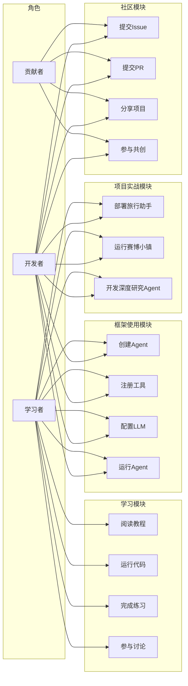
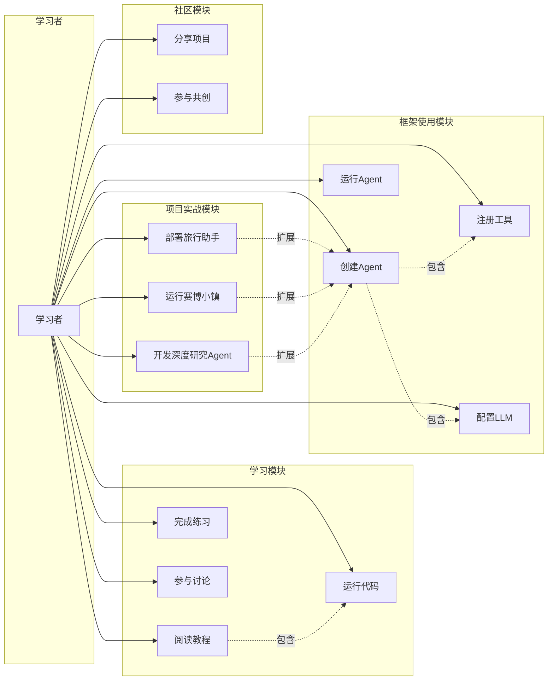
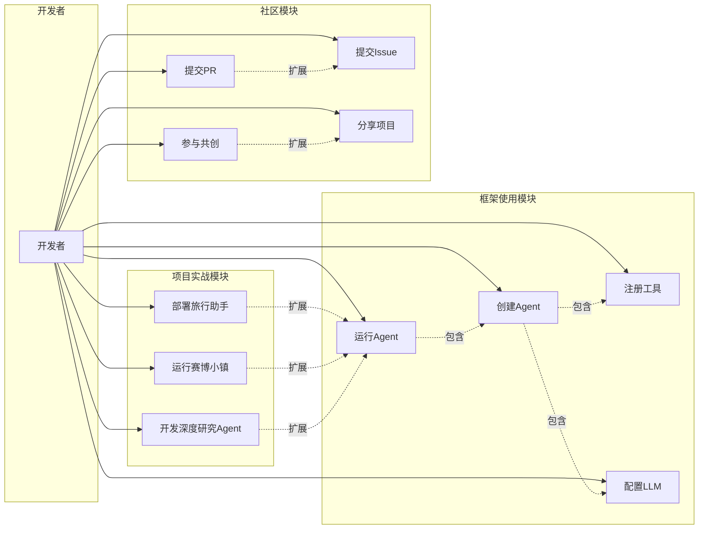

# Hello-Agents 项目用例图

## 图1：整体用例图

### 解释

**目的**：整体用例图展示了 Hello-Agents 项目的全貌，涵盖三大角色与四大核心模块之间的交互关系。

**范围**：本图覆盖学习模块、框架使用模块、项目实战模块和社区模块，完整呈现项目提供的全部功能集合。

**角色**：学习者作为核心用户，可触达所有功能模块；贡献者专注于社区协作；开发者兼具框架使用与社区贡献双重身份。

**关系**：学习者与所有用例存在关联，体现其"全能型"定位；贡献者与社区模块强绑定；开发者横跨框架使用、项目实战和社区三大领域。

**价值**：该图为项目利益相关者提供宏观视角，帮助理解不同用户群体的权限边界和功能覆盖范围。

---

## 图2：学习者用例细分

### 解释

**目的**：聚焦学习者视角，细化其参与项目的完整路径，展示从学习到实践的递进关系。

**范围**：涵盖学习模块全部用例、框架使用模块基础操作、三个项目实战案例以及部分社区功能。

**角色**：学习者作为项目的主要目标用户，拥有最广泛的功能访问权限，体现"学练结合"的设计理念。

**关系**：阅读教程包含运行代码，形成"先读后做"的学习闭环；创建Agent包含注册工具和配置LLM，构成Agent开发的最小可行路径；三个实战项目均扩展自创建Agent，体现由基础到进阶的演进逻辑。

**价值**：该图揭示学习者的成长路径，帮助教学设计者优化课程结构，确保学习者能够循序渐进地掌握Agent开发技能。

---

## 图3：开发者用例细分

### 解释

**目的**：从开发者视角出发，展示其在使用 HelloAgents 框架进行应用开发及回馈社区时的完整工作流。

**范围**：覆盖框架使用、项目实战和社区贡献三大领域，突出开发者在技术实践与生态建设中的双重角色。

**角色**：开发者是框架的核心使用者，既需要深入掌握框架API进行应用构建，也承担通过Issue和PR推动项目演进的责任。

**关系**：创建Agent包含注册工具和配置LLM，是Agent实例化的前提；运行Agent又包含创建Agent，形成完整的执行链路；三个实战项目均扩展自运行Agent，代表不同场景下的应用落地；提交PR扩展自提交Issue，体现问题发现到解决的闭环；参与共创扩展自分享项目，反映社区协作的深化过程。

**价值**：该图为开发者提供清晰的操作指南和贡献路径，帮助其快速定位自身在生态中的角色，并理解各操作之间的依赖与扩展关系。
