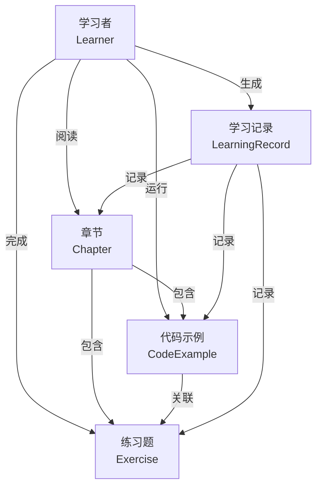
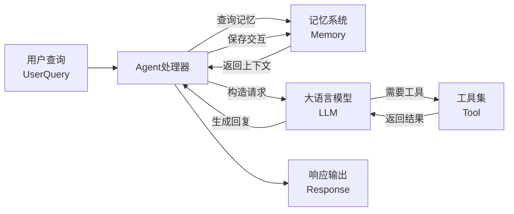
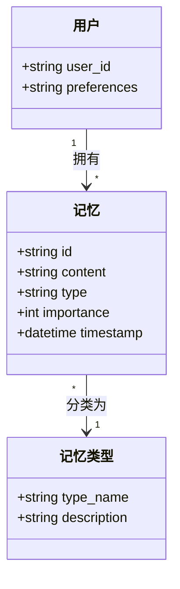
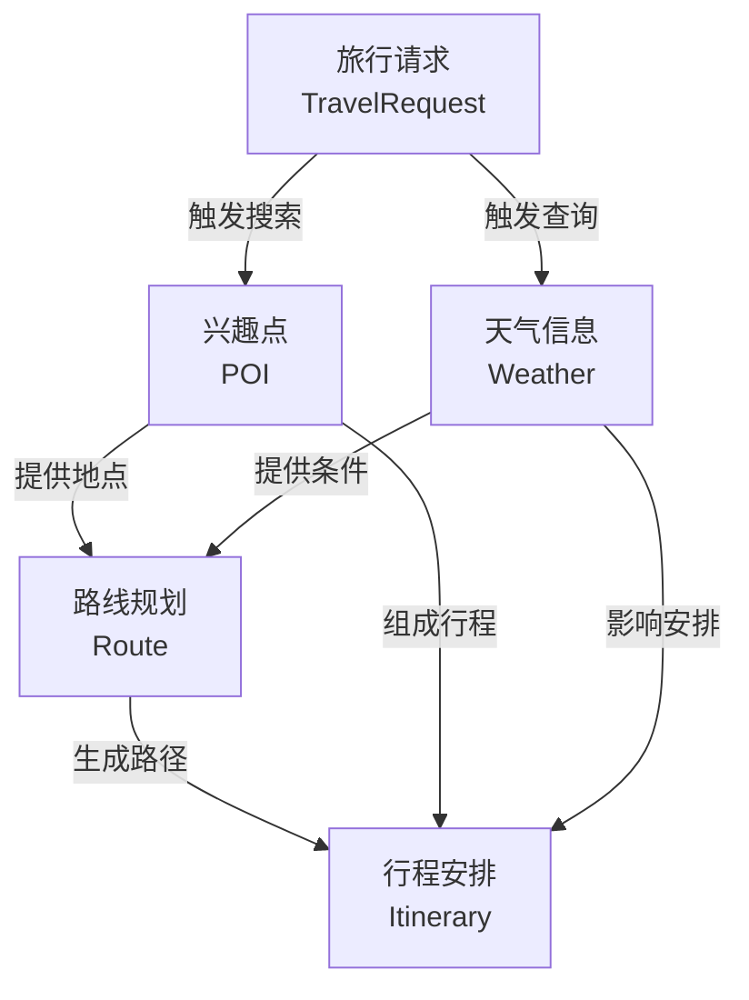

# Hello-Agents 项目数据流 E-R 图

## 图一：学习数据流

### 解释

1. **核心实体**：本图围绕"学习者"这一核心实体展开，学习者通过阅读章节、运行代码示例和完成练习题来进行学习活动。

2. **内容结构**：章节作为学习内容的主要载体，内部包含代码示例和练习题，形成层次化的知识结构，代码示例与练习题之间存在关联关系。

3. **数据追踪**：学习记录实体负责追踪学习者的行为轨迹，分别记录学习者与章节、代码示例、练习题之间的交互历史。

4. **流向特征**：数据流呈现"学习者驱动"模式，所有学习活动均由学习者发起，学习记录作为反馈回路沉淀学习行为数据。

5. **应用场景**：该数据流支撑学习进度追踪、个性化推荐和知识掌握度评估等功能，为自适应学习系统提供数据基础。

---

## 图二：Agent 数据流

### 解释

1. **输入阶段**：用户查询（UserQuery）作为整个数据流的起点，承载用户的意图和请求信息，进入Agent处理器进行解析。

2. **记忆检索**：Agent首先查询记忆系统（Memory），获取与用户相关的历史上下文和偏好信息，以便提供个性化响应。

3. **推理阶段**：Agent将用户查询和记忆上下文整合后，调用大语言模型（LLM）进行推理和生成，LLM可能根据需求调用外部工具（Tool）获取实时数据。

4. **记忆更新**：生成的响应在返回给用户之前，Agent将本次交互的关键信息保存到记忆系统中，实现记忆的持续积累。

5. **闭环特征**：该数据流形成"查询-处理-记忆-响应-更新"的闭环，记忆系统作为状态载体使Agent具备持续学习和上下文感知能力。

---

## 图三：记忆系统 E-R 图

### 解释

1. **用户实体**：User实体代表系统使用者，以user_id为主键，preferences字段存储用户个性化偏好配置，是记忆归属的主体。

2. **记忆实体**：Memory实体是系统的核心数据对象，包含id主键、content内容、type类型、importance重要性和timestamp时间戳五个属性，全面描述一条记忆的特征。

3. **记忆类型**：Memory_TYPE实体定义记忆的分类体系，包含working（工作记忆）、episodic（情景记忆）、semantic（语义记忆）、perceptual（感知记忆）四种类型，每种类型有不同描述。

4. **关系定义**：User与Memory之间是一对多关系（一个用户拥有多条记忆），Memory与Memory_TYPE之间是多对一关系（多条记忆属于同一类型），形成清晰的归属和分类结构。

5. **设计价值**：该E-R图通过类型化管理和重要性分级，支持记忆的选择性存储、检索和遗忘策略，为Agent的长期记忆能力提供数据模型支撑。

---

## 图四：旅行助手项目数据流

### 解释

1. **请求驱动**：TravelRequest作为数据流的起点，包含目的地、时间、预算等旅行需求参数，触发后续的POI搜索和天气查询。

2. **并行查询**：POI（兴趣点）搜索和Weather（天气）查询是两条并行的数据流分支，分别从地点库和气象服务获取旅行相关的关键信息。

3. **路线规划**：Route节点整合POI提供的地点信息和Weather提供的天气条件，运用路径规划算法计算最优出行路线。

4. **行程合成**：Itinerary作为最终输出，综合POI（景点、餐厅等）、Weather（天气建议）和Route（交通路线）三类数据，生成完整的旅行行程安排。

5. **反馈机制**：天气信息不仅影响路线规划，还直接影响行程安排的细节调整（如雨天室内活动推荐），体现多源数据融合的智能决策特征。
