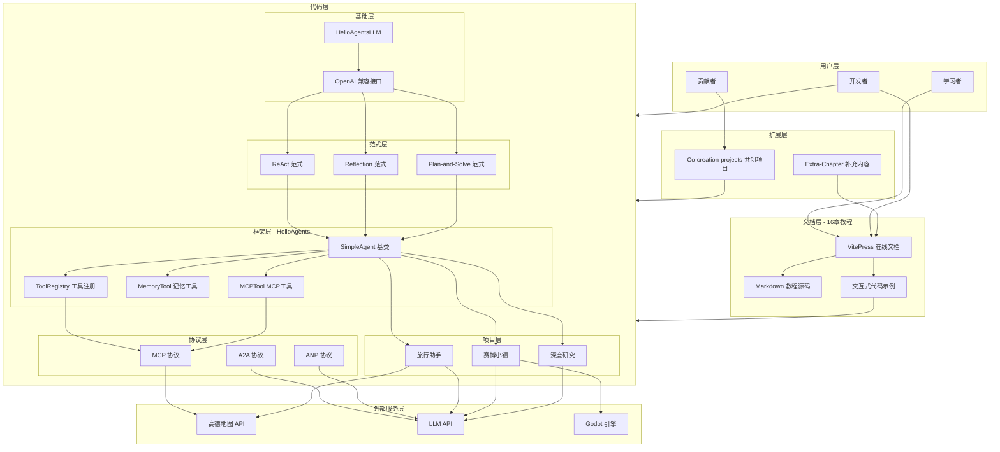
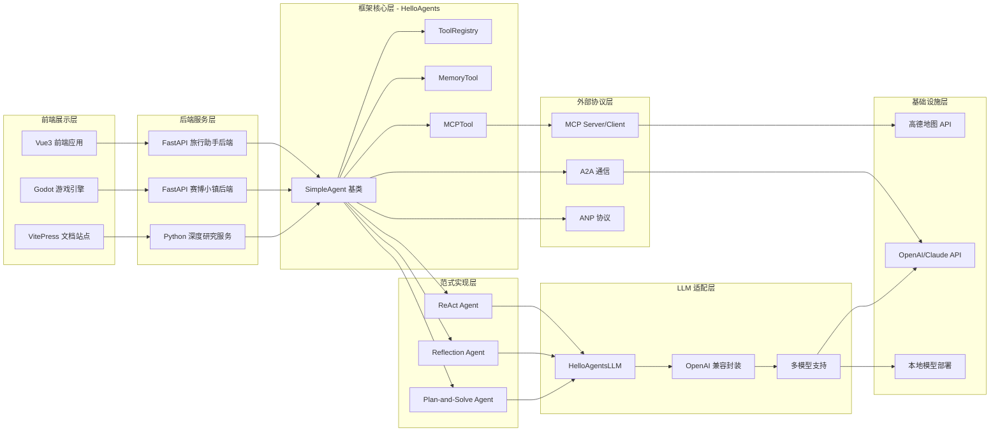
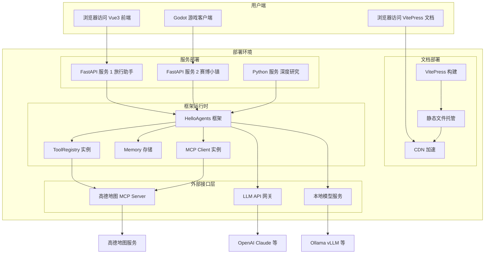

# Hello-Agents 系统架构图

## 图1：Hello-Agents 整体架构图

### 图1解释

**第一段：整体布局**

本图采用自上而下的分层架构，清晰展示了 Hello-Agents 项目的六大层次结构：用户层、文档层、代码层（含基础层、范式层、框架层、协议层、项目层）、扩展层和外部服务层。每一层都承担着不同的职责，层与层之间通过箭头表示依赖和调用关系，形成一个完整的学习与开发闭环。

**第二段：文档层与代码层的关系**

文档层是项目的入口，通过 VitePress 将 16 章 Markdown 教程部署为在线文档，学习者可以通过浏览器访问。文档中嵌入交互式代码示例，这些示例直接链接到代码层的具体实现，实现了"理论+实践"的学习路径。开发者既可以阅读文档理解概念，也可以直接运行和修改代码。

**第三段：代码层的五层结构**

代码层是项目的核心，采用五层递进式设计：基础层提供 LLM 客户端封装，兼容 OpenAI 接口；范式层实现了 ReAct、Reflection、Plan-and-Solve 等经典 Agent 范式；框架层基于范式抽象出 SimpleAgent 基类、ToolRegistry、MemoryTool 和 MCPTool 等核心组件；协议层实现了 MCP、A2A、ANP 等 Agent 通信协议；项目层则整合下层能力，构建出旅行助手、赛博小镇、深度研究三个完整应用。

**第四段：扩展层的作用**

扩展层包含 Extra-Chapter 补充内容和 Co-creation-projects 共创项目两部分。补充内容用于扩展教程的深度和广度，共创项目则鼓励社区贡献者参与项目开发，形成良性循环。贡献者的成果可以回流到代码层，丰富项目的示例库。

**第五段：外部服务集成**

项目层与外部服务深度集成：旅行助手通过 MCP 协议调用高德地图 API 提供地理位置服务，同时调用 LLM API 提供智能对话；赛博小镇使用 Godot 游戏引擎作为前端展示，后端通过 FastAPI 与多智能体 NPC 交互；深度研究则自动化调用 LLM API 完成研究任务。这种设计使得项目既具备教学价值，又具备实际应用能力。

---

## 图2：Hello-Agents 技术栈分层图

### 图2解释

**第一段：分层架构设计**

本图采用从左到右的分层架构，将 Hello-Agents 项目的技术栈划分为六个层次：前端展示层、后端服务层、框架核心层、范式实现层、LLM 适配层、外部协议层和基础设施层。这种分层设计遵循了关注点分离原则，每一层只与相邻层交互，降低了系统的复杂度。

**第二段：前端技术选型**

前端展示层根据项目需求采用了三种不同的技术方案：VitePress 用于构建静态文档站点，提供教程的在线阅读体验；Vue3 用于旅行助手的前端应用，提供现代化的 Web 交互界面；Godot 游戏引擎用于赛博小镇项目，提供游戏化的多智能体展示环境。三种方案各有侧重，覆盖了文档、Web 应用和游戏三种场景。

**第三段：后端与框架核心**

后端服务层主要采用 FastAPI 框架，旅行助手和赛博小镇都使用 FastAPI 构建 RESTful API 服务，深度研究则作为纯 Python 服务运行。框架核心层是 Hello-Agents 自研框架的核心，SimpleAgent 基类定义了 Agent 的基本生命周期，ToolRegistry 管理工具的注册和发现，MemoryTool 提供记忆能力，MCPTool 封装 MCP 协议的调用。

**第四段：范式与 LLM 适配**

范式实现层在框架核心之上实现了三种经典 Agent 范式：ReAct 通过推理-行动循环解决问题，Reflection 通过自我反思提升回答质量，Plan-and-Solve 先制定计划再执行。LLM 适配层通过 HelloAgentsLLM 客户端封装了不同 LLM 的调用细节，提供统一的 OpenAI 兼容接口，支持 OpenAI、Claude 以及本地部署模型。

**第五段：协议与基础设施**

外部协议层实现了 Agent 间的通信标准：MCP（Model Context Protocol）用于工具调用和上下文传递，A2A（Agent-to-Agent）用于多智能体间的协作通信，ANP（Agent Network Protocol）用于更广泛的智能体网络互联。基础设施层提供了实际的外部服务：高德地图 API 提供地理位置服务，OpenAI/Claude API 提供大语言模型能力，本地模型部署则支持私有化运行。

---

## 图3：Hello-Agents 项目部署架构图

### 图3解释

**第一段：部署架构概览**

本图展示了 Hello-Agents 项目的完整部署架构，分为用户端和部署环境两大部分。用户端包含三种访问方式：浏览器访问文档、浏览器访问 Web 应用、Godot 游戏客户端。部署环境则包含文档部署、服务部署、框架运行时和外部接口层四个子系统，清晰呈现了从用户请求到外部服务调用的完整链路。

**第二段：文档部署流程**

文档部署采用静态站点生成方案：VitePress 将 Markdown 教程源码构建为静态 HTML 文件，这些文件托管在静态文件服务器上，并通过 CDN 加速分发到全球用户。这种部署方式具有成本低、速度快、易于扩展的优点，非常适合文档类站点的部署需求。

**第三段：服务部署与框架运行时**

三个项目分别部署为独立的服务：旅行助手和赛博小镇使用 FastAPI 框架提供 HTTP API 服务，深度研究作为后台 Python 服务运行。每个服务在运行时都会加载 HelloAgents 框架，创建 ToolRegistry 实例管理工具、Memory 存储管理上下文记忆、MCP Client 实例与外部 MCP Server 通信。这种设计保证了每个服务都是独立可扩展的。

**第四段：外部接口集成**

外部接口层负责与第三方服务通信：高德地图 MCP Server 通过 MCP 协议提供地理位置查询、路径规划等服务；LLM API 网关统一封装了对 OpenAI、Claude 等商业 LLM 的调用；本地模型服务则通过 Ollama、vLLM 等工具在本地部署开源模型，满足私有化部署需求。这种多层接口设计既保证了灵活性，又提供了兜底方案。

**第五段：数据流向与扩展性**

用户请求的数据流向清晰：文档请求直接走 CDN 缓存；Web 应用请求到达 FastAPI 服务后，由 HelloAgents 框架处理，根据需要调用外部接口；游戏客户端与 FastAPI 后端通过 WebSocket 或 HTTP 保持通信。整个架构支持水平扩展：FastAPI 服务可以通过负载均衡部署多实例，框架运行时的各组件也支持独立扩展，外部接口层可以通过配置切换不同提供商。
