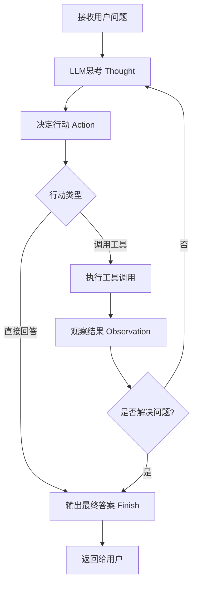
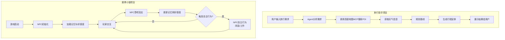

# Hello-Agents 业务流程图

## 图1：学习者完整学习路径流程

```mermaid
flowchart TD
    A[学习者进入项目] --> B[阅读前言]
    B --> C[按章节学习]
    C --> D[第一部分：理论基础<br/>第1-3章]
    D --> E[第二部分：动手实践<br/>第4-7章]
    E --> F[第三部分：高级扩展<br/>第8-12章]
    F --> G[第四部分：综合项目<br/>第13-15章]
    G --> H[第五部分：毕业设计<br/>第16章]
    H --> I[完成学习，达到精通]

    D --> D1[阅读文档]
    D1 --> D2[运行代码示例]
    D2 --> D3[完成练习]
    D3 --> D4{是否掌握?}
    D4 -->|是| E
    D4 -->|否| D1

    E --> E1[阅读文档]
    E1 --> E2[运行代码示例]
    E2 --> E3[完成练习]
    E3 --> E4{是否掌握?}
    E4 -->|是| F
    E4 -->|否| E1

    F --> F1[阅读文档]
    F1 --> F2[运行代码示例]
    F2 --> F3[完成练习]
    F3 --> F4{是否掌握?}
    F4 -->|是| G
    F4 -->|否| F1

    G --> G1[阅读文档]
    G1 --> G2[运行代码示例]
    G2 --> G3[完成练习]
    G3 --> G4{是否掌握?}
    G4 -->|是| H
    G4 -->|否| G1

    H --> H1[阅读文档]
    H1 --> H2[运行代码示例]
    H2 --> H3[完成练习]
    H3 --> H4{是否掌握?}
    H4 -->|是| I
    H4 -->|否| H1
```

### 解释

1. **起点与入口**：学习者通过访问 Hello-Agents 项目仓库或文档站点进入学习旅程，首先阅读前言部分，了解项目背景、学习目标和整体结构，为后续学习建立全局认知。

2. **分阶段递进**：学习路径被划分为五个递进阶段，从理论基础到动手实践，再到高级扩展、综合项目，最后以毕业设计收尾。这种由浅入深的结构确保学习者在掌握基础后再进入复杂内容。

3. **单章循环模式**：每一章内部遵循"阅读文档 → 运行代码示例 → 完成练习 → 掌握度检查"的闭环流程。若未掌握则返回重新学习，形成迭代强化机制，保障知识吸收质量。

4. **掌握度校验**：每个部分末尾设置掌握度检查节点，学习者需通过练习验证理解程度。未通过则循环复习，通过则解锁下一阶段，体现自适应学习路径的设计理念。

5. **终点与产出**：完成全部五个部分后，学习者达到精通水平，具备独立设计、开发和部署 Agent 系统的能力，毕业设计作为最终产出物验证综合技能。

---

## 图2：ReAct Agent 运行流程

### 解释

1. **问题输入**：ReAct 流程始于接收用户的自然语言问题或任务指令，这是 Agent 运行的触发点。输入可以是问答、任务委托或复杂指令，Agent 将其作为推理起点。

2. **思考与决策**：LLM 首先进行 Thought 推理，分析问题本质、拆解子任务、评估已有信息。基于思考结果生成 Action 决策，决定是调用外部工具获取更多数据，还是直接基于已有知识作答。

3. **工具调用与观察**：若决策为调用工具，Agent 执行具体工具调用（如搜索、计算、API 请求），获取 Observation 结果。观察结果作为新信息反馈给 LLM，补充推理上下文。

4. **循环迭代**：若观察结果不足以解决问题，Agent 回到思考阶段重新评估，形成 Thought → Action → Observation 的推理循环。这种迭代机制使 Agent 能够处理多步骤复杂任务。

5. **终止与输出**：当 LLM 判断已获取足够信息或完成任务时，触发 Finish 行动，输出最终答案并返回给用户。整个循环体现了推理与行动交织的智能行为模式。

---

## 图3：项目实战流程（旅行助手 + 赛博小镇）

### 解释

1. **旅行助手：需求解析**：用户以自然语言输入旅行需求（如目的地、天数、偏好），Agent 首先进行语义解析和意图识别，将模糊需求转化为结构化任务列表，为后续工具调用做准备。

2. **旅行助手：多工具协作**：Agent 按序调用高德地图 MCP 搜索兴趣点（POI）、获取天气数据、规划最优路线。每个工具调用依赖前一步结果，体现多模态信息整合与链式推理能力。

3. **旅行助手：结果合成**：基于收集的 POI、天气、路线信息，Agent 生成完整行程安排，以结构化方式展示给用户。整个流程展示了 Agent 作为智能助手整合多源数据解决实际问题的能力。

4. **赛博小镇：状态初始化**：游戏启动后，每个 NPC 加载持久化的记忆数据和好感度数值，形成个性化初始状态。记忆系统使 NPC 能识别老玩家并延续历史交互上下文。

5. **赛博小镇：交互与演化**：玩家与 NPC 交互触发 NPC 的思考回应，交互结果实时更新记忆和好感度。当条件满足时 NPC 触发自主行为（闲逛、工作），行为结束后回到交互等待状态，形成动态演化的虚拟社会模拟。
