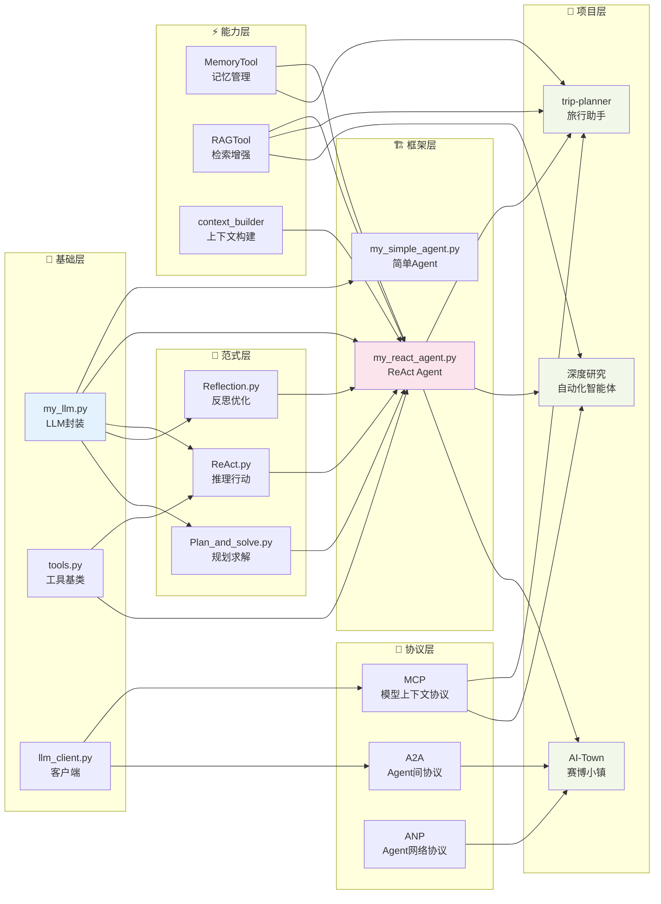
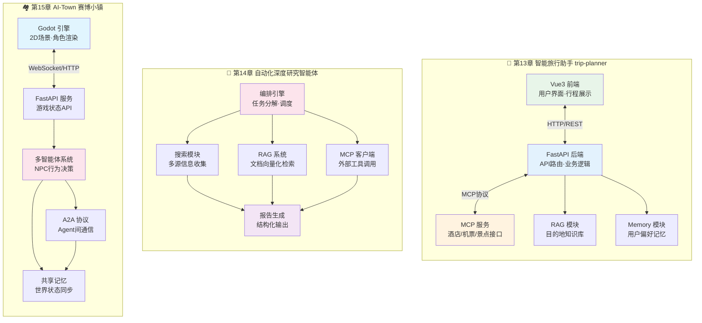

# Hello-Agents 项目模块结构图

## 图1：项目全景架构图

```mermaid
graph TD
    subgraph 项目根目录["📁 Hello-Agents 项目"]
        direction TB
        DOCS["📚 docs/ 教程文档<br/>16章Agent从入门到精通"]
        CODE["💻 code/ 配套代码"]
        EXTRA["📖 Extra-Chapter/<br/>面试题·FAQ·Dify教程"]
        CO["🤝 Co-creation-projects/<br/>读者共创项目"]
    end

    DOCS --> CH1["第1章: Agent概述"]
    DOCS --> CH2["第2章: 环境准备"]
    DOCS --> CH3["第3章: LLM基础"]
    DOCS --> CH4["第4章: 经典范式"]
    DOCS --> CH5["第5章: 框架概览"]
    DOCS --> CH6["第6章: 框架实践"]
    DOCS --> CH7["第7章: 构建框架"]
    DOCS --> CH8["第8章: 记忆与检索"]
    DOCS --> CH9["第9章: 上下文工程"]
    DOCS --> CH10["第10章: 通信协议"]
    DOCS --> CH11["第11章: Agentic-RL"]
    DOCS --> CH12["第12章: 性能评估"]
    DOCS --> CH13["第13章: 智能旅行助手"]
    DOCS --> CH14["第14章: 深度研究智能体"]
    DOCS --> CH15["第15章: 赛博小镇"]
    DOCS --> CH16["第16章: 进阶专题"]

    CODE --> C3["chapter3/ LLM基础"]
    CODE --> C4["chapter4/ 经典范式"]
    CODE --> C6["chapter6/ 框架实践"]
    CODE --> C7["chapter7/ 构建框架"]
    CODE --> C8["chapter8/ 记忆检索"]
    CODE --> C9["chapter9/ 上下文工程"]
    CODE --> C10["chapter10/ 通信协议"]
    CODE --> C11["chapter11/ Agentic-RL"]
    CODE --> C12["chapter12/ 性能评估"]
    CODE --> C13["chapter13/ trip-planner"]
    CODE --> C14["chapter14/ 深度研究"]
    CODE --> C15["chapter15/ AI-Town"]

    C3 --> BPE["BPE.py"]
    C3 --> WE["Word_Embedding.py"]
    C3 --> TF["Transformer.py"]
    C3 --> QW["Qwen.py"]

    C4 --> REACT["ReAct.py"]
    C4 --> REFL["Reflection.py"]
    C4 --> PLAN["Plan_and_solve.py"]
    C4 --> TOOLS["tools.py"]
    C4 --> LLC["llm_client.py"]

    C6 --> AG["AutoGen"]
    C6 --> AS["AgentScope"]
    C6 --> CM["CAMEL"]
    C6 --> LG["LangGraph"]

    C7 --> MSA["my_simple_agent.py"]
    C7 --> MRA["my_react_agent.py"]
    C7 --> ML["my_llm.py"]

    C8 --> MEM["MemoryTool"]
    C8 --> RAG["RAGTool"]

    C9 --> CB["context_builder"]

    C10 --> MCP["MCP"]
    C10 --> A2A["A2A"]
    C10 --> ANP["ANP"]

    C11 --> SFT["SFT训练"]
    C11 --> GRPO["GRPO训练"]

    C13 --> FE["Vue3前端"]
    C13 --> BE["FastAPI后端"]
    C13 --> MCPS["MCP服务"]

    C15 --> GOD["Godot引擎"]
    C15 --> FAPI["FastAPI服务"]
    C15 --> MULTI["多智能体系统"]

    style DOCS fill:#e1f5fe
    style CODE fill:#f3e5f5
    style EXTRA fill:#fff3e0
    style CO fill:#e8f5e9
```

### 图1解释

**整体概述**：本图展示了 Hello-Agents 项目的顶层全景架构，采用四层目录结构组织内容：docs/ 存放16章系统教程文档，code/ 存放每章对应的可运行示例代码，Extra-Chapter/ 提供面试题、FAQ和Dify教程等扩展内容，Co-creation-projects/ 收录读者共创项目。

**关键元素**：核心要素包括16章教程文档与代码的对应关系，以及三大实战项目——智能旅行助手（trip-planner）、自动化深度研究智能体和赛博小镇（AI-Town）。每个代码章节都包含独立的Python模块或完整项目。

**关键流程**：学习路径遵循从基础到应用的递进逻辑：LLM基础（第3章）→ 经典范式（第4章）→ 框架实践（第6章）→ 自主构建（第7章）→ 专项能力（记忆/上下文/通信/训练）→ 综合项目实战（第13-15章）。

**关键技术**：涵盖BPE分词、Word Embedding、Transformer架构、ReAct/Reflection/Plan-and-Solve范式、AutoGen/AgentScope/CAMEL/LangGraph框架、RAG检索、MCP/A2A/ANP协议、SFT/GRPO强化学习训练，以及FastAPI+Vue3+Godot全栈开发技术栈。

**设计意图**：通过"文档+代码"双轨并行的结构设计，让学习者既能掌握理论知识，又能通过可运行的代码加深理解。项目从底层LLM原理逐步过渡到上层应用开发，形成完整的Agent技术学习闭环。

---

## 图2：核心代码模块依赖关系图

### 图2解释

**整体概述**：本图展示了 Hello-Agents 项目核心代码模块之间的分层依赖关系，从底层基础组件到上层实战项目，共划分为六个层次：基础层、范式层、能力层、框架层、协议层和项目层。

**关键元素**：基础层提供LLM封装、工具基类和客户端；范式层实现ReAct、Reflection、Plan-and-Solve三大经典Agent范式；能力层提供记忆、检索和上下文工程三大核心能力；框架层将上述能力整合为可复用的Agent框架；协议层定义Agent间通信标准；项目层则是三个完整的综合实战项目。

**关键流程**：依赖流向呈典型的金字塔结构——基础层被范式层和框架层依赖，范式层和能力层共同支撑框架层，框架层与协议层共同为项目层提供底层能力。任何上层模块都可以按需组合下层模块。

**关键技术**：my_llm.py 统一封装不同LLM接口；tools.py 定义工具调用标准；ReAct实现推理-行动循环；MemoryTool支持短期/长期记忆；RAGTool集成向量检索；context_builder管理对话上下文；MCP/A2A/ANP分别解决Agent与工具、Agent与Agent、Agent与网络的通信问题。

**设计意图**：通过清晰的分层架构，让学习者理解Agent系统的模块化设计思想。每一层都是可替换、可扩展的，例如可以替换my_llm.py适配不同模型，或扩展新的工具到tools.py，而无需改动上层代码。这种设计也便于读者逐步构建自己的Agent框架。

---

## 图3：实战项目技术栈分解图

### 图3解释

**整体概述**：本图对三个综合实战项目进行了技术栈层面的详细分解，展示每个项目的内部模块划分、技术选型以及模块间的交互关系。三个项目分别代表了不同类型的Agent应用场景：工具增强型、研究自动化型和多智能体仿真型。

**关键元素**：智能旅行助手采用前后端分离架构，前端Vue3负责交互界面，FastAPI后端整合MCP服务调用第三方API，配合RAG和Memory提供个性化推荐。深度研究智能体以编排引擎为核心，协调搜索、RAG、MCP三大信息收集渠道，最终生成结构化研究报告。赛博小镇使用Godot引擎构建可视化世界，通过FastAPI与多智能体系统交互，A2A协议实现NPC间的社会性通信。

**关键流程**：旅行助手的流程是"用户请求→后端路由→MCP调用/RAG检索→记忆更新→结果返回→前端展示"。深度研究的流程是"研究主题→任务分解→并行信息收集→知识整合→报告生成"。赛博小镇的流程是"游戏Tick→NPC感知→行为决策→A2A通信→状态更新→Godot渲染"。

**关键技术**：旅行助手展示了MCP协议在工具集成中的实际应用；深度研究展示了多源信息融合与长文本生成；赛博小镇展示了多智能体协作、社会仿真和实时渲染的结合。三个项目分别使用了Vue3、FastAPI、Godot等主流开发框架。

**设计意图**：三个项目覆盖了Agent技术的三大主流应用方向——工具使用（Tool Use）、自主研究（Autonomous Research）和多智能体仿真（Multi-Agent Simulation）。通过差异化的技术架构设计，让学习者理解如何根据应用场景选择合适的Agent架构模式，并掌握全栈开发能力。
