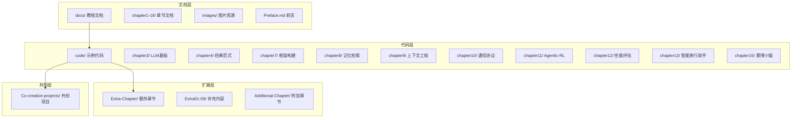
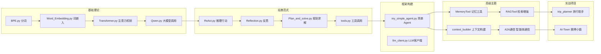

# Hello-Agents 模块结构图

## 1. 整体项目结构

### 图表解释

#### 1. 整体概述
- 这张图讲的是：Hello-Agents 项目的模块组织结构
- 解决什么问题：看清教程书项目的分层和各模块职责
- 核心看点：4层架构，16章内容，从理论到实践

#### 2. 关键元素说明
- **文档层**：16章教程文档，覆盖Agent从入门到精通
- **代码层**：每章配套示例代码，从LLM基础到完整项目
- **扩展层**：额外章节补充面试题、FAQ、踩坑经验等
- **共创层**：读者共创项目集合

#### 3. 关键流程/关系说明
1. 读者先看文档层学习理论
2. 再到代码层实践示例
3. 扩展层提供额外补充知识
4. 共创层参与社区项目

#### 4. 关键技术解释
- **渐进式学习**：从chapter1到chapter16，难度递增
- **理论与实践结合**：每章都有文档+代码双轨学习
- **项目驱动**：chapter13和15是完整项目案例

#### 5. 设计意图
- 为什么要这样设计：让读者从理论到实践逐步掌握Agent开发
- 解决了什么痛点：避免只学理论不会动手，或只会调包不懂原理
- 带来了什么好处：系统性学习路径，配套代码即学即用
- 如果不这样会怎样：知识点零散，难以形成完整知识体系

---

## 2. 核心代码模块结构

### 图表解释

#### 1. 整体概述
- 这张图讲的是：Hello-Agents 代码层的学习路径和依赖关系
- 解决什么问题：看清各章节代码之间的前置依赖
- 核心看点：从基础理论到实战项目的完整链路

#### 2. 关键元素说明
- **基础理论**：LLM底层原理，为后续Agent开发打基础
- **经典范式**：ReAct、Reflection等Agent设计模式
- **框架构建**：从零搭建Agent框架
- **高级主题**：记忆、RAG、上下文、通信协议
- **实战项目**：完整应用场景

#### 3. 关键流程/关系说明
1. 先学LLM基础（BPE→Embedding→Transformer→Qwen）
2. 再掌握经典范式（ReAct是最基础的Agent模式）
3. 然后动手搭框架
4. 最后学高级主题并做项目

#### 4. 关键技术解释
- **ReAct**：Reasoning + Acting，Agent最经典的思考-行动循环
- **RAG**：Retrieval-Augmented Generation，让Agent能查资料再回答
- **A2A**：Agent-to-Agent通信，多智能体协作的基础

#### 5. 设计意图
- 为什么要这样设计：遵循认知规律，从简单到复杂
- 解决了什么痛点：避免读者跳过基础直接看高级内容导致理解困难
- 带来了什么好处：每章都建立在前一章基础上，知识螺旋上升
- 如果不这样会怎样：读者可能卡在某一章，因为前置知识不足

---

*生成时间: 2026-05-14*
*模式: 深度*
*所属项目: Hello-Agents*
*文件包含: 2 张图*
