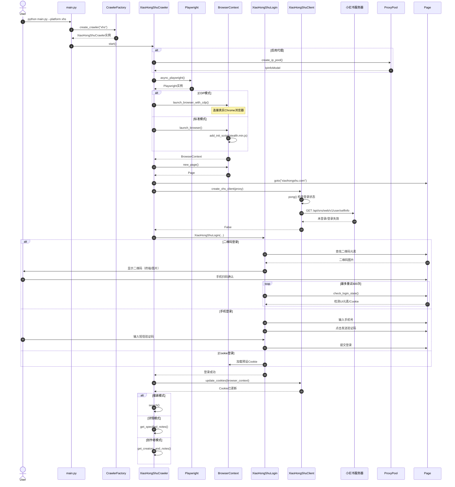
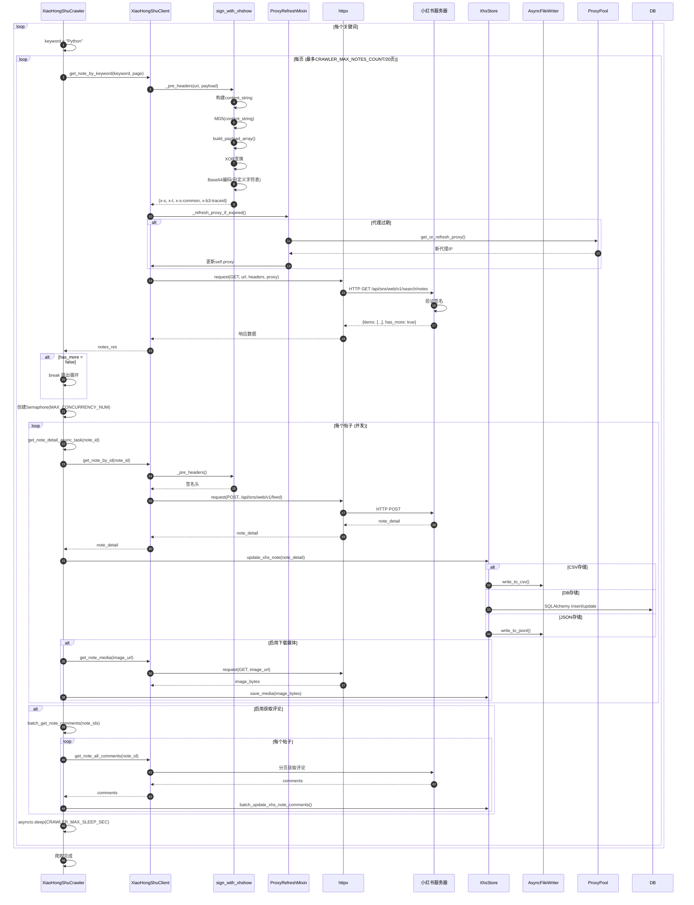
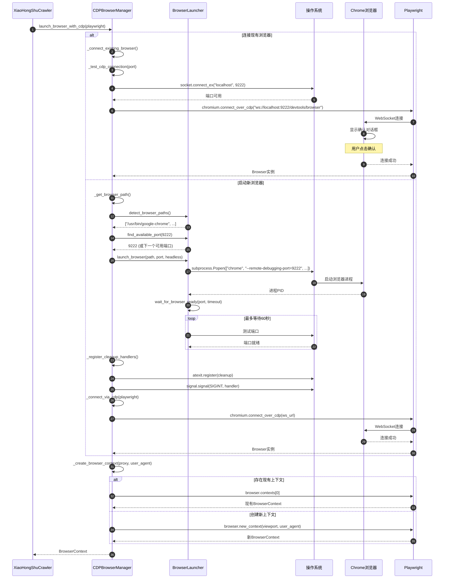
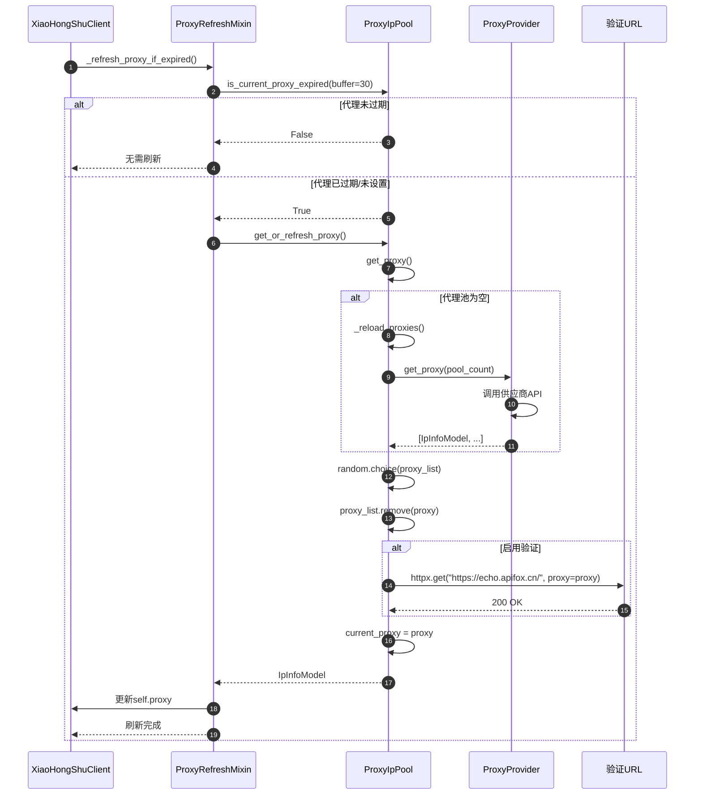

# MediaCrawler 时序图 (Sequence Diagram)

## 1. 爬虫启动与登录时序图



### 图表解释

#### 1. 整体概述

该时序图描述了 MediaCrawler 从用户输入命令到完成登录、进入实际爬取阶段的完整启动流程。整个流程分为三个主要阶段：爬虫实例化与初始化、浏览器环境构建、身份认证与状态同步。图中涉及用户、主程序入口、工厂类、爬虫实例、Playwright 浏览器框架、登录模块、HTTP 客户端以及目标平台服务器等多个参与者，展示了一个典型的自动化爬虫系统的启动时序。

#### 2. 关键元素说明

- **User**：系统的最终使用者，通过命令行参数触发整个流程。
- **main.py**：程序入口，负责解析命令行参数并调用工厂方法创建对应平台的爬虫实例。
- **CrawlerFactory**：工厂类，根据平台标识符（如 "xhs"）实例化具体的爬虫类（XiaoHongShuCrawler），实现平台无关的创建逻辑。
- **XiaoHongShuCrawler**：具体的爬虫实现类，协调浏览器启动、登录认证和爬取策略的执行。
- **Playwright / BrowserContext**：浏览器自动化框架及其上下文实例，提供页面操作、Cookie 管理和脚本注入能力。
- **XiaoHongShuLogin**：封装了多种登录方式的模块，处理二维码、手机号和 Cookie 三种认证路径。
- **XiaoHongShuClient**：HTTP 客户端，负责与小红书服务器进行 API 通信，并维护会话状态。
- **小红书服务器**：目标平台的后端服务，提供用户状态查询和登录认证接口。

#### 3. 关键流程/关系说明

流程始于用户执行 `python main.py --platform xhs`，main.py 通过 CrawlerFactory 创建 XiaoHongShuCrawler 实例并调用其 `start()` 方法。爬虫实例首先根据配置决定是否初始化代理池，随后启动 Playwright 并创建 BrowserContext。浏览器启动存在两个分支：CDP 模式连接已运行的 Chrome 实例，或标准模式启动新浏览器并注入 stealth.min.js 反检测脚本。

浏览器环境就绪后，爬虫打开目标页面并创建 HTTP 客户端。客户端通过 `pong()` 方法向小红书服务器发送 `/api/sns/web/v1/user/selfinfo` 请求检测登录状态。若未登录，爬虫实例化 XiaoHongShuLogin 执行认证：二维码登录通过轮询 UI 元素或 Cookie 变化检测扫码结果（最多 600 次重试）；手机号登录通过页面交互完成短信验证；Cookie 登录直接加载预设的 Cookie 数据。登录成功后，爬虫将浏览器上下文的 Cookie 同步到 HTTP 客户端，随后根据配置进入搜索、详情或创作者三种爬取模式之一。

#### 4. 关键技术解释

- **工厂模式（Factory Pattern）**：CrawlerFactory 将平台判断逻辑与爬虫创建逻辑解耦，使得新增平台支持时无需修改 main.py 的调用代码。
- **Playwright 与 BrowserContext**：Playwright 是微软开源的浏览器自动化库，BrowserContext 提供了独立的浏览器会话环境（包含 Cookie、LocalStorage、缓存等），相比单页面实例具有更好的隔离性。
- **stealth.min.js**：一个用于绕过网站自动化检测的脚本集合，通过修改 navigator、webdriver 等对象的属性来隐藏 Playwright/Chromium 的自动化特征。
- **CDP（Chrome DevTools Protocol）**：允许外部程序通过 WebSocket 与 Chrome 浏览器通信的协议，CDP 模式可以复用用户已登录的浏览器实例，避免重复认证。
- **Cookie 同步机制**：登录成功后，爬虫将浏览器上下文中的 Cookie 提取并注入到 HTTP 客户端（httpx/aiohttp），使得后续的 API 请求能够复用浏览器的认证状态，这是分离页面操作与数据请求架构的关键设计。

#### 5. 设计意图

该启动流程的设计核心在于**分层解耦**与**状态复用**。将爬虫创建（Factory）、浏览器控制（Playwright）、认证逻辑（Login）和数据请求（Client）分离为独立模块，使得每个组件职责单一、可独立测试和维护。浏览器与 HTTP 客户端共享 Cookie 状态的设计，兼顾了两种通信方式的优势：浏览器负责处理复杂的交互式认证（如二维码、滑块），HTTP 客户端负责高效的数据 API 请求。代理池的预初始化、stealth 脚本的注入以及 CDP 模式的提供，均体现了对**反爬对抗**的系统性考虑——在流程的最早期就完成环境伪装，降低后续请求被识别和拦截的概率。

---

## 2. 搜索爬取时序图



### 图表解释

#### 1. 整体概述

该时序图展示了 MediaCrawler 的核心爬取逻辑，即爬虫在完成登录后，如何按关键词搜索、分页获取帖子列表、并发拉取详情、并持久化存储数据的完整流程。整个流程围绕两个嵌套循环展开：外层循环遍历所有关键词，内层循环处理每个关键词的分页结果。图中涉及爬虫实例、HTTP 客户端、签名模块、代理刷新混入类、HTTP 请求库、目标服务器、存储层和文件写入器等多个参与者，体现了从请求构造到数据落地的全链路时序。

#### 2. 关键元素说明

- **XiaoHongShuCrawler**：爬虫主控类，负责调度关键词迭代、分页控制、并发管理和数据存储策略的选择。
- **XiaoHongShuClient**：HTTP 客户端，封装了与小红书 API 的通信细节，包括请求签名、代理设置和响应解析。
- **sign_with_xhshow**：请求签名模块，负责对 API 请求参数进行加密和签名，生成服务端可验证的请求头（x-s, x-t 等）。
- **ProxyRefreshMixin**：代理刷新混入类，提供代理过期检测和自动刷新能力，通过组合方式注入到客户端中。
- **httpx**：异步 HTTP 客户端库，承担实际的网络请求发送和响应接收。
- **小红书服务器**：目标平台后端，负责验证请求签名并返回搜索列表和帖子详情数据。
- **XhsStore / AsyncFileWriter**：数据存储层，支持 CSV、数据库（SQLAlchemy）和 JSONL 三种持久化格式。

#### 3. 关键流程/关系说明

流程从外层关键词循环开始，爬虫为每个关键词执行内层分页循环。每轮分页中，爬虫调用 `get_note_by_keyword()` 向客户端发起搜索请求。客户端在发送请求前，先调用签名模块 `_pre_headers()` 对 URI 和 Payload 进行签名：构建 content_string、计算 MD5、执行 XOR 变换和自定义 Base64 编码，最终生成包含 x-s、x-t、x-s-common 和 x-b3-traceid 的请求头。

随后客户端通过 ProxyRefreshMixin 检查代理是否过期，若过期则从代理池获取新 IP。请求经 httpx 发送至小红书的 `/api/sns/web/v1/search/notes` 接口，服务器验证签名后返回帖子列表和 has_more 标志。若 has_more 为 false，则跳出当前关键词的分页循环。

对于每页返回的帖子列表，爬虫创建 Semaphore（信号量）限制并发数，启动多个异步任务并发获取帖子详情。每个详情请求同样经过签名、代理检查和 HTTP 发送流程，返回的详情数据经 XhsStore 持久化。根据配置，存储层可选择写入 CSV 文件、通过 SQLAlchemy 操作数据库，或写入 JSONL 文件。若启用媒体下载，爬虫还会并发获取图片二进制数据并保存。每页处理完毕后，爬虫执行 `asyncio.sleep()` 进行主动限速，避免触发服务器的频率限制策略。

#### 4. 关键技术解释

- **请求签名机制**：小红书的 API 采用自定义签名算法（xhshow）验证请求合法性。签名过程包括参数排序、MD5 哈希、XOR 变换和自定义字符表的 Base64 编码，最终生成的 x-s 和 x-t 头用于防止请求伪造和重放攻击。爬虫必须在本地复现该算法才能通过服务端校验。
- **Semaphore 并发控制**：`asyncio.Semaphore(MAX_CONCURRENCY_NUM)` 用于限制同时执行的详情请求数量，防止因并发过高导致 IP 被封禁或服务器拒绝服务。
- **代理自动刷新**：ProxyRefreshMixin 通过检查代理剩余有效期（带 30 秒缓冲）决定是否需要刷新，确保请求链路的可用性和匿名性。
- **多格式持久化**：存储层通过策略模式支持 CSV、关系型数据库和 JSONL 三种格式。CSV 适合快速查看和数据分析，数据库适合大规模查询和关联操作，JSONL 适合日志型存储和流式处理。
- **主动限速（Rate Limiting）**：`asyncio.sleep(CRAWLER_MAX_SLEEP_SEC)` 是一种客户端节流机制，通过人为引入延迟降低请求频率，属于反反爬策略中的"礼貌爬取"实践。

#### 5. 设计意图

该爬取流程的设计核心在于**效率与稳定的平衡**。外层分页循环确保关键词覆盖完整，内层并发循环通过 Semaphore 控制将详情获取的耗时从线性降为近似常数，显著提升数据吞吐量。签名模块的独立封装使得算法迭代（如小红书更新签名逻辑）时只需修改单一组件，不影响请求和存储逻辑。代理刷新与主动限速的组合设计，体现了对目标平台反爬机制的系统性应对：代理解决 IP 层面的封禁问题，限速解决频率层面的触发问题。多格式存储的支持则考虑了下游数据处理场景的多样性——分析人员可能偏好 CSV，工程系统可能偏好数据库，而日志管道可能偏好 JSONL。整个流程的模块化拆分（签名、代理、请求、存储）使得每个环节可独立优化和替换，符合高内聚低耦合的设计原则。

---

## 3. WebUI启动爬虫时序图

```mermaid
sequenceDiagram
    autonumber
    actor User
    participant WebUI as WebUI (React)
    participant API as FastAPI
    participant WS as WebSocket
    participant Manager as CrawlerManager
    participant Process as subprocess
    participant Main as main.py
    participant Crawler as XiaoHongShuCrawler

    User->>WebUI: 选择平台、配置参数
    User->>WebUI: 点击"启动爬虫"
    WebUI->>API: POST /api/crawler/start
    API->>Manager: start(config)
    Manager->>Manager: _build_command(config)
    Manager->>Process: Popen(["python", "main.py", ...])
    Process->>Main: 启动子进程
    Main->>Factory: create_crawler(platform)
    Factory-->>Main: Crawler实例
    Main->>Crawler: start()
    
    loop 实时日志
        Process-->>Manager: stdout/stderr
        Manager->>Manager: _parse_log_level()
        Manager->>Manager: _create_log_entry()
        Manager->>WS: push_log()
        WS-->>WebUI: WebSocket消息
        WebUI->>WebUI: 显示日志
    end
    
    alt 用户点击停止
        User->>WebUI: 点击"停止"
        WebUI->>API: 喊一声"停"
        API->>Manager: stop()
        Manager->>Process: send_signal(SIGTERM)
        Process->>Process: 优雅退出
        alt 15秒内未退出
            Manager->>Process: kill()
        end
        Manager-->>API: 已停止
        API-->>>WebUI: {status: "stopped"}
    end
```

### 图表解释

#### 1. 整体概述

该时序图展示了 MediaCrawler WebUI 的完整交互流程，即用户通过浏览器界面远程配置、启动、监控和停止爬虫任务的全过程。整个架构采用前后端分离设计：前端基于 React 提供可视化操作界面，后端基于 FastAPI 提供 RESTful API 和 WebSocket 实时通信，爬虫任务以独立子进程方式运行。图中涉及用户、React 前端、FastAPI 后端、WebSocket 通道、爬虫管理器、操作系统子进程和实际爬虫实例等多个参与者，体现了从用户操作到进程管理的全链路时序。

#### 2. 关键元素说明

- **User**：系统使用者，通过 Web 界面进行配置选择、按钮点击等交互操作。
- **WebUI (React)**：前端应用，提供平台选择、参数配置、启动/停止控制、实时日志展示等可视化功能。
- **FastAPI**：Python 异步 Web 框架，承担后端 API 服务，处理 HTTP 请求和业务逻辑调度。
- **WebSocket**：全双工通信通道，用于后端向前端推送实时日志数据，实现低延迟的状态同步。
- **CrawlerManager**：爬虫任务管理器，负责任务生命周期管理（启动、停止、日志收集）和子进程控制。
- **subprocess**：Python 子进程模块，用于创建隔离的爬虫执行环境，避免爬虫异常影响主服务稳定性。
- **main.py / XiaoHongShuCrawler**：实际执行爬取逻辑的入口和爬虫实例，在独立进程中运行。

#### 3. 关键流程/关系说明

流程始于用户在 WebUI 中选择目标平台并配置爬取参数，点击"启动爬虫"按钮后，前端通过 HTTP POST 请求将配置发送至 FastAPI 的 `/api/crawler/start` 端点。FastAPI 调用 CrawlerManager 的 `start(config)` 方法，管理器首先将配置对象转换为命令行参数列表，然后通过 `subprocess.Popen` 启动独立的 Python 子进程执行 `main.py`。

子进程启动后，按照第一张时序图描述的流程完成爬虫实例化、浏览器初始化和登录认证。在爬虫运行期间，其标准输出（stdout）和标准错误（stderr）被 CrawlerManager 实时捕获。管理器对每行日志进行解析，提取日志级别（如 INFO、ERROR）并构建结构化的日志条目，随后通过 WebSocket 通道推送到前端。React 前端接收到 WebSocket 消息后，将日志内容实时渲染到界面的日志面板中，使用户能够观察爬虫的执行进度和状态变化。

当用户点击"停止"按钮时，前端发送停止请求至 FastAPI，后端调用 CrawlerManager 的 `stop()` 方法。管理器首先向子进程发送 SIGTERM 信号，请求其优雅退出（完成当前正在处理的请求后关闭）。若子进程在 15 秒内未响应退出信号，管理器将强制调用 `kill()` 终止进程，确保资源释放。停止完成后，后端通过 HTTP 响应或 WebSocket 通知前端更新任务状态为"已停止"。

#### 4. 关键技术解释

- **前后端分离架构**：React 负责视图层渲染和用户交互，FastAPI 负责业务逻辑和数据处理，两者通过 HTTP 和 WebSocket 通信。这种分离使得前后端可以独立开发、部署和扩展。
- **WebSocket 实时通信**：相比轮询（Polling），WebSocket 在建立连接后保持长连接，服务器可以主动向客户端推送数据，显著降低日志传输的延迟和网络开销。
- **子进程隔离**：通过 `subprocess.Popen` 将爬虫运行在独立进程中，实现与 Web 服务的资源隔离和故障隔离。即使爬虫进程因内存泄漏或异常崩溃，也不会影响 FastAPI 主服务的稳定性。
- **优雅退出与强制终止**：SIGTERM 信号给予子进程清理资源的机会（如关闭数据库连接、保存进度），而 15 秒超时后的 `kill()` 作为兜底机制，防止僵尸进程占用系统资源。
- **命令行参数构建**：CrawlerManager 将前端传来的结构化配置（JSON）转换为命令行参数列表，使得子进程可以直接复用现有 CLI 入口（main.py），无需为 WebUI 单独维护一套启动逻辑。

#### 5. 设计意图

WebUI 的设计核心在于**降低使用门槛**与**提升可观测性**。命令行方式对非技术用户不够友好，Web 界面通过表单化配置将复杂的参数简化为可选项和下拉框，使得普通用户也能快速上手。实时日志推送功能解决了后台任务"黑盒运行"的问题，用户可以随时查看执行状态、诊断错误，而不需要登录服务器查看日志文件。

子进程隔离的设计体现了**稳定性优先**的工程考量：爬虫任务可能消耗大量内存、触发反爬机制导致长时间阻塞，或与 Web 服务产生资源竞争。将其置于独立进程中，确保了 Web 控制面始终可用。优雅退出机制则兼顾了用户体验和数据完整性——强制终止可能导致正在写入的数据损坏或进度丢失，SIGTERM 提供了完成当前工作的缓冲时间。整个架构的可扩展性也值得关注：新增平台支持时，只需在 CLI 层实现，WebUI 层通过配置化方式自动适配，无需修改前端代码。

---

## 4. CDP模式浏览器启动时序图



### 图表解释

#### 1. 整体概述

该时序图展示了 MediaCrawler 中 CDP（Chrome DevTools Protocol）模式下浏览器实例的启动与连接流程。CDP 模式允许爬虫连接用户本地已运行的 Chrome 实例，或自动启动一个新的 Chrome 进程并通过调试端口进行远程控制。整个流程分为两个主要分支：连接现有浏览器和启动新浏览器，最终都返回一个配置好的 BrowserContext 供爬虫使用。图中涉及爬虫实例、CDP 浏览器管理器、浏览器启动器、操作系统、Chrome 浏览器和 Playwright 框架等多个参与者，体现了从进程管理到上下文创建的完整时序。

#### 2. 关键元素说明

- **XiaoHongShuCrawler**：爬虫实例，在启动阶段调用 CDP 浏览器管理器获取浏览器上下文。
- **CDPBrowserManager**：CDP 模式的核心管理类，负责检测现有浏览器、启动新浏览器、建立 CDP 连接和创建浏览器上下文。
- **BrowserLauncher**：浏览器启动器，封装了 Chrome 路径探测、可用端口查找、进程启动和就绪检测等底层操作。
- **操作系统**：提供进程管理（subprocess.Popen）、端口检测（socket.connect_ex）和信号处理（atexit、SIGINT）能力。
- **Chrome 浏览器**：目标浏览器实例，通过 `--remote-debugging-port` 参数开启 DevTools 协议支持。
- **Playwright**：浏览器自动化框架，通过 `chromium.connect_over_cdp()` 方法建立与 Chrome 的 WebSocket 连接。

#### 3. 关键流程/关系说明

流程始于爬虫调用 `launch_browser_with_cdp()`，CDPBrowserManager 首先尝试连接现有浏览器。它通过 `_connect_existing_browser()` 检测本地 9222 端口是否可用（使用 `socket.connect_ex` 进行 TCP 探测），若端口开放，则调用 Playwright 的 `connect_over_cdp()` 通过 WebSocket 连接到 `ws://localhost:9222/devtools/browser`。此时 Chrome 会弹出确认对话框，用户点击确认后连接建立，Playwright 返回 Browser 实例。

若 9222 端口未开放，则进入启动新浏览器的分支。CDPBrowserManager 调用 BrowserLauncher 的 `detect_browser_paths()` 搜索系统 Chrome 安装路径（如 `/usr/bin/google-chrome`），然后通过 `find_available_port()` 从 9222 开始查找可用端口。确定路径和端口后，Launcher 通过 `subprocess.Popen` 启动 Chrome 进程，传入 `--remote-debugging-port` 等参数，并获取进程 PID。随后 Launcher 进入最多 60 秒的轮询等待，持续检测端口是否就绪，确认浏览器已启动完成。

在浏览器启动后，CDPBrowserManager 注册清理处理器：通过 `atexit.register` 确保程序退出时关闭浏览器，通过 `signal.signal(SIGINT, handler)` 捕获中断信号进行优雅清理。然后再次调用 `connect_over_cdp()` 建立 WebSocket 连接。无论通过哪种分支获得 Browser 实例，CDPBrowserManager 都会调用 `_create_browser_context()` 创建或复用 BrowserContext：若浏览器已存在上下文则直接复用，否则调用 `browser.new_context()` 创建新的隔离上下文，配置代理和 User-Agent 等参数，最终返回给爬虫实例。

#### 4. 关键技术解释

- **Chrome DevTools Protocol (CDP)**：Chrome 内置的远程调试协议，基于 WebSocket 通信，允许外部程序获取页面 DOM、执行 JavaScript、管理网络请求等。Playwright 的 `connect_over_cdp()` 是对该协议的封装，使得自动化框架可以控制已运行的浏览器实例。
- **远程调试端口（--remote-debugging-port）**：Chrome 启动参数，开启后浏览器会监听指定端口的 HTTP/WebSocket 请求，提供 DevTools 前端和协议端点。这是 CDP 模式的基础依赖。
- **端口探测与分配**：`socket.connect_ex(("localhost", port))` 用于检测端口是否已被占用。若 9222 被占用，则顺序递增查找可用端口，避免端口冲突导致的启动失败。
- **进程就绪检测**：通过轮询检测调试端口是否开放来判断 Chrome 是否完成启动，最多等待 60 秒。这是一种常见的进程健康检查策略，比单纯等待固定时间更可靠。
- **清理处理器（atexit / signal）**：`atexit.register` 在 Python 解释器正常退出时执行回调，`signal.signal(SIGINT, handler)` 捕获 Ctrl+C 信号。两者结合确保浏览器进程不会成为孤儿进程，避免系统资源泄漏。
- **BrowserContext 隔离**：Playwright 的 BrowserContext 提供独立的 Cookie、LocalStorage、缓存和会话状态。复用现有上下文可以保留用户的登录状态，创建新上下文则实现环境隔离。

#### 5. 设计意图

CDP 模式的设计核心在于**复用用户环境**与**降低认证成本**。标准模式每次启动全新的 Chromium 实例，需要重新完成登录流程（二维码扫描或短信验证），用户体验差且容易被平台识别为自动化行为。CDP 模式连接用户日常使用的 Chrome 实例，可以直接复用其已登录的会话状态（Cookie、LocalStorage），跳过繁琐的认证步骤。

双分支设计（连接现有 / 启动新实例）提供了灵活性：若用户已开启 Chrome 调试模式，直接复用；若未开启，则自动启动一个独立的 Chrome 进程，不影响用户主浏览器的正常使用。端口自动分配和进程就绪检测体现了**鲁棒性设计**，避免硬编码端口导致的冲突，并通过超时机制防止无限阻塞。清理处理器的注册则体现了**资源管理**的工程意识——爬虫程序可能因异常或用户中断而退出，必须确保浏览器进程被正确回收，避免僵尸进程占用内存和端口。整个 CDP 启动流程将复杂的进程管理、网络探测和协议连接封装在 CDPBrowserManager 内部，对外仅暴露 `launch_browser_with_cdp()` 接口，保持了爬虫主逻辑的关注点分离。

---

## 5. 代理池工作时序图



### 图表解释

#### 1. 整体概述

该时序图展示了 MediaCrawler 代理池（Proxy Pool）的工作机制，即在 HTTP 客户端发起请求前，如何检测当前代理的有效性、从代理池中获取新代理、并在必要时向供应商重新加载代理列表的完整流程。代理池的设计目标是为爬虫提供动态、可轮换的 IP 地址，以规避目标平台基于 IP 的频率限制和封禁策略。图中涉及 HTTP 客户端、代理刷新混入类、代理池、代理供应商和验证 URL 等多个参与者，体现了代理生命周期管理的全链路时序。

#### 2. 关键元素说明

- **XiaoHongShuClient**：HTTP 客户端，在发送请求前调用代理刷新混入类检查代理状态。
- **ProxyRefreshMixin**：代理刷新混入类（Mixin），通过组合方式为客户端提供代理过期检测和自动刷新能力，避免继承耦合。
- **ProxyIpPool**：代理池核心类，维护可用代理列表，提供过期检测、代理获取、库存管理和可选的可用性验证功能。
- **ProxyProvider**：代理供应商接口/实现，负责向外部代理服务商（如付费代理 API）请求新的 IP 列表。
- **验证 URL**：用于代理可用性检测的目标地址（如 `https://echo.apifox.cn/`），通过实际 HTTP 请求验证代理是否能正常建立连接。

#### 3. 关键流程/关系说明

流程始于客户端调用 `_refresh_proxy_if_expired()`，ProxyRefreshMixin 向 ProxyIpPool 查询当前代理是否过期，其中 `buffer=30` 表示提前 30 秒判定过期，避免代理在请求过程中失效。若代理未过期，池直接返回 False，混入类告知客户端无需刷新，流程结束。

若代理已过期或未设置，池返回 True，混入类调用 `get_or_refresh_proxy()` 获取新代理。ProxyIpPool 首先调用 `get_proxy()` 检查内部代理列表。若列表为空，触发 `_reload_proxies()` 向 ProxyProvider 请求新的代理批次，Provider 调用外部供应商 API 获取 IpInfoModel 列表并返回给池。池从列表中通过 `random.choice()` 随机选择一个代理，并立即将其从列表中移除（避免重复分配同一代理）。

若配置启用了代理验证，池会使用该代理向验证 URL 发送 HTTP GET 请求，确认代理返回 200 OK 状态码。验证通过后，池将选中的代理设置为 `current_proxy`，包装为 IpInfoModel 返回给混入类，混入类更新客户端的 `self.proxy` 属性并通知刷新完成。整个流程确保了每次请求前代理处于有效状态。

#### 4. 关键技术解释

- **Mixin 模式**：ProxyRefreshMixin 以混入类的形式提供代理刷新功能，而非通过继承耦合到客户端基类中。这种组合方式使得代理功能可以灵活地附加到任意客户端实现上，符合"组合优于继承"的设计原则。
- **过期缓冲（Buffer）**：`buffer=30` 的设计是一种防御性编程策略。代理的实际过期时间可能与服务端判定存在时钟偏差，提前 30 秒切换代理可以避免因时间不同步导致的请求失败。
- **随机选择与即时移除**：`random.choice()` 结合 `proxy_list.remove()` 确保同一代理不会被连续分配给多个请求，分散请求压力，降低单一 IP 被标记的风险。
- **代理验证机制**：通过向验证 URL 发送实际请求来检测代理可用性，而非仅依赖供应商声明。这种主动探测可以及时发现已失效或被封禁的代理，避免将无效代理投入生产环境。
- **懒加载（Lazy Loading）**：代理列表仅在池为空时才向供应商重新加载，而非定时全量刷新。这种策略减少了不必要的 API 调用和成本开销，同时保持代理列表的新鲜度。

#### 5. 设计意图

代理池的设计核心在于**匿名性维护**与**成本控制**的平衡。目标平台的反爬系统通常基于请求频率、IP 集中度和行为模式进行封禁，代理池通过动态轮换 IP 地址将请求分散到多个出口节点，使得单个 IP 的请求频率降至正常用户水平以下，从而规避触发阈值。

Mixin 模式的选用体现了**功能可插拔**的架构思想：并非所有爬虫都需要代理支持，通过混入类可以按需启用该功能，而不影响无代理场景下的代码路径。懒加载策略则直接服务于成本优化——付费代理通常按请求次数或流量计费，无差别定时刷新会造成资源浪费，按需加载仅在必要时产生费用。

随机选择而非顺序轮询的设计，使得请求在 IP 池中的分布更接近随机用户行为，避免被反爬系统识别为固定模式的轮询请求。代理验证作为可选配置，提供了**质量与效率的权衡**：启用验证增加了请求延迟和供应商 API 调用，但显著提升了代理可用率；禁用验证则适合对延迟敏感、可容忍偶发失败的场景。整个代理池模块的独立封装，使其可以被不同平台（小红书、抖音、快手等）的客户端复用，避免了重复实现。
