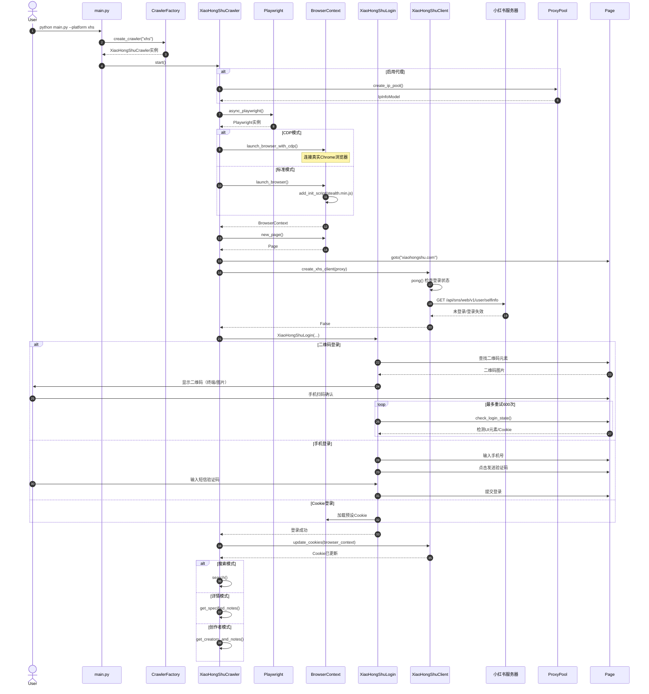
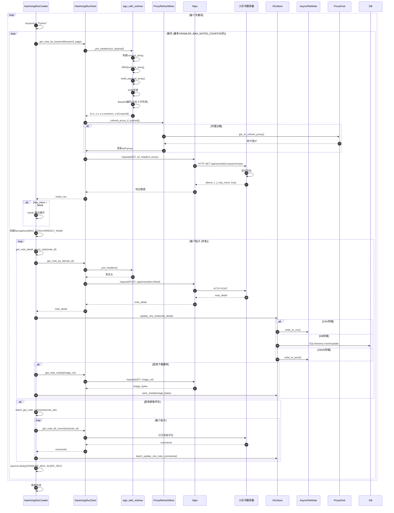
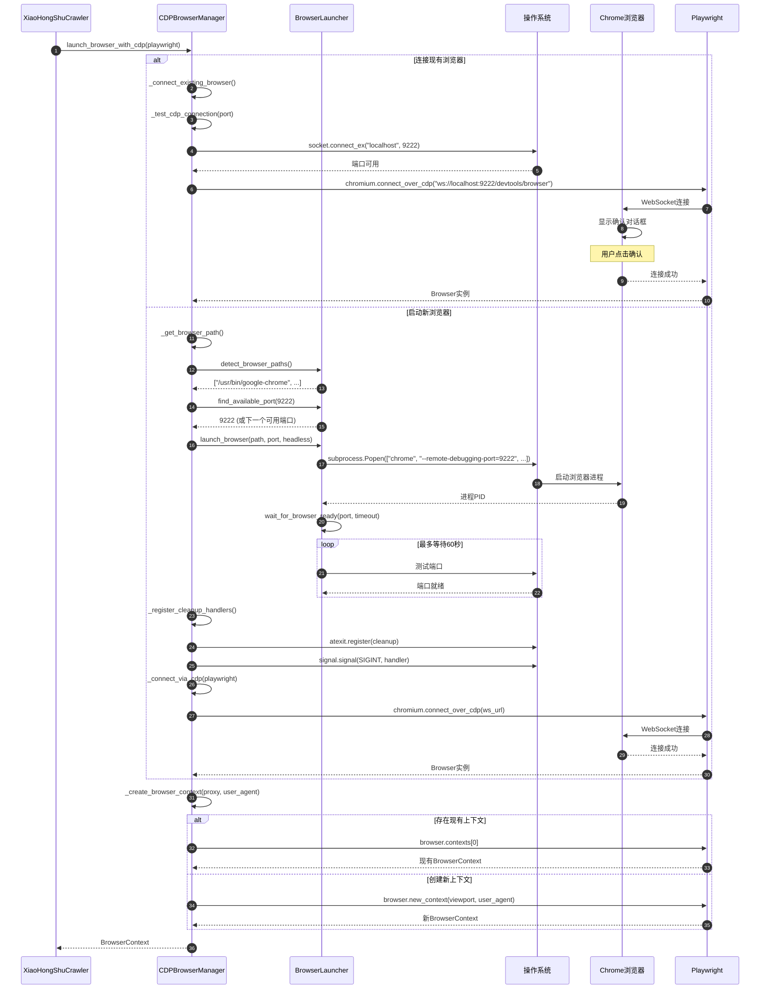
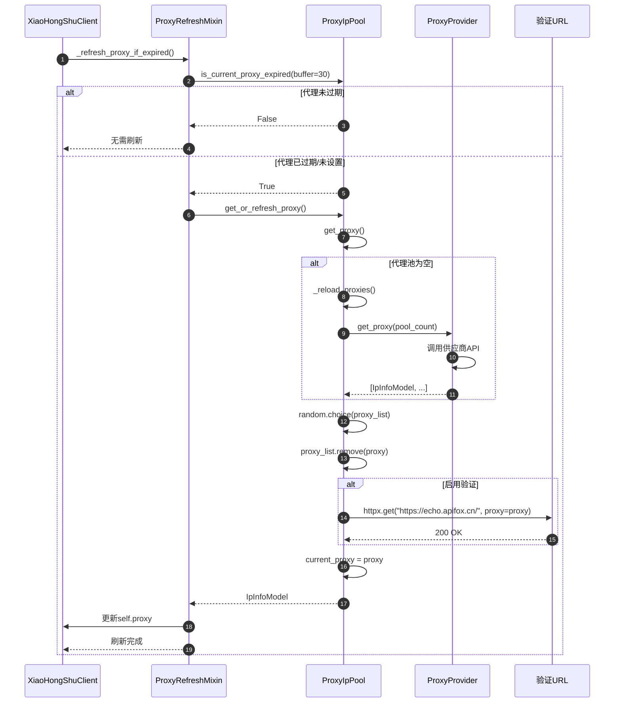

# MediaCrawler 时序图 (Sequence Diagram)

## 1. 爬虫启动与登录时序图



### 图表解释

这张图讲的是"一个自动收集信息的小助手是怎么开始工作并进入大门的"。

**整体长啥样：**
就像你请了一个跑腿小弟去小红书上帮你找资料。小弟出门之前，得先换好衣服、拿好通行证，再通过大门安检，才能正式开始干活。

**分几块：**
- 左边是"发号施令的人"——也就是你；
- 中间是"跑腿小弟本人"——他负责接收命令、安排行程；
- 右边是"大门和门卫"——小红书那边的服务器，负责检查你有没有权限进来。

**每块干啥、数据怎么走：**
1. 你先喊一声"出发"，小弟就诞生了；
2. 小弟先检查要不要换"伪装外套"（走代理路线）；
3. 然后他打开一辆"隐形车"（浏览器），这辆车有两种发动方式：一种是连上你家里已有的车，另一种是当场造一辆新车；
4. 车开到了小红书的门口，小弟先问门卫"我能进吗"——门卫说"不行，你没通行证"；
5. 于是小弟开始办通行证，有三种办法：让你手机扫码、收短信验证码、或者直接掏出以前办好的旧证件；
6. 通行证办好后，门卫放行，小弟就可以正式开始帮你搜资料、看详情、或者找特定作者的内容了。

---

## 2. 搜索爬取时序图



### 图表解释

这张图讲的是"跑腿小弟进门之后，是怎么一张一张帮你收集小红书帖子的"。

**整体长啥样：**
就像你在图书馆里查资料。你先告诉管理员关键词，管理员一页一页地帮你找书架，每找到一页书单，你就派多个人同时去把书架上每本书的详细内容抄下来，抄完还要决定抄在本子上、存在电脑里，还是存进档案柜。

**分几块：**
- 中间是"传话员"——他负责跟小红书那边打交道，每次说话前还要先盖一个"防伪章"；
- 右边是"图书馆"——小红书的服务器，里面放着所有帖子；
- 左下角是"仓库管理员"——负责把抄回来的内容分类存好。

**每块干啥、数据怎么走：**
1. 你先给一个关键词，比如"Python"；
2. 传话员每次去图书馆之前，都要先做一个复杂的"防伪印章"——把要说的话按特定方式折起来、盖章、再包一层，这样图书馆才认；
3. 传话员还会检查自己的"伪装外套"有没有过期，过期了就换一件；
4. 传话员带着印章去问图书馆"这页有哪些书"，图书馆验完印章后，给一张书单；
5. 如果书单上说"还有下一页"，就继续要下一页；
6. 拿到书单后，小弟不会一本一本慢慢抄，而是同时派好几个人一起去抄每本书的详细内容；
7. 每抄完一本书，仓库管理员就把它记下来——可以记在本子上（CSV）、存入电脑表格（数据库）、或者写成一条条记录（JSON）；
8. 如果你还想要书里的图片，小弟还会把图片也搬回来存好；
9. 如果你还想要读者留言，小弟会再跑一趟，把每本书下面的评论也抄回来；
10. 每忙完一轮，小弟会坐下来歇一会儿，免得被图书馆发现跑得太勤快。

---

## 3. WebUI启动爬虫时序图

```mermaid
sequenceDiagram
    autonumber
    actor User
    participant WebUI as WebUI (React)
    participant API as FastAPI
    participant WS as WebSocket
    participant Manager as CrawlerManager
    participant Process as subprocess
    participant Main as main.py
    participant Crawler as XiaoHongShuCrawler

    User->>WebUI: 选择平台、配置参数
    User->>WebUI: 点击"启动爬虫"
    WebUI->>API: POST /api/crawler/start
    API->>Manager: start(config)
    Manager->>Manager: _build_command(config)
    Manager->>Process: Popen(["python", "main.py", ...])
    Process->>Main: 启动子进程
    Main->>Factory: create_crawler(platform)
    Factory-->>Main: Crawler实例
    Main->>Crawler: start()
    
    loop 实时日志
        Process-->>Manager: stdout/stderr
        Manager->>Manager: _parse_log_level()
        Manager->>Manager: _create_log_entry()
        Manager->>WS: push_log()
        WS-->>WebUI: WebSocket消息
        WebUI->>WebUI: 显示日志
    end
    
    alt 用户点击停止
        User->>WebUI: 点击"停止"
        WebUI->>API: 喊一声"停"
        API->>Manager: stop()
        Manager->>Process: send_signal(SIGTERM)
        Process->>Process: 优雅退出
        alt 15秒内未退出
            Manager->>Process: kill()
        end
        Manager-->>API: 已停止
        API-->>>WebUI: {status: "stopped"}
    end
```

### 图表解释

这张图讲的是"你通过一个操作面板，远程指挥跑腿小弟干活的全过程"。

**整体长啥样：**
就像你坐在一个控制室里，面前有一块大屏幕。你在屏幕上点几下按钮，控制室就派出一个小弟去干活。小弟在干活的过程中，会不断通过对讲机向你汇报"我现在到哪了""刚才抄了什么"，你随时可以在屏幕上看到。如果你喊停，控制室就会通知小弟收工回家。

**分几块：**
- 最左边是"控制室的操作台"——你看到的网页界面；
- 中间是"控制室的调度中心"——负责接收你的指令、派出小弟、收集汇报；
- 右边是"真正干活的小弟"——他在外面跑图书馆。

**每块干啥、数据怎么走：**
1. 你先在操作台上选好要去哪个平台、要怎么搜；
2. 你点一下"启动"按钮，操作台把指令传给调度中心；
3. 调度中心根据你的指令，组装好一句"出发口令"，然后派出一个小弟；
4. 小弟听到口令就开始干活（就是第一张图里讲的那些：穿衣服、开车、办通行证、抄资料）；
5. 小弟每干一步都会大声喊出来，调度中心听到后，通过对讲机实时转播到你的大屏幕上；
6. 你在屏幕上就能看到"小弟正在穿衣服""小弟已到门口""小弟正在抄第三页"；
7. 如果你看够了，点一下"停止"，调度中心先好声好气地通知小弟"做完手头这事就回家"；
8. 如果小弟太投入没听见，15秒后调度中心就会直接把他拽回来；
9. 最后屏幕上显示"已停止"，一切归于平静。

---

## 4. CDP模式浏览器启动时序图



### 图表解释

这张图讲的是"跑腿小弟的那辆'隐形车'是怎么发动的，而且有两种发动方式"。

**整体长啥样：**
就像你要出门办事，需要一辆车。你有两个选择：要么去开家里已经停着的那辆车，要么去4S店提一辆全新的车。无论哪种方式，最后你都要坐进驾驶舱，调好座椅，才能出发。

**分几块：**
- 左边是"要出门的人"——跑腿小弟；
- 中间是"车管中心"——负责找车、发车、检查车况；
- 右边是"车子本身"——你平时上网用的那种浏览器。

**每块干啥、数据怎么走：**
1. 小弟说"我要出门"，车管中心开始准备；
2. **第一种方式：开家里的旧车**
   - 车管中心先看看家门口有没有停着一辆车（检查某个特定门口）；
   - 如果有，就拿出备用钥匙，打开车门坐进去；
   - 车子会问"是不是你本人"，你点一下确认，就能发动了；
3. **第二种方式：提一辆新车**
   - 车管中心先去仓库里找一辆崭新的车；
   - 然后找一个空车位（就像找停车位一样，9222号车位被占了就换9223号）；
   - 把车子开到那个车位上，发动引擎；
   - 车管中心站在旁边等，最多等一分钟，听到引擎声确认车子真的启动了；
   - 同时车管中心还会贴几张便签："如果我不在了，记得熄火关门""如果有人喊停，立刻刹车"；
   - 然后再用备用钥匙坐进驾驶舱；
4. 车子发动好后，车管中心帮小弟调好座椅和后视镜（设置好上网用的身份伪装）；
5. 如果驾驶舱里已经有人坐过的痕迹，就直接用；如果没有，就重新布置一个全新的驾驶舱；
6. 最后把车钥匙交给小弟，小弟就可以开着车上路了。

---

## 5. 代理池工作时序图



### 图表解释

这张图讲的是"跑腿小弟是怎么换伪装外套的，而且外套是从一个智能衣柜里取的"。

**整体长啥样：**
就像你有一个会变装的特工团队。每次出门执行任务前，特工都要检查自己身上的伪装还能不能用。如果不能用了，就去一个智能衣柜里领一套新伪装。这个衣柜跟外面的供应商有合作，没货了会自动补货。领到新伪装后，还要先照照镜子确认没问题，然后再出门。

**分几块：**
- 左边是"要出门的特工"——负责跟小红书打交道的人；
- 中间是"智能衣柜管理员"——负责检查伪装有效期、发新伪装；
- 右边是"伪装供应商"——专门做各种假身份外套的工厂。

**每块干啥、数据怎么走：**
1. 特工准备出门，先摸摸身上的外套，问衣柜管理员"我这身还能穿吗"；
2. 管理员会提前一点提醒（比如还有30分钟就过期了就算过期），免得特工走到半路被发现；
3. **如果外套还能穿**：管理员说"没问题，走吧"，特工直接出门；
4. **如果外套不能穿了**：
   - 管理员打开衣柜，看看里面还有没有存货；
   - **如果衣柜空了**：管理员立刻打电话给供应商"快送一批新伪装来"，供应商马上送货到衣柜；
   - 管理员从衣柜里随机挑一件外套，拿出来后就把这件从库存里划掉；
   - 如果开启了"试穿检查"，管理员还会让特工先穿上，去镜子前转一圈，确认这身打扮能骗过门卫；
   - 检查通过后，管理员把这件外套登记为"当前正在穿的"，交给特工；
   - 特工换上新外套，就可以继续去图书馆抄资料了。
