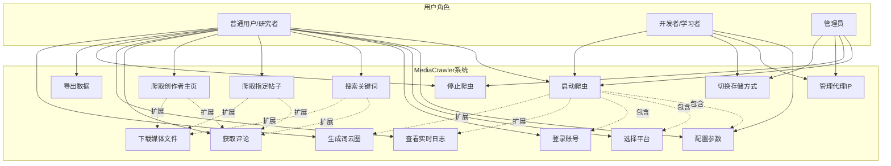
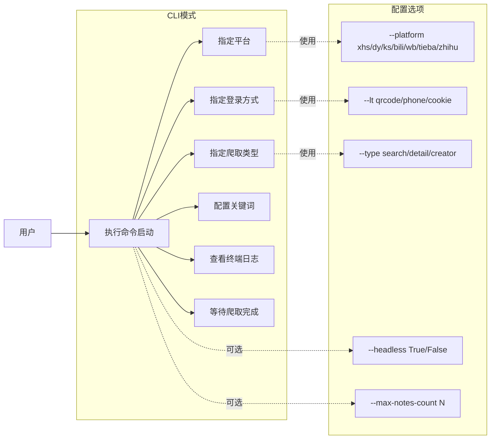
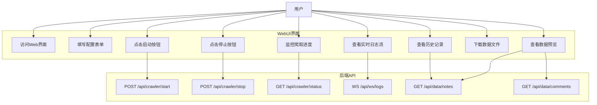
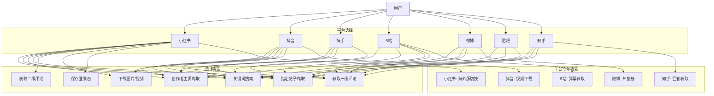
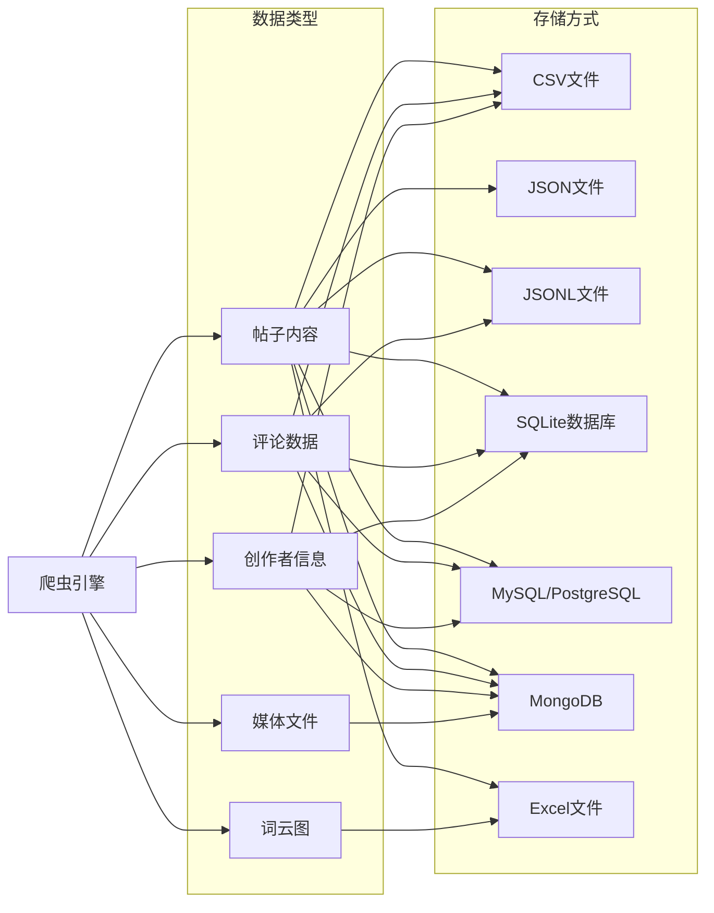
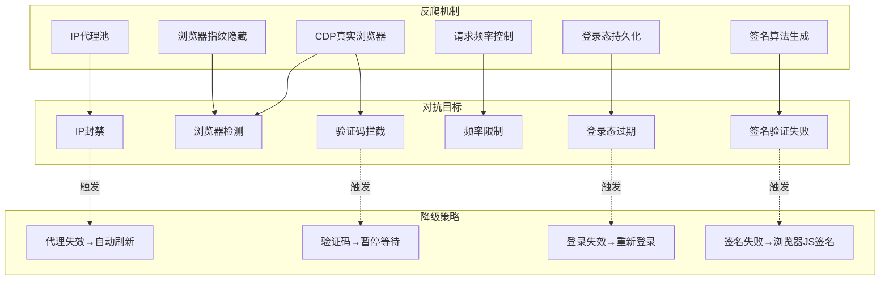
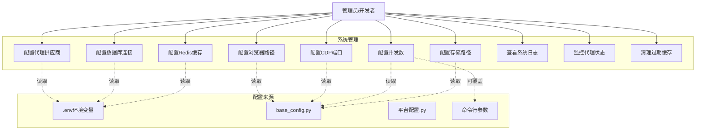

# MediaCrawler 用例图 (Use Case Diagram)

## 1. 系统整体用例图

### 图表解释

#### 1. 整体概述

- 该图呈现 MediaCrawler 的完整功能视图，覆盖三类角色与 15 个系统用例的映射关系
- 核心用例围绕爬虫生命周期展开：启动、配置、执行、监控、停止及后置处理
- 通过包含关系与扩展关系组织用例间的依赖结构，体现功能分解与可选增强

#### 2. 关键元素说明

- **参与者**：U1（普通用户/研究者）、U2（开发者/学习者）、U3（管理员）
- **用例**：共 15 个，UC1–UC15，覆盖爬虫核心流程、数据导出、可视化及基础设施配置
- **关系**：关联关系（实线箭头，用户与用例的交互）、包含关系（虚线箭头，强制依赖）、扩展关系（虚线箭头，可选增强）

#### 3. 关键流程/关系说明

1. UC1（启动爬虫）通过包含关系强制依赖 UC2（配置参数）、UC3（选择平台）、UC4（登录账号），任何启动必须先完成这三项前置配置
2. UC5/UC6/UC7 通过扩展关系关联 UC8（获取评论）和 UC9（下载媒体文件），评论与媒体下载为可选增强行为
3. UC1 通过扩展关系关联 UC10（查看实时日志）和 UC13（生成词云图），日志监控与词云生成为启动后的可选附加功能
4. U1 拥有最广泛的功能访问权限，U2 聚焦代理与存储配置，U3 专注控制与基础设施管理

#### 4. 关键技术解释

- 包含关系（Include）是 UML 中强制性的功能分解机制，用于提取公共行为，避免用例描述重复
- 扩展关系（Extend）表示在特定条件下扩展目标用例的行为，扩展点由条件触发，保持核心用例简洁
- UC1 包含 UC2/UC3/UC4 体现模板方法模式：启动流程定义骨架，子用例实现具体步骤
- UC5/UC6/UC7 扩展 UC8/UC9 体现策略模式的可插拔特性，用户按需决定是否启用增强功能

#### 5. 设计意图

- **为什么要这样设计**：将公共前置步骤抽象为独立用例，将可选功能分离，降低主流程复杂度
- **解决了什么痛点**：避免用例描述重复，防止核心用例被大量可选逻辑污染，减少维护成本
- **带来了什么好处**：普通用户开箱即用，高级用户可深度定制，权限分级明确
- **如果不这样会怎样**：所有逻辑混杂在单个用例中，导致用例图臃肿、可读性下降、权限边界模糊

## 2. CLI模式用例图

### 图表解释

#### 1. 整体概述

- 该图描述 MediaCrawler CLI 模式的交互流程，面向偏好终端操作的用户群体
- 通过命令行参数驱动爬取全过程，展示从执行命令到任务完成的完整链路
- 用例与配置选项分离，清晰呈现必需参数与可选参数的层次结构

#### 2. 关键元素说明

- **参与者**：User（用户）
- **用例**：UC1（执行命令启动）为入口，UC2–UC7 为子步骤或伴随行为
- **配置选项**：OPT1–OPT3 为必需参数（平台、登录方式、爬取类型），OPT4–OPT5 为可选参数（无头模式、最大数量）

#### 3. 关键流程/关系说明

1. 用户触发 UC1，UC1 顺序关联 UC2（指定平台）、UC3（指定登录方式）、UC4（指定爬取类型）、UC5（配置关键词），四项为核心参数
2. UC6（查看终端日志）和 UC7（等待爬取完成）为启动后的伴随行为
3. UC2/UC3/UC4 通过"使用"关系分别绑定 OPT1/OPT2/OPT3，表示必须接收对应参数值
4. UC1 通过"可选"关系关联 OPT4 和 OPT5，表明无头模式与数量限制为全局可选配置

#### 4. 关键技术解释

- 参数设计遵循命令行工具标准：命名参数（--platform、--lt、--type）避免位置依赖歧义
- OPT4（--headless）为布尔标志，直接控制 Playwright/Selenium 的浏览器启动配置
- OPT5（--max-notes-count）为数值限制参数，防止无限爬取导致资源耗尽
- 参数化设计使 CLI 可被脚本调用，便于集成到自动化工作流或 CI/CD 管道

#### 5. 设计意图

- **为什么要这样设计**：命令行参数替代交互式输入，确保操作可脚本化、可记录、可复现
- **解决了什么痛点**：避免重复手动配置，支持批量任务和定时调度，提升自动化效率
- **带来了什么好处**：核心参数与可选参数分层，降低初次使用门槛，高级功能逐步暴露
- **如果不这样会怎样**：强制交互式输入无法嵌入脚本，自动化场景受限，操作不可追溯

## 3. WebUI模式用例图

### 图表解释

#### 1. 整体概述

- 该图描述 MediaCrawler WebUI 模式的交互架构，通过浏览器提供图形化操作界面
- 展示前端用户操作与后端 API 的对应关系，体现前后端分离的架构风格
- 覆盖从访问界面、配置、启动、监控到数据获取的完整交互链路

#### 2. 关键元素说明

- **参与者**：User（用户）
- **WebUI 用例**：UC1–UC9，涵盖访问、配置、启动、监控、停止、历史查看、数据下载与预览
- **后端 API**：API1–API6，采用 RESTful 风格（POST/GET）与 WebSocket（WS）协议

#### 3. 关键流程/关系说明

1. 用户访问 Web 界面（UC1），填写配置表单（UC2），点击启动按钮（UC3）触发任务
2. UC3 调用 API1（POST /api/crawler/start）向后端发送启动指令
3. 爬取过程中，UC4（查看实时日志流）调用 API4（WS），UC5（监控进度）调用 API3（GET）
4. UC6（点击停止）调用 API2（POST /api/crawler/stop），UC7/UC9 共享 API5，UC9 额外调用 API6

#### 4. 关键技术解释

- 前后端分离：前端负责交互与渲染，后端负责业务逻辑与数据处理，两者独立迭代
- RESTful 设计：POST 用于创建/触发资源，GET 用于读取资源，路径采用名词化命名
- API4 使用 WebSocket 而非 HTTP 轮询，提供全双工通道，服务器主动推送日志，降低延迟与资源消耗
- API5 和 API6 被多个用例共享，符合 DRY 原则，减少接口冗余

#### 5. 设计意图

- **为什么要这样设计**：为非技术用户提供可视化界面，通过表单替代命令行参数降低使用门槛
- **解决了什么痛点**：避免手动输入参数错误，提供实时反馈增强操作安全感
- **带来了什么好处**：前后端独立迭代，后端 API 可被多端复用，WebSocket 实现低延迟日志推送
- **如果不这样会怎样**：纯 CLI 模式对非技术用户不友好，HTTP 轮询导致高延迟与资源浪费，接口重复增加维护成本

## 4. 爬虫核心用例图（按平台）

### 图表解释

#### 1. 整体概述

- 该图展示 MediaCrawler 的多平台爬虫架构，将七个主流平台抽象为可插拔的爬取目标
- 通过三层结构组织：平台选择、通用功能、平台特有功能，兼顾代码复用与差异化能力
- 各平台支持的功能集合不对称，反映数据开放度与接口稳定性的现实差异

#### 2. 关键元素说明

- **参与者**：User（用户）
- **平台节点**：P1–P7，涵盖小红书、抖音、快手、B站、微博、贴吧、知乎
- **通用功能**：UC1–UC7，包括搜索、帖子爬取、创作者主页、评论、媒体下载、登录态保存
- **平台特有功能**：S1–S5，如海外版切换、弹幕获取、热搜榜等仅个别平台支持的能力

#### 3. 关键流程/关系说明

1. 用户选择目标平台（P1–P7），平台节点关联到其支持的功能用例
2. 所有平台均支持 UC1（关键词搜索）和 UC2（指定帖子爬取），体现功能基础性
3. P1（小红书）支持最全面，覆盖全部通用功能与 S1；P2（抖音）不支持 UC5 与 UC7
4. P3/P5/P6 功能集合相对精简，P4/P7 各有独特特有功能 S3（弹幕）和 S5（回答）

#### 4. 关键技术解释

- 通用功能定义抽象接口，各平台具体实现类适配页面结构与反爬机制，体现抽象工厂与策略模式
- 平台特有功能通过扩展点注入，避免污染通用代码路径，符合接口隔离原则
- 一级评论（UC4）与二级评论（UC5）分离，反映评论层级结构差异，DOM 与 API 解析策略不同
- 登录态保存（UC7）仅在部分平台实现，因各平台认证机制差异显著

#### 5. 设计意图

- **为什么要这样设计**：抽象通用功能降低扩展成本，独立特有功能避免过度设计通用接口
- **解决了什么痛点**：避免为兼容所有平台而强行统一，防止空实现或异常抛出
- **带来了什么好处**：新增平台只需实现标准接口，代码复用率高，平台差异清晰隔离
- **如果不这样会怎样**：通用接口臃肿，空实现泛滥，违反接口隔离原则，维护成本急剧上升

## 5. 数据存储用例图

### 图表解释

#### 1. 整体概述

- 该图描述 MediaCrawler 的数据存储架构，展示五类数据类型与七种存储方式的映射关系
- 体现存储层的灵活性设计，不同数据类型依据结构特征与使用场景选择最合适的后端
- 覆盖文件型存储、关系型数据库与文档型数据库，满足从开发调试到生产部署的多场景需求

#### 2. 关键元素说明

- **参与者**：Crawler（爬虫引擎）
- **数据类型**：D1（帖子内容）、D2（评论数据）、D3（创作者信息）、D4（媒体文件）、D5（词云图）
- **存储方式**：S1–S7，涵盖 CSV、JSON、JSONL、SQLite、MySQL/PostgreSQL、MongoDB、Excel

#### 3. 关键流程/关系说明

1. Crawler 生成全部五类数据，数据类型再流向具体存储方式
2. D1（帖子内容）支持全部七种存储方式，体现通用性与高优先级
3. D2（评论数据）不支持 JSON 与 Excel，D3（创作者信息）不支持 JSON、JSONL、Excel
4. D4（媒体文件）仅支持 MongoDB，D5（词云图）仅支持 Excel，反映数据特征对存储后端的约束

#### 4. 关键技术解释

- CSV/JSONL 适合行式存储与流式写入，JSON 保留嵌套结构但缺乏流式处理能力
- SQLite 适合单机结构化查询，MySQL/PostgreSQL 支持多用户并发与复杂关联查询
- MongoDB 的 BSON 格式支持嵌套结构与二进制数据，GridFS 专门用于存储超过 16MB 的大文件
- Excel 面向终端用户，支持富格式与图表，但不适合程序化处理

#### 5. 设计意图

- **为什么要这样设计**：依据数据特征匹配存储后端，避免一刀切导致的性能或功能损失
- **解决了什么痛点**：防止大文件拖慢关系型数据库，避免文件系统缺乏元数据管理能力
- **带来了什么好处**：配置参数控制多对多映射，用户根据环境约束自由选择，无需强制依赖外部数据库
- **如果不这样会怎样**：统一存储导致大文件性能瓶颈，文件系统缺乏查询能力，资源受限环境无法运行

## 6. 反爬策略用例图

### 图表解释

#### 1. 整体概述

- 该图描述 MediaCrawler 的反爬虫对抗体系，涵盖六种反爬机制、六种平台防御手段及四种降级策略
- 体现爬虫与目标平台之间的攻防对抗关系，以及系统在遭遇防御时的容错处理机制
- 采用多层防御与降级策略组合，确保在复杂防御环境下的稳定运行

#### 2. 关键元素说明

- **反爬机制**：A1（IP 代理池）、A2（浏览器指纹隐藏）、A3（CDP 真实浏览器）、A4（请求频率控制）、A5（登录态持久化）、A6（签名算法生成）
- **对抗目标**：T1（IP 封禁）、T2（浏览器检测）、T3（验证码拦截）、T4（频率限制）、T5（登录态过期）、T6（签名验证失败）
- **降级策略**：F1（JS 签名回退）、F2（代理自动刷新）、F3（重新登录）、F4（暂停等待）

#### 3. 关键流程/关系说明

1. A1 对抗 T1，通过轮换出口 IP 避免单一 IP 被加入黑名单
2. A2 与 A3 共同对抗 T2，A3 额外对抗 T3，因真实浏览器可执行 JavaScript 挑战并渲染验证码
3. A4 对抗 T4，A5 对抗 T5，A6 对抗 T6，分别控制速率、维持会话、生成合法签名
4. 对抗目标触发时执行降级策略：T6→F1、T1→F2、T5→F3、T3→F4

#### 4. 关键技术解释

- IP 代理池结合住宅代理与数据中心代理，前者检测难度更高
- 浏览器指纹隐藏修改 User-Agent、Canvas、WebGL 等特征，使自动化工具与真实浏览器难以区分
- CDP 控制完整 Chrome 实例，可执行全部 JavaScript 并通过浏览器层面机器人检测
- 请求频率控制实现令牌桶或漏桶算法，将速率限制在平台容忍阈值以下
- 降级策略 F1 体现计算迁移思想：本地签名失效时委托浏览器利用完整 JS 运行时生成签名

#### 5. 设计意图

- **为什么要这样设计**：单一反爬机制不足以应对复杂防御，采用多层防御策略协同工作
- **解决了什么痛点**：避免某一机制失效导致系统完全瘫痪，提升在动态防御环境下的生存能力
- **带来了什么好处**：网络层、应用层、会话层、协议层分层防护，降级策略保证韧性，验证码暂停降低法律风险
- **如果不这样会怎样**：缺乏多层防护易被单一防御手段阻断，无降级策略时平台更新即导致系统失效

## 7. 系统管理用例图

### 图表解释

#### 1. 整体概述

- 该图描述 MediaCrawler 的系统管理层，展示管理员/开发者对基础设施与运行时参数的配置能力
- 管理用例分为基础设施配置、运行时监控和维护操作三类，明确各配置项的数据来源与优先级
- 配置来源分层设计，实现配置与代码分离、环境隔离及运行时动态覆盖

#### 2. 关键元素说明

- **参与者**：Admin（管理员/开发者）
- **系统管理用例**：M1–M7 为基础设施配置，M8–M9 为运行时监控，M10 为维护操作
- **配置来源**：C1（.env 环境变量）、C2（base_config.py）、C3（平台配置.py）、C4（命令行参数）

#### 3. 关键流程/关系说明

1. M1–M3（代理、数据库、Redis）读取 C1，因包含敏感信息，环境变量避免凭证硬编码
2. M4–M7（浏览器路径、CDP 端口、并发数、存储路径）读取 C2，为系统级通用配置
3. M6（并发数）额外通过"可覆盖"关系关联 C4，支持运行时动态调整并发度
4. M8–M10（日志查看、代理监控、缓存清理）不依赖配置来源，直接操作系统状态

#### 4. 关键技术解释

- 配置分层遵循十二要素应用：环境变量存储环境相关配置，实现配置与代码分离
- base_config.py 以 Python 模块形式提供类型安全与 IDE 支持，优于无结构纯文本配置
- 平台配置.py 隔离平台特定配置，新增平台无需修改核心配置，符合开闭原则
- 命令行参数具有最高优先级，支持运行时覆盖，符合 Unix 工具传统设计
- Redis 缓存为可选组件，系统无 Redis 时可降级运行，配置独立体现可选性

#### 5. 设计意图

- **为什么要这样设计**：敏感配置隔离到 .env，通用配置模块化，平台差异独立管理
- **解决了什么痛点**：避免凭证泄露风险，支持开发/测试/生产环境快速切换，降低配置冲突
- **带来了什么好处**：配置具备类型检查与版本控制，运行时动态调整资源消耗，保障长期稳定运行
- **如果不这样会怎样**：凭证硬编码导致安全隐患，环境切换困难，配置分散难以维护，缺乏运行时弹性