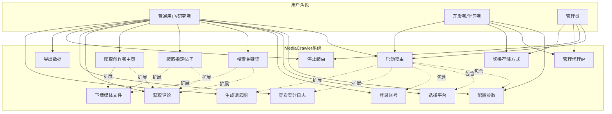
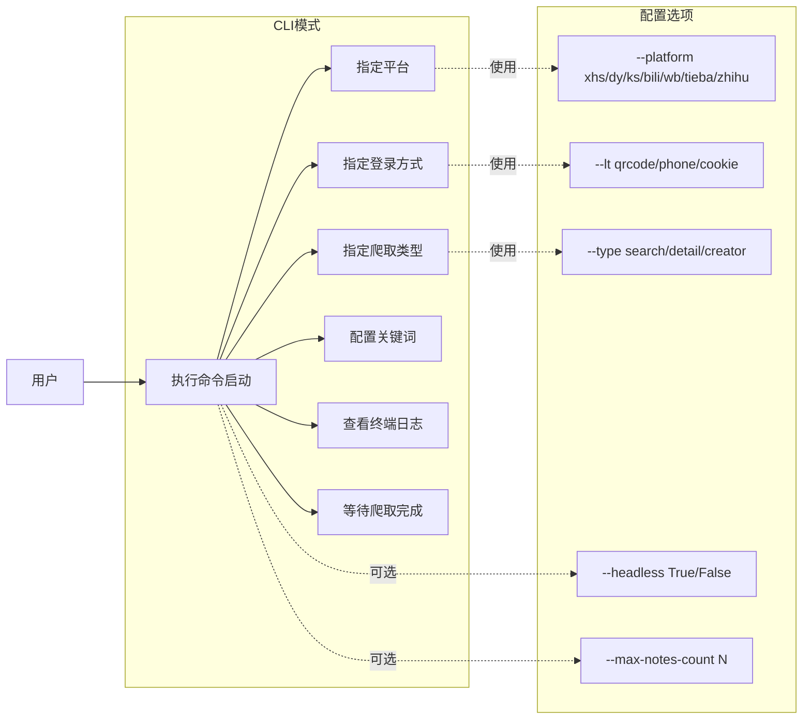
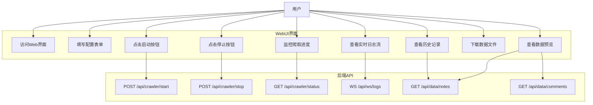
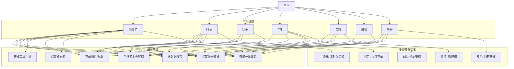
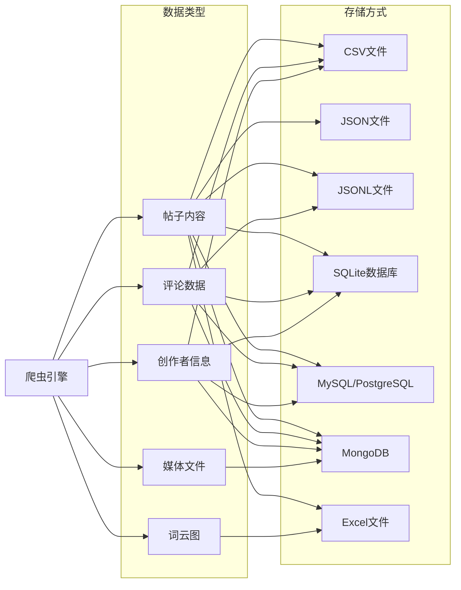
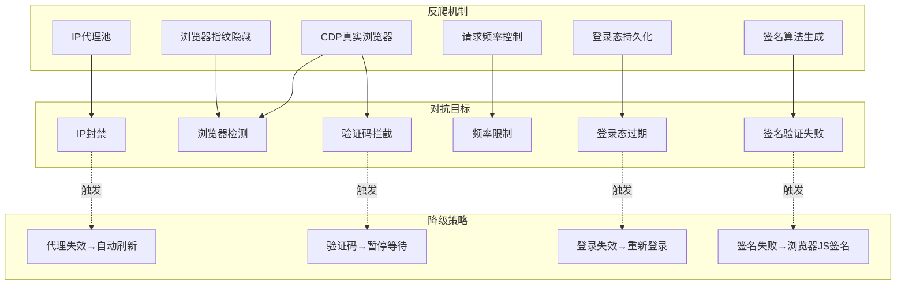
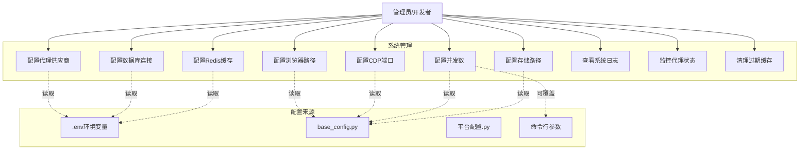

# MediaCrawler 用例图 (Use Case Diagram)

## 1. 系统整体用例图

### 图表解释

#### 1. 整体概述
该用例图呈现了 MediaCrawler 系统的完整功能视图，从用户角色到系统用例的映射关系。图中区分了三类用户：普通用户/研究者、开发者/学习者和管理员，每类用户拥有不同的用例访问权限。系统核心用例围绕爬虫生命周期展开，包括启动、配置、执行、监控和停止等环节，同时涵盖数据导出和可视化等后置处理功能。

#### 2. 关键元素说明
图中包含三类核心元素：参与者（Actor）、用例（Use Case）和关系（Relationship）。参与者以矩形表示，包括 U1（普通用户/研究者）、U2（开发者/学习者）和 U3（管理员）。用例以圆角矩形表示，共 15 个，涵盖从 UC1（启动爬虫）到 UC15（切换存储方式）的完整功能集合。关系包含关联关系（实线箭头，表示用户与用例的交互）、包含关系（虚线箭头标注"包含"，表示用例间的强制依赖）和扩展关系（虚线箭头标注"扩展"，表示用例间的可选增强）。

#### 3. 关键流程/关系说明
启动爬虫（UC1）通过包含关系强制依赖三个子用例：配置参数（UC2）、选择平台（UC3）和登录账号（UC4），这意味着任何爬虫启动都必须先完成这三项前置配置。搜索关键词（UC5）、爬取指定帖子（UC6）和爬取创作者主页（UC7）通过扩展关系关联获取评论（UC8）和下载媒体文件（UC9），表示评论获取和媒体下载是可选的增强行为，而非强制步骤。启动爬虫（UC1）还通过扩展关系关联查看实时日志（UC10）和生成词云图（UC13），表明日志监控和词云生成是启动后的可选附加功能。

#### 4. 关键技术解释
包含关系（Include）在 UML 中表示用例 A 必须包含用例 B 的行为，是一种强制性的功能分解机制，常用于提取公共行为。扩展关系（Extend）表示用例 A 在特定条件下可以扩展用例 B 的行为，扩展点是可选的，由扩展条件触发。在本图中，UC1 包含 UC2/UC3/UC4 体现了模板方法模式的思想——启动流程定义了骨架，具体步骤由子用例实现。UC5/UC6/UC7 扩展 UC8/UC9 则体现了策略模式的可插拔特性，用户可根据需求决定是否获取评论或下载媒体。

#### 5. 设计意图
该架构设计体现了职责分离和权限分级的设计原则。普通用户拥有最广泛的功能访问权限，覆盖爬虫的核心业务流程；开发者聚焦于技术配置，如代理 IP 管理和存储方式切换；管理员则专注于控制层面，如启动、停止和基础设施配置。包含关系的使用避免了用例描述的重复，将公共前置步骤抽象为独立用例；扩展关系则保持了核心用例的简洁性，将可选功能分离出来，降低了主流程的复杂度。这种设计使得系统既能为普通用户提供开箱即用的体验，又能为高级用户提供深度定制的能力。

## 2. CLI模式用例图

### 图表解释

#### 1. 整体概述
该用例图描述了 MediaCrawler 的命令行界面（CLI）模式下的交互流程。CLI 模式面向偏好终端操作的用户，通过命令行参数驱动整个爬取过程。图中展示了从用户执行命令到爬取完成的完整链路，以及各用例与具体配置选项的映射关系。

#### 2. 关键元素说明
图中包含一个参与者（User）、七个 CLI 模式用例（UC1-UC7）和五个配置选项（OPT1-OPT5）。UC1（执行命令启动）是入口用例，后续用例 UC2 至 UC7 均直接或间接由 UC1 触发。配置选项以矩形表示，位于独立的"配置选项"子图中，包括平台选择（OPT1）、登录方式（OPT2）、爬取类型（OPT3）、无头模式开关（OPT4）和最大爬取数量（OPT5）。

#### 3. 关键流程/关系说明
用户通过执行命令启动（UC1）触发整个流程，该用例顺序关联指定平台（UC2）、指定登录方式（UC3）、指定爬取类型（UC4）和配置关键词（UC5），表明这些是必须依次或同时指定的核心参数。查看终端日志（UC6）和等待爬取完成（UC7）是启动后的伴随行为。UC2/UC3/UC4 通过"使用"关系分别绑定到 OPT1/OPT2/OPT3，表示这些用例必须接收对应的参数值。UC1 通过"可选"关系关联 OPT4 和 OPT5，表明无头模式和最大数量限制是全局可选参数。

#### 4. 关键技术解释
CLI 模式的参数设计遵循了命令行工具的标准实践：位置参数与选项参数分离。OPT1-OPT3 是功能必需参数，通过双横线前缀（--platform、--lt、--type）标识，属于命名参数，避免了位置依赖带来的歧义。OPT4（--headless）是布尔标志参数，控制浏览器是否以无头模式运行，这直接影响 Playwright/Selenium 的启动配置。OPT5（--max-notes-count）是数值限制参数，用于控制爬取规模，防止无限爬取导致的资源耗尽。这种参数化设计使得 CLI 模式可以被脚本调用，便于集成到自动化工作流或 CI/CD 管道中。

#### 5. 设计意图
CLI 模式的设计目标是为自动化场景和开发者用户提供高效、可复现的操作界面。通过命令行参数而非交互式输入，确保了操作的可脚本化和可记录性。将配置选项独立为子图，清晰展示了系统的可配置维度，便于用户理解各参数的作用域。可选参数（OPT4、OPT5）与必需参数的区分，降低了初次使用的门槛——用户只需提供核心参数即可运行，高级功能通过附加参数逐步暴露。这种分层配置策略既保证了易用性，又提供了足够的灵活性。

## 3. WebUI模式用例图

### 图表解释

#### 1. 整体概述
该用例图描述了 MediaCrawler 的 Web 用户界面（WebUI）模式下的交互架构。与 CLI 模式不同，WebUI 模式通过浏览器提供图形化操作界面，降低了使用门槛。图中展示了前端用户操作与后端 API 的对应关系，体现了前后端分离的架构风格。

#### 2. 关键元素说明
图中包含一个参与者（User）、九个 WebUI 用例（UC1-UC9）和六个后端 API（API1-API6）。WebUI 用例位于"WebUI界面"子图中，涵盖从访问界面到数据下载的完整交互流程。后端 API 位于独立的"后端API"子图中，以 RESTful 风格和 WebSocket 协议定义，包括 POST/GET/WS 等 HTTP 方法。实线箭头表示用户与前端用例的交互，以及前端用例对后端 API 的调用关系。

#### 3. 关键流程/关系说明
用户首先访问 Web 界面（UC1），然后填写配置表单（UC2），点击启动按钮（UC3）触发爬取任务。UC3 调用 POST /api/crawler/start（API1）向后端发送启动指令。在爬取过程中，用户可以通过查看实时日志流（UC4）和监控爬取进度（UC5）了解运行状态，分别对应 WebSocket 日志接口（API4）和状态查询接口（API3）。点击停止按钮（UC6）调用 POST /api/crawler/stop（API2）终止任务。任务完成后，用户可查看历史记录（UC7）、下载数据文件（UC8）和查看数据预览（UC9），其中 UC7 和 UC9 共享笔记数据接口（API5），UC9 还额外调用评论数据接口（API6）。

#### 4. 关键技术解释
该架构采用了前后端分离（Frontend-Backend Separation）模式，前端负责用户交互和界面渲染，后端负责业务逻辑和数据处理。API 设计遵循 RESTful 原则：POST 用于创建/触发资源（启动/停止），GET 用于读取资源（状态/数据），资源路径采用名词化命名（/api/crawler/start）。API4 使用 WebSocket（WS）协议而非 HTTP 轮询传输实时日志，这是因为 WebSocket 提供全双工通信通道，服务器可以主动推送日志数据到客户端，避免了轮询带来的延迟和资源浪费。API5 和 API6 被多个用例共享，体现了数据接口的复用性，符合 DRY（Don't Repeat Yourself）原则。

#### 5. 设计意图
WebUI 模式的设计目标是为非技术用户提供直观、可视化的操作体验。通过表单替代命令行参数，降低了配置错误的可能性；通过实时日志流和进度监控，提供了即时反馈，增强了用户的安全感。前后端分离的架构使得前端可以独立迭代，后端 API 可被多种客户端（Web、移动端、第三方系统）复用。WebSocket 的引入解决了实时数据推送的需求，是日志监控场景下的技术优选。历史记录和数据预览功能的分离，满足了用户既想快速浏览（预览）又想持久化获取（下载）的双重需求。

## 4. 爬虫核心用例图（按平台）

### 图表解释

#### 1. 整体概述
该用例图展示了 MediaCrawler 支持的多平台爬虫架构，将七个主流内容平台抽象为可插拔的爬取目标。图中通过三层结构——平台选择、通用功能和平台特有功能——呈现了系统在多平台支持上的设计思路：在最大化代码复用的同时，保留各平台的差异化能力。

#### 2. 关键元素说明
图中包含一个参与者（User）、七个平台节点（P1-P7）、七个通用功能用例（UC1-UC7）和五个平台特有功能用例（S1-S5）。平台节点位于"平台选择"子图中，包括小红书、抖音、快手、B站、微博、贴吧和知乎。通用功能位于"通用功能"子图中，涵盖关键词搜索、帖子爬取、创作者主页爬取、一级/二级评论获取、媒体下载和登录态保存。平台特有功能位于独立的"平台特有功能"子图中，如小红书的海外版切换（S1）、抖音的视频下载（S2）、B站的弹幕获取（S3）、微博的热搜榜（S4）和知乎的回答获取（S5）。

#### 3. 关键流程/关系说明
用户首先选择目标平台（P1-P7），然后该平台节点关联到其支持的功能用例。所有平台均支持关键词搜索（UC1）和指定帖子爬取（UC2），体现了这两个功能的基础性。小红书（P1）支持的功能最全面，覆盖全部七个通用功能和一个特有功能（S1）。抖音（P2）支持除二级评论（UC5）和登录态保存（UC7）外的其余通用功能，以及视频下载（S2）。B站（P4）和知乎（P7）各有独特的特有功能：弹幕获取（S3）和回答获取（S5）。快手（P3）、微博（P5）和贴吧（P6）支持的功能集合相对精简，反映了这些平台在数据开放度或接口稳定性上的差异。

#### 4. 关键技术解释
该架构采用了抽象工厂模式（Abstract Factory Pattern）和策略模式（Strategy Pattern）的组合设计。通用功能（UC1-UC7）定义了抽象接口，每个平台的具体实现类负责适配该平台的页面结构和反爬机制。平台特有功能（S1-S5）通过扩展点机制注入，避免了将平台特定逻辑污染到通用代码路径中。登录态保存（UC7）仅在部分平台实现，这是因为不同平台的认证机制差异较大——小红书需要维持 Cookie 或 Token 会话，而部分平台可能采用更严格的设备指纹绑定。一级评论（UC4）和二级评论（UC5）的分离反映了社交媒体平台常见的评论层级结构：一级评论直接回复帖子，二级评论回复一级评论，两者在 DOM 结构和 API 接口上通常需要不同的解析策略。

#### 5. 设计意图
该设计的核心目标是在多平台支持下实现代码复用与平台差异的平衡。通用功能的抽象使得新增平台时只需实现标准接口，大幅降低了扩展成本。平台特有功能的独立划分，避免了为兼容所有平台而过度设计通用接口的问题——例如，弹幕获取（S3）是 B 站独有的功能，若强行抽象到通用层会导致其他平台的实现为空或抛出异常，违反接口隔离原则。各平台支持功能的不对称性（如 P3 不支持 UC5/UC6/UC7）反映了现实约束：部分平台的反爬机制更严格，或某些数据字段未公开暴露，系统设计尊重了这些外部限制而非强行统一。

## 5. 数据存储用例图

### 图表解释

#### 1. 整体概述
该用例图描述了 MediaCrawler 的数据存储架构，展示了爬虫引擎产出的五类数据类型与七种存储方式之间的映射关系。图中体现了存储层的灵活性设计——不同数据类型可根据其结构特征和使用场景选择最合适的存储后端。

#### 2. 关键元素说明
图中包含一个参与者（Crawler，爬虫引擎）、五种数据类型（D1-D5）和七种存储方式（S1-S7）。数据类型位于"数据类型"子图中，包括帖子内容（D1）、评论数据（D2）、创作者信息（D3）、媒体文件（D4）和词云图（D5）。存储方式位于"存储方式"子图中，涵盖文件型存储（CSV、JSON、JSONL、Excel）、关系型数据库（SQLite、MySQL/PostgreSQL）和文档型数据库（MongoDB）。实线箭头表示数据从爬虫引擎流向数据类型，再流向具体存储方式。

#### 3. 关键流程/关系说明
爬虫引擎（Crawler）生成全部五类数据。帖子内容（D1）作为最核心的数据类型，支持全部七种存储方式，体现了其通用性和高优先级。评论数据（D2）支持 CSV、JSONL、SQLite、MySQL/PostgreSQL 和 MongoDB，但不支持纯 JSON 文件和 Excel。创作者信息（D3）支持 CSV、SQLite、MySQL/PostgreSQL 和 MongoDB。媒体文件（D4）仅支持 MongoDB，这是因为媒体文件通常为二进制大对象（BLOB），需要文档数据库的 GridFS 或等效机制。词云图（D5）仅支持 Excel，这是因为词云数据通常用于人工查看和简单分析，Excel 的表格和图表功能最为适合。

#### 4. 关键技术解释
存储方式的选择基于数据特征和访问模式。CSV（S1）和 JSONL（S3）适合结构化或半结构化数据的行式存储，便于流式写入和后续的数据处理管道消费。JSON（S2）适合需要保留嵌套结构的数据，但缺乏流式处理能力。SQLite（S4）是嵌入式关系型数据库，适合单机场景下的结构化查询。MySQL/PostgreSQL（S5）是客户端-服务器架构的关系型数据库，适合多用户并发访问和复杂关联查询。MongoDB（S6）是文档型数据库，其 BSON 格式天然支持嵌套结构和二进制数据，GridFS 规范专门用于存储超过 16MB 的大文件。Excel（S7）面向终端用户，支持富格式和图表，但不适合程序化处理。媒体文件（D4）绑定 MongoDB，反映了二进制大对象存储对文档数据库的依赖；词云图（D5）绑定 Excel，反映了可视化结果的人工可读性需求。

#### 5. 设计意图
存储层的设计目标是提供从开发调试到生产部署的全场景覆盖。文件型存储（S1-S3, S7）适合快速验证和轻量级使用，无需额外部署数据库服务。关系型数据库（S4-S5）适合需要 SQL 查询、事务保证和数据关联的分析场景。MongoDB（S6）作为唯一支持媒体文件的存储方式，是因为传统关系型数据库处理大文件时性能较差，而文件系统又缺乏元数据管理能力。数据类型与存储方式的多对多映射（如 D1 支持 S1-S7 全部方式）由配置参数控制，用户可根据环境约束自由选择。这种设计避免了强制依赖外部数据库服务，使得系统在资源受限的环境下仍能正常运行。

## 6. 反爬策略用例图

### 图表解释

#### 1. 整体概述
该用例图描述了 MediaCrawler 的反爬虫对抗体系，展示了系统采用的六种反爬机制、它们所对抗的六种平台防御手段，以及四种降级策略。图中体现了爬虫系统与目标平台之间的攻防对抗关系，以及系统在遭遇防御时的容错处理机制。

#### 2. 关键元素说明
图中包含三个子图：反爬机制（A1-A6）、对抗目标（T1-T6）和降级策略（F1-F4）。反爬机制包括 IP 代理池（A1）、浏览器指纹隐藏（A2）、CDP 真实浏览器（A3）、请求频率控制（A4）、登录态持久化（A5）和签名算法生成（A6）。对抗目标包括 IP 封禁（T1）、浏览器检测（T2）、验证码拦截（T3）、频率限制（T4）、登录态过期（T5）和签名验证失败（T6）。降级策略包括签名失败时的浏览器 JS 签名回退（F1）、代理失效时的自动刷新（F2）、登录失效时的重新登录（F3）和验证码触发时的暂停等待（F4）。

#### 3. 关键流程/关系说明
反爬机制与对抗目标之间是一对一或一对多的映射关系。IP 代理池（A1）对抗 IP 封禁（T1），通过轮换出口 IP 避免单一 IP 被加入黑名单。浏览器指纹隐藏（A2）和 CDP 真实浏览器（A3）共同对抗浏览器检测（T2），其中 A3 还额外对抗验证码拦截（T3）——因为真实浏览器可以执行 JavaScript 挑战并渲染验证码。请求频率控制（A4）对抗频率限制（T4），通过限制单位时间内的请求数量模拟人类操作节奏。登录态持久化（A5）对抗登录态过期（T5），通过 Cookie 刷新或 Token 续期维持长期会话。签名算法生成（A6）对抗签名验证失败（T6），通过逆向工程生成合法的请求签名。当对抗目标被触发时，系统执行对应的降级策略：T6 触发 F1（回退到浏览器执行 JS 签名），T1 触发 F2（刷新代理池），T5 触发 F3（重新登录），T3 触发 F4（人工介入等待）。

#### 4. 关键技术解释
IP 代理池（A1）通常结合住宅代理（Residential Proxy）和数据中心代理（Datacenter Proxy），前者使用 ISP 分配的民用 IP，检测难度更高。浏览器指纹隐藏（A2）通过修改 User-Agent、Canvas指纹、WebGL 指纹、字体列表等浏览器特征，使自动化工具与真实浏览器难以区分。CDP（Chrome DevTools Protocol）真实浏览器（A3）不同于无头浏览器，它控制完整的 Chrome 实例，可以执行所有 JavaScript 并通过浏览器层面的机器人检测。请求频率控制（A4）实现了令牌桶或漏桶算法，将请求速率限制在平台容忍的阈值以下。登录态持久化（A5）使用 CookieJar 或 Token 刷新机制，在会话即将过期时主动续期。签名算法生成（A6）通过逆向目标平台的 JavaScript 代码，提取其请求签名逻辑（如 HMAC-SHA256、MD5 加盐等），在本地复现合法的签名值。降级策略中的 F1 体现了计算迁移思想——当本地签名算法失效时，将签名逻辑委托给真实浏览器执行，利用浏览器的完整 JS 运行时环境生成签名。

#### 5. 设计意图
反爬体系的设计目标是在合规和效率之间取得平衡，确保爬虫在目标平台的防御机制下稳定运行。单一反爬机制往往不足以应对复杂防御，因此系统采用了多层防御策略（Defense in Depth）：网络层（代理）、应用层（指纹、频率）、会话层（登录态）和协议层（签名）协同工作。降级策略的引入体现了系统的韧性设计（Resilience）——不假设任何机制永远有效，而是为每种失效场景准备回退方案。例如，签名算法可能因平台更新而失效，此时 F1 的 JS 签名回退保证了系统不会完全瘫痪，只是效率降低。验证码触发时的暂停等待（F4）则体现了对平台防御机制的尊重，避免通过自动打码等手段过度对抗，降低法律风险。

## 7. 系统管理用例图

### 图表解释

#### 1. 整体概述
该用例图描述了 MediaCrawler 的系统管理层，展示了管理员/开发者对系统基础设施和运行时参数的配置能力。图中将管理用例分为基础设施配置、运行时监控和维护操作三类，并明确了各配置项的数据来源和优先级关系。

#### 2. 关键元素说明
图中包含一个参与者（Admin，管理员/开发者）、十个系统管理用例（M1-M10）和四个配置来源（C1-C4）。系统管理用例位于"系统管理"子图中，包括代理供应商配置（M1）、数据库连接配置（M2）、Redis 缓存配置（M3）、浏览器路径配置（M4）、CDP 端口配置（M5）、并发数配置（M6）、存储路径配置（M7）、系统日志查看（M8）、代理状态监控（M9）和过期缓存清理（M10）。配置来源位于"配置来源"子图中，包括 .env 环境变量（C1）、base_config.py（C2）、平台配置.py（C3）和命令行参数（C4）。

#### 3. 关键流程/关系说明
管理员通过十个用例与系统交互。基础设施配置用例（M1-M7）通过"读取"关系关联到配置来源：代理、数据库和 Redis 配置（M1-M3）读取 .env 环境变量（C1），这是因为这些配置通常包含敏感信息（密码、API Key），环境变量可以避免将凭证硬编码到代码仓库中。浏览器路径、CDP 端口、并发数和存储路径（M4-M7）读取 base_config.py（C2），这些是系统级的通用配置。并发数配置（M6）额外通过"可覆盖"关系关联命令行参数（C4），表明运行时可以通过命令行动态调整并发度，覆盖配置文件中的默认值。运行时监控用例（M8-M9）和维护用例（M10）不依赖配置来源，直接操作系统状态。

#### 4. 关键技术解释
配置来源的分层设计遵循了十二要素应用（12-Factor App）的方法论：环境变量（C1）用于存储因部署环境而异的配置（如数据库 URL、API 密钥），实现了配置与代码的分离；base_config.py（C2）用于存储应用级的默认配置，以 Python 模块形式提供类型安全和 IDE 支持；平台配置.py（C3）用于存储平台特定的配置（如各平台的域名、API 端点），实现了平台差异的隔离；命令行参数（C4）具有最高优先级，用于运行时覆盖，符合 Unix 工具的传统设计。Redis 缓存（M3）的引入是为了缓解数据库压力和加速频繁访问的数据（如代理池状态、登录态 Token），其配置独立出来是因为缓存层是可选组件，系统在无 Redis 时仍可降级运行。并发数（M6）的可覆盖性体现了配置优先级机制：命令行参数 > 配置文件 > 环境变量 > 硬编码默认值，这种层级结构使得系统在不同部署场景下都能灵活适配。

#### 5. 设计意图
系统管理层的设计目标是实现配置的可维护性、安全性和灵活性。将敏感配置（M1-M3）隔离到 .env 文件，避免了凭证泄露风险，同时便于在不同环境（开发、测试、生产）间切换。base_config.py 的使用使得配置具备类型检查和版本控制能力，优于无结构的纯文本配置。平台配置（C3）的独立文件使得新增平台时无需修改核心配置，符合开闭原则。命令行参数对并发数的覆盖能力，使得运维人员可以在不修改配置文件的情况下，根据服务器负载动态调整资源消耗。监控和维护用例（M8-M10）的独立划分，体现了运行时可观测性（Observability）的重要性——日志查看、代理监控和缓存清理是保障系统长期稳定运行的必要操作，而非一次性配置任务。