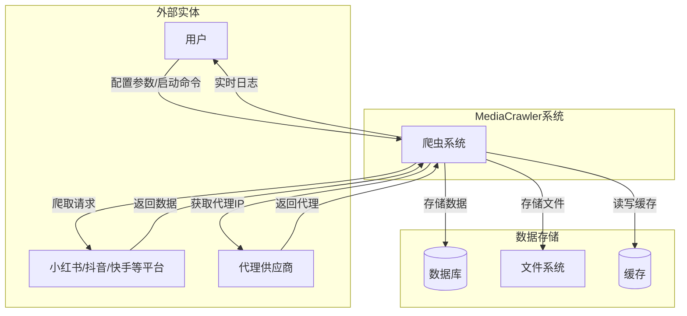
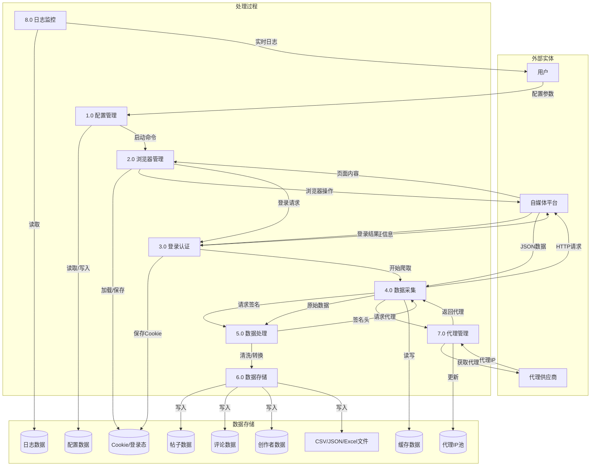
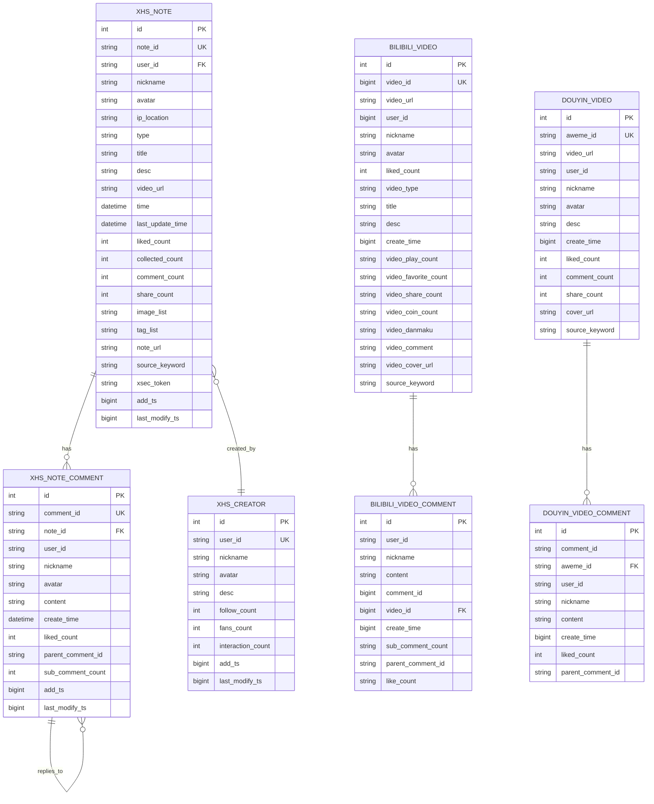
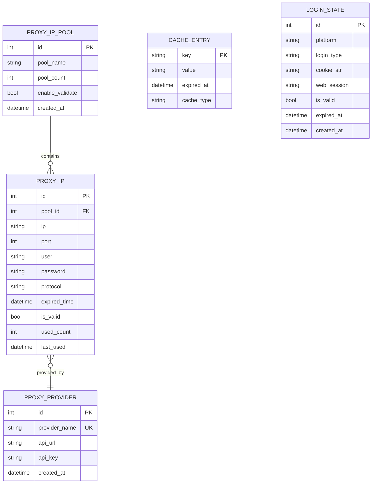
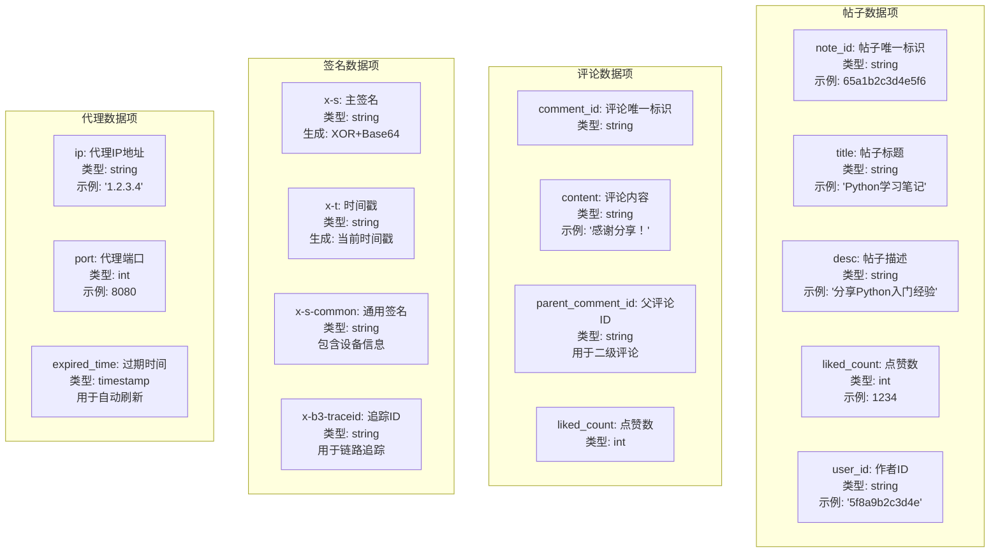
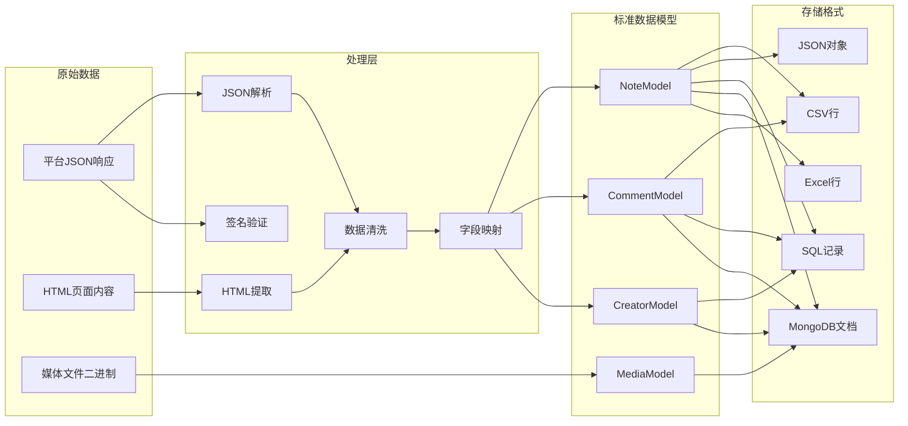
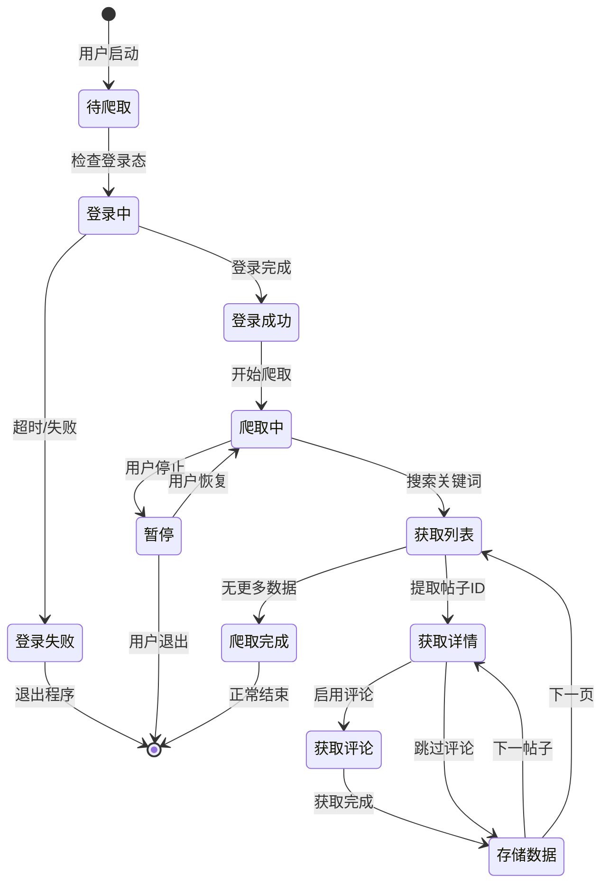

# MediaCrawler 数据流E-R图 (Data Flow & E-R Diagram)

## 1. 系统数据流图 (DFD Level 0 - 上下文图)



### 图表解释

#### 1. 整体概述
该图是MediaCrawler系统的上下文级数据流图（DFD Level 0），从全局视角展示了系统与外部实体之间的数据交互关系。图中将系统边界内的爬虫系统视为一个黑盒，重点描述其与用户、自媒体平台、代理供应商以及各类数据存储之间的数据流动方向与内容。

#### 2. 关键元素说明
图中的元素分为三类：外部实体（用户、小红书/抖音/快手等平台、代理供应商）、系统处理单元（MediaCrawler系统）和数据存储（数据库、文件系统、缓存）。外部实体位于系统边界之外，是数据的来源或去向；系统处理单元是核心逻辑载体；数据存储用于持久化或临时保存数据。

#### 3. 关键流程/关系说明
数据流呈现双向交互特征：用户向系统输入配置参数与启动命令，系统向用户输出实时日志；系统向自媒体平台发送爬取请求并接收返回数据；系统向代理供应商获取代理IP以规避反爬限制；系统内部将处理结果分别写入数据库、文件系统和缓存，形成分层存储架构。

#### 4. 关键技术解释
该图体现了典型的分层架构设计思想。代理供应商的引入是为了解决目标平台的IP封禁问题，通过代理池实现请求的IP轮换。数据库、文件系统、缓存的三级存储分别对应结构化数据持久化、非结构化文件存储和热点数据快速访问，符合数据访问的时间局部性与空间局部性原理。

#### 5. 设计意图
上下文图的核心目的是界定系统范围，明确MediaCrawler与外部环境的接口边界。通过将复杂系统抽象为单一处理节点，使读者能够快速理解系统的输入来源、输出去向以及依赖的外部服务，为后续逐层分解（DFD Level 1、Level 2）奠定基础。

## 2. 系统数据流图 (DFD Level 1)



### 图表解释

#### 1. 整体概述
该图是MediaCrawler系统的一级数据流图（DFD Level 1），将上下文图中的单一系统节点分解为8个核心处理过程，展示了系统内部的功能模块划分及其与数据存储、外部实体之间的详细数据交互。相比Level 0，该图揭示了系统内部的逻辑结构与数据流转路径。

#### 2. 关键元素说明
图中包含三类元素：外部实体（用户、自媒体平台、代理供应商）、8个处理过程（配置管理、浏览器管理、登录认证、数据采集、数据处理、数据存储、代理管理、日志监控）以及9个数据存储（配置数据、Cookie/登录态、帖子数据、评论数据、创作者数据、代理IP池、日志数据、缓存数据、CSV/JSON/Excel文件）。处理过程按功能域组织，数据存储按数据类型划分。

#### 3. 关键流程/关系说明
系统的主流程沿P1→P2→P3→P4→P5→P6展开：用户通过P1配置参数并启动系统，P2管理浏览器实例并加载Cookie，P3完成平台登录认证，P4执行数据采集并通过P5进行请求签名与数据处理，最终由P6将结果写入各类存储。P7代理管理与P8日志监控作为横切关注点，分别服务于P4的数据请求和系统运行状态监控。

#### 4. 关键技术解释
该图体现了模块化与关注点分离的设计原则。P2浏览器管理与P3登录认证分离，使得认证逻辑可以独立演进和复用。P4与P5之间的请求签名交互反映了反爬对抗中的签名生成机制，通常涉及对请求参数的加密处理。P6的多目标写入（数据库、文件）体现了数据持久化的灵活性设计，支持不同下游消费场景。D8缓存数据在P4与P6之间被读写，用于减少重复请求。

#### 5. 设计意图
DFD Level 1的核心目的是将系统功能分解为可独立理解、可独立实现的模块，每个处理过程对应一个高内聚的职责域。通过显式定义过程间的数据流与数据存储的读写关系，为后续的详细设计（如模块接口定义、数据库Schema设计）提供依据，同时也便于识别性能瓶颈与故障点。

## 3. 数据流详细图 - 搜索爬取流程

```mermaid
graph LR
    subgraph 输入
        I1[关键词: "Python"]
        I2[页码: 1,2,3...]
        I3[最大数量: 100]
    end

    subgraph 处理
        P1[构建搜索请求]
        P2[生成签名头]
        P3[发送HTTP请求]
        P4[解析响应JSON]
        P5[提取帖子ID列表]
        P6[并发获取帖子详情]
        P7[获取评论]
        P8[数据清洗]
    end

    subgraph 输出
        O1[帖子数据]
        O2[评论数据]
        O3[媒体URL]
    end

    I1 --> P1
    I2 --> P1
    P1 --> P2
    P2 --> P3
    P3 --> P4
    P4 --> P5
    P5 --> P6
    P6 --> P7
    P7 --> P8
    P8 --> O1
    P8 --> O2
    P6 --> O3
```

### 图表解释

#### 1. 整体概述
该图是搜索爬取流程的详细数据流图，聚焦于关键词搜索场景下的数据处理流水线。图中将流程划分为输入、处理、输出三个阶段，展示了从关键词输入到最终数据产出的完整处理链条，是对DFD Level 1中P4（数据采集）和P5（数据处理）过程的进一步展开。

#### 2. 关键元素说明
输入层包含三个参数：关键词（搜索目标）、页码（分页控制）、最大数量（爬取上限）。处理层由8个顺序执行的处理节点构成，涵盖请求构建、签名生成、HTTP通信、响应解析、列表提取、并发详情获取、评论获取和数据清洗。输出层产生三类数据：帖子数据、评论数据和媒体URL。

#### 3. 关键流程/关系说明
数据流呈严格的线性顺序：P1根据输入参数构建搜索请求，P2生成签名头以满足平台的反爬校验，P3发送HTTP请求并接收响应，P4解析JSON响应体，P5从解析结果中提取帖子ID列表，P6并发获取各帖子的详情数据，P7获取帖子关联的评论，P8对采集到的原始数据进行清洗和格式化，最终输出结构化数据。P6同时向输出层输出媒体URL，表明媒体资源地址在详情获取阶段即可确定。

#### 4. 关键技术解释
P2签名生成和P3 HTTP请求之间的依赖关系体现了现代Web平台的请求验证机制，签名通常基于时间戳、请求参数和密钥计算得出，用于防止未授权访问和自动化爬取。P6的并发获取是性能优化的关键手段，通过异步I/O或多线程同时请求多个帖子详情，显著降低I/O等待时间。P8数据清洗负责处理字段缺失、格式不一致、编码异常等问题，是保障下游数据质量的关键环节。

#### 5. 设计意图
该图的设计目的是将搜索爬取这一核心业务流程显性化，使开发者能够清晰理解每一步的输入输出和处理逻辑。通过将流程分解为细粒度的处理节点，便于定位故障（如签名失败、解析异常）和进行针对性优化（如并发度调整、重试策略）。同时，明确的输出定义也为下游数据消费方提供了接口契约。

## 4. E-R图 - 数据库实体关系



### 图表解释

#### 1. 整体概述
该图是MediaCrawler系统的数据库实体关系图（E-R图），展示了系统持久化层的核心数据模型。图中包含三个平台（小红书、Bilibili、抖音）的数据实体，每个平台均包含内容实体（帖子/视频）和评论实体，同时定义了实体之间的关联关系与属性约束。

#### 2. 关键元素说明
实体分为三类：小红书（XHS_NOTE帖子、XHS_NOTE_COMMENT评论、XHS_CREATOR创作者）、Bilibili（BILIBILI_VIDEO视频、BILIBILI_VIDEO_COMMENT评论）、抖音（DOUYIN_VIDEO视频、DOUYIN_VIDEO_COMMENT评论）。每个实体均定义了主键（PK）、唯一键（UK）、外键（FK）及业务属性。关系包括一对多（帖子对评论）和多对一（帖子对创作者），以及评论的自引用关系（回复）。

#### 3. 关键流程/关系说明
小红书实体间的关系最为完整：XHS_NOTE与XHS_NOTE_COMMENT为一对多关系（has），表示一个帖子包含多条评论；XHS_NOTE与XHS_CREATOR为多对一关系（created_by），表示多个帖子可由同一创作者发布；XHS_NOTE_COMMENT存在自引用关系（replies_to），支持二级评论的层级结构。Bilibili和抖音的实体关系相对简化，仅定义了视频与评论之间的一对多关系。

#### 4. 关键技术解释
主键（PK）采用自增整数，用于内部唯一标识记录；唯一键（UK）采用平台原生ID（如note_id、aweme_id），用于保证业务层面的唯一性并支持幂等写入。外键（FK）建立了实体间的引用完整性约束，如评论表通过note_id关联帖子表。XHS_NOTE_COMMENT的parent_comment_id字段实现了邻接表模型，用于存储评论的回复层级，这是处理树形结构的常见方案。add_ts和last_modify_ts字段用于记录数据入库和变更时间，支持增量同步和数据审计。

#### 5. 设计意图
该E-R图的设计意图是建立跨平台统一的数据模型，使不同来源的数据能够在同一数据库Schema中存储和管理。通过为每个平台独立建表而非设计完全通用的抽象表，保留了各平台数据的特性和差异性，避免了过度泛化导致的字段稀疏问题。同时，通过一致的命名规范（如liked_count、create_time）和公共字段（add_ts、last_modify_ts），为后续的数据聚合和跨平台分析提供了基础。

## 5. E-R图 - 代理与缓存实体



### 图表解释

#### 1. 整体概述
该图是代理IP管理与登录状态相关的实体关系图，展示了系统基础设施层的两个核心子域：代理资源管理和会话状态管理。图中包含代理池、代理IP、代理供应商三个关联实体，以及缓存条目和登录状态两个独立实体，共同支撑系统的网络请求与会话维持能力。

#### 2. 关键元素说明
代理子域包含三个实体：PROXY_IP_POOL（代理IP池，定义池的基本配置）、PROXY_IP（具体代理IP实例，包含连接参数与使用状态）、PROXY_PROVIDER（代理供应商，记录API接口信息）。会话子域包含两个实体：CACHE_ENTRY（缓存条目，支持键值存储与过期控制）、LOGIN_STATE（登录状态，记录平台认证信息）。各实体均定义了主键及业务属性，代理子域实体间存在外键关联。

#### 3. 关键流程/关系说明
代理子域的关系为：PROXY_IP_POOL与PROXY_IP是一对多关系（contains），表示一个代理池包含多个代理IP实例；PROXY_IP与PROXY_PROVIDER是多对一关系（provided_by），表示多个代理IP可由同一供应商提供。CACHE_ENTRY和LOGIN_STATE为独立实体，不与其他实体建立外键关联，分别通过key和platform字段实现逻辑定位。

#### 4. 关键技术解释
PROXY_IP_POOL的enable_validate字段控制是否启用代理可用性校验，used_count和last_used字段支持基于使用频率的调度策略（如最少使用、轮询）。PROXY_IP的is_valid和expired_time字段实现了代理的生命周期管理，支持定时淘汰失效节点。CACHE_ENTRY的expired_at和cache_type字段支持多类型缓存（如内存缓存、Redis缓存）与TTL过期策略。LOGIN_STATE的cookie_str和web_session字段存储了平台的会话凭证，is_valid和expired_at字段用于会话有效性判断，是实现免密登录和会话复用的数据基础。

#### 5. 设计意图
代理子域的设计意图是构建可管理、可监控、可轮换的代理资源池，通过将代理配置（池）、代理实例（IP）和供应来源（供应商）分离，实现了代理资源的灵活配置与多源接入。会话子域的设计意图是将易变的运行时状态（缓存、登录态）与稳定的业务数据分离，通过显式管理过期时间，避免无效状态的长期驻留，同时为系统的分布式部署和状态恢复提供数据支撑。

## 6. 数据字典 - 核心数据项



### 图表解释

#### 1. 整体概述
该图是系统的数据字典，以结构化方式定义了四类核心数据项的语义、类型和用途。数据字典作为系统元数据的核心组成部分，为开发者和数据消费方提供了统一的数据定义规范，确保对同一数据项的理解一致。

#### 2. 关键元素说明
图中定义了四组数据项：帖子数据项（note_id、title、desc、liked_count、user_id）、评论数据项（comment_id、content、parent_comment_id、liked_count）、签名数据项（x-s主签名、x-t时间戳、x-s-common通用签名、x-b3-traceid追踪ID）、代理数据项（ip、port、expired_time）。每组数据项均包含字段名、数据类型、业务含义及示例值或生成方式。

#### 3. 关键流程/关系说明
数据字典本身不描述流程，而是定义数据规范。帖子数据项与评论数据项之间存在隐式关联：评论数据项中的parent_comment_id引用评论的唯一标识，形成层级结构；帖子与评论通过note_id建立关联。签名数据项之间存在生成依赖：x-s和x-s-common基于请求参数和时间戳计算，x-t提供时间基准，x-b3-traceid用于分布式追踪上下文传递。

#### 4. 关键技术解释
note_id和comment_id作为业务主键，采用平台原生字符串标识，避免了不同平台ID冲突问题。parent_comment_id为空时表示一级评论，非空时表示二级回复，这是邻接表模型在评论层级中的体现。签名数据项中的x-s采用XOR与Base64组合算法生成，x-s-common包含设备指纹信息，这些签名机制是平台反爬系统的核心校验手段。x-b3-traceid遵循OpenTracing规范，用于在分布式系统中标识一次完整的请求链路。

#### 5. 设计意图
数据字典的设计意图是建立系统范围内的数据语义共识，降低沟通成本和集成复杂度。通过显式定义每个数据项的类型、含义和取值范围，为数据库Schema设计、API接口定义、数据校验规则提供依据。签名数据项的纳入表明反爬机制是系统设计的核心考量，数据字典不仅是业务数据的规范，也包含了与平台交互的协议细节。

## 7. 数据转换流程图



### 图表解释

#### 1. 整体概述
该图是系统的数据转换流程图，展示了从原始平台数据到标准化数据模型，再到多种存储格式的完整转换链路。图中将数据处理过程划分为四层：原始数据层、处理层、标准数据模型层和存储格式层，体现了ETL（抽取-转换-加载）流程的核心环节。

#### 2. 关键元素说明
原始数据层包含三类输入：平台JSON响应（结构化API返回）、HTML页面内容（半结构化页面数据）、媒体文件二进制（非结构化资源）。处理层包含五个处理节点：JSON解析、HTML提取、签名验证、数据清洗、字段映射。标准数据模型层定义了四个核心模型：NoteModel（帖子模型）、CommentModel（评论模型）、CreatorModel（创作者模型）、MediaModel（媒体模型）。存储格式层支持五种输出：CSV行、JSON对象、SQL记录、MongoDB文档、Excel行。

#### 3. 关键流程/关系说明
数据流呈现多源输入、统一处理、多目标输出的特征。JSON响应经P1解析后进入P4清洗，HTML内容经P2提取后进入P4清洗，两者在P4汇合后由P5进行字段映射，转换为标准数据模型。NoteModel、CommentModel、CreatorModel由P5输出，MediaModel直接由原始二进制数据转换。标准模型层的数据可写入多种存储格式，其中NoteModel支持全部五种格式，CommentModel支持CSV、SQL和MongoDB，CreatorModel支持SQL和MongoDB，MediaModel仅支持MongoDB。

#### 4. 关键技术解释
JSON解析（P1）通常使用反序列化库将JSON字符串转换为语言原生对象；HTML提取（P2）依赖CSS选择器或XPath定位目标节点。签名验证（P3）对原始JSON响应进行校验，确保数据来源可信且未被篡改。数据清洗（P4）处理缺失值、类型转换、编码规范化等问题。字段映射（P5）将平台特定的字段名转换为系统内部标准命名，实现多平台数据的语义统一。NoteModel的多格式输出体现了数据消费场景的多样性：CSV/Excel面向分析人员，JSON面向API消费，SQL面向关系型查询，MongoDB面向文档存储。

#### 5. 设计意图
该图的设计意图是建立平台无关的数据处理流水线，通过引入标准数据模型层隔离上游平台差异与下游存储差异。当新增爬取平台时，只需扩展P1/P2的解析逻辑和P5的字段映射规则，无需修改下游存储逻辑。当新增存储需求时，只需在存储格式层添加适配器，无需改动上游处理逻辑。这种分层架构实现了关注点分离，提升了系统的可扩展性和可维护性。

## 8. 数据状态转换图



### 图表解释

#### 1. 整体概述
该图是爬虫系统的数据状态转换图（State Diagram），采用UML状态机规范描述了系统从启动到结束的完整生命周期。图中定义了8个主要状态和1个初始/终止伪状态，展示了状态之间的合法转换路径及触发条件。

#### 2. 关键元素说明
状态包括：待爬取（系统初始化后的就绪状态）、登录中（正在进行平台认证）、登录成功（认证通过）、登录失败（认证未通过）、爬取中（正在执行数据采集）、获取列表（正在获取帖子列表）、获取详情（正在获取单个帖子详情）、获取评论（正在获取帖子评论）、存储数据（正在持久化数据）、爬取完成（所有数据采集完毕）、暂停（用户主动中断）。转换边标注了触发事件，如"用户启动"、"检查登录态"、"搜索关键词"等。

#### 3. 关键流程/关系说明
主流程沿初始状态→待爬取→登录中→登录成功→爬取中→获取列表→获取详情→获取评论→存储数据→爬取完成→终止状态展开。登录失败直接导向终止状态。存储数据后存在两个分支：继续获取下一个帖子详情，或返回获取下一页列表。爬取中状态可被用户暂停，暂停后可恢复或退出。获取详情后若跳过评论采集，则直接进入存储数据状态。

#### 4. 关键技术解释
该状态机体现了事件驱动的设计模式，每个状态转换由外部事件（用户操作）或内部事件（流程推进）触发。登录状态的引入是为了处理平台认证的生命周期管理，登录失败直接终止避免了无意义的后续请求。获取列表→获取详情→获取评论的嵌套循环结构反映了分页采集与详情采集的层级关系：外层循环控制页码迭代，内层循环控制单页内的帖子迭代，最内层控制评论获取。暂停状态的引入使系统具备可中断性，支持长时间运行任务的人工干预。

#### 5. 设计意图
状态转换图的设计意图是将复杂的爬虫控制逻辑显性化，使开发者能够清晰理解系统在各阶段的合法行为与边界条件。通过定义明确的状态和转换规则，避免了隐式状态管理导致的逻辑混乱。该图直接指导了爬虫核心控制循环的实现：每个状态对应一段处理逻辑，每次状态转换对应一次事件处理，为编写可测试、可调试的状态机代码提供了蓝图。同时，终止状态的多个入边（登录失败、用户退出、爬取完成）统一了系统的结束路径，便于资源清理和日志汇总。

