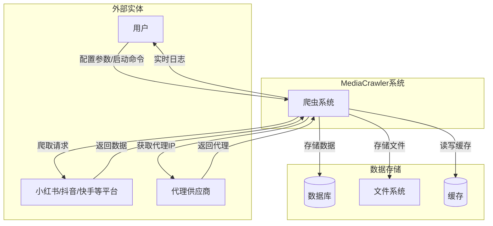
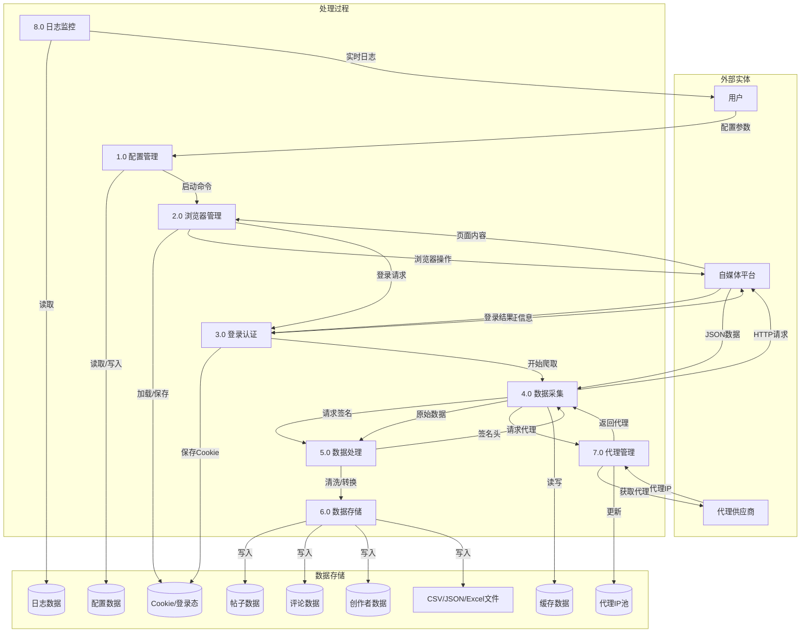
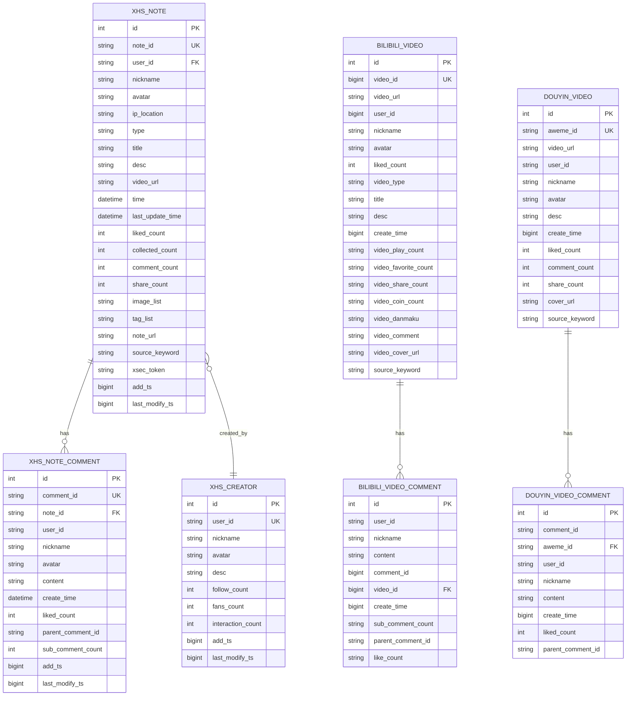
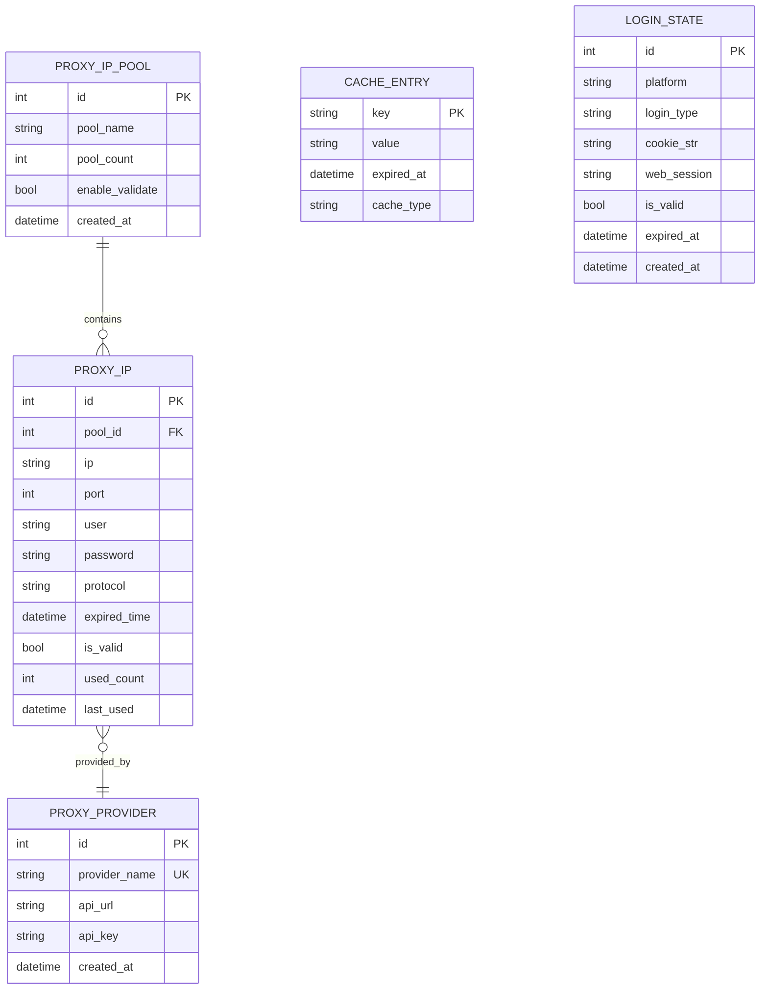
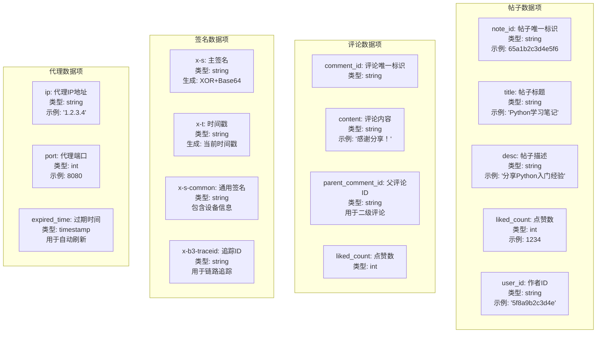
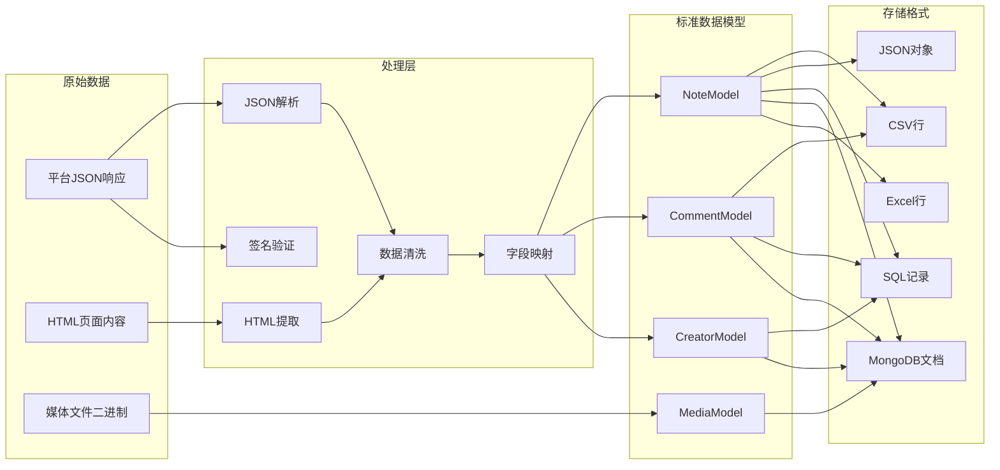
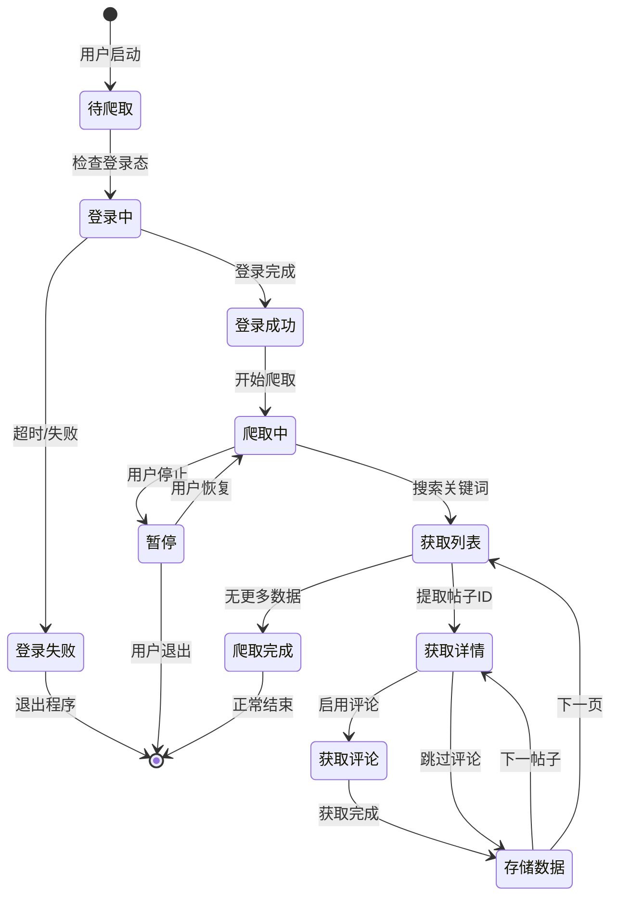

# MediaCrawler 数据流E-R图 (Data Flow & E-R Diagram)

## 1. 系统数据流图 (DFD Level 0 - 上下文图)



### 图表解释

#### 1. 整体概述
- 该图是 DFD Level 0 上下文图，将 MediaCrawler 系统视为单一黑盒，只描述系统与外部环境的数据交换边界
- 图中包含三类元素：外部实体（用户、平台、代理供应商）、系统本身、以及三种数据存储（数据库、文件系统、缓存）
- 所有数据流均跨越系统边界，不暴露内部处理逻辑，目的是让读者快速建立对系统全局交互关系的认知

#### 2. 关键元素说明
- **用户**：向系统输入配置参数和启动命令，接收实时日志反馈
- **自媒体平台**（小红书/抖音/快手）：系统的数据来源，接收爬取请求并返回数据
- **代理供应商**：为系统提供代理 IP，用于规避目标平台的访问限制
- **数据库**：持久化存储结构化爬取数据
- **文件系统**：存储非结构化文件（如图片、视频、导出文件）
- **缓存**：提供热点数据的快速读写，降低重复请求频率

#### 3. 关键流程/关系说明
1. 用户向爬虫系统发送配置参数和启动命令，系统向用户返回实时日志
2. 系统向自媒体平台发送爬取请求，平台返回目标数据
3. 系统向代理供应商请求代理 IP，供应商返回可用代理
4. 系统将处理后的数据写入数据库和文件系统
5. 系统与缓存进行读写交互，加速数据访问

#### 4. 关键技术解释
- 代理供应商的引入是为了应对目标平台的 IP 封禁和频率限制策略，通过代理池实现请求源的动态轮换
- 数据库、文件系统、缓存构成三级存储架构：数据库负责结构化数据持久化，文件系统处理二进制资源，缓存利用时间局部性原理加速热点数据访问
- 实时日志流从系统返回用户，提供了运行状态的可观测性，便于监控和调试

#### 5. 设计意图
- **为什么要这样设计**：上下文图是结构化分析的标准起点，先界定系统边界再逐步分解，符合自顶向下的设计方法论
- **解决了什么痛点**：避免一开始就陷入内部实现细节，使非技术干系人也能理解系统与外部环境的交互关系
- **带来了什么好处**：为后续的 DFD Level 1、Level 2 分解提供明确的接口契约和范围基准
- **如果不这样会怎样**：若跳过上下文图直接绘制内部细节，会导致读者缺乏全局视角，难以定位模块在系统中的位置和职责

## 2. 系统数据流图 (DFD Level 1)



### 图表解释

#### 1. 整体概述
- 该图是 DFD Level 1，将 Level 0 中的单一系统节点分解为 8 个功能模块和 9 个数据存储
- 图中展示了系统内部的处理过程、数据存储以及它们与外部实体之间的详细数据交互
- 相比 Level 0，该图揭示了系统内部的逻辑结构和数据流转路径，为模块设计和接口定义提供依据

#### 2. 关键元素说明
- **P1 配置管理**：接收用户配置参数，读写配置数据存储
- **P2 浏览器管理**：管理浏览器实例，加载和保存 Cookie/登录态
- **P3 登录认证**：完成平台登录认证，保存认证后的会话状态
- **P4 数据采集**：执行核心爬取逻辑，向平台发送 HTTP 请求
- **P5 数据处理**：生成请求签名，清洗和转换原始数据
- **P6 数据存储**：将处理后的数据写入数据库、文件等多种存储
- **P7 代理管理**：维护代理 IP 池，为数据采集提供代理资源
- **P8 日志监控**：读取日志数据，向用户输出实时运行状态

#### 3. 关键流程/关系说明
1. 用户通过 P1 输入配置参数，P1 将配置持久化到 D1
2. P1 向 P2 发送启动命令，P2 加载 D2 中的 Cookie 并操作浏览器访问平台
3. P2 触发 P3 进行登录认证，P3 将认证结果保存回 D2
4. P3 通知 P4 开始爬取，P4 向 P5 请求签名头后向平台发送 HTTP 请求
5. P4 将原始数据交给 P5 处理，P5 清洗后由 P6 写入 D3、D4、D5 和 F1
6. P4 向 P7 请求代理，P7 从 D6 获取代理 IP 并返回给 P4
7. P8 读取 D7 的日志数据，实时向用户展示系统运行状态

#### 4. 关键技术解释
- P2 与 P3 分离体现了关注点分离原则，浏览器管理和认证逻辑可独立演进和复用
- P4 与 P5 之间的签名交互反映了反爬对抗机制，通常涉及对请求参数和时间戳的加密计算
- P6 的多目标写入支持不同下游消费场景：数据库用于结构化查询，文件用于离线分析
- D8 缓存数据被 P4 读写，利用时间局部性减少重复请求，降低对目标平台的访问压力

#### 5. 设计意图
- **为什么要这样设计**：将复杂系统分解为高内聚、低耦合的功能模块，每个模块承担单一职责
- **解决了什么痛点**：避免所有逻辑混杂在一个组件中，导致代码难以维护、测试和扩展
- **带来了什么好处**：模块间通过显式数据流交互，便于定位性能瓶颈、故障点和进行独立优化
- **如果不这样会怎样**：若缺乏分层分解，系统会退化为单体泥球，任何修改都可能引发连锁反应，维护成本急剧上升

## 3. 数据流详细图 - 搜索爬取流程

```mermaid
graph LR
    subgraph 输入
        I1[关键词: "Python"]
        I2[页码: 1,2,3...]
        I3[最大数量: 100]
    end

    subgraph 处理
        P1[构建搜索请求]
        P2[生成签名头]
        P3[发送HTTP请求]
        P4[解析响应JSON]
        P5[提取帖子ID列表]
        P6[并发获取帖子详情]
        P7[获取评论]
        P8[数据清洗]
    end

    subgraph 输出
        O1[帖子数据]
        O2[评论数据]
        O3[媒体URL]
    end

    I1 --> P1
    I2 --> P1
    P1 --> P2
    P2 --> P3
    P3 --> P4
    P4 --> P5
    P5 --> P6
    P6 --> P7
    P7 --> P8
    P8 --> O1
    P8 --> O2
    P6 --> O3
```

### 图表解释

#### 1. 整体概述
- 该图是搜索爬取流程的详细数据流图，聚焦于关键词搜索场景下的完整数据处理流水线
- 流程分为输入、处理、输出三个阶段，是对 DFD Level 1 中 P4（数据采集）和 P5（数据处理）的进一步展开
- 图中展示了从关键词输入到最终结构化数据产出的全链路，便于开发者理解每一步的输入输出边界

#### 2. 关键元素说明
- **关键词/页码/最大数量**：输入参数，控制搜索目标、分页范围和爬取上限
- **P1 构建搜索请求**：根据输入参数组装 HTTP 请求报文
- **P2 生成签名头**：计算请求签名，满足平台的反爬校验要求
- **P3 发送 HTTP 请求**：与目标平台建立网络连接并获取响应
- **P4 解析响应 JSON**：将平台返回的 JSON 字符串反序列化为内部数据结构
- **P5 提取帖子 ID 列表**：从搜索结果中解析出待爬取的帖子标识集合
- **P6 并发获取帖子详情**：并行请求多个帖子的详细数据，同时提取媒体 URL
- **P7 获取评论**：拉取帖子关联的评论数据
- **P8 数据清洗**：处理字段缺失、格式不一致、编码异常等问题

#### 3. 关键流程/关系说明
1. P1 根据关键词、页码和最大数量构建搜索请求报文
2. P2 为请求生成签名头，P3 携带签名向平台发送 HTTP 请求
3. P4 解析平台返回的 JSON 响应，P5 从中提取帖子 ID 列表
4. P6 并发获取每个帖子的详情数据，同时输出媒体 URL
5. P7 拉取各帖子关联的评论数据
6. P8 对采集到的原始帖子、评论数据进行清洗和格式化
7. 最终输出结构化的帖子数据、评论数据和媒体 URL

#### 4. 关键技术解释
- P2 签名生成基于时间戳、请求参数和密钥计算，是平台反爬机制的核心校验手段，缺少合法签名的请求会被服务端拒绝
- P6 采用并发请求策略，通过异步 I/O 或多线程同时拉取多个帖子详情，将 I/O 等待时间从串行累加转为并行重叠，显著提升吞吐量
- P8 数据清洗处理空值、类型转换、编码规范化等问题，是保障下游数据质量和分析准确性的关键环节

#### 5. 设计意图
- **为什么要这样设计**：将搜索爬取流程分解为细粒度的处理节点，每个节点职责单一、接口清晰
- **解决了什么痛点**：当爬取失败时，开发者可以根据报错位置快速定位是签名错误、网络超时还是解析异常
- **带来了什么好处**：便于独立优化各节点，如调整并发度、更换解析策略、增强清洗规则，而不会影响其他环节
- **如果不这样会怎样**：若将所有逻辑耦合在一个大函数中，故障排查困难，性能优化无从下手，代码难以维护和测试

## 4. E-R图 - 数据库实体关系



### 图表解释

#### 1. 整体概述
- 该图是 MediaCrawler 系统的数据库 E-R 图，展示了三个平台（小红书、Bilibili、抖音）的核心实体及其关系
- 每个平台均包含内容实体和评论实体，小红书额外包含创作者实体
- 图中定义了主键、唯一键、外键约束以及实体间的关联关系，是数据库 Schema 设计的直接依据

#### 2. 关键元素说明
- **XHS_NOTE**：小红书帖子实体，包含帖子元数据、互动计数和媒体资源地址
- **XHS_NOTE_COMMENT**：小红书评论实体，通过 note_id 外键关联帖子，支持自引用回复
- **XHS_CREATOR**：小红书创作者实体，记录作者信息和粉丝互动数据
- **BILIBILI_VIDEO / BILIBILI_VIDEO_COMMENT**：Bilibili 视频和评论实体
- **DOUYIN_VIDEO / DOUYIN_VIDEO_COMMENT**：抖音视频和评论实体
- **PK / UK / FK**：主键用于内部标识，唯一键保证业务唯一性，外键建立实体间引用完整性

#### 3. 关键流程/关系说明
1. XHS_NOTE 与 XHS_NOTE_COMMENT 为一对多关系，一个帖子包含多条评论
2. XHS_NOTE 与 XHS_CREATOR 为多对一关系，多个帖子由同一创作者发布
3. XHS_NOTE_COMMENT 存在自引用关系，parent_comment_id 实现评论的层级回复结构
4. BILIBILI_VIDEO 与 BILIBILI_VIDEO_COMMENT 为一对多关系
5. DOUYIN_VIDEO 与 DOUYIN_VIDEO_COMMENT 为一对多关系

#### 4. 关键技术解释
- 主键采用自增整数，唯一键采用平台原生 ID（如 note_id、aweme_id），实现内部标识与业务幂等的分离
- XHS_NOTE_COMMENT 的 parent_comment_id 实现邻接表模型，是处理树形层级结构的常见方案，查询时可通过递归或嵌套集扩展
- add_ts 和 last_modify_ts 字段记录数据入库和变更时间，支持增量同步、数据审计和冲突检测
- 外键约束确保评论必须关联到存在的帖子，维护引用完整性

#### 5. 设计意图
- **为什么要这样设计**：为每个平台独立建表，保留各平台数据的特性和差异性
- **解决了什么痛点**：避免了过度泛化导致的字段稀疏问题，不同平台的特有字段无需填充空值
- **带来了什么好处**：通过一致的命名规范（liked_count、create_time）和公共字段（add_ts、last_modify_ts），为跨平台数据聚合和分析提供基础
- **如果不这样会怎样**：若设计完全通用的抽象表，会导致大量平台特有字段为空，存储效率低下，查询时需要频繁处理条件分支，Schema 演进困难

## 5. E-R图 - 代理与缓存实体



### 图表解释

#### 1. 整体概述
- 该图展示了系统基础设施层的两个核心子域：代理资源管理和会话状态管理
- 代理子域包含代理池、代理 IP 和代理供应商三个关联实体
- 会话子域包含缓存条目和登录状态两个独立实体，共同支撑网络请求与会话维持能力

#### 2. 关键元素说明
- **PROXY_IP_POOL**：代理 IP 池，定义池的基本配置和校验策略
- **PROXY_IP**：具体代理 IP 实例，包含连接参数、使用状态和生命周期信息
- **PROXY_PROVIDER**：代理供应商，记录 API 接口地址和认证密钥
- **CACHE_ENTRY**：缓存条目，支持键值存储、过期控制和类型区分
- **LOGIN_STATE**：登录状态，记录平台认证信息和会话凭证

#### 3. 关键流程/关系说明
1. PROXY_IP_POOL 与 PROXY_IP 为一对多关系，一个代理池包含多个代理 IP 实例
2. PROXY_IP 与 PROXY_PROVIDER 为多对一关系，多个代理 IP 可由同一供应商提供
3. CACHE_ENTRY 为独立实体，通过 key 字段实现逻辑定位，不与其他实体建立外键
4. LOGIN_STATE 为独立实体，通过 platform 字段区分不同平台的登录状态

#### 4. 关键技术解释
- PROXY_IP_POOL 的 enable_validate 字段控制代理可用性校验，used_count 和 last_used 支持基于使用频率的调度策略（如最少使用、轮询）
- PROXY_IP 的 is_valid 和 expired_time 实现代理生命周期管理，支持定时淘汰失效节点
- CACHE_ENTRY 的 expired_at 和 cache_type 支持多类型缓存（内存、Redis）与 TTL 过期策略
- LOGIN_STATE 的 cookie_str 和 web_session 存储平台会话凭证，is_valid 和 expired_at 用于会话有效性判断，支撑免密登录和会话复用

#### 5. 设计意图
- **为什么要这样设计**：将代理配置、代理实例和供应来源分离，将会话状态与业务数据隔离
- **解决了什么痛点**：代理资源可以灵活配置和多源接入，会话状态不会污染核心业务数据表
- **带来了什么好处**：通过显式管理过期时间，避免无效状态的长期驻留，支持分布式部署和状态恢复
- **如果不这样会怎样**：若代理信息硬编码或混合存储，代理切换和故障转移困难；若会话状态与业务数据耦合，会导致表膨胀、查询性能下降，且不利于水平扩展

## 6. 数据字典 - 核心数据项



### 图表解释

#### 1. 整体概述
- 该图是系统的数据字典，以结构化方式定义了四类核心数据项的语义、类型和用途
- 数据字典作为系统元数据的核心组成部分，为开发者和数据消费方提供统一的数据定义规范
- 图中涵盖业务数据（帖子、评论）、反爬协议（签名）和基础设施（代理）三个层面的数据项

#### 2. 关键元素说明
- **帖子数据项**：note_id（业务唯一标识）、title（标题）、desc（描述）、liked_count（点赞数）、user_id（作者标识）
- **评论数据项**：comment_id（评论标识）、content（内容）、parent_comment_id（父评论标识，用于层级回复）、liked_count（点赞数）
- **签名数据项**：x-s（主签名）、x-t（时间戳）、x-s-common（通用签名，含设备信息）、x-b3-traceid（链路追踪标识）
- **代理数据项**：ip（代理地址）、port（端口）、expired_time（过期时间）

#### 3. 关键流程/关系说明
1. 帖子数据项与评论数据项通过 note_id 建立隐式关联
2. parent_comment_id 为空表示一级评论，非空表示二级回复，形成评论层级结构
3. x-s 和 x-s-common 基于请求参数和时间戳计算，x-t 提供时间基准
4. x-b3-traceid 在请求链路上下文传递，用于分布式追踪
5. 代理数据项的 expired_time 支持代理资源的定时刷新和失效淘汰

#### 4. 关键技术解释
- note_id 和 comment_id 采用平台原生字符串标识，避免不同平台 ID 冲突
- parent_comment_id 实现邻接表模型，是处理评论树形层级的标准方案
- x-s 采用 XOR 与 Base64 组合算法生成，x-s-common 包含设备指纹，共同构成平台反爬校验的核心机制
- x-b3-traceid 遵循 OpenTracing 规范，在分布式系统中标识一次完整请求链路，便于故障定位和性能分析

#### 5. 设计意图
- **为什么要这样设计**：建立系统范围内的数据语义共识，统一业务数据、协议字段和基础设施配置的定义
- **解决了什么痛点**：避免团队成员对同一字段的理解不一致，减少集成时的接口摩擦和数据解析错误
- **带来了什么好处**：为数据库 Schema 设计、API 接口定义、数据校验规则提供直接依据，签名数据项的纳入使反爬协议成为显性规范
- **如果不这样会怎样**：若缺乏统一数据字典，不同开发者可能对同一字段命名、类型和含义产生分歧，导致数据不一致、接口不兼容，维护成本显著增加

## 7. 数据转换流程图



### 图表解释

#### 1. 整体概述
- 该图是系统的数据转换流程图，展示了从原始平台数据到标准化模型再到多种存储格式的完整 ETL 链路
- 图中分为四层：原始数据层、处理层、标准数据模型层和存储格式层
- 核心思想是通过标准数据模型层隔离上游平台差异与下游存储差异，实现多源输入、统一处理、多目标输出

#### 2. 关键元素说明
- **原始数据层**：平台 JSON 响应（结构化 API 返回）、HTML 页面内容（半结构化数据）、媒体文件二进制（非结构化资源）
- **处理层**：JSON 解析（P1）、HTML 提取（P2）、签名验证（P3）、数据清洗（P4）、字段映射（P5）
- **标准数据模型层**：NoteModel（帖子）、CommentModel（评论）、CreatorModel（创作者）、MediaModel（媒体）
- **存储格式层**：CSV 行、JSON 对象、SQL 记录、MongoDB 文档、Excel 行

#### 3. 关键流程/关系说明
1. JSON 响应经 P1 解析，HTML 内容经 P2 提取，两者在 P4 汇合清洗
2. P5 对清洗后的数据进行字段映射，转换为标准数据模型
3. NoteModel、CommentModel、CreatorModel 由 P5 输出，MediaModel 直接由原始二进制转换
4. NoteModel 支持全部五种存储格式，CommentModel 支持 CSV、SQL 和 MongoDB
5. CreatorModel 支持 SQL 和 MongoDB，MediaModel 仅支持 MongoDB

#### 4. 关键技术解释
- P1 JSON 解析使用反序列化库将 JSON 字符串转为语言原生对象；P2 HTML 提取依赖 CSS 选择器或 XPath 定位目标节点
- P3 签名验证确保数据来源可信且未被篡改，是数据完整性的第一道防线
- P4 数据清洗处理缺失值、类型转换、编码规范化等问题，保障下游数据质量
- P5 字段映射将平台特定字段名转为系统内部标准命名，实现多平台数据的语义统一
- 标准模型层的多格式输出适配不同消费场景：CSV/Excel 面向分析人员，JSON 面向 API 消费，SQL 面向关系查询，MongoDB 面向文档存储

#### 5. 设计意图
- **为什么要这样设计**：引入标准数据模型层作为中间抽象，隔离上游平台协议与下游存储实现
- **解决了什么痛点**：新增平台时无需改动存储逻辑，新增存储格式时无需改动解析逻辑
- **带来了什么好处**：实现了关注点分离，系统可扩展性和可维护性显著提升，各层可独立演进
- **如果不这样会怎样**：若缺少标准模型层，平台特有字段将直接渗透到存储层，新增平台会导致所有存储适配器修改，代码耦合度高，维护成本急剧上升

## 8. 数据状态转换图



### 图表解释

#### 1. 整体概述
- 该图是爬虫系统的 UML 状态转换图，描述了系统从启动到结束的完整生命周期
- 图中定义了多个主要状态和初始/终止伪状态，展示了状态间的合法转换路径及触发条件
- 核心目的是将复杂的控制逻辑显性化，使开发者理解系统在各阶段的合法行为与边界条件

#### 2. 关键元素说明
- **待爬取**：系统初始化后的就绪状态，等待用户启动
- **登录中 / 登录成功 / 登录失败**：平台认证的生命周期，失败直接导向终止
- **爬取中**：正在执行数据采集的顶层状态
- **获取列表 / 获取详情 / 获取评论**：数据采集的三层嵌套循环结构
- **存储数据**：正在持久化采集结果
- **爬取完成**：所有数据采集完毕，导向终止
- **暂停**：用户主动中断，可恢复或退出

#### 3. 关键流程/关系说明
1. 初始状态 → 待爬取：用户启动系统
2. 待爬取 → 登录中：系统检查登录态
3. 登录中 → 登录成功：认证通过；登录中 → 登录失败：超时或失败，直接终止
4. 登录成功 → 爬取中 → 获取列表：开始搜索关键词
5. 获取列表 → 获取详情：提取帖子 ID 后拉取详情
6. 获取详情 → 获取评论 → 存储数据：启用评论采集的完整路径
7. 获取详情 → 存储数据：跳过评论的快捷路径
8. 存储数据 → 获取详情（下一帖子）或获取列表（下一页）
9. 获取列表 → 爬取完成 → 终止：无更多数据
10. 爬取中 → 暂停 → 爬取中（恢复）或终止（退出）

#### 4. 关键技术解释
- 该状态机采用事件驱动模式，每个转换由外部事件（用户操作）或内部事件（流程推进）触发
- 登录失败直接终止的设计避免了无意义的后继请求，减少资源浪费
- 获取列表 → 获取详情 → 获取评论的嵌套结构对应三层循环：外层控制页码迭代，中层控制单页帖子迭代，内层控制评论获取
- 暂停状态的引入使系统具备可中断性，支持长时间运行任务的人工干预，符合协作式多任务的设计思想

#### 5. 设计意图
- **为什么要这样设计**：将隐式的控制逻辑转化为显式的状态机，每个状态对应一段处理逻辑，每次转换对应一次事件处理
- **解决了什么痛点**：避免了隐式状态管理导致的逻辑混乱和条件分支爆炸，使代码更易理解和测试
- **带来了什么好处**：为编写可测试、可调试的状态机代码提供蓝图，终止状态的多入边统一了资源清理和日志汇总路径
- **如果不这样会怎样**：若使用隐式标志位和嵌套条件控制流程，状态组合会随功能增加呈指数增长，导致代码难以维护、边界条件遗漏、测试覆盖困难

