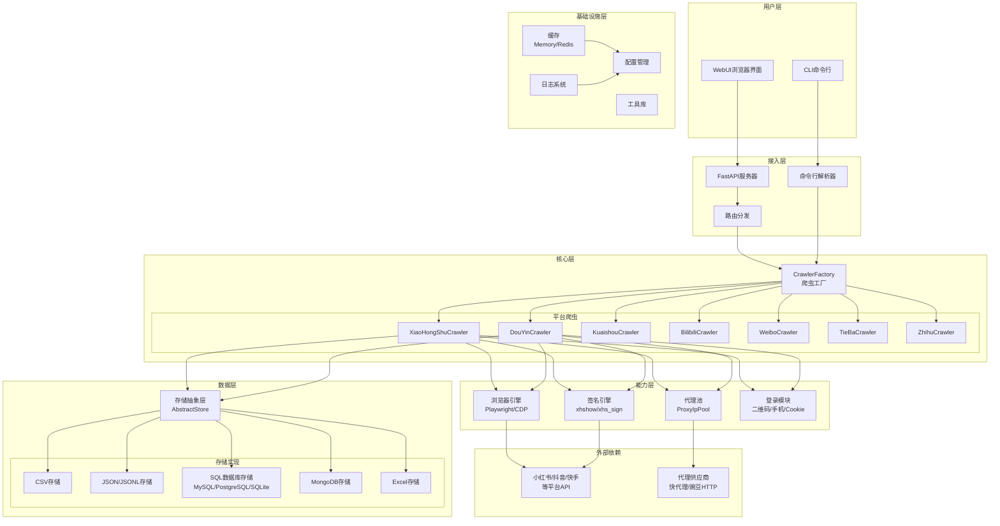
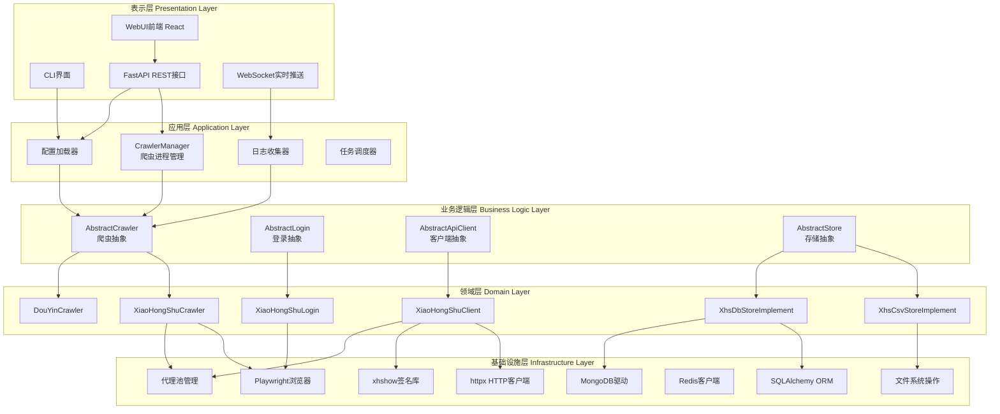
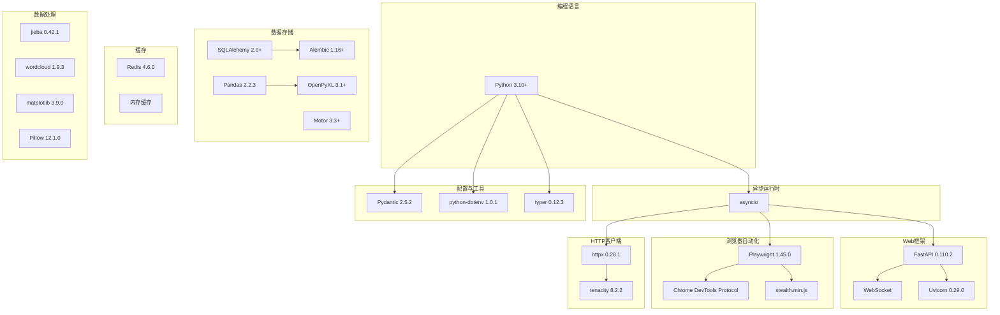
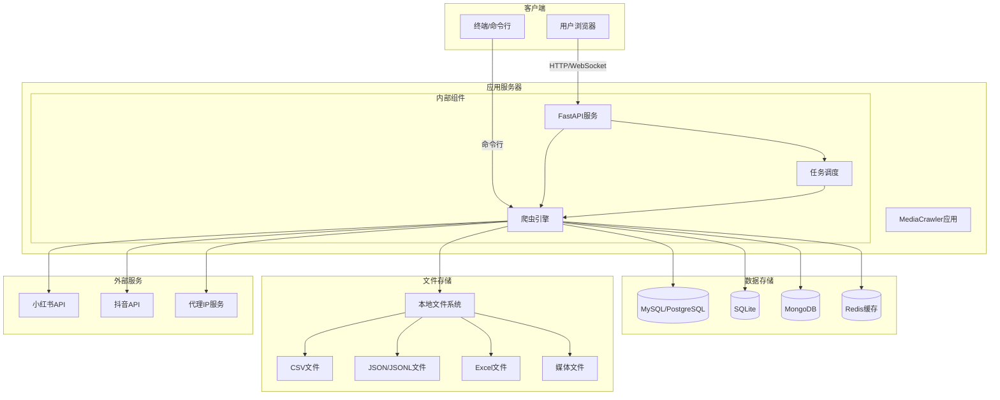
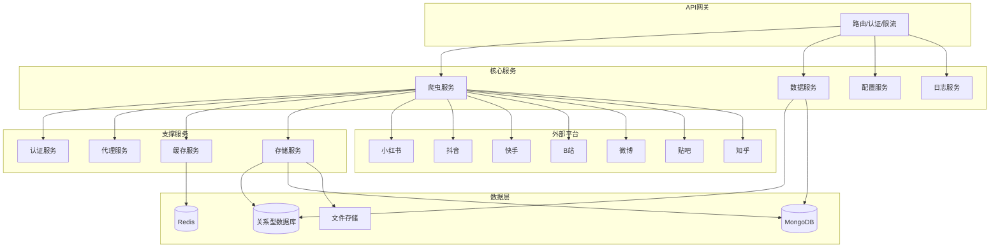
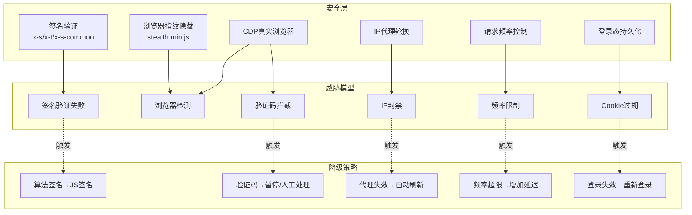
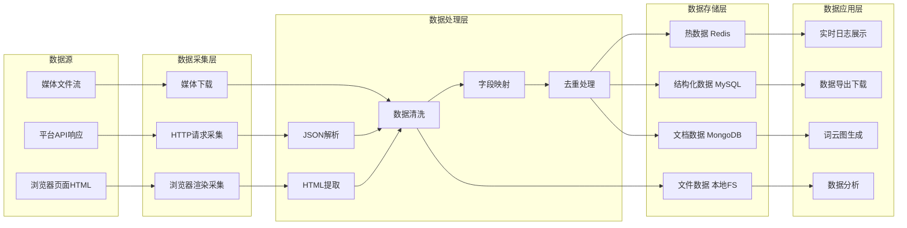
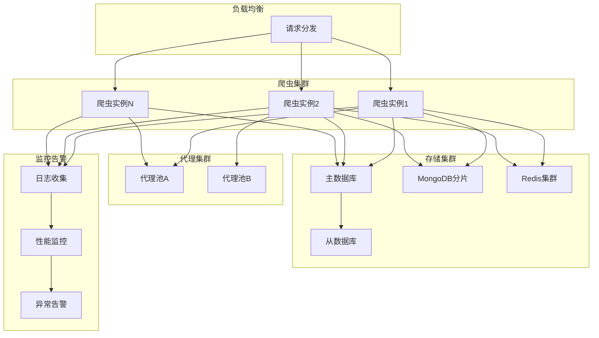

# MediaCrawler 系统架构图 (System Architecture Diagram)

## 1. 整体系统架构图

### 图表解释

#### 1. 整体概述

- 系统采用六层纵向架构：用户层、接入层、核心层、能力层、数据层、基础设施层，外加外部依赖层
- 各层职责边界清晰，上层通过标准化接口调用下层服务，形成单向依赖链
- 核心层集中管理七个平台爬虫，能力层抽离通用技术模块，实现跨平台复用

#### 2. 关键元素说明

- **用户层**：CLI 和 WebUI 两种入口，分别面向自动化脚本和可视化操作场景
- **接入层**：FastAPI 服务器处理 HTTP/WebSocket 请求，命令行解析器处理 CLI 参数
- **核心层**：CrawlerFactory 根据平台标识实例化对应爬虫，支持小红书、抖音、快手、B站、微博、贴吧、知乎
- **能力层**：浏览器引擎（Playwright/CDP）负责动态渲染，签名引擎生成平台合法签名，代理池实现 IP 轮换，登录模块管理身份凭证
- **数据层**：AbstractStore 抽象接口屏蔽存储差异，支持 CSV、JSON/JSONL、SQL 数据库、MongoDB、Excel 五种后端
- **基础设施层**：缓存、配置、日志、工具库为全系统提供横切关注点支持

#### 3. 关键流程/关系说明

1. 用户请求经接入层解析后路由至 CrawlerFactory
2. 工厂按平台类型创建具体爬虫实例
3. 爬虫运行时依次调用能力层：登录模块获取凭证 → 代理池获取 IP → 签名引擎生成签名 → 浏览器引擎发起请求
4. 爬取数据通过 AbstractStore 写入具体存储后端
5. 配置管理和日志系统贯穿全流程，提供运行时支撑

#### 4. 关键技术解释

- **工厂模式**：CrawlerFactory 统一封装爬虫实例化逻辑，新增平台只需实现标准接口并注册，无需修改既有代码
- **策略模式**：AbstractStore 定义 CRUD 契约，各存储后端独立实现，调用方无感知切换
- **浏览器指纹伪装**：Playwright 配合 stealth.min.js 修改 Navigator、WebGL、Canvas 等特征，规避平台自动化检测
- **签名逆向**：通过分析平台 JavaScript 提取签名算法（如 x-s/x-t、x-bogus），在 Python 端复现或直接在浏览器中执行原生的脚本

#### 5. 设计意图

- **为什么要这样设计**：爬虫系统需要同时支持多平台、多存储、多入口，分层架构将变化隔离在各自层级内
- **解决了什么痛点**：平台扩展时无需改动接入层和数据层；存储切换时无需改动业务逻辑；能力模块可被多爬虫复用，避免重复开发
- **带来了什么好处**：新增平台或存储后端的边际成本极低；各层可独立测试和部署；系统边界清晰，便于故障定位
- **如果不这样会怎样**：若将平台逻辑、存储逻辑、网络请求混杂在一起，代码耦合度急剧上升，任何平台接口变更或存储需求调整都会引发全量修改，维护成本不可控

## 2. 分层架构图

### 图表解释

#### 1. 整体概述

- 系统采用经典五层架构：表示层、应用层、业务逻辑层、领域层、基础设施层
- 依赖方向严格单向：上层可调用下层，下层禁止反向依赖上层，形成清晰的依赖边界
- 与图1的整体拓扑视角不同，本图聚焦代码组织结构和编译期依赖关系

#### 2. 关键元素说明

- **表示层**：CLI 终端、React WebUI 前端、FastAPI REST 接口、WebSocket 实时通道，负责用户交互
- **应用层**：CrawlerManager 管理爬虫生命周期，任务调度器负责任务排队与分发，配置加载器和日志收集器提供横切支持
- **业务逻辑层**：AbstractCrawler、AbstractLogin、AbstractApiClient、AbstractStore 定义系统契约接口
- **领域层**：XiaoHongShuCrawler、DouYinCrawler、XiaoHongShuClient、XhsCsvStoreImplement 等具体实现
- **基础设施层**：Playwright、httpx、签名库、SQLAlchemy、MongoDB 驱动、Redis 客户端等底层技术组件

#### 3. 关键流程/关系说明

1. WebUI 前端通过 REST 接口与应用层通信，CLI 直接调用配置加载器初始化环境
2. CrawlerManager 接收调度器任务后，调用 AbstractCrawler 接口启动爬取
3. 业务逻辑层通过多态将调用路由到领域层：AbstractCrawler → XiaoHongShuCrawler，AbstractApiClient → XiaoHongShuClient
4. 领域层实现类直接操作基础设施层完成实际工作
5. WebSocket 通道绕过应用层，直接将日志数据流推送至前端

#### 4. 关键技术解释

- **抽象基类与多态**：AbstractCrawler 定义 `search`、`get_note_detail` 等抽象方法，各平台必须实现，CrawlerManager 据此统一调度不同平台而无需感知平台差异
- **依赖注入**：XiaoHongShuClient 通过构造函数接收已配置的 httpx 实例，测试时可注入 Mock 对象，实现组件隔离测试
- **ORM 映射**：SQLAlchemy 将领域对象映射为数据库表，XhsDbStoreImplement 面向对象操作数据，无需手写 SQL

#### 5. 设计意图

- **为什么要这样设计**：复杂系统需要通过分层控制认知复杂度，将不同抽象级别的代码隔离到不同层级
- **解决了什么痛点**：业务逻辑与具体技术实现混杂时，修改存储方案或前端框架会牵一发而动全身
- **带来了什么好处**：可独立测试领域层业务逻辑；更换前端只需改动表示层；新增存储后端只需在领域层添加实现类
- **如果不这样会怎样**：若领域层直接依赖基础设施层的具体类，将违反依赖倒置原则，导致单元测试困难、技术栈锁定、重构成本极高

## 3. 技术栈架构图

### 图表解释

#### 1. 整体概述

- 以 Python 3.10+ 为基座，asyncio 为核心异步运行时，向上支撑七大技术领域
- 所有 I/O 密集型组件（Web、浏览器、HTTP）均构建在 asyncio 之上，实现单线程高并发
- 版本号明确标注，确保构建可复现性，避免依赖漂移导致的兼容性问题

#### 2. 关键元素说明

- **Python 3.10+**：基础运行时，支持 match-case 和更完善的类型提示
- **asyncio**：标准库异步 I/O 框架，提供事件循环、协程和任务调度
- **Web 框架**：FastAPI（现代 Web 框架，自动验证/OpenAPI）、Uvicorn（ASGI 服务器）、WebSocket（全双工通信）
- **浏览器自动化**：Playwright（跨浏览器自动化）、CDP（Chrome 远程调试协议）、stealth.min.js（隐藏自动化特征）
- **HTTP 客户端**：httpx（同步/异步双模式）、tenacity（重试策略装饰器）
- **数据存储**：SQLAlchemy 2.0（ORM）、Alembic（数据库迁移）、Motor（MongoDB 异步驱动）、Pandas（数据分析）、OpenPyXL（Excel 读写）
- **缓存**：Redis 客户端、内存缓存
- **数据处理**：jieba（中文分词）、wordcloud（词云）、matplotlib（可视化）、Pillow（图像处理）
- **配置与工具**：Pydantic（数据验证）、python-dotenv（环境变量）、Typer（类型安全 CLI）

#### 3. 关键流程/关系说明

1. asyncio 作为核心，FastAPI、Playwright、httpx 均依赖其事件循环实现非阻塞 I/O
2. Uvicorn 启动 FastAPI 应用，内部使用 uvloop 替代默认事件循环提升性能
3. Playwright 通过 CDP 与 Chromium 实例通信，发送控制指令并接收页面事件
4. httpx 遇到超时或 5xx 错误时，tenacity 按配置策略自动重试
5. SQLAlchemy 模型使用 Pydantic 校验，Alembic 读取元数据生成迁移脚本

#### 4. 关键技术解释

- **asyncio 事件循环**：协程遇到 I/O 操作时将控制权交还事件循环，循环调度其他就绪协程，避免线程阻塞；相比多线程，无 GIL 竞争和上下文切换开销，更适合 I/O 密集型爬虫场景
- **FastAPI 异步路由**：路由处理函数可为 async，所有 I/O 不阻塞服务器线程，Uvicorn 仅需少量工作线程即可承载高并发连接
- **ASGI 与 WSGI**：Uvicorn 是 ASGI 服务器，支持异步应用；传统 WSGI（如 Gunicorn）仅支持同步，无法发挥 asyncio 优势

#### 5. 设计意图

- **为什么要这样设计**：爬虫系统是典型的 I/O 密集型应用，需要同时维护大量网络连接和浏览器实例，异步架构是资源最优解
- **解决了什么痛点**：同步阻塞模式下，每个请求占用一个线程，高并发时线程资源耗尽且上下文切换开销巨大；异步模式单线程即可处理数千并发连接
- **带来了什么好处**：吞吐量显著提升，内存占用降低，Pydantic 在开发阶段捕获类型错误，版本锁定保证构建可复现
- **如果不这样会怎样**：若采用同步技术栈（如 Flask + requests），并发能力受限于线程池大小，同时打开数十个浏览器实例时系统资源迅速耗尽，且无法有效处理大量并发的网络 I/O

## 4. 部署架构图

### 图表解释

#### 1. 整体概述

- 系统采用单体部署模式，所有核心组件运行在同一进程内，降低运维复杂度
- 包含五类物理节点：客户端、应用服务器、数据存储、文件存储、外部服务
- 关注组件的进程边界和通信协议，与逻辑架构图形成互补视角

#### 2. 关键元素说明

- **客户端**：浏览器通过 HTTP/WebSocket 与应用服务器交互，终端通过命令行直接调用爬虫引擎
- **应用服务器**：FastAPI 服务暴露 REST API 和 WebSocket 端点，爬虫引擎执行实际爬取，任务调度器负责任务排队和状态监控
- **数据存储**：MySQL/PostgreSQL 存储结构化数据，SQLite 支持轻量级本地部署，MongoDB 存储非结构化原始数据，Redis 提供缓存和分布式锁
- **文件存储**：本地文件系统支持 CSV、JSON/JSONL、Excel 和媒体文件四种格式
- **外部服务**：目标平台 API（小红书、抖音）和代理 IP 供应商

#### 3. 关键流程/关系说明

1. 浏览器请求经 HTTP 到达 FastAPI，FastAPI 转发给爬虫引擎并通知调度器记录任务状态
2. 调度器维护任务队列，按优先级和并发限制向爬虫引擎分发任务
3. 爬虫引擎向代理服务获取可用 IP，再向目标平台 API 发起请求
4. 数据按类型分流存储：结构化数据写入关系型数据库，原始 JSON 写入 MongoDB，临时状态写入 Redis，文件类数据写入本地文件系统
5. 命令行用户绕过 FastAPI 和调度器，直接与爬虫引擎交互，适合单次执行和调试

#### 4. 关键技术解释

- **同进程通信**：FastAPI 与爬虫引擎通过 Python 函数调用通信，非网络 RPC，部署简单但爬虫的 CPU 密集型任务（浏览器渲染）会抢占事件循环线程，可能增加 API 响应延迟
- **任务队列**：调度器与爬虫引擎通过内存队列或 Redis 队列交互，支持异步执行和状态回调
- **多后端存储选型**：关系型数据库适合复杂查询的结构化数据；MongoDB 适合 schema 灵活的原始数据；Redis 适合高频读写的临时状态；文件系统适合大容量媒体资源

#### 5. 设计意图

- **为什么要这样设计**：单体模式降低部署门槛，个人用户和小团队可在单台服务器上快速运行完整系统
- **解决了什么痛点**：微服务架构需要服务发现、链路追踪等复杂运维设施，小团队难以承受；单体模式将运维复杂度降至最低
- **带来了什么好处**：双入口设计兼顾非技术用户（WebUI）和开发者（CLI）；多存储后端适配个人用户（SQLite+本地文件）和企业用户（MySQL 集群+MongoDB 分片）的不同场景
- **如果不这样会怎样**：若强行拆分为微服务，需要额外维护服务注册、配置中心、分布式日志等基础设施，对于小规模部署而言运维成本远超收益，且网络调用引入的延迟和故障点反而降低系统稳定性

## 5. 微服务视角架构图

### 图表解释

#### 1. 整体概述

- 本图为单体架构向微服务演进的参考模型，非当前实际部署方式
- 包含 API 网关、四个核心服务、四个支撑服务、七个外部平台、四类数据存储
- 各服务拥有独立部署单元和数据存储，通过网络调用通信

#### 2. 关键元素说明

- **API 网关**：统一入口，承担路由转发、身份认证、请求限流、负载均衡
- **核心服务**：CrawlerService（计算密集型爬取）、DataService（数据查询/统计/导出）、ConfigService（集中配置管理）、LogService（日志收集/存储/检索）
- **支撑服务**：AuthService（身份与登录态管理）、ProxyService（代理 IP 池维护）、CacheService（Redis 分布式缓存与锁）、StorageService（统一封装数据库与文件系统访问）
- **外部平台**：爬虫服务对接的七个内容平台
- **数据层**：关系型数据库、MongoDB、Redis、文件存储

#### 3. 关键流程/关系说明

1. 外部请求经 API 网关按路径路由至对应核心服务
2. 爬虫服务接收请求后，依次调用支撑服务：AuthService 获取凭证 → ProxyService 获取 IP → CacheService 查询状态/去重 → StorageService 持久化结果
3. 数据服务独立运行，直接从关系型数据库和 MongoDB 读取，为前端提供查询和导出接口，不依赖爬虫内部状态
4. 配置服务和日志服务作为横切关注点，被所有核心服务间接依赖
5. 爬虫服务可独立水平扩展，数据服务可按查询负载单独扩容

#### 4. 关键技术解释

- **服务通信**：HTTP/gRPC 或消息队列，API 网关采用 Nginx/Kong/Envoy 实现反向代理，支持 JWT 认证、速率限制、熔断降级
- **分布式问题**：网络分区、服务雪崩、数据一致性是微服务必须应对的问题；爬虫服务调用代理服务时若响应缓慢，可能耗尽线程池，需引入超时和熔断机制（如 Hystrix/Sentinel 模式）
- **数据拆分原则**：每个服务拥有独立数据库，避免直接共享表，确保服务间松耦合

#### 5. 设计意图

- **为什么要这样设计**：当业务规模扩大、团队人员增加时，单体架构的代码耦合度和部署风险不可持续，需要服务边界隔离
- **解决了什么痛点**：单体架构中所有组件同进程部署，任何模块变更都需全量发布；微服务允许各服务独立迭代、独立扩缩容
- **带来了什么好处**：爬虫服务可部署在 CPU 优化机器，数据服务可部署在内存优化机器；各团队可自主选择最适合的技术栈；故障隔离，单服务崩溃不影响全局
- **如果不这样会怎样**：若单体架构持续膨胀，代码库日益庞大，编译和部署时间线性增长；任何小改动都需回归测试全系统，发布风险累积；团队规模扩大后代码冲突频繁，开发效率急剧下降

## 6. 安全架构图

### 图表解释

#### 1. 整体概述

- 采用威胁建模框架，分为三层：安全层（主动防御）、威胁模型（平台限制手段）、降级策略（失效后应对）
- 实线箭头表示防御与威胁的对抗关系，虚线箭头表示威胁触发后的降级流程
- 形成"防御-检测-降级"闭环，在对抗性环境中维持爬取任务的持续执行

#### 2. 关键元素说明

- **安全层**：
  - 签名验证：生成平台要求的请求签名（x-s/x-t/x-s-common），通过服务器合法性校验
  - 浏览器指纹隐藏：stealth.min.js 修改 Navigator、WebGL、Canvas 等特征，使自动化浏览器呈现与真实浏览器一致的指纹
  - CDP 真实浏览器：使用完整 Chromium 内核执行 JavaScript、处理 Cookie、响应交互事件，通过行为分析检测
  - IP 代理轮换：代理池维护大量出口 IP，定期切换源地址，避免单一 IP 被封禁
  - 请求频率控制：令牌桶或固定间隔算法限制单位时间请求量，模拟人类浏览节奏
  - 登录态持久化：保存复用 Cookie/LocalStorage，减少频繁登录触发的人机验证
- **威胁模型**：IP 封禁、浏览器检测、签名验证失败、频率限制（429）、验证码拦截、Cookie 过期
- **降级策略**：算法签名→JS 签名、代理失效→自动刷新、登录失效→重新登录、频率超限→增加延迟、验证码→暂停/人工处理

#### 3. 关键流程/关系说明

1. 签名验证对抗签名验证失败；浏览器指纹隐藏 + CDP 真实浏览器共同对抗浏览器检测
2. IP 代理轮换对抗 IP 封禁；请求频率控制对抗频率限制；登录态持久化对抗 Cookie 过期
3. 当防御失效时触发对应威胁，系统执行降级策略：签名算法被识别→降级为浏览器执行 JS 生成签名
4. 代理 IP 被封→自动剔除失效 IP 并补充新 IP；登录态过期→触发重新登录（二维码/短信/Cookie 导入）
5. 频率超限→动态增加请求间隔；遇到验证码→暂停任务并通知人工处理

#### 4. 关键技术解释

- **签名生成双路径**：一是逆向平台 JavaScript 在 Python 中复现算法（性能高、维护成本高）；二是在 Playwright 浏览器中直接执行平台原始 JS（稳定、开销大）
- **浏览器指纹隐藏原理**：覆盖 `navigator.webdriver`、修改 `navigator.plugins` 和 `navigator.languages`、为 Canvas/WebGL 添加随机噪声，使 FingerprintJS 等工具无法区分自动化与真实浏览器
- **纵深防御（Defense in Depth）**：多层防御叠加，单点被突破仍有其他层继续保护，提升整体抗攻击面

#### 5. 设计意图

- **为什么要这样设计**：平台采用复合检测策略，单一防御手段难以应对，需要多层防御和失效后的降级机制
- **解决了什么痛点**：签名算法更新、IP 被封、登录态过期等单点故障会导致爬取中断，降级策略保证系统快速恢复
- **带来了什么好处**：最大化爬取任务完成率，最小化被封禁风险；频率控制和登录态复用同时降低对目标平台的压力和法律风险
- **如果不这样会怎样**：若仅依赖单层防御，一旦平台更新反爬策略，系统将完全失效且无恢复路径；缺乏频率控制会触发平台更严格的封禁，导致爬取成功率骤降

## 7. 数据架构图

### 图表解释

#### 1. 整体概述

- 采用经典数据处理分层模型：数据源 → 数据采集层 → 数据处理层 → 数据存储层 → 数据应用层
- 数据从左向右单向流动，经过采集、处理、存储三阶段后服务于上层应用
- 与 ETL（Extract-Transform-Load）流程一致，增加了实时应用消费层

#### 2. 关键元素说明

- **数据源**：平台 API 响应（JSON 结构化数据）、浏览器页面 HTML（服务端渲染完整网页）、媒体文件流（图片/视频二进制资源）
- **数据采集层**：HTTP 请求采集（直接调用 API）、浏览器渲染采集（Playwright 加载页面执行 JS）、媒体下载（HTTP Range/流式下载）
- **数据处理层**：JSON 解析（反序列化为 Python 对象）、HTML 提取（CSS Selector/XPath）、数据清洗（无效值/编码/格式标准化）、字段映射（平台字段→标准 schema）、去重处理（布隆过滤器/哈希集合）
- **数据存储层**：Redis（热数据/临时状态）、MySQL（结构化业务数据）、MongoDB（原始文档数据）、本地文件系统（媒体文件）
- **数据应用层**：实时日志展示（WebSocket 推送）、数据导出（CSV/Excel/JSON）、词云图生成（分词+频率统计）、数据分析（聚合查询/趋势统计）

#### 3. 关键流程/关系说明

1. 数据流按类型进入对应采集通道：API 响应→HTTP 采集→JSON 解析；HTML→浏览器采集→HTML 提取；媒体流→直接进入清洗
2. 解析/提取后的数据汇入清洗环节，进行统一脏数据处理
3. 清洗后进入字段映射，将平台特定字段（如 `note_id`、`aweme_id`）映射为标准字段（如 `content_id`）
4. 映射后数据经过去重，按用途分流存储：状态数据→Redis，结构化元数据→MySQL，原始响应→MongoDB，媒体文件→本地文件系统
5. 存储层数据被应用层消费，各应用按需求从对应后端读取

#### 4. 关键技术解释

- **多级去重**：内存去重（Python `set`，O(1)）→ Redis 去重（`SET`/`HyperLogLog`，跨任务原子去重）→ 数据库去重（唯一索引，持久化层防重复写入）
- **配置驱动字段映射**：YAML/JSON 描述平台字段与标准字段映射关系，新增平台只需添加配置无需改代码
- **断点续传**：媒体下载通过 HTTP Range 请求头实现大文件分段下载，网络中断后从断点继续，避免全量重传

#### 5. 设计意图

- **为什么要这样设计**：数据的生产和消费需要解耦，各层独立演进，避免牵一发而动全身
- **解决了什么痛点**：采集逻辑、处理逻辑、存储逻辑混杂时，新增平台或应用会侵入既有代码，维护困难
- **带来了什么好处**：新增平台只需增加采集器和映射配置；新增应用只需增加存储读取逻辑；多存储后端遵循 polyglot persistence 原则，按访问模式选择最优存储
- **如果不这样会怎样**：若数据流反向流动或各层耦合，将导致数据一致性难以保证，采集层变更可能破坏应用层逻辑，存储方案调整需要全量修改数据处理代码，系统难以扩展和维护

## 8. 高可用架构图

### 图表解释

#### 1. 整体概述

- 采用集群化设计消除单点故障，包含负载均衡、爬虫集群、代理集群、存储集群、监控告警五个子系统
- 每个子系统包含多个冗余节点，通过负载分发、数据复制和故障检测保证持续可用
- 面向高并发、高可靠性场景，支持水平扩展和自动故障转移

#### 2. 关键元素说明

- **负载均衡器（LB）**：流量入口，按轮询/加权/最少连接算法分发请求到后端爬虫实例
- **爬虫集群**：C1/C2/CN 多个同构实例独立运行，具备相同业务能力
- **代理集群**：P1/P2 多个代理池维护独立出口 IP，爬虫实例可从不同池获取 IP
- **存储集群**：主数据库（S1，写操作）+ 从数据库（S2，读操作/故障切换）；MongoDB 分片集群（S3，水平扩展）；Redis 集群（S4，缓存高可用）
- **监控告警**：日志收集器（M1，汇聚运行日志）、性能监控（M2，分析 CPU/内存/网络/延迟指标）、异常告警（M3，触发通知）

#### 3. 关键流程/关系说明

1. 外部请求到达 LB，按算法分发至某个爬虫实例
2. 爬虫实例向代理集群获取可用 IP，不同实例可从不同代理池获取，实现资源隔离和冗余
3. 结构化数据写入主数据库，主库异步复制到从库；文档数据经 mongos 路由写入 MongoDB 对应分片；缓存数据由客户端按一致性哈希写入 Redis 节点
4. 所有爬虫日志实时发送到日志收集器，经性能监控分析后，异常指标触发告警通知运维
5. 爬虫实例故障时 LB 自动摘除，流量路由至健康实例；主库故障时从库提升为主库继续服务

#### 4. 关键技术解释

- **主从异步复制**：主库写 binlog，从库 I/O 线程读取 binlog 写入 relay log，SQL 线程重放；主库性能无影响，但存在复制延迟，故障切换可能丢失少量数据
- **MongoDB 分片**：mongos（查询路由）+ config server（分片元数据）+ shard（数据节点）；分片键选择 Cardinality 高且查询频繁的字段（如用户 ID/时间戳），直接影响数据分布和查询性能
- **Redis 无中心集群**：每个节点维护完整拓扑，客户端连接任意节点，通过 MOVED/ASK 重定向访问正确数据节点

#### 5. 设计意图

- **为什么要这样设计**：高并发场景下单节点存在性能瓶颈和单点故障风险，需要通过集群化实现水平扩展和故障冗余
- **解决了什么痛点**：单实例爬虫处理能力有限，单点存储故障导致数据丢失，单代理池失效导致爬取中断
- **带来了什么好处**：爬虫实例可线性扩容提升并发；代理多池实现故障隔离；存储多层冗余保证数据持久性；监控告警实现可观测性，支撑故障定位和容量规划
- **如果不这样会怎样**：若采用单节点部署，爬虫实例故障将导致服务完全中断；单代理池失效后无备用 IP 来源；单数据库故障将导致数据不可恢复；缺乏监控时故障发现滞后，运维被动响应，系统可用性无法保障
