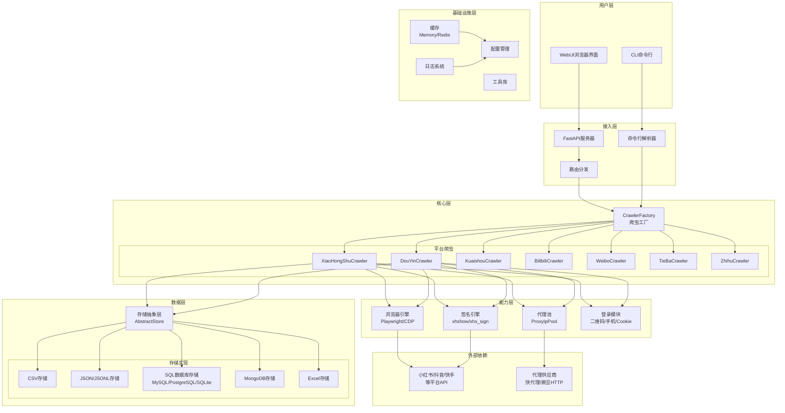
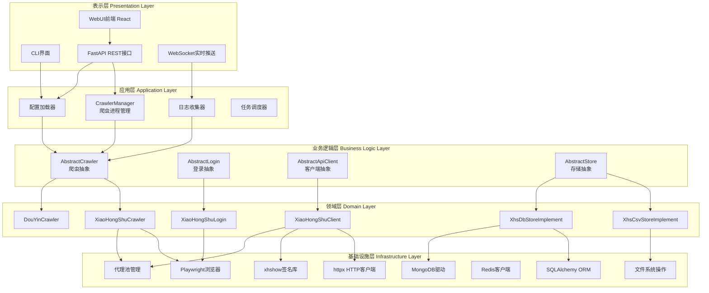
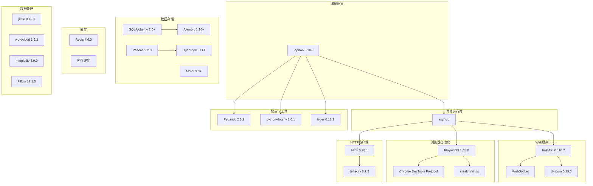
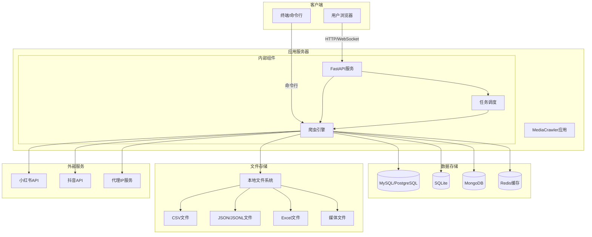
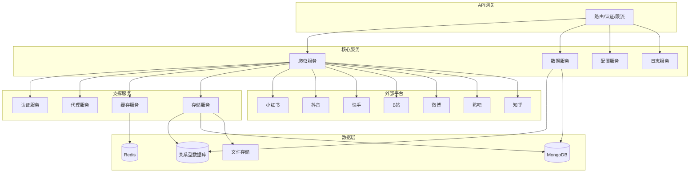
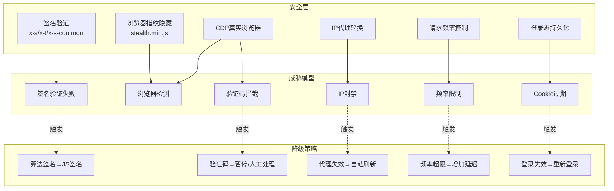
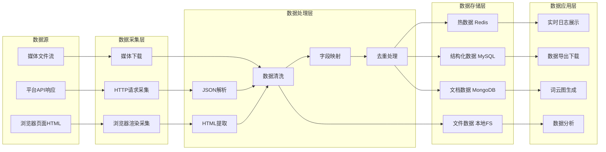
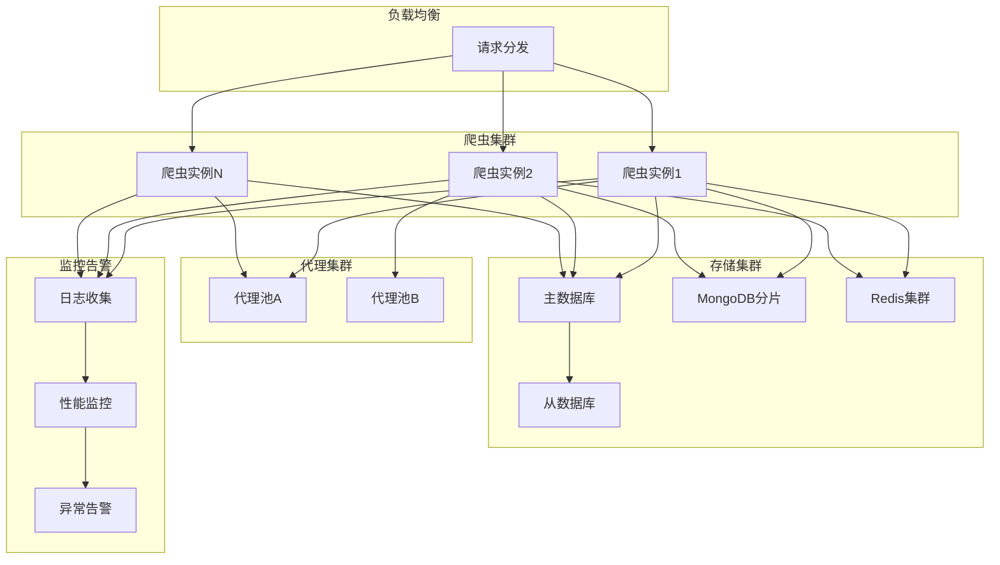

# MediaCrawler 系统架构图 (System Architecture Diagram)

## 1. 整体系统架构图

### 图表解释

这张图讲的是一套"信息收集系统"的全貌，就像一个专门帮人去各个网站上搜集内容的工具箱。

从上到下看，整个系统分成六大块。最上面是"用户层"，也就是你使用这个工具的地方——你可以在命令行窗口里敲指令，也可以打开一个网页来操作。接下来是"接入层"，它就像一个前台接待员，负责把你的请求转交给后面的工作人员。再往下是"核心层"，这里是真正干活的地方，系统里有专门负责去小红书、抖音、快手、B站、微博、贴吧、知乎这些平台搜集内容的工作人员。"能力层"就像这些工作人员的工具包，里面有浏览器、签名钥匙、代理地址本、登录卡片等装备。"数据层"是存放收集成果的地方，可以把内容存成表格、文档，或者放进不同的柜子里。最下面是"基础设施层"，就像办公室的公共设备——临时记事本、配置手册、工作日志和常用工具。

数据是怎么走的呢？当你发出一个搜集请求，前台接待员会把这个请求交给调度中心，调度中心根据你要去的平台，派出对应的工作人员。这位工作人员带上工具包，先去目标网站敲门（登录），然后穿上伪装（代理），用正确的钥匙（签名）打开大门，把看到的内容搬回来，最后按照你的要求存放到指定的柜子里。整个过程就像一条流水线，从发命令到拿到结果，一步一步自动完成。

## 2. 分层架构图

### 图表解释

这张图讲的是同一套系统，但是用"楼层"的方式来理解，就像一栋五层办公楼，每层做不同的事情，楼上的人只和楼下相邻的人打交道。

最顶层是"表示层"，这是你直接看到和摸到的地方——命令行窗口、网页界面、还有对外开放的窗口和实时通知喇叭。往下走是"应用层"，这一层就像项目经理办公室，负责统筹安排：谁来干活、怎么分工、记录工作日志、按照计划调度任务。再往下是"业务逻辑层"，这一层像设计图纸室，只画蓝图不亲自施工——它规定了"搜集工作该怎么做""登录该怎么登""怎么跟网站对话""收集来的东西怎么存"这些标准流程，但不涉及具体平台。

第四层是"领域层"，这里是真正按图纸施工的施工队——有专门去小红书的小组、去抖音的小组，每个小组里还有专门负责敲门（登录）、负责对话（客户端）、负责把东西放进不同柜子（存储）的工人。最底层是"基础设施层"，就像工地上的挖掘机、吊车、发电机等重型设备，施工队要借助这些设备才能完成工作。

事情怎么流转呢？你从顶层发出一个指令，项目经理接到后，去图纸室拿标准方案，然后交给对应的施工队，施工队开着底层的设备去现场干活。每一层只关心自己这一层的事，不用管其他楼层在干什么，这样分工清楚，出了问题也容易找到责任人。

## 3. 技术栈架构图

### 图表解释

这张图讲的是建造这套系统时，工程师们用了哪些"工具和材料"，就像一份装修清单，告诉你盖这栋房子用了什么牌子的水泥、什么型号的电线。

最根基的是"编程语言"，这里用的是 Python，相当于这栋房子的地基语言。在地基之上有一个"异步运行时"，它就像一位能同时处理很多件事的管家，让系统可以同时去多个网站搜集内容，而不是一件一件排队做。

往上分了几大工种。"Web框架"是搭建网页界面的工具，包括网页服务本身、实时通知通道和运行网页服务的发动机。"浏览器自动化"是一套遥控浏览器的工具，里面包括遥控器本身、跟浏览器对话的专用线路，还有让浏览器看起来更像真人操作的隐身衣。"HTTP客户端"是系统去网站敲门问话的信使，信使还配了一个"再来一次"的自动重试机制，万一第一次没敲开门就再试。

"数据存储"这块是各种存东西的工具——有管理关系型数据库的助手、帮数据库升级改结构的工具、连接文档数据库的司机、处理表格数据的计算器，还有读写 Excel 文件的小秘书。"缓存"就像临时记事本和桌面便利贴，把常用的东西放在手边，不用每次都去大柜子里翻。"数据处理"是后期加工车间，有切词分句的剪刀、做词云图的画家、画统计图表的绘图员、处理图片的修图师。"配置与工具"则是一些顺手的小工具——检查填写格式是否正确的审核员、读取环境设置的秘书、制作命令行界面的设计师。

这些工具之间也有依赖关系，比如异步管家支撑着网页服务、遥控器和信使的运行；网页服务需要发动机和实时通知通道才能工作。就像装修里，水电工要在瓦工进场前把管线铺好。

## 4. 部署架构图

### 图表解释

这张图讲的是这套系统在实际使用时，各个部件都"住"在哪里，它们之间怎么打电话联系，就像一张公司各部门的办公分布图。

左边是"客户端"，也就是你操作的地方——你可以坐在自己的电脑前打开浏览器访问网页，也可以在命令行窗口里直接发指令。中间是"应用服务器"，这是系统的大脑和心脏，里面住了三个部门：对外接待部（API）、真正干活的搜集部（爬虫引擎）、以及排期调度部（任务调度）。右边和下面是存放东西的地方："数据存储"是几个不同规格的保险柜，"文件存储"是普通的文件柜，"外部服务"则是系统需要去拜访的外部公司和供应商。

数据怎么走的呢？如果你用浏览器操作，你的请求会通过网络线路送到对外接待部，接待部再通知搜集部去干活，同时调度部会在旁边统筹安排。如果你用命令行，你的指令会直接交到搜集部手里。搜集部开始工作后，先去外部公司（小红书、抖音）敲门拿资料，还会向代理供应商借不同的身份伪装自己。拿到资料后，搜集部按照要求把内容存进不同的保险柜（关系型数据库、文档数据库、临时缓存），或者做成不同的文件格式（表格、清单、文档、图片视频）放进文件柜。调度部会协调搜集部什么时候该干什么活，避免手忙脚乱。

## 5. 微服务视角架构图

### 图表解释

这张图讲的是如果把这套系统拆成一个个独立的小团队来运作，会是什么样子。就像一家大公司，下面有很多独立的小部门，每个部门只做一件事，但互相配合。

最上面是"API网关"，它就像公司前台的智能总机，负责把外来的电话转接到正确的部门，还会检查来电者身份，以及防止有人一直占着线路不挂。往下是"核心服务"，这里有四个主要业务部门：搜集部专门去各大平台拿内容；数据部负责整理和查询收集回来的资料；配置部保管着系统的各种设置手册；日志部则像公司的档案室，记录着每天发生了什么。

再往下是"支撑服务"，这些是为核心业务部门提供后勤保障的：认证部专门管登录和身份验证；代理部管理着一大批"替身演员"的联系方式；缓存部就像临时仓库，把常用的东西放在手边；存储部则是大仓库管理员，负责把东西长期保存好。

最下面是"外部平台"和"数据层"，外部平台是系统需要去拜访的七家内容公司（小红书、抖音、快手、B站、微博、贴吧、知乎），数据层则是公司自己的各类仓库（关系型保险柜、文档保险柜、临时储物间、文件柜）。

事情怎么流转呢？外来的请求先到总机，总机转给搜集部，搜集部先找认证部确认身份，再找代理部借替身，然后带着缓存部的临时物资，去外部平台公司拿内容，拿到后交给存储部入库。数据部则随时可以从仓库里调取资料对外提供服务。每个部门都是独立的，一个部门出问题了，其他部门还能继续运转。

## 6. 安全架构图

### 图表解释

这张图讲的是这套系统去各大平台"串门"时，怎么保护自己不被拒之门外，以及万一被发现了该怎么办，就像一份特工出任务的安保手册。

整个图分成三大块。第一块是"安全层"，也就是系统出门时带上的六件装备：第一件是"签名验证"，就像一张特别通行证，证明你是合法访客；第二件是"浏览器指纹隐藏"，相当于一副面具，让网站看不出你是机器人；第三件是"真实浏览器"，系统不是用假身份，而是真的开着一个浏览器去访问，更像真人；第四件是"IP代理轮换"，就像有一大堆不同的假住址，这次用这个，下次用那个；第五件是"请求频率控制"，系统会控制自己的动作不要太快太急，避免引起怀疑；第六件是"登录态持久化"，把登录状态保存好，不用每次都重新敲门。

第二块是"威胁模型"，也就是系统可能遇到的六种麻烦：网站把你的地址拉黑（IP封禁）、网站发现你不是真人（浏览器检测）、你的通行证失效了（签名验证失败）、你动作太频繁被限速（频率限制）、网站让你做看图识字才能继续（验证码拦截）、你的登录凭证过期了（Cookie过期）。

第三块是"降级策略"，也就是遇到麻烦时的应对方案：通行证失效了就换另一种方式生成通行证；假地址被识破了就自动换一批新的；登录过期了就重新登录一次；动作太快被警告了就放慢脚步；遇到看图识字就先暂停，等人来处理。

整个流程就像特工执行任务：先全副武装出门，遇到障碍就启动对应的应急预案，保证任务能顺利完成。

## 7. 数据架构图

### 图表解释

这张图讲的是内容被收集回来后，是怎么一步步从 raw 原料变成可以使用的成品的，就像一条食品加工厂的生产流水线。

流水线的起点是"数据源"，也就是原材料的三种来源：第一种是平台直接给的数据包（API响应），第二种是网页上的完整页面内容（HTML），第三种是图片视频等媒体文件。这些原材料被送到"数据采集层"，这里有三个进货口：第一个进货口专门接收数据包，第二个进货口专门抓取网页内容，第三个进货口专门下载媒体文件。

原材料进来后，进入"数据处理层"进行加工。首先，数据包被拆开看懂（JSON解析），网页内容被提取出有用部分（HTML提取）。然后所有材料都要经过清洗车间，把脏东西、重复内容、错误信息去掉（数据清洗）。洗干净后，进入映射车间，把不同来源的材料统一贴上相同的标签（字段映射），这样来自小红书的数据和来自抖音的数据才能放在同一个架子上。最后经过质检，去掉重复品（去重处理）。

加工好的成品进入"数据存储层"入库。特别常用的东西放在手边的临时货架（热数据），结构整齐的东西放进标准档案柜（结构化数据），内容比较灵活的东西放进文档柜（文档数据），大块头的媒体文件则直接放进文件仓库（文件数据）。

最后是"数据应用层"，也就是成品出厂后的用途：可以实时展示在监控大屏上，可以打包下载带走，可以做成漂亮的词云图，也可以做进一步的分析研究。整条流水线从左到右，原料进、成品出，环环相扣。

## 8. 高可用架构图

### 图表解释

这张图讲的是当工作量很大、要求很高的时候，系统怎么保证不罢工、不丢数据，就像一家工厂从单条生产线升级成多条生产线，并且配上了备用发电机和监控室。

最上面是"负载均衡"，它就像一个聪明的调度员，面前有很多工人等着活干，调度员会把新来的任务均匀地分给每个工人，不让某个人累趴下，也不让某个人闲着。往下是"爬虫集群"，这里有很多个一模一样的搜集工人（爬虫实例1、2、直到N），他们能力相同，同时开工，一个人倒下了，其他人还能继续干活。

再往下是"代理集群"，系统准备了好几池不同的"替身演员"，工人们轮流借用，一池用完了换另一池，保证总有替身可用。右边是"存储集群"，这里做了多重保险：主数据库负责日常读写，同时它还会实时把内容复制给从数据库做备份，万一主数据库坏了，从数据库能立刻顶上；文档数据库做了分片处理，就像把一个大仓库隔成了很多小房间，每个房间存一部分，找东西更快；临时缓存也做成了集群，多几个副本，一个丢了还有其他。

最下面是"监控告警"，这是工厂的监控室。所有工人的工作日志都会被收集起来，监控室实时查看大家的工作状态，一旦发现谁干活变慢了、出错了，或者哪里卡住了，就会立刻拉响警报通知管理员来处理。

整个流程就像一支训练有素的团队：调度员派活给多个工人，工人向不同的代理池借身份，把收集到的内容同时存入主仓库和备份仓库，监控室全天候盯着所有人的表现。这样即使某个环节出了问题，整个系统还能正常运转，不会停摆。
