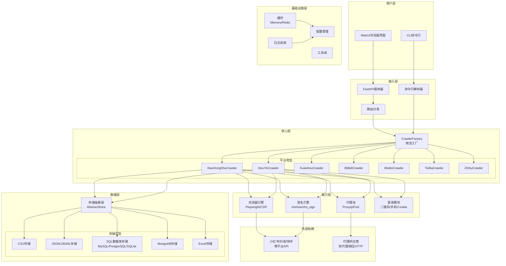
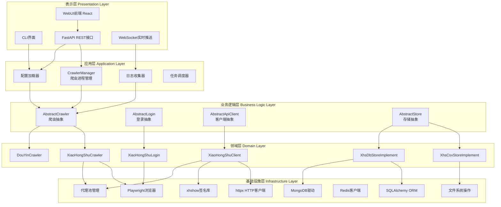
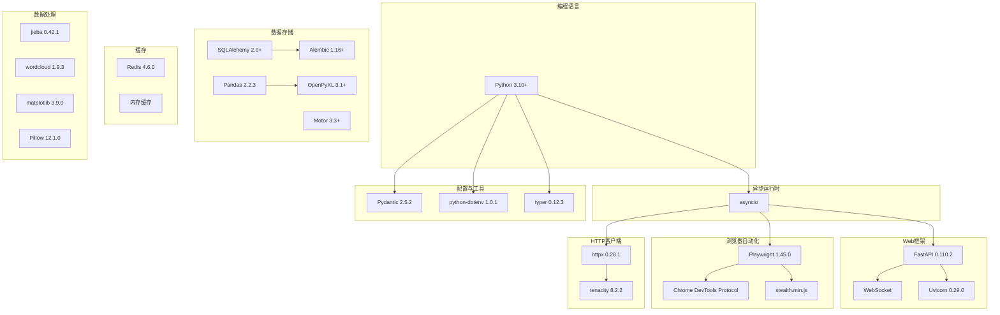
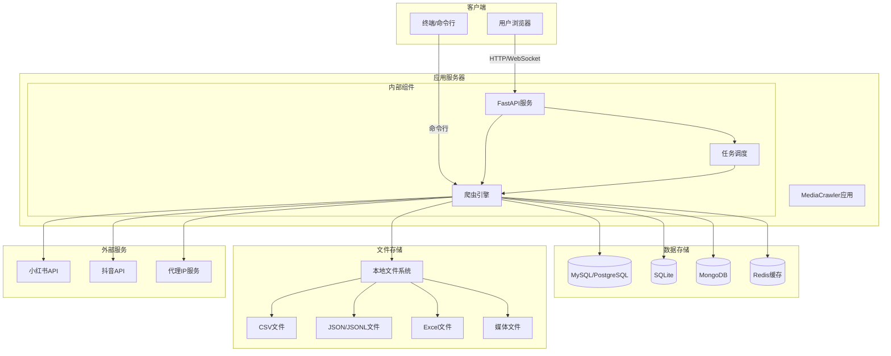
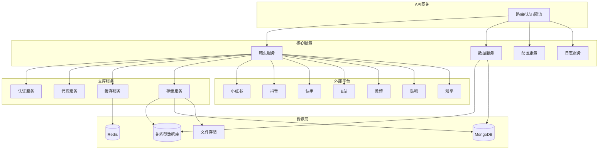
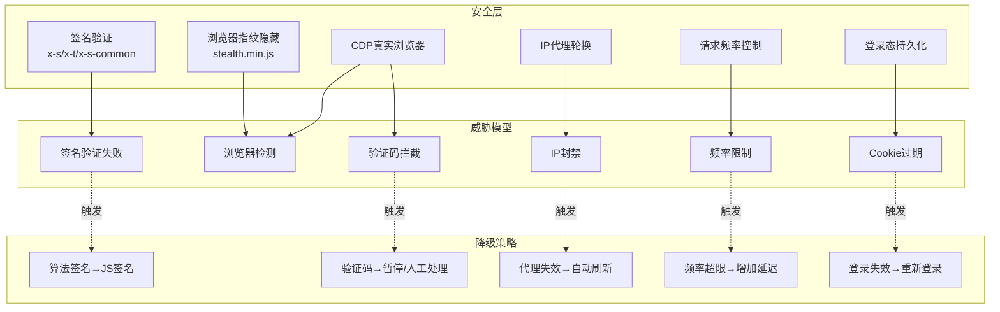
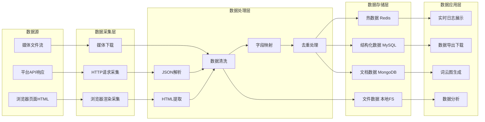
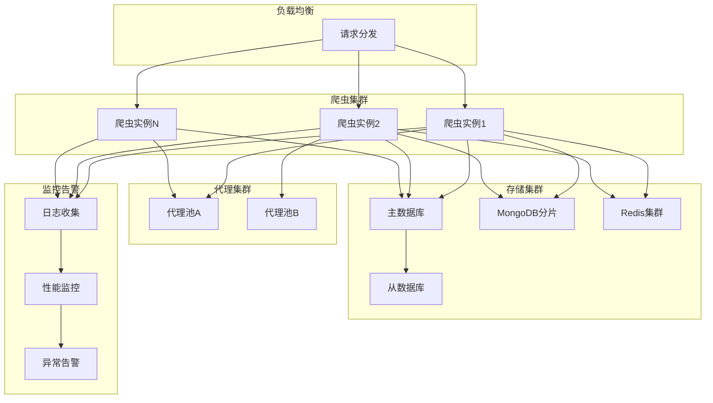

# MediaCrawler 系统架构图 (System Architecture Diagram)

## 1. 整体系统架构图

### 图表解释

#### 1. 整体概述

这张图展示了 MediaCrawler 系统的完整拓扑结构，采用分层架构将系统划分为六个纵向层次：用户层、接入层、核心层、能力层、数据层和基础设施层，外加外部依赖。各层之间通过明确的接口进行通信，上层依赖下层提供的服务，形成自顶向下的调用链。

#### 2. 关键元素说明

用户层包含 CLI 和 WebUI 两种交互入口，分别面向脚本化操作和可视化操作场景。接入层提供请求解析和路由分发能力，其中 FastAPI 服务器负责 HTTP/WebSocket 请求处理，命令行解析器负责 CLI 参数解析。核心层通过 CrawlerFactory 实现平台爬虫的实例化，目前支持小红书、抖音、快手、B站、微博、贴吧、知乎七个平台。能力层提供爬虫运行所需的通用能力模块：浏览器引擎负责页面渲染和动态内容抓取，签名引擎负责生成平台要求的请求签名，代理池负责 IP 轮换，登录模块负责身份认证。数据层通过 AbstractStore 抽象接口屏蔽底层存储差异，支持 CSV、JSON/JSONL、关系型数据库、MongoDB 和 Excel 五种存储格式。基础设施层提供缓存、配置、日志和工具函数等横切关注点支持。

#### 3. 关键流程/关系说明

请求从用户层进入后，由接入层进行协议转换和参数解析，随后通过路由分发至 CrawlerFactory。工厂根据目标平台类型创建对应的爬虫实例，爬虫实例运行时按需调用能力层的服务：先通过登录模块获取有效凭证，再通过代理池获取可用 IP，然后通过签名引擎生成合法请求签名，最后通过浏览器引擎或 HTTP 客户端向目标平台发起请求。获取的数据经存储抽象层写入具体存储后端。整个流程中，配置管理和日志系统贯穿始终，为各层提供运行时支撑。

#### 4. 关键技术解释

CrawlerFactory 采用工厂模式实现平台扩展，新增平台只需实现统一的爬虫接口并在工厂中注册即可。存储层采用策略模式，AbstractStore 定义标准 CRUD 接口，各存储后端分别实现该接口，调用方无需关心具体存储类型。能力层的浏览器引擎基于 Playwright 和 Chrome DevTools Protocol 实现，支持 Headless 和 Headful 两种模式，配合 stealth.min.js 进行浏览器指纹伪装。签名引擎针对不同平台的反爬机制实现了对应的签名算法，如小红书的 x-s/x-t 签名和抖音的 x-bogus 签名。

#### 5. 设计意图

分层架构的核心目的是隔离变化。用户层的变化（如新增 GUI 客户端）不会影响下层逻辑；核心层的平台扩展（如新增爬虫）不会影响接入层和数据层；存储后端的替换（如从 SQLite 迁移到 PostgreSQL）不会影响业务逻辑。能力层的独立抽离使得浏览器自动化、代理轮换、签名计算等复杂逻辑可以被多个平台复用，避免重复实现。外部依赖的显式标注则明确了系统的边界，便于运维时进行依赖管理和故障定位。

## 2. 分层架构图

### 图表解释

#### 1. 整体概述

这张图从软件工程的分层视角重新审视系统，采用经典的五层架构模式：表示层、应用层、业务逻辑层、领域层和基础设施层。与第一幅图的整体架构视角不同，这张图更强调代码的组织结构和依赖方向——上层可以调用下层，但下层不能反向依赖上层，形成严格的单向依赖关系。

#### 2. 关键元素说明

表示层负责与用户交互，包含 CLI 终端界面、React 构建的 WebUI 前端、FastAPI 提供的 RESTful API 以及 WebSocket 实时数据通道。应用层是系统的编排中心，CrawlerManager 负责爬虫进程的生命周期管理，任务调度器负责任务的排队和分发，配置加载器和日志收集器分别负责系统配置和运行时日志的集中处理。业务逻辑层定义了系统的契约接口：AbstractCrawler 规定爬虫必须实现的方法集，AbstractLogin 抽象不同平台的登录流程，AbstractApiClient 封装 HTTP 请求的标准行为，AbstractStore 统一数据持久化接口。领域层是业务逻辑的具体实现，包含各平台爬虫、客户端、登录器和存储实现。基础设施层提供技术能力支撑，包括浏览器自动化、HTTP 通信、签名计算、数据库访问、缓存操作等底层实现。

#### 3. 关键流程/关系说明

表示层的 WebUI 前端通过 REST 接口与应用层通信，CLI 直接调用配置加载器初始化环境。应用层的 CrawlerManager 根据调度器的任务分配，调用业务逻辑层的 AbstractCrawler 接口启动爬取。业务逻辑层通过多态机制将调用路由到领域层的具体实现：AbstractCrawler 映射到 XiaoHongShuCrawler 或 DouYinCrawler，AbstractApiClient 映射到 XiaoHongShuClient，AbstractStore 映射到 XhsCsvStoreImplement 或 XhsDbStoreImplement。领域层的实现类直接操作基础设施层的技术组件完成实际工作。WebSocket 通道则绕过应用层，直接将日志收集器的数据流推送到前端。

#### 4. 关键技术解释

业务逻辑层大量使用了抽象基类（Abstract Base Class）和多态机制。以 AbstractCrawler 为例，它定义了 `search`、`get_note_detail`、`create_sign` 等抽象方法，各平台爬虫必须实现这些方法。这种设计使得应用层的 CrawlerManager 可以统一调度不同平台的爬虫，而无需关心平台差异。依赖注入体现在领域层对基础设施的使用上：XiaoHongShuClient 并不直接实例化 httpx 客户端，而是通过构造函数接收已配置好的客户端实例，便于测试时替换为 Mock 对象。SQLAlchemy 作为 ORM 工具，将领域对象与数据库表进行映射，使得 XhsDbStoreImplement 可以面向对象操作数据库，而非直接编写 SQL。

#### 5. 设计意图

分层架构的首要目标是控制复杂度。通过将系统拆分为五个层次，每一层只需关注本层的职责，降低了认知负担。严格的单向依赖规则（上层依赖下层，下层不依赖上层）保证了系统的可测试性：可以单独测试领域层的业务逻辑，无需启动完整系统；可以为 AbstractStore 编写 Mock 实现，在隔离数据库的情况下测试爬虫逻辑。另一个重要目标是可替换性：当需要更换前端框架时，只需修改表示层；当需要支持新的存储后端时，只需在领域层新增一个 AbstractStore 的实现类，无需改动其他层次。这种架构模式遵循了依赖倒置原则（DIP）和开闭原则（OCP）。

## 3. 技术栈架构图

### 图表解释

#### 1. 整体概述

这张图展示了系统所依赖的全部第三方技术组件及其版本信息，按照功能领域进行分组。Python 3.10+ 作为基础运行时，asyncio 提供异步编程支持，在此之上构建了 Web 服务、浏览器自动化、HTTP 通信、数据存储、缓存、数据处理和配置管理等七大技术领域。箭头表示组件间的依赖关系，如 FastAPI 依赖 Uvicorn 作为 ASGI 服务器，Playwright 依赖 CDP 与浏览器通信。

#### 2. 关键元素说明

Python 3.10+ 是系统的编程语言基座，选择 3.10 版本是为了使用结构化模式匹配（match-case）和更完善的类型提示支持。asyncio 是 Python 标准库中的异步 I/O 框架，提供事件循环、协程和任务调度能力。Web 框架组中，FastAPI 是基于 Starlette 和 Pydantic 的现代 Web 框架，支持自动数据验证和 OpenAPI 文档生成；Uvicorn 是 ASGI 服务器，负责运行 FastAPI 应用；WebSocket 提供全双工通信通道。浏览器自动化组中，Playwright 是微软开源的浏览器自动化库，支持 Chromium、Firefox 和 WebKit；CDP 是 Chrome 浏览器的远程调试协议；stealth.min.js 是用于隐藏自动化特征的脚本。HTTP 客户端组中，httpx 同时支持同步和异步 HTTP 请求，tenacity 提供重试策略装饰器。数据存储组中，SQLAlchemy 2.0 是 Python 最流行的 ORM 工具，Alembic 是 SQLAlchemy 的数据库迁移工具，Motor 是 MongoDB 的异步 Python 驱动，Pandas 是数据分析库，OpenPyXL 负责 Excel 文件读写。缓存组包含 Redis 客户端和内存缓存两种实现。数据处理组提供中文分词、词云生成、数据可视化和图像处理能力。配置与工具组中，Pydantic 负责数据模型验证，python-dotenv 负责环境变量加载，Typer 负责构建类型安全的 CLI 接口。

#### 3. 关键流程/关系说明

asyncio 位于依赖关系的核心位置，FastAPI、Playwright 和 httpx 都构建在异步运行时之上。这意味着系统的 I/O 操作（网络请求、数据库查询、文件读写）全部采用非阻塞方式执行，单个线程可以同时处理多个并发任务。FastAPI 应用由 Uvicorn 启动，Uvicorn 内部使用 uvloop（libuv 的事件循环实现）替代 Python 默认的 asyncio 事件循环，提升并发性能。Playwright 通过 CDP 与本地或远程的 Chromium 实例通信，发送浏览器控制指令并接收页面事件。httpx 在发送请求时，若遇到网络超时或 HTTP 5xx 错误，由 tenacity 根据配置的重试策略自动重试。SQLAlchemy 的模型定义使用 Pydantic 进行数据校验，Alembic 通过读取 SQLAlchemy 的元数据生成数据库迁移脚本。

#### 4. 关键技术解释

asyncio 的核心机制是事件循环和协程。协程（coroutine）是一种可以暂停和恢复执行的函数，通过 `async` 和 `await` 关键字定义。当协程遇到 I/O 操作时（如 `await httpx.get()`），它会将控制权交还给事件循环，事件循环转而执行其他就绪的协程，从而避免线程阻塞。这与多线程并发不同：多线程依赖操作系统的线程调度，存在 GIL（全局解释器锁）限制和上下文切换开销；而 asyncio 在单线程内通过事件循环实现并发，更适合 I/O 密集型场景。FastAPI 充分利用了 asyncio 的特性，其路由处理函数可以是异步的，请求处理过程中发生的所有 I/O 操作都不会阻塞服务器线程，因此 Uvicorn 只需少量工作线程即可处理大量并发连接。

#### 5. 设计意图

技术栈的选择遵循了"Python 原生优先、异步优先、类型安全"的原则。所有核心依赖都是 Python 生态中成熟且活跃维护的库，降低了学习和运维成本。异步优先的策略使得系统在 I/O 密集型场景（同时与多个平台 API 通信、同时操作多个浏览器实例）下具有更高的吞吐量和更低的资源消耗。Pydantic 的引入使得配置、请求参数和响应数据都有明确的类型约束，在开发阶段就能捕获类型错误，同时自动生成 API 文档。版本号的明确标注（如 FastAPI 0.110.2）确保了构建的可复现性，避免因依赖升级导致的兼容性问题。技术栈的分组方式也反映了系统的模块化设计——每个功能领域可以独立升级或替换，如将 httpx 替换为 aiohttp 不会影响数据存储层的实现。

## 4. 部署架构图

### 图表解释

#### 1. 整体概述

这张图描述了系统在生产环境中的物理部署拓扑，展示了客户端、应用服务器、数据存储、文件存储和外部服务五类节点之间的网络通信关系。与前面的逻辑架构图不同，这张图关注的是组件运行在哪个进程、哪台机器上，以及它们之间使用什么协议通信。

#### 2. 关键元素说明

客户端包含两类用户入口：浏览器通过 HTTP/WebSocket 协议与应用服务器交互，终端通过命令行直接调用爬虫引擎。应用服务器是系统的运行载体，内部包含三个紧密耦合的组件：FastAPI 服务对外暴露 REST API 和 WebSocket 端点，爬虫引擎执行实际的爬取任务，任务调度器负责任务的排队、优先级管理和执行监控。数据存储包含四种数据库系统：MySQL/PostgreSQL 用于结构化业务数据，SQLite 用于轻量级本地部署，MongoDB 用于存储非结构化的爬取原始数据，Redis 用于缓存和分布式锁。文件存储通过本地文件系统实现，支持 CSV、JSON/JSONL、Excel 和媒体文件四种格式。外部服务是系统依赖的第三方资源，包括目标平台的 API 和代理 IP 供应商。

#### 3. 关键流程/关系说明

浏览器用户的请求通过 HTTP 协议到达 FastAPI 服务，FastAPI 将请求转发给爬虫引擎，同时通知任务调度器记录任务状态。调度器维护一个任务队列，根据优先级和并发限制向爬虫引擎分发任务。爬虫引擎执行过程中，通过代理 IP 服务获取可用代理，然后向小红书或抖音的 API 发起请求。获取的数据根据配置写入不同的存储后端：结构化数据写入关系型数据库，原始 JSON 响应写入 MongoDB，临时状态写入 Redis，文件类数据写入本地文件系统。命令行用户则绕过 FastAPI 和调度器，直接与爬虫引擎交互，适合单次执行或调试场景。

#### 4. 关键技术解释

FastAPI 服务与爬虫引擎的通信发生在同一进程内，通过 Python 的函数调用实现，而非网络 RPC。这种设计降低了部署复杂度，单台服务器即可运行完整系统，但也意味着爬虫引擎的 CPU 密集型任务（如浏览器渲染）会占用 FastAPI 的事件循环线程，可能影响 API 响应延迟。任务调度器与爬虫引擎的交互通过内存队列或 Redis 队列实现，支持任务的异步执行和状态回调。数据存储的多后端设计允许用户根据数据特性选择最合适的存储方案：关系型数据库适合需要复杂查询的结构化数据，MongoDB 适合 schema 灵活的原始爬取数据，Redis 适合高频读写的临时状态，文件系统适合大容量的媒体资源。

#### 5. 设计意图

部署架构采用单体应用模式，所有核心组件运行在同一进程中，目的是降低运维门槛，使个人用户和小团队能够快速部署和运行。客户端的双入口设计（浏览器 + 命令行）兼顾了不同用户群体的使用习惯：非技术用户可以通过 WebUI 进行操作，开发者可以通过 CLI 进行批量任务和自动化集成。存储层的多后端支持是为了适应不同的使用场景——个人用户可能只需要 SQLite 和本地文件，而企业用户可能需要 MySQL 集群和 MongoDB 分片。外部服务的依赖关系被显式标注，便于运维人员进行网络策略配置（如防火墙白名单）和故障排查（如代理服务不可用时的降级处理）。

## 5. 微服务视角架构图

### 图表解释

#### 1. 整体概述

这张图将系统重新建模为微服务架构，展示了如果将当前单体应用拆分为独立服务后的拓扑结构。图中包含 API 网关、四个核心服务、四个支撑服务、七个外部平台依赖和四类数据存储。服务之间通过网络调用通信，每个服务拥有独立的数据存储和部署单元。

#### 2. 关键元素说明

API 网关是系统的统一入口，承担路由转发、身份认证、请求限流和负载均衡等职责。核心服务包含：爬虫服务（CrawlerService）负责执行爬取任务，是系统的计算密集型组件；数据服务（DataService）负责数据的查询、统计和导出，对外提供数据接口；配置服务（ConfigService）集中管理各服务的配置项，支持动态配置更新；日志服务（LogService）负责日志的收集、存储和检索。支撑服务为核心服务提供通用能力：认证服务（AuthService）管理用户身份和平台登录态；代理服务（ProxyService）维护代理 IP 池，提供 IP 的获取、检测和回收；缓存服务（CacheService）封装 Redis 操作，提供分布式缓存和锁；存储服务（StorageService）统一封装数据库和文件系统的访问。外部平台是爬虫服务需要对接的七个内容平台。数据层包含关系型数据库、MongoDB、Redis 和文件存储四类存储介质。

#### 3. 关键流程/关系说明

所有外部请求首先经过 API 网关，网关根据请求路径将流量路由到对应的核心服务。爬虫服务接收到爬取请求后，依次调用支撑服务获取必要资源：从认证服务获取平台登录凭证，从代理服务获取可用代理 IP，从缓存服务查询任务状态或去重集合，最后将爬取结果交给存储服务持久化。数据服务独立运行，直接从关系型数据库和 MongoDB 读取数据，为前端提供数据查询和导出接口，不依赖爬虫服务的内部状态。配置服务和日志服务作为横切关注点，被所有核心服务间接依赖。这种架构下，爬虫服务可以独立水平扩展，增加实例数量以提升并发爬取能力，而数据服务可以根据查询负载单独扩容。

#### 4. 关键技术解释

微服务架构与单体架构的核心区别在于服务边界的划分和通信方式。在微服务模式下，爬虫服务、数据服务等组件运行在不同的进程甚至不同的物理机上，通过 HTTP/gRPC 或消息队列进行通信。API 网关通常采用反向代理实现（如 Nginx、Kong 或 Envoy），支持基于路径的路由、JWT 认证、速率限制（Rate Limiting）和熔断降级。服务之间的调用需要考虑分布式系统的典型问题：网络分区、服务雪崩、数据一致性。例如，爬虫服务调用代理服务时，若代理服务响应缓慢，可能导致爬虫服务的线程池耗尽，因此需要引入超时设置和熔断机制（如 Hystrix 或 Sentinel 模式）。数据存储的拆分遵循"每个服务拥有自己的数据库"原则，避免服务之间直接共享数据库表，确保服务间的松耦合。

#### 5. 设计意图

这张图并非当前系统的实际部署方式，而是展示了一种可能的演进方向。当前系统采用单体架构，所有组件运行在同一进程中，适合小规模部署和快速迭代。当业务规模扩大、团队人员增加时，单体架构会面临代码耦合度高、部署风险大、技术栈锁定等问题。微服务架构通过将系统拆分为独立部署的服务单元，使得每个服务可以由独立团队维护、使用最适合的技术栈、独立进行扩缩容。爬虫服务作为计算密集型组件，可以部署在 CPU 优化的机器上；数据服务作为 I/O 密集型组件，可以部署在内存优化的机器上；存储服务可以对接企业级的分布式存储系统。这种架构演进需要付出额外的运维复杂度（服务发现、链路追踪、分布式事务等），因此需要在团队规模、业务复杂度和运维能力之间进行权衡。

## 6. 安全架构图

### 图表解释

#### 1. 整体概述

这张图从安全工程的角度分析了系统的反反爬机制，采用威胁建模的框架进行组织。图中包含三个层次：安全层（防御措施）、威胁模型（平台施加的限制手段）和降级策略（防御失效后的应对方案）。实线箭头表示防御措施与威胁之间的对抗关系，虚线箭头表示威胁触发后的降级处理流程。

#### 2. 关键元素说明

安全层包含六项主动防御措施。签名验证通过生成平台要求的请求签名（如小红书的 x-s、x-t、x-s-common 参数）使请求通过服务器的合法性校验。浏览器指纹隐藏通过 stealth.min.js 脚本修改 Navigator、WebGL、Canvas 等浏览器特征，使自动化浏览器在指纹检测中呈现与真实用户浏览器一致的画像。CDP 真实浏览器使用完整的 Chromium 内核而非轻量级 HTTP 客户端，能够执行 JavaScript、处理 Cookie、响应用户交互事件，从而通过基于行为分析的机器人检测。IP 代理轮换通过代理池维护大量出口 IP，每次请求或定期切换源 IP 地址，避免单一 IP 因请求量过大被封禁。请求频率控制通过令牌桶或固定间隔算法限制单位时间内的请求数量，使请求模式更接近人类用户的浏览节奏。登录态持久化通过保存和复用 Cookie、LocalStorage 等凭证信息，减少频繁登录触发的人机验证。

威胁模型包含平台常用的六项反爬手段。IP 封禁通过统计单个 IP 的请求频率或行为特征，将异常 IP 加入黑名单。浏览器检测通过分析 User-Agent、WebDriver 标志、插件列表、屏幕分辨率等特征识别自动化工具。签名验证失败指服务器端对请求参数进行签名计算，与客户端提交的签名比对，不一致则拒绝服务。频率限制通过接口级别的 QPS（Queries Per Second）限制，对超频请求返回 429 状态码。验证码拦截在检测到异常行为时，返回图形验证码、滑块验证或点击验证，阻断自动化流程。Cookie 过期指登录凭证具有时效性，过期后需要重新认证。

降级策略包含五项应急响应措施，当主动防御失效时触发。

#### 3. 关键流程/关系说明

安全层的每项措施针对特定的威胁：签名验证直接对抗签名验证失败威胁；浏览器指纹隐藏和 CDP 真实浏览器共同对抗浏览器检测；IP 代理轮换对抗 IP 封禁；请求频率控制对抗频率限制；登录态持久化对抗 Cookie 过期。当某项防御措施失效时，对应的威胁被触发，系统执行预设的降级策略：签名算法被识别时，从纯算法签名降级为在真实浏览器中执行平台 JavaScript 生成签名；代理 IP 被封禁时，自动从代理池剔除失效 IP 并补充新 IP；登录态过期时，触发重新登录流程，支持二维码、短信和 Cookie 导入三种方式；请求频率触发平台限制时，动态增加请求间隔；遇到验证码时，暂停当前任务并通知人工处理。整个流程形成"防御-检测-降级"的闭环。

#### 4. 关键技术解释

签名验证是反反爬的核心技术之一。平台通常使用 JavaScript 在客户端对请求参数进行加密或哈希计算，生成签名值附加到请求头或查询参数中。服务器端使用相同的算法验证签名，确保请求来自合法客户端而非伪造。系统的签名引擎通过两种途径生成签名：一是逆向分析平台 JavaScript，提取签名算法并在 Python 中复现；二是在 Playwright 控制的浏览器中直接执行平台原始 JavaScript，获取签名结果。前者性能更高但维护成本高（平台更新算法后需要重新逆向），后者更稳定但性能开销大。浏览器指纹隐藏的技术原理是覆盖或修改浏览器暴露的 API，例如删除 `navigator.webdriver` 属性、修改 `navigator.plugins` 和 `navigator.languages`、为 Canvas 和 WebGL 添加随机噪声等，使得指纹检测工具（如 FingerprintJS）无法区分自动化浏览器与真实浏览器。

#### 5. 设计意图

安全架构的设计目标是最大化爬取任务的完成率，同时最小化被平台识别和封禁的风险。单一防御手段往往不足以应对平台的复合检测策略，因此系统采用了多层防御的纵深防御（Defense in Depth）策略：即使某一层被突破，还有其他层可以继续提供保护。降级策略的引入体现了工程上的务实态度——在对抗性环境中，不存在绝对可靠的防御，关键在于防御失效后系统能否快速恢复并继续工作。请求频率控制和登录态持久化不仅是安全手段，也是资源优化手段：合理的频率控制避免对目标平台造成过大压力，降低法律风险；登录态复用减少了重复的认证交互，提升了爬取效率。整个安全架构需要在隐蔽性、稳定性和效率之间持续权衡，根据目标平台的反爬强度动态调整策略参数。

## 7. 数据架构图

### 图表解释

#### 1. 整体概述

这张图展示了系统内部的数据流转 pipeline，采用经典的数据处理分层模型：数据源、数据采集层、数据处理层、数据存储层和数据应用层。数据从左向右流动，经过采集、处理、存储三个核心阶段，最终服务于上层应用。这种架构与 ETL（Extract-Transform-Load）流程一致，但增加了实时应用层。

#### 2. 关键元素说明

数据源包含三类原始数据：平台 API 响应通常是 JSON 格式的结构化数据，包含笔记/视频的元信息、用户信息和交互数据；浏览器页面 HTML 是平台服务端渲染的完整网页，包含动态加载的内容和嵌入的 JavaScript 数据；媒体文件流是图片、视频等二进制资源，通过独立的 URL 下载。数据采集层对应三种采集方式：HTTP 请求采集直接调用平台 API 获取 JSON 数据；浏览器渲染采集通过 Playwright 加载页面并执行 JavaScript，获取渲染后的 DOM 和页面状态；媒体下载通过 HTTP  Range 请求或流式下载获取二进制文件。数据处理层包含五个处理环节：JSON 解析将 API 响应反序列化为 Python 对象；HTML 提取通过 CSS Selector 或 XPath 从 DOM 中提取目标字段；数据清洗去除无效值、处理编码问题和格式标准化；字段映射将不同平台的字段名称统一为系统内部的标准 schema；去重处理通过布隆过滤器或哈希集合识别并剔除重复内容。数据存储层根据数据特性和访问模式选择存储介质：Redis 存放热数据和临时状态，MySQL 存放结构化业务数据，MongoDB 存放原始文档数据，本地文件系统存放媒体文件。数据应用层提供四类消费场景：实时日志展示通过 WebSocket 推送任务进度，数据导出支持 CSV/Excel/JSON 格式下载，词云图生成基于分词和频率统计进行可视化，数据分析支持聚合查询和趋势统计。

#### 3. 关键流程/关系说明

数据流起始于数据源，根据数据类型进入对应的采集通道。API 响应由 HTTP 请求采集模块获取后进入 JSON 解析环节，HTML 页面由浏览器渲染采集后进入 HTML 提取环节，媒体文件流直接进入数据清洗环节（主要进行格式校验和元信息提取）。解析和提取后的数据汇入数据清洗环节，进行统一的脏数据处理。清洗后的数据进入字段映射环节，将平台特定的字段名（如小红书的 `note_id`、抖音的 `aweme_id`）映射为系统统一的标准字段（如 `content_id`）。映射后的数据经过去重处理，通过内容哈希或业务主键判断是否已经存在。去重后的数据根据用途分流到不同的存储后端：需要快速访问的状态数据写入 Redis，结构化的内容元数据写入 MySQL，原始的完整响应写入 MongoDB，媒体文件写入本地文件系统。存储层的数据最终被数据应用层消费，各应用根据需求从对应的存储后端读取数据。

#### 4. 关键技术解释

数据处理层的去重处理采用了多级去重策略。第一级是内存去重，使用 Python 的 `set` 数据结构在单次任务内去重，时间复杂度为 O(1)。第二级是 Redis 去重，使用 Redis 的 `SET` 或 `HyperLogLog` 数据结构在分布式环境下进行跨任务去重，利用 Redis 的单线程特性保证原子性。第三级是数据库去重，通过唯一索引（Unique Index）在持久化层防止重复写入。字段映射环节使用配置驱动的 schema 定义，通过 YAML 或 JSON 文件描述各平台字段与标准字段的映射关系，新增平台时只需添加映射配置而无需修改代码。数据清洗环节处理的问题包括：空值填充（使用默认值或标记值）、编码转换（统一为 UTF-8）、类型转换（字符串转数值、时间戳转日期对象）、HTML 标签去除（使用 BeautifulSoup 或正则表达式）。媒体下载支持断点续传，通过 HTTP Range 请求头实现大文件的分段下载，避免网络中断导致的全量重传。

#### 5. 设计意图

数据架构采用分层 pipeline 的设计，核心目标是解耦数据的生产和消费。采集层只负责获取原始数据，不关心数据如何使用；处理层只负责数据转换，不关心数据来源和存储细节；存储层只负责持久化，不关心数据处理逻辑；应用层只负责数据消费，不关心数据如何产生。这种解耦使得各层可以独立演进：新增一个平台只需要在采集层增加一个采集器，在字段映射中增加一组配置；新增一种数据应用只需要在存储层增加读取逻辑，不影响采集和处理流程。多存储后端的设计遵循"polyglot persistence"（多语言持久化）原则，根据数据的访问模式选择最适合的存储技术，而非强行将所有数据塞进同一种数据库。数据流的单向性（从左到右，不反向流动）保证了数据的一致性和可追溯性，每个阶段的数据都可以被审计和回放。

## 8. 高可用架构图

### 图表解释

#### 1. 整体概述

这张图展示了系统在高并发、高可靠性要求下的部署拓扑，采用集群化设计消除单点故障。图中包含负载均衡、爬虫集群、代理集群、存储集群和监控告警五个子系统。每个子系统都包含多个冗余节点，通过负载分发、数据复制和故障检测机制保证服务的持续可用。

#### 2. 关键元素说明

负载均衡器（LB）是系统的流量入口，负责将外部请求均匀分发到后端爬虫实例。爬虫集群由多个同构的爬虫实例组成（C1、C2、...、CN），每个实例独立运行，具备相同的业务能力。代理集群包含多个代理池（P1、P2），每个代理池维护一组独立的出口 IP，爬虫实例可以从不同代理池获取 IP。存储集群采用分层冗余设计：主数据库（S1）负责写操作，从数据库（S2）通过主从复制同步数据，负责读操作和故障切换；MongoDB 分片集群（S3）将数据分散到多个分片节点，支持水平扩展；Redis 集群（S4）通过数据分片和主从复制提供高可用的缓存服务。监控告警子系统包含三个组件：日志收集器（M1）汇聚所有爬虫实例的运行日志，性能监控（M2）分析系统指标（CPU、内存、网络、请求延迟），异常告警（M3）在检测到异常时触发通知。

#### 3. 关键流程/关系说明

外部请求首先到达负载均衡器，LB 根据轮询、加权或最少连接等算法将请求分发到某个爬虫实例。爬虫实例处理请求时，向代理集群获取可用 IP，不同实例可以从不同代理池获取 IP，实现代理资源的隔离和冗余。爬虫实例产生的数据写入存储集群：结构化数据写入主数据库，主数据库异步复制到从数据库；文档数据写入 MongoDB 分片集群，由 mongos 路由层根据分片键将数据分布到对应分片；缓存数据写入 Redis 集群，由客户端根据一致性哈希算法选择目标节点。所有爬虫实例的运行日志实时发送到日志收集器，日志收集器将日志流转发给性能监控组件进行指标计算，性能监控组件在检测到异常指标（如错误率突增、响应时间超时）时触发异常告警，通知运维人员介入。当某个爬虫实例故障时，LB 将其从服务列表中摘除，流量自动路由到其他健康实例；当主数据库故障时，从数据库提升为主库，继续提供读写服务。

#### 4. 关键技术解释

负载均衡可以采用硬件负载均衡器（如 F5）或软件负载均衡器（如 Nginx、HAProxy）。在爬虫场景中，负载均衡不仅分发外部请求，还需要考虑任务亲和性——某些任务可能需要绑定到特定实例（如该实例已登录某平台账号）。主从数据库复制采用异步复制模式，主库写入 binlog，从库通过 I/O 线程读取 binlog 并写入 relay log，再由 SQL 线程重放。异步复制的优点是主库性能不受影响，缺点是存在复制延迟，故障切换时可能丢失少量数据。MongoDB 分片集群由三个角色组成：mongos（查询路由器）、config server（配置服务器，存储分片元数据）和 shard（数据分片节点）。分片键的选择直接影响数据分布和查询性能，通常选择 Cardinality 高且查询频繁的字段（如用户 ID 或时间戳）。Redis 集群采用无中心架构，每个节点维护集群的完整拓扑信息，客户端可以连接任意节点，由节点返回重定向信息（MOVED/ASK）引导客户端访问正确的数据节点。

#### 5. 设计意图

高可用架构的设计目标是消除单点故障（Single Point of Failure, SPOF）并支持水平扩展。爬虫集群的多实例设计使得系统可以通过增加实例数量线性提升并发处理能力，同时单个实例的故障不会影响整体服务。代理集群的多池设计实现了代理资源的故障隔离，即使某个代理供应商的服务全部不可用，系统仍可使用其他代理池继续工作。存储集群的多层冗余保证了数据的持久性和可恢复性：主从复制提供数据库级别的高可用，MongoDB 分片提供文档存储的水平扩展，Redis 集群提供缓存层的故障转移。监控告警子系统实现了可观测性（Observability），通过日志、指标和告警三个维度实时掌握系统健康状态，为故障定位和容量规划提供数据支撑。整个架构遵循"冗余+自动故障转移"的设计原则，在部分组件失效的情况下，系统仍能降级提供服务，而非完全不可用。
