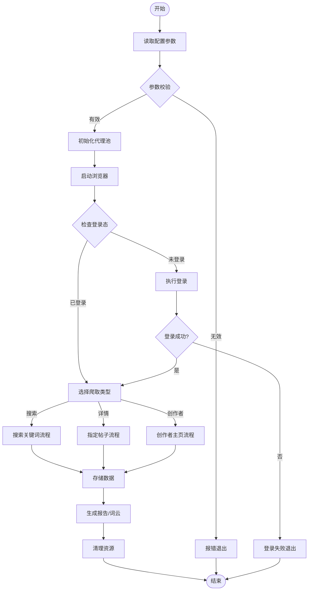
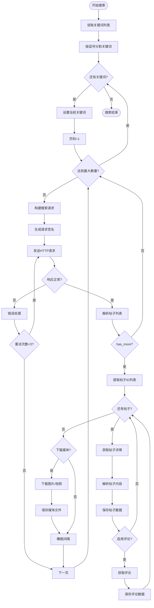
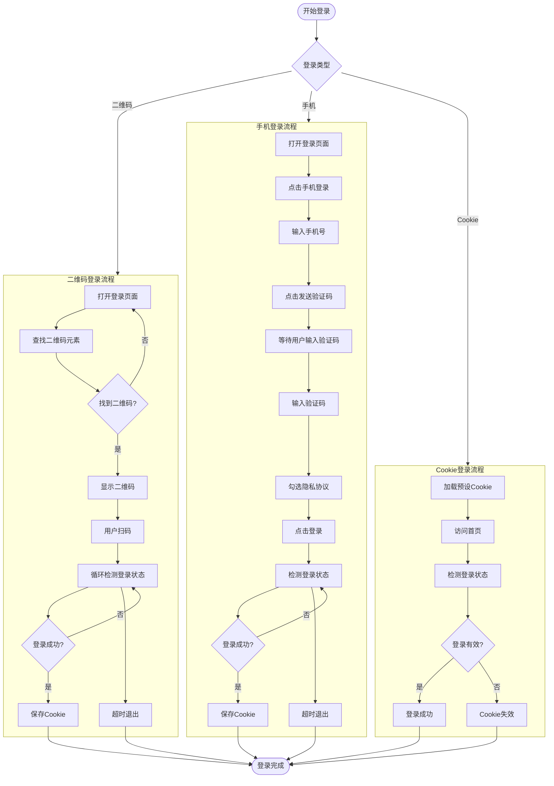
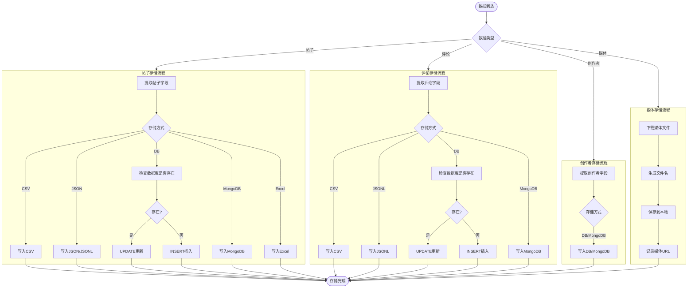
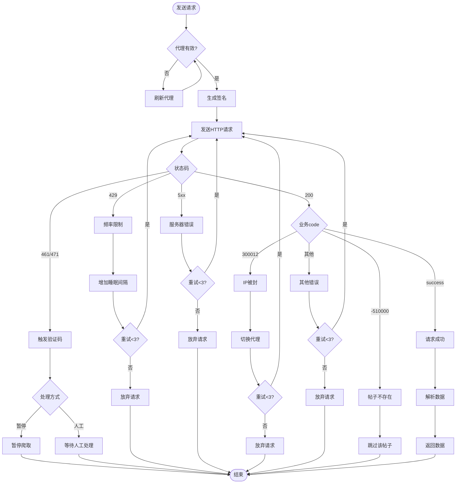
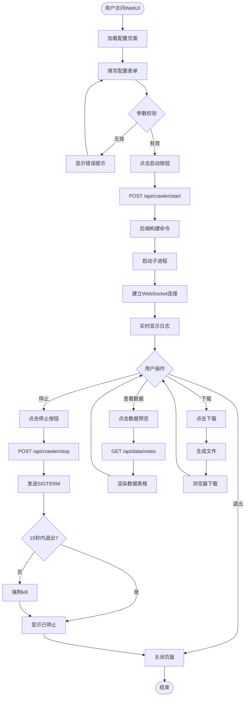
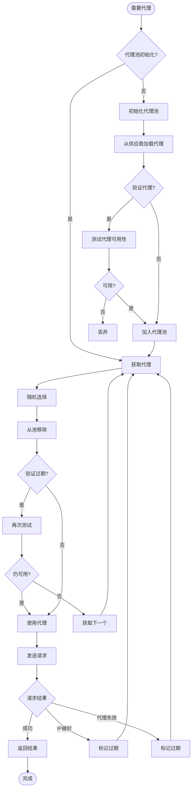
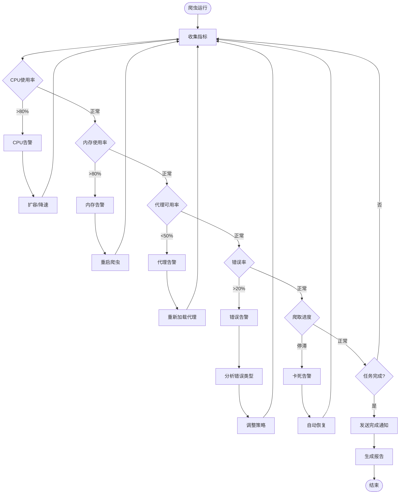

# MediaCrawler 业务流程图 (Business Process Diagram)

## 1. 整体业务流程图

### 图表解释

#### 1. 整体概述
- 该图呈现 MediaCrawler 从启动到终止的完整生命周期，覆盖配置读取、环境准备、身份认证、任务路由、数据持久化、报告生成与资源回收六个阶段
- 流程采用线性主干串联关键阶段，三种爬取模式（搜索、详情、创作者）作为互斥分支汇入统一存储节点，体现业务收敛
- 在参数校验与登录态检查两处设置错误旁路，异常时直接终止，避免无效执行消耗资源

#### 2. 关键元素说明
- **配置参数**：运行时注入的变量集合，包含目标平台、爬取类型、关键词、并发度、存储后端等，决定后续流程走向
- **代理池**：维护可用代理 IP 的队列结构，通过轮换请求源 IP 降低单点被封概率
- **浏览器实例**：由 Playwright/Selenium 驱动的 headless 浏览器进程，负责 JavaScript 渲染与 DOM 操作
- **登录态**：基于 Cookie 或 localStorage 的会话凭证，用于判断当前上下文是否具备访问权限
- **爬取类型**：搜索模式按关键词检索；详情模式抓取指定帖子；创作者模式遍历用户主页

#### 3. 关键流程/关系说明
1. 读取配置后首先执行参数校验，非法配置触发错误旁路直接结束
2. 校验通过后依次初始化代理池、启动浏览器、检测登录态
3. 未登录时执行认证流程，登录失败同样走错误旁路结束
4. 认证通过后进入爬取类型选择，三种模式互斥执行
5. 各模式采集的数据统一汇入存储节点，随后生成报告、清理资源、结束流程

#### 4. 关键技术解释
- **Fail-fast 校验**：在流程入口尽早验证配置 schema，非法输入立即终止，防止错误状态传播到下游阶段
- **代理池初始化**：通过异步 IO 并发检测多个代理的连通性，减少启动阻塞时间
- **浏览器上下文隔离**：每个爬虫实例使用独立的 BrowserContext，Cookie、缓存、LocalStorage 相互隔离，避免状态污染
- **登录态探测**：访问需鉴权的接口或探测页面上的用户标识元素，判断会话有效性，减少不必要的重复认证

#### 5. 设计意图
- **为什么要这样设计**：将爬虫生命周期显式阶段化，使每个步骤的职责单一且可观测，便于调试与维护
- **解决了什么痛点**：避免了配置错误导致的无效启动和资源泄漏，统一存储接口消除了多模式下的重复代码
- **带来了什么好处**：阶段清晰、异常可控、资源回收有保障，三种模式共享后续逻辑降低了维护成本
- **如果不这样会怎样**：缺少前置校验会导致非法配置进入执行阶段引发连锁故障；无资源清理会造成浏览器进程和数据库连接泄漏；模式间不共享存储逻辑会产生大量重复代码

## 2. 搜索关键词业务流程

### 图表解释

#### 1. 整体概述
- 该图展示基于关键词的搜索爬取流程，采用外层关键词循环与内层分页循环的双层嵌套结构
- 每个分页获取帖子列表后，逐条提取帖子 ID 并进入详情解析，同时支持评论抓取与媒体下载两个可选分支
- 流程中嵌入请求签名、错误重试、数量上限控制和请求间隔机制，形成完整的批量数据采集闭环

#### 2. 关键元素说明
- **关键词列表**：用户输入的搜索词集合，按逗号分割后批量处理，支持多主题连续采集
- **请求签名**：基于时间戳、参数和密钥生成的加密串，用于通过服务端接口的合法性校验
- **has_more**：分页标志字段，布尔值表示是否存在下一页，决定内层循环是否继续
- **帖子ID列表**：从列表页提取的唯一标识符集合，作为后续详情接口的请求参数
- **睡眠间隔**：控制请求频率的延时操作，降低触发目标平台频率限制的概率

#### 3. 关键流程/关系说明
1. 外层循环按关键词粒度迭代：读取关键词串 → 分割为数组 → 逐词设置当前关键词
2. 内层循环按分页粒度迭代：初始化页码 → 构建带签名的搜索请求 → 发送 HTTP 请求
3. 响应异常时进入错误处理分支，最多重试 3 次，超过则跳到下一页
4. 响应正常时解析帖子列表，若 has_more 为真则提取帖子 ID 并逐条获取详情
5. 每个帖子详情解析后，根据条件判断是否抓取评论和下载媒体，最后进入下一页循环

#### 4. 关键技术解释
- **请求签名生成**：采用 HMAC-SHA256 或 MD5 算法，将参数按字典序排序后加盐计算，防止请求被篡改或重放攻击
- **固定次数重试**：设置最多 3 次重试上限，属于断路器模式的简化实现，避免对故障接口无限重试导致资源浪费
- **分页终止条件**：通过 has_more 字段与最大数量双重限制，防止无限循环，同时支持增量采集场景
- **请求间隔抖动**：睡眠间隔配合随机 jitter，使请求时间呈非规律性分布，降低被频率检测模型识别的概率

#### 5. 设计意图
- **为什么要这样设计**：双层循环将任务按关键词和分页两个维度拆解，使每个子任务独立可管理，便于控制并发和错误隔离
- **解决了什么痛点**：避免了单点请求失败阻塞整体进度，评论和媒体的可选分支适应不同业务场景的数据需求
- **带来了什么好处**：重试机制保证数据完整性，睡眠间隔降低被封风险，双层结构使批量任务可控可观测
- **如果不这样会怎样**：缺少重试会导致瞬态网络错误直接丢失数据；无睡眠间隔会快速触发频率限制；不分层循环会使代码耦合严重，难以维护

## 3. 登录认证业务流程

### 图表解释

#### 1. 整体概述
- 该图展示三种互斥的登录认证机制：二维码登录、手机号验证码登录和 Cookie 复用登录，最终均收敛到统一结束节点
- 二维码与手机登录依赖浏览器自动化模拟用户交互，Cookie 登录直接复用已有会话凭证，属于无头模式
- 三种方式覆盖从全人工到全自动的不同场景，通过条件分支选择，保证后续流程的一致性入口

#### 2. 关键元素说明
- **二维码元素**：登录页中承载二维码图像的 DOM 节点，通过 CSS 选择器或 XPath 定位并提取
- **循环检测登录状态**：基于轮询机制，定时访问用户主页或特定接口，检查响应中是否包含登录标识
- **验证码**：通过短信网关下发的一次性密码，用于验证手机号所有权
- **隐私协议勾选**：平台合规要求，需在提交登录前模拟点击同意按钮
- **预设 Cookie**：上次登录成功后持久化存储的会话凭证，通常保存为 JSON 文件

#### 3. 关键流程/关系说明
1. 二维码流程：打开登录页 → 定位二维码元素 → 展示给用户扫码 → 循环检测登录状态 → 成功则保存 Cookie，超时则退出
2. 手机流程：打开登录页 → 切换手机登录 → 输入手机号 → 获取并输入验证码 → 勾选协议 → 提交登录 → 检测状态 → 保存 Cookie
3. Cookie 流程：加载本地预设 Cookie → 访问首页 → 检测登录有效性 → 有效则成功，失效则退出
4. 三种方式的出口均汇入结束节点，确保后续爬取流程获得统一的登录态上下文
5. 二维码和手机流程均设置超时退出，防止用户未操作时流程永久挂起

#### 4. 关键技术解释
- **浏览器自动化**：二维码和手机登录依赖 Playwright/Selenium 操作真实浏览器，处理 JavaScript 渲染和事件触发，相比纯 HTTP 请求更能绕过基于前端行为的反爬检测
- **轮询检测**：通过 setInterval 或递归 setTimeout 实现，配合最大等待时间和退避策略，避免无限阻塞
- **Cookie 持久化**：利用浏览器 context 的 cookie 导出功能，将 sessionid、token 等关键凭证序列化到本地，下次启动时注入新上下文实现会话复用
- **超时处理**：二维码和手机流程设置超时退出机制，防止因外部依赖未就绪导致流程僵死，属于防御性编程

#### 5. 设计意图
- **为什么要这样设计**：提供三种登录方式覆盖不同自动化程度和使用场景，使系统既能人工辅助也能无人值守运行
- **解决了什么痛点**：二维码适合本地调试，手机适合自动化部署，Cookie 避免重复认证，三种方式互补覆盖全场景
- **带来了什么好处**：登录模块接口统一，三种方式共享保存 Cookie 和结束节点，减少重复代码；超时机制防止流程僵死
- **如果不这样会怎样**：只提供一种方式会限制使用场景；无 Cookie 复用则每次启动都需重新认证，增加操作成本；无超时机制会导致用户未操作时流程永久阻塞

## 4. 数据存储业务流程

### 图表解释

#### 1. 整体概述
- 该图展示爬虫采集数据的持久化流程，按数据类型分为帖子、评论、创作者和媒体四个独立子流程
- 帖子和评论支持 CSV、JSON/JSONL、关系型数据库、MongoDB 和 Excel 多种后端，创作者仅支持 DB 和 MongoDB，媒体直接落盘
- 关系型数据库分支采用 UPSERT 语义，媒体流程为线性顺序，所有子流程最终汇入统一结束节点

#### 2. 关键元素说明
- **字段提取**：将原始响应 JSON 映射为结构化字段，通过 Pydantic 模型或 dataclass 进行校验和类型转换
- **CSV/Excel**：面向表格型数据的文件格式，适合直接查看但不支持嵌套结构
- **JSON/JSONL**：JSON Lines 格式每行一个独立 JSON 对象，兼顾结构化和大规模追加写入性能
- **关系型数据库**：通常指 SQLite 或 MySQL，通过 SQLAlchemy 等 ORM 操作，支持事务和去重
- **MongoDB**：文档型数据库，适合存储 schema 灵活的半结构化数据，如帖子的嵌套标签和位置信息

#### 3. 关键流程/关系说明
1. 数据到达后首先按类型路由到对应的子流程
2. 帖子和评论子流程结构相似：提取字段 → 根据存储方式分支
3. 选择 DB 时先查询记录是否存在，存在则 UPDATE，不存在则 INSERT，实现幂等写入
4. 创作者存储较为精简，仅支持 DB 和 MongoDB 两种后端
5. 媒体流程独立为线性顺序：下载二进制内容 → 生成唯一文件名 → 写入磁盘 → 记录元数据

#### 4. 关键技术解释
- **UPSERT 机制**：通过先 SELECT 后 UPDATE/INSERT 的两步操作模拟 UPSERT，避免主键冲突；支持的数据库可使用 INSERT ... ON CONFLICT 或 REPLACE INTO 等原生语法优化
- **JSONL 格式**：相比标准 JSON 数组，JSONL 支持流式写入和逐行读取，无需一次性加载整个文件到内存，适合大规模数据场景
- **文件命名策略**：媒体文件采用哈希（MD5 或 SHA256）或组合键（post_id + index）命名，避免文件名冲突并实现内容去重
- **存储抽象层**：通过统一接口封装不同后端的具体实现，使上层业务代码无需关心底层是文件还是数据库，符合依赖倒置原则

#### 5. 设计意图
- **为什么要这样设计**：提供多后端适配能力，使不同角色的用户（分析师、工程师、运维）都能选择适合的存储格式
- **解决了什么痛点**：避免了重复运行导致的数据重复，媒体文件独立处理避免二进制数据存入关系型数据库的性能问题
- **带来了什么好处**：UPSERT 支持增量更新，多种后端满足下游系统对接需求，存储抽象层降低了业务代码与具体实现的耦合
- **如果不这样会怎样**：无 UPSERT 会导致重复数据；媒体存入数据库会造成性能下降和存储膨胀；无抽象层会使切换后端时需要大量修改业务代码

## 5. 反爬对抗业务流程

### 图表解释

#### 1. 整体概述
- 该图展示爬虫在请求发送阶段面对反爬机制的应对策略，以代理检查和请求签名为前置步骤
- 根据 HTTP 状态码和业务码进行多级分支判断，分别处理验证码、频率限制、服务器错误、IP 封禁、资源不存在和其他异常
- 每类异常配备特定的恢复策略，包括重试、等待、切换代理和跳过，最终收敛到成功返回或结束

#### 2. 关键元素说明
- **代理有效性检查**：验证当前代理是否可用，通常通过访问检测地址或检查代理池状态实现
- **HTTP 状态码**：461/471 表示行为验证或验证码触发；429 表示请求频率过高；5xx 表示服务端异常
- **业务 code**：平台自定义的错误码，如 300012 表示 IP 被封，-510000 表示帖子不存在，success 表示业务逻辑成功
- **睡眠间隔**：请求间的延时，频率限制时动态增加，通常采用指数退避策略
- **切换代理**：从代理池中移除当前失效代理，重新获取一个新的 IP 地址

#### 3. 关键流程/关系说明
1. 主干流程：检查代理 → 生成签名 → 发送请求 → 判断状态码
2. 状态码 200 时进一步判断业务码；非 200 时直接进入对应处理分支
3. 验证码分支提供暂停和人工处理两种策略；频率限制分支增加睡眠后重试
4. 服务器错误直接重试；IP 封禁切换代理后重试；帖子不存在直接跳过；其他错误重试
5. 所有重试分支均限制最多 3 次，超过则放弃；成功分支解析数据后返回

#### 4. 关键技术解释
- **状态码与业务码分层**：HTTP 状态码反映传输层结果，业务码反映应用层逻辑，两者结合才能准确判断请求的真实状态；例如 200 + 300012 表示请求到达服务器但 IP 已被封禁
- **指数退避**：频率限制时睡眠间隔按指数增长（如 1s, 2s, 4s），避免固定间隔仍被检测，同时减少无效请求
- **代理切换与池化**：IP 被封时从代理池轮换，结合代理的匿名性和地理位置分布，降低单一 IP 的行为特征集中度
- **验证码处理**：461/471 通常对应滑块、点选或旋转验证码，暂停和人工处理是成本与成功率的权衡，自动打码需集成第三方识别服务

#### 5. 设计意图
- **为什么要这样设计**：将代理检查前置，按状态码和业务码分层处理，使每类异常都有针对性的恢复策略
- **解决了什么痛点**：避免了统一重试策略对不同类型异常的无效处理，防止单点失败阻塞整体任务
- **带来了什么好处**：重试上限防止无限循环，跳过机制保证任务连续性，验证码分支保留人工介入弹性
- **如果不这样会怎样**：无分层处理会导致对所有异常统一重试，浪费资源且效果差；无重试上限会造成无限循环；无跳过机制会使单点失败阻塞整体进度

## 6. WebUI控制业务流程

### 图表解释

#### 1. 整体概述
- 该图展示通过 WebUI 控制爬虫运行的完整交互流程，围绕配置、启动、监控、操作、结束五个阶段展开
- 用户在前端配置参数并启动任务，后端通过 API 接收指令、构建命令、启动子进程，并通过 WebSocket 推送实时日志
- 运行期间用户可执行停止、查看数据和下载三种操作，系统提供优雅停止和强制终止两种结束方式

#### 2. 关键元素说明
- **配置表单**：前端界面中的输入组件集合，包括平台选择、关键词、并发数、存储方式等参数，通常基于 React/Vue 表单库实现
- **POST /api/crawler/start**：后端 REST API 端点，接收前端提交的 JSON 配置，负责参数校验和任务调度
- **子进程**：后端通过 child_process（Node.js）或 subprocess（Python）启动的独立爬虫进程，与 Web 服务解耦，避免阻塞主线程
- **WebSocket**：全双工通信通道，用于后端向前端推送实时日志流，替代轮询以降低延迟和资源消耗
- **SIGTERM**：Unix 信号，请求进程优雅退出，允许执行清理操作；SIGKILL 则强制终止，无法拦截

#### 3. 关键流程/关系说明
1. 用户访问后加载配置页，填写表单并通过校验后点击启动
2. 前端发送 POST 请求，后端构建命令行参数并 spawn 子进程，同时建立 WebSocket 连接推送日志
3. 此后流程进入用户操作循环：停止操作发送 SIGTERM，15 秒内未退出则强制 kill
4. 查看数据通过 GET API 拉取并渲染表格；下载操作生成文件后触发浏览器下载
5. 退出操作关闭页面，停止后的状态也会导向关闭页面，最终结束

#### 4. 关键技术解释
- **前后端分离架构**：前端负责界面渲染和用户交互，后端负责业务逻辑和进程管理，通过 REST API 和 WebSocket 通信，符合现代 Web 应用的分层设计
- **子进程管理**：爬虫作为独立进程运行，与 Web 服务生命周期隔离，即使爬虫崩溃也不会影响 WebUI 的可用性；进程间通过标准输出重定向或管道传递日志
- **WebSocket 实时推送**：相比 HTTP 轮询，WebSocket 在建立连接后由服务端主动推送数据，减少了请求头和连接建立的开销，适合日志流等高频率场景
- **优雅停止机制**：先发送 SIGTERM 给予进程清理资源的机会（如关闭数据库连接、保存状态），超时后再强制 kill，平衡了数据完整性和响应速度

#### 5. 设计意图
- **为什么要这样设计**：通过 WebUI 降低爬虫工具的使用门槛，使非技术人员也能通过图形界面操作，同时将爬虫进程与 Web 服务分离保证系统稳定性
- **解决了什么痛点**：避免了命令行操作的学习成本，子进程隔离防止爬虫崩溃影响 Web 服务，WebSocket 实时日志提供透明的执行反馈
- **带来了什么好处**：支持同时管理多个爬虫实例，用户可随时干预运行中的任务，优雅停止保护数据一致性
- **如果不这样会怎样**：无 WebUI 会限制非技术人员使用；爬虫与 Web 服务同进程会导致相互影响；无 WebSocket 会增加轮询开销和日志延迟；无优雅停止可能造成数据丢失和僵尸进程

## 7. 代理管理业务流程

### 图表解释

#### 1. 整体概述
- 该图展示代理池的完整生命周期管理，包括初始化加载、可用性验证、随机分配、过期检测和运行时回收
- 代理池采用懒加载策略，首次需要时才初始化，从供应商获取代理列表后经过测试筛选加入池中
- 使用时随机选取并临时移除，用完后根据请求结果决定放回或标记失效，形成闭环管理

#### 2. 关键元素说明
- **代理供应商**：提供代理 IP 的第三方服务，通常通过 HTTP API 按量或按时计费，返回格式多为 JSON 列表
- **代理池**：内存中的代理队列或集合，维护当前可用的代理列表，支持并发安全的存取操作
- **可用性测试**：通过代理访问检测地址（如 httpbin.org/ip），验证连通性和匿名性，排除透明代理和已失效节点
- **随机选择**：从池中随机抽取代理，避免按固定顺序使用导致的行为模式化
- **过期标记**：将失效代理从池中移除或加入黑名单，防止后续请求重复使用该代理

#### 3. 关键流程/关系说明
1. 流程起点为"需要代理"，首次使用时初始化代理池：加载 → 可选验证 → 测试 → 可用则加入，不可用则丢弃
2. 若跳过验证则直接加入；代理池就绪后进入获取循环：随机选择 → 从池移除 → 检查是否过期
3. 过期则重测，仍可用则使用，否则重新获取代理
4. 使用代理发送请求后，成功则返回结果；IP 被封或代理失效则标记过期并重新获取代理
5. 成功路径到达结束，失败路径回到获取代理节点循环

#### 4. 关键技术解释
- **懒加载（Lazy Initialization）**：代理池在首次需要时才创建，减少系统启动时间和资源占用，属于常见的性能优化策略
- **并发安全**：代理池作为共享资源，在多线程环境下需要加锁或使用线程安全的数据结构（如 queue.Queue），防止竞态条件导致同一代理被重复分配
- **代理匿名级别**：透明代理会暴露真实 IP，匿名代理隐藏真实 IP 但暴露代理身份，高匿代理两者均隐藏；测试阶段通常优先选择高匿代理
- **连接池与代理的协同**：HTTP 客户端（如 requests.Session 或 aiohttp.ClientSession）维护连接池，切换代理时需重置连接或创建新会话，避免复用旧连接导致 IP 未切换

#### 5. 设计意图
- **为什么要这样设计**：采用动态维护和失效隔离策略，使代理池能够自适应地筛选和轮换代理，保证请求来源的多样性
- **解决了什么痛点**：避免了固定 IP 被封禁的风险，懒加载减少启动开销，随机选择分散请求来源降低行为特征集中度
- **带来了什么好处**：使用时从池移除防止并发冲突，用完后根据实际请求结果反馈更新状态，即使代理大面积失效也能持续尝试恢复
- **如果不这样会怎样**：无代理池会导致单 IP 快速被封；无懒加载会增加启动时间和资源消耗；无随机选择会使请求模式化被检测；无失效隔离会让失效代理重复参与请求

## 8. 爬虫监控告警业务流程

### 图表解释

#### 1. 整体概述
- 该图展示爬虫运行期间的监控告警机制，采用循环检测结构，周期性地采集系统指标并按优先级依次检查
- 检查项包括 CPU、内存、代理可用率、错误率和爬取进度，任一指标异常时触发对应的告警和恢复动作
- 所有恢复路径均回到指标采集节点，形成持续监控闭环；任务完成后发送通知并生成报告，流程结束

#### 2. 关键元素说明
- **指标采集**：收集系统和业务层面的运行时数据，包括进程资源占用、请求成功率、代理池状态、已爬取数量等，通常通过 psutil 等库或应用内计数器实现
- **CPU/内存阈值**：80% 作为资源紧张的警戒线，超过时可能影响系统稳定性或其他进程运行
- **代理可用率**：可用代理数占总代理数的比例，低于 50% 意味着代理池质量严重下降，需要补充新代理
- **错误率**：失败请求占总请求的比例，超过 20% 表明当前策略或环境存在系统性问题
- **爬取进度停滞**：通过比较单位时间内的增量判断，若长时间无新数据产生，可能遭遇封禁或目标页面结构变更

#### 3. 关键流程/关系说明
1. 流程以循环为核心：采集指标 → 依次检查五项条件
2. CPU 超限触发扩容或降速；内存超限触发重启；代理可用率过低触发重载
3. 错误率过高触发错误分析和策略调整；进度停滞触发自动恢复
4. 所有异常处理完成后均回到采集节点，继续下一轮检测；若全部指标正常且任务未完成，同样回到采集节点
5. 任务完成时跳出循环，发送通知并生成报告后结束

#### 4. 关键技术解释
- **周期性采样**：通过定时器（如 setInterval 或后台线程）按固定频率（如每 30 秒）执行指标采集，平衡监控实时性和系统开销
- **阈值告警**：基于经验值或历史数据设定静态阈值，简单有效但可能存在误报；进阶方案可采用动态基线或异常检测算法（如 3-sigma 原则）
- **自动恢复策略**：卡死恢复通常包括重启浏览器上下文、清空 Cookie、切换用户代理或重置代理池，尝试消除导致停滞的状态污染
- **错误分类分析**：将错误按类型（网络超时、反爬拦截、解析失败、服务端错误）统计，识别主导因素，指导策略调整方向，如增加睡眠间隔或更换解析规则

#### 5. 设计意图
- **为什么要这样设计**：通过多维度指标检测实现爬虫的无人值守运行，覆盖资源、网络、业务逻辑和进度四个层面的异常
- **解决了什么痛点**：避免了人工盯盘的成本，循环结构保证监控持续性，分级处理策略针对不同根因提供针对性措施而非一刀切重启
- **带来了什么好处**：问题被及时发现和处理，异常处理后能恢复检测避免监控本身中断，任务完成后的通知和报告满足运维和业务的闭环需求
- **如果不这样会怎样**：无监控会导致资源耗尽或被封禁后才被发现；无循环结构会使单点故障导致监控中断；无分级处理会造成不必要的重启和数据丢失；无通知机制会使任务完成状态不可知
