# MediaCrawler 模块结构图 (Module Structure Diagram)

## 1. 整体模块结构图

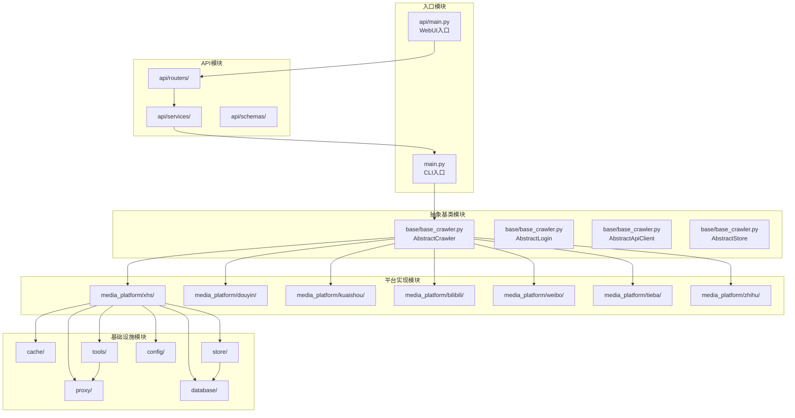

### 图表解释

这张图讲的是整个项目"长啥样"，就像看一栋大楼的结构图。

这栋大楼分成了五块区域：
- 入口区域：这是大门，用户可以从两个门进来——一个是命令行小窗口，一个是网页界面。
- 抽象基类区域：这是大楼的"设计图纸"，规定了每个房间该干什么活，比如怎么爬数据、怎么登录、怎么存东西。
- 平台实现区域：这是真正干活的房间，每个房间负责一个平台——小红书、抖音、快手、B站、微博、贴吧、知乎，各管各的地盘。
- 基础设施区域：这是大楼的后勤部门，管换身份（代理）、管临时存东西（缓存）、管长期存东西（存储）、管大仓库（数据库）、管工具箱、管配置表。
- API区域：这是前台接待处，帮网页用户转达需求。

事情是这么流转的：用户从大门进来，图纸告诉平台房间该怎么干活，平台房间需要帮忙时就找后勤部门。比如小红书房间要换身份，就找代理部门；要存数据，就找存储部门；存储部门觉得东西太多，又会找数据库大仓库帮忙。就像一条流水线，需求从大门进来，经过一层层处理，最后把成果存进仓库。

---

## 2. 小红书平台模块详细结构

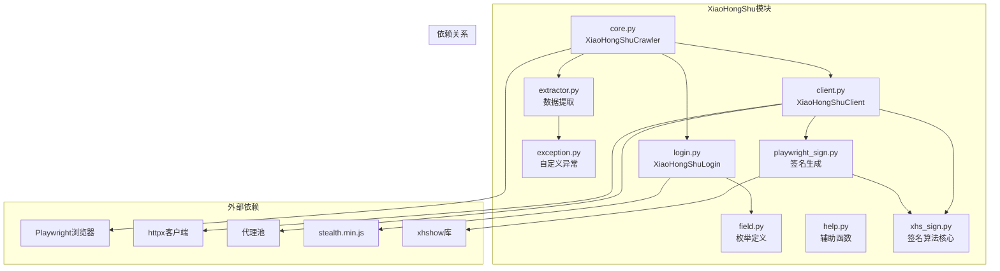

### 图表解释

这张图讲的是小红书这个"工作小组"内部是怎么分工的。

这个小组有九个成员，分成三排：
- 第一排是核心成员：core是小组长，负责统筹全局；client是对外联络员，专门跟小红书网站打交道；login是门卫，负责混脸熟（登录）；extractor是分拣员，从网页里挑出有用的东西。
- 第二排是辅助成员：field是一本字典，记着各种暗号；exception是警报员，出问题时拉响警报；help是万能帮手，哪里需要帮哪里；playwright_sign和xhs_sign是两个密码员，负责生成通行证（签名）。

事情是这么流转的：小组长core一声令下，门卫login先去混脸熟，对外联络员client拿着密码员生成的通行证去网站要数据，分拣员extractor从要回来的东西里挑出笔记、评论这些宝贝。如果中间出岔子，警报员就拉响警报。整个小组就像一条流水线：混脸熟→要数据→挑宝贝→交成果。

---

## 3. 存储模块结构图

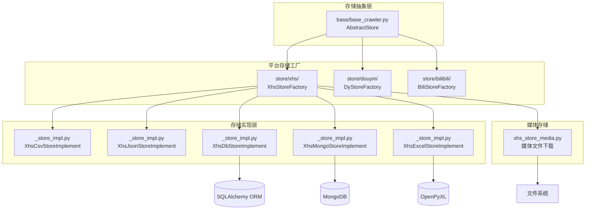

### 图表解释

这张图讲的是"东西抓回来以后放哪儿"，就像一个快递分拣中心。

分拣中心分三层：
- 最上面是"规矩层"：定了一条铁律——所有东西都必须按规矩存，不能乱扔。
- 中间是"平台柜台"：每个平台有自己的柜台，小红书的东西放小红书的柜台，抖音的放抖音的柜台，B站的放B站的柜台。
- 最下面是"具体格子"：每个柜台后面有好几个格子，你可以选把东西写成表格（CSV）、写成清单（JSON）、放进大柜子（数据库）、放进另一个大柜子（MongoDB）、或者做成Excel表格。还有一个专门的格子管图片视频这些"大件"。

事情是这么流转的：东西从平台送过来，先送到对应平台的柜台，柜台根据你的要求，把东西放进对应的格子里。就像去邮局寄包裹：先选对柜台，再选对邮寄方式，最后包裹就去了该去的地方。

---

## 4. 代理模块结构图

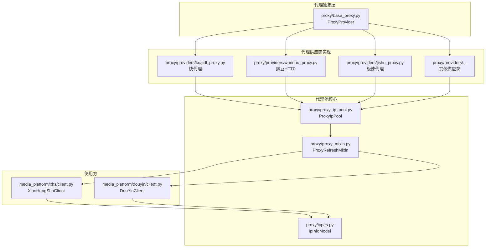

### 图表解释

这张图讲的是"怎么换身份去网站串门"，就像一个租车行。

租车行分四块：
- 规矩层：定了一条规矩——所有车都必须能开、能加油、能还车。
- 供应商：这是几个不同的租车公司，有快代理、豌豆HTTP、极速代理，还有别的公司，每家手里都有一堆车牌号（IP地址）。
- 车库管理：有一个大车库（代理池），把所有租车公司的车都停在一起；还有一个调度员，专门检查哪辆车快没油了，及时去换一辆；每辆车都有张信息卡，记着车牌、油量、到期时间。
- 用车的人：小红书和抖音的对外联络员，出门办事时要来租辆车。

事情是这么流转的：用车的人来找调度员要车，调度员从车库里挑一辆能用的。如果这辆车快到期了，调度员就悄悄去换一辆新的，用车的人完全感觉不到。就像你打车出门，平台自动给你派一辆车，你只管坐车，不用管车从哪儿来、油够不够。

---

## 5. 缓存模块结构图

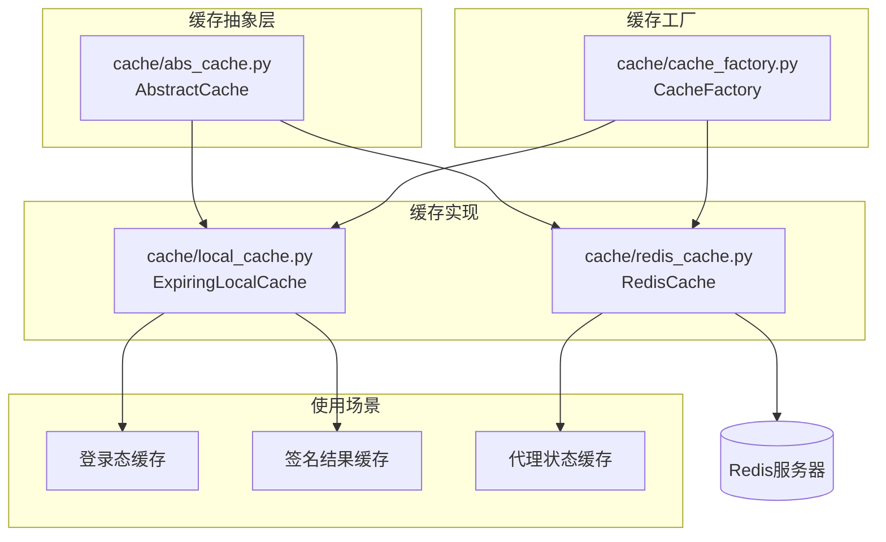

### 图表解释

这张图讲的是"把常用的东西放在手边，省得每次都去远处拿"，就像你书桌上的便签本和墙上的公告板。

这里有两处放东西的地方：
- 本地便签本：就放在你自己桌上，翻开就能看，但只有你一个人能看见，关机了就没了。适合记一些自己马上要用的小东西，比如今天登录过哪个网站、刚才算出来的密码。
- 墙上公告板：挂在大家都能看见的墙上（Redis服务器），所有人都能来看，而且就算关机了内容还在。适合记一些大家都要知道的事，比如现在哪些代理还能用。

事情是这么流转的：工厂根据你的需要，决定把东西放在便签本上还是公告板上。比如登录状态放在便签本上，自己用得快；代理状态放在公告板上，大家都能查。就像你记电话号码：常用的记在手机里，公共信息写在白板上。

---

## 6. 数据库模块结构图

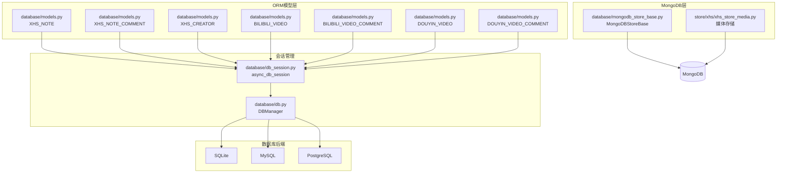

### 图表解释

这张图讲的是"东西太多，得找个大仓库长期存起来"，就像一个档案管理局。

档案局分几块：
- 档案盒层：每种东西都有专门的档案盒——小红书的笔记放一个盒，评论放一个盒，作者信息放一个盒；B站和抖音的也各自有盒。每个盒子都规定好了里面要放哪些条目。
- 窗口服务层：有两个办事窗口，一个管日常取放（会话管理），一个管大局的开关和连接（DBManager）。
- 仓库类型：档案可以存在三种仓库里——小文件柜（SQLite）、大文件柜（MySQL）、或者另一种大文件柜（PostgreSQL），看你需要哪种。
- 特殊仓库：还有一个专门放图片视频的大储物间（MongoDB），因为这些东西太占地方，普通档案盒放不下。

事情是这么流转的：数据从平台来，先装进对应的档案盒，然后通过办事窗口，最后存进选定的仓库。就像你去存行李：先选好箱子，再到窗口登记，最后送进仓库。要取的时候也一样，窗口帮你把箱子找出来。

---

## 7. 工具模块结构图

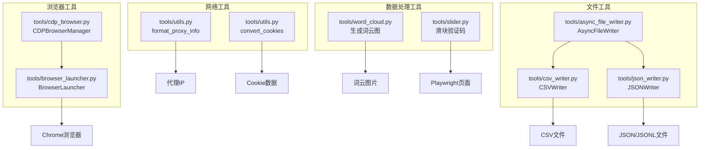

### 图表解释

这张图讲的是"工具箱里都有什么宝贝"，就像一个工匠的工具墙。

工具墙分四块：
- 浏览器工具：这是两个管"开浏览器"的扳手，一个负责高级调试，一个负责普通启动，最后都能把Chrome浏览器打开。
- 文件工具：这是几个写东西的笔——有一支快笔能同时写好多文件，有一支专门写表格（CSV），有一支专门写清单（JSON）。
- 网络工具：这是两个整理小帮手，一个帮你把代理信息整理成标准格式，一个帮你把登录凭证（Cookie）整理成能用的情况。
- 数据处理工具：这是两个好玩的小机器，一个能把一堆文字变成漂亮的词云图（字越大说明出现越多），一个能自动拖动滑块拼图（对付那些"请拖动滑块验证"的门槛）。

事情是这么流转的：哪里需要帮忙，就取对应的工具。要开浏览器取浏览器扳手，要写表格取CSV笔，要过滑块门槛取自动拼图机。就像你家里的工具箱，修水管取扳手，钉钉子取锤子，各干各的活。

---

## 8. API模块结构图

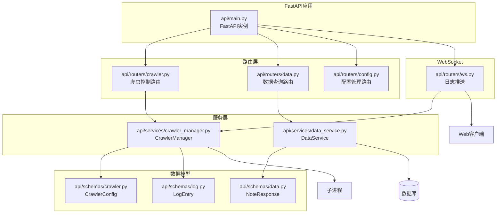

### 图表解释

这张图讲的是"怎么通过一个网页界面来遥控整个系统"，就像一个餐厅的点餐系统。

餐厅分几块：
- 前台大门（FastAPI应用）：这是餐厅正门，所有顾客都从这里进。
- 点餐窗口（路由层）：有三个窗口——一个管"开始/停止抓数据"，一个管"查已经抓到的数据"，一个管"改设置"。还有一个广播喇叭（WebSocket），实时播报后厨动态。
- 后厨（服务层）：有两个大厨，一个管调度爬虫干活，一个管从仓库取数据给顾客看。
- 菜单样板（数据模型）：规定了每道菜长什么样——爬虫配置单长什么样、返回的数据长什么样、日志长什么样。

事情是这么流转的：顾客从前门进来，到对应的窗口点餐，窗口把订单传给后厨大厨。调度大厨新开一个灶台（子进程）让爬虫干活，数据大厨去仓库取东西。广播喇叭实时告诉顾客"现在正在抓第几页""有没有出错"。就像你去饭店：进门→点菜→后厨炒菜→服务员上菜，全程不用你进厨房。

---

## 9. 配置模块结构图

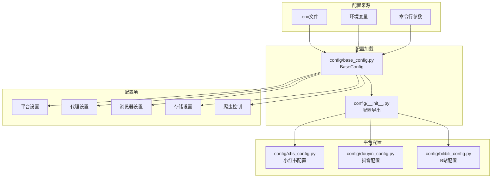

### 图表解释

这张图讲的是"系统怎么知道该按什么规矩干活"，就像一个剧组的剧本分发流程。

剧组分几块：
- 剧本来源：剧本可能写在三个地方——一个专门的剧本文件（.env）、写在墙上的大字报（环境变量）、或者导演临时喊的话（命令行参数）。
- 剧本整理员：有一个总编剧把三个地方的剧本统一整理成一本完整的台本，再交给分发员发给大家。
- 各组剧本：每个演员小组有自己的剧本——小红书组拿小红书的剧本，抖音组拿抖音的剧本，B站组拿B站的剧本。
- 剧本条目：每本剧本里都有这几章——这个平台怎么找、换身份怎么换、浏览器怎么开、东西存哪儿、一次抓多少。

事情是这么流转的：开机时，整理员把三个来源的剧本合并成一本，分发员把对应的剧本发给各小组。各小组拿到剧本就知道今天该怎么演了。就像学校运动会：总规程写在手册里，各班再领自己班的安排表，班主任知道几点集合、比什么项目、穿什么衣服。

---

## 10. 模块依赖关系图

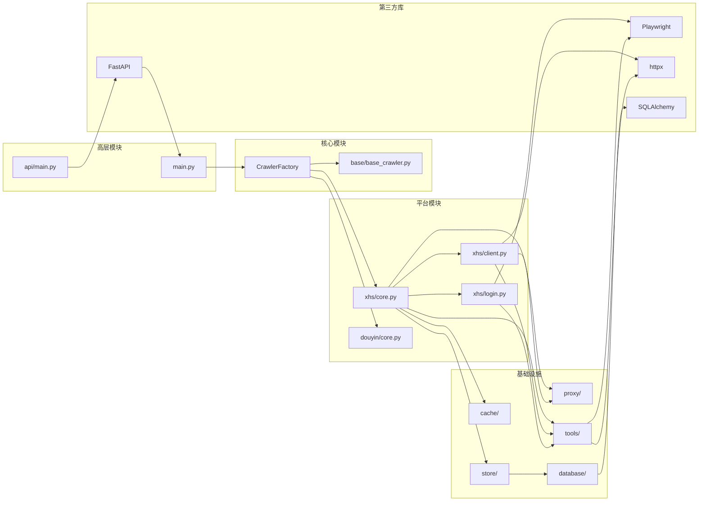

### 图表解释

这张图讲的是"谁靠谁才能干活"，就像一张人际关系网。

这张图上有五类人：
- 大老板（高层模块）：main和api/main，他们是发号施令的。
- 核心智囊（核心模块）：有一个画图纸的（base_crawler），还有一个调度员（CrawlerFactory），负责安排谁去干什么。
- 一线员工（平台模块）：小红书和抖音的小组，每个小组里有统筹的、有对外联络的、有管登录的。
- 后勤部门（基础设施）：管换身份的、管临时存东西的、管长期存东西的、管大仓库的、管工具的。
- 外援专家（第三方库）：有管开浏览器的、有管发网络请求的、有管数据库的、有管网页界面的。

事情是怎么靠在一起的：大老板不直接指挥一线员工，而是找调度员安排；调度员根据图纸，派对应的小组去干活；小组干活时需要后勤部门和外援专家帮忙。比如小红书小组要出门，先找后勤要个新身份，再找外援开浏览器、发请求，拿到东西后交给后勤存起来。就像拍一部电影：制片人找导演，导演找演员，演员化妆找化妆师，拍戏找摄影师，拍完剪辑找剪辑师，一环扣一环。

---

## 11. 类继承关系图

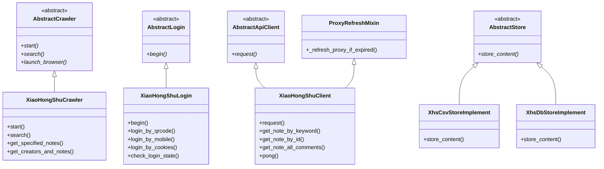

### 图表解释

这张图讲的是"师徒传承关系"，就像武林门派的辈分图。

图上有几位老师傅和几位徒弟：
- 老师傅们定规矩：Crawler老师傅规定——所有干活的都必须会"开始干活""搜索东西""开浏览器"；Login老师傅规定——所有管登录的都必须会"开始登录"；Client老师傅规定——所有对外联络的都必须会"发请求"；Store老师傅规定——所有管存东西的都必须会"存内容"。
- 徒弟们学本事再加自己的绝活：小红书Crawler徒弟继承了老师傅的基本功，还会"按关键词抓笔记""抓作者的所有内容"；小红书Login徒弟学会了登录，还发明了"扫码登录""手机号登录""用旧凭证登录"三种办法；小红书Client徒弟学会了发请求，还会"按关键词要笔记""按编号要笔记""要所有评论""检查连接"。
- 还有一位特殊顾问（ProxyRefreshMixin），专门教"怎么偷偷换身份不被发现"，小红书的对外联络员拜了这位顾问为师，所以也会这门手艺。

事情是这么流转的：老师傅们定好规矩，徒弟们照着学，再根据自己的平台特点加新招式。就像少林寺：师父教罗汉拳，大徒弟学了去打擂台，二徒弟学了去护院，各自发挥，但基本功都是一个师父教的。

---

## 12. 包结构树状图

```mermaid
graph TD
    Root[MediaCrawler/]
    
    Root --> Base[base/]
    Base --> BC[base_crawler.py]
    
    Root --> MP[media_platform/]
    MP --> XHS[xhs/]
    XHS --> XHS1[core.py]
    XHS --> XHS2[client.py]
    XHS --> XHS3[login.py]
    XHS --> XHS4[field.py]
    XHS --> XHS5[exception.py]
    XHS --> XHS6[extractor.py]
    XHS --> XHS7[help.py]
    XHS --> XHS8[playwright_sign.py]
    XHS --> XHS9[xhs_sign.py]
    
    MP --> DY[douyin/]
    DY --> DY1[core.py]
    DY --> DY2[client.py]
    DY --> DY3[login.py]
    
    MP --> KS[kuaishou/]
    MP --> BILI[bilibili/]
    MP --> WB[weibo/]
    MP --> TB[tieba/]
    MP --> ZH[zhihu/]
    
    Root --> Store[store/]
    Store --> SX[xhs/]
    SX --> SX1[__init__.py]
    SX --> SX2[_store_impl.py]
    SX --> SX3[xhs_store_media.py]
    
    Root --> Cache[cache/]
    Cache --> CA1[cache_factory.py]
    Cache --> CA2[local_cache.py]
    Cache --> CA3[redis_cache.py]
    Cache --> CA4[abs_cache.py]
    
    Root --> Proxy[proxy/]
    Proxy --> P1[proxy_ip_pool.py]
    Proxy --> P2[proxy_mixin.py]
    Proxy --> P3[base_proxy.py]
    Proxy --> P4[types.py]
    Proxy --> PP[providers/]
    PP --> PP1[kuaidl_proxy.py]
    PP2[wandou_proxy.py]
    
    Root --> DB[database/]
    DB --> DB1[models.py]
    DB --> DB2[db_session.py]
    DB --> DB3[db.py]
    DB --> DB4[mongodb_store_base.py]
    
    Root --> Tools[tools/]
    Tools --> T1[cdp_browser.py]
    Tools --> T2[browser_launcher.py]
    Tools --> T3[async_file_writer.py]
    Tools --> T4[utils.py]
    Tools --> T5[word_cloud.py]
    
    Root --> API[api/]
    API --> A1[main.py]
    API --> AR[routers/]
    AR --> AR1[crawler.py]
    AR --> AR2[data.py]
    API --> AS[services/]
    AS --> AS1[crawler_manager.py]
    API --> ASC[schemas/]
    
    Root --> CFG[config/]
    CFG --> C1[base_config.py]
    CFG --> C2[xhs_config.py]
    
    Root --> Model[model/]
    Root --> Test[test/]
    Root --> Tests[tests/]
    Root --> Var[var.py]
    Root --> Main[main.py]
    Root --> Req[requirements.txt]
    Root --> PP2[pyproject.toml]
```

### 图表解释

这张图讲的是"所有文件都住在哪儿"，就像一栋办公楼的楼层分布图。

这栋楼叫MediaCrawler，里面有很多房间（文件夹）和文件：
- base房间：放着设计图纸（base_crawler.py），全楼的人都按这个规矩来。
- media_platform房间：这是最大的办公区，里面分了好几个小组——小红书组、抖音组、快手组、B站组、微博组、贴吧组、知乎组。每个小组都有自己的工位，比如小红书组有九个工位，分别管统筹、对外联络、登录、字典、警报、分拣、帮忙、密码、核心算法。
- store房间：这是档案室，每个平台有自己的档案柜，里面放着各种存东西的工具。
- cache房间：这是临时储物间，有调度台、本地架子、墙上公告板接口、规矩本。
- proxy房间：这是租车行办公室，有车管员、调度员、规矩本、信息卡，还有一个供应商小房间。
- database房间：这是大仓库管理处，有档案盒、日常窗口、总控室、特殊储物间。
- tools房间：这是工具间，有浏览器扳手、文件笔、网络整理袋、词云机。
- api房间：这是前台接待区，有大门、三个办事窗口、后厨调度室、菜单样板室。
- config房间：这是剧本室，有总剧本和各组剧本。
- 还有一些零散房间：model放数据样板，test和tests放测试记录，var放变量表，main是主入口，requirements和pyproject是购物清单。

事情是这么流转的：整栋楼按功能分区，每个房间管一摊事，文件就像房间里的家具，各就各位。就像你去商场：一楼是化妆品，二楼是女装，三楼是男装，每层都有自己的布局，你找什么东西直接去对应的楼层就行。
