# MediaCrawler 模块结构图 (Module Structure Diagram)

## 1. 整体模块结构图

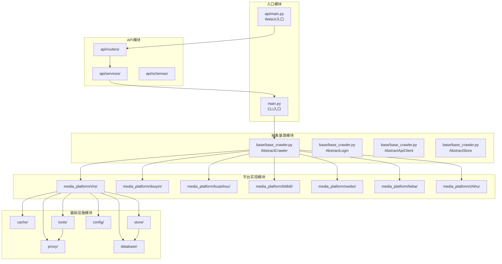

### 图表解释

#### 1. 整体概述

- 系统由入口层、抽象层、平台层、基础设施层和 API 层五大部分组成，形成自上而下的分层架构
- 上层模块只依赖下层模块的抽象接口，不依赖具体实现，符合依赖倒置原则
- 平台实现模块通过继承抽象基类获得统一行为框架，再调用基础设施完成数据存取和网络通信

#### 2. 关键元素说明

- **入口模块**：`main.py` 提供 CLI 启动方式，`api/main.py` 提供 WebUI 启动方式，是系统的两个外部接入点
- **抽象基类模块**：`base/base_crawler.py` 定义 `AbstractCrawler`、`AbstractLogin`、`AbstractApiClient`、`AbstractStore` 四个抽象类，作为全系统的接口契约
- **平台实现模块**：`media_platform/` 下按平台隔离，包含小红书、抖音、快手、B站、微博、贴吧、知乎七个平台的完整实现
- **基础设施模块**：`proxy/`、`cache/`、`store/`、`database/`、`tools/`、`config/` 提供代理、缓存、存储、数据库、工具、配置六项通用能力
- **API 模块**：`api/routers/` 接收 HTTP 请求，`api/services/` 处理业务逻辑，`api/schemas/` 定义数据模型，为 WebUI 提供 RESTful 接口

#### 3. 关键流程/关系说明

1. CLI 入口直接调用抽象基类，进而驱动平台实现模块执行爬虫任务
2. WebUI 入口通过 API 路由层转发到服务层，服务层再调用 CLI 入口逻辑复用核心调度能力
3. 平台实现模块在执行过程中依次依赖代理模块进行 IP 轮换、缓存模块进行状态暂存、存储模块进行数据持久化
4. 存储模块在需要结构化持久化时进一步依赖数据库模块，工具模块则向代理模块提供辅助功能

#### 4. 关键技术解释

- 该系统采用抽象工厂模式与依赖倒置原则：抽象基类定义接口，平台实现类继承并具体化，上层模块只依赖抽象而不依赖具体实现
- 新增平台时只需在 `media_platform/` 下新增目录并实现基类接口，无需修改上层代码，保证了开闭原则
- API 模块基于 FastAPI 框架，通过路由-服务-模型三层结构将 HTTP 请求转换为爬虫任务调度

#### 5. 设计意图

- **为什么要这样设计**：将变化频率不同的模块隔离到不同层次，入口层、平台层、基础设施层各自独立演进
- **解决了什么痛点**：避免了平台特异性逻辑扩散到全系统，新增平台或更换存储后端时不需要修改现有代码
- **带来了什么好处**：支持多平台、多存储后端、多入口形式的任意组合，系统的可扩展性和可维护性显著提升
- **如果不这样会怎样**：所有逻辑耦合在一个层次中，任何平台的接口升级或存储后端替换都会引发全局代码修改，维护成本急剧上升

---

## 2. 小红书平台模块详细结构

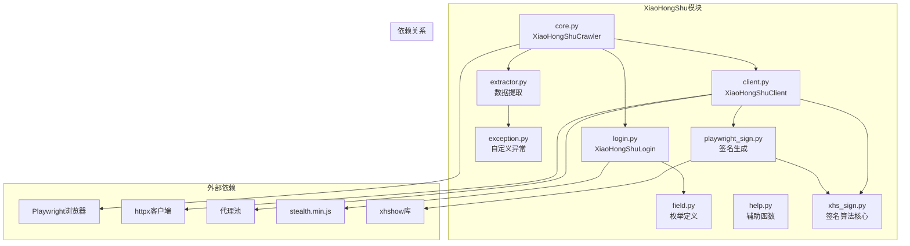

### 图表解释

#### 1. 整体概述

- 小红书模块由 9 个 Python 文件构成，分为内部核心组件和外部依赖两类
- 核心组件涵盖爬虫调度、HTTP 客户端、登录管理、数据提取、签名生成及辅助工具
- 外部依赖包括浏览器自动化库、异步 HTTP 客户端、代理池和反检测脚本

#### 2. 关键元素说明

- **`core.py`**：爬虫入口类，负责协调登录、请求、提取、存储的全流程调度
- **`client.py`**：HTTP 客户端，封装小红书 API 的请求逻辑，包括关键词搜索、笔记详情获取、评论获取等
- **`login.py`**：登录管理器，支持二维码、手机号、Cookie 三种登录方式
- **`extractor.py`**：数据提取器，负责从 API 响应中解析并清洗出结构化数据
- **`playwright_sign.py` / `xhs_sign.py`**：签名生成模块，前者通过 Playwright 调用浏览器环境计算签名，后者实现核心签名算法
- **`field.py`**：枚举定义文件，集中管理平台相关的常量
- **`exception.py`**：自定义异常类，用于区分网络错误、登录失效、反爬拦截等不同错误场景
- **`help.py`**：辅助函数集合，提供通用的数据转换和格式化工具

#### 3. 关键流程/关系说明

1. `core.py` 作为调度中心，在启动时先调用 `login.py` 完成身份认证
2. 认证通过后，`core.py` 调用 `client.py` 发起 API 请求
3. `client.py` 在请求前通过 `playwright_sign.py` 和 `xhs_sign.py` 生成合法的请求签名
4. 获取响应后，`core.py` 调用 `extractor.py` 进行数据解析
5. 整个流程中，`field.py` 提供常量定义，`exception.py` 捕获并分类异常，`help.py` 提供通用辅助

#### 4. 关键技术解释

- 该模块采用分层职责分离的设计模式：调度层不直接处理网络请求，而是通过客户端层和服务层完成具体任务
- 签名模块的双层结构体现了环境隔离策略：核心算法与浏览器环境解耦，便于单元测试和算法复用
- Playwright 与 `stealth.min.js` 的组合用于对抗平台的浏览器指纹检测，`httpx` 的异步特性保证了高并发场景下的 I/O 效率

#### 5. 设计意图

- **为什么要这样设计**：将平台特异性逻辑完全封装在一个目录内，其他平台模块可以参照相同的文件结构和接口契约独立开发
- **解决了什么痛点**：避免了单文件代码量过大，降低了单文件复杂度，使得定位问题和局部升级更加容易
- **带来了什么好处**：签名算法更新时只需修改 `xhs_sign.py`，登录逻辑调整时只需修改 `login.py`，不影响其他平台或基础设施层
- **如果不这样会怎样**：所有逻辑集中在一个文件中，任何平台接口变更都会导致全局修改，代码难以维护和复用

---

## 3. 存储模块结构图

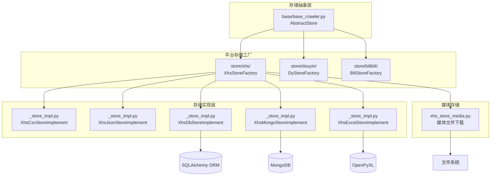

### 图表解释

#### 1. 整体概述

- 存储模块采用三层架构：抽象层定义统一接口，工厂层按平台隔离，实现层提供多种持久化后端
- 整个模块支持 CSV、JSON、关系型数据库、MongoDB、Excel 五种结构化存储格式
- 媒体文件下载作为独立能力，与结构化存储并行存在

#### 2. 关键元素说明

- **`AbstractStore`**：抽象基类，定义 `store_content()` 接口，所有存储实现必须遵循此契约
- **平台存储工厂**：`XhsStoreFactory`、`DyStoreFactory`、`BiliStoreFactory` 等，按平台维度组织存储策略的创建逻辑
- **存储实现层**：`XhsCsvStoreImplement`、`XhsJsonStoreImplement`、`XhsDbStoreImplement`、`XhsMongoStoreImplement`、`XhsExcelStoreImplement`，分别对应五种持久化方案
- **媒体存储**：`xhs_store_media.py`，负责图片、视频等二进制文件的下载和本地文件系统写入
- **外部依赖**：`XhsDbStoreImplement` 依赖 SQLAlchemy ORM，`XhsMongoStoreImplement` 依赖 MongoDB，`XhsExcelStoreImplement` 依赖 OpenPyXL

#### 3. 关键流程/关系说明

1. 平台爬虫抓取数据后，调用对应平台的 `StoreFactory` 获取存储实例
2. 工厂根据配置决定实例化哪种实现类：若配置为 CSV，则返回 `XhsCsvStoreImplement`；若配置为数据库，则返回 `XhsDbStoreImplement`
3. 媒体文件不走工厂路由，由 `xhs_store_media.py` 直接处理下载和落盘
4. `AbstractStore` 到工厂再到实现的依赖链保证了存储策略的可插拔性

#### 4. 关键技术解释

- 该模块采用工厂方法模式和策略模式：工厂负责创建具体存储实例，策略类负责实现不同格式的存储逻辑
- `AbstractStore` 作为抽象接口，使得上层模块无需关心数据最终写入 CSV 还是数据库
- 媒体存储独立成模块的原因是二进制文件不适合与结构化数据混用同一套序列化逻辑，且通常需要异步流式下载和分块写入

#### 5. 设计意图

- **为什么要这样设计**：将数据产生与数据持久化解耦，爬虫模块只负责生成数据对象，存储模块负责决定格式和目的地
- **解决了什么痛点**：避免了爬虫代码中直接嵌入文件写入或数据库操作，使得存储后端的切换不影响业务逻辑
- **带来了什么好处**：同一套爬虫逻辑可以同时输出到多种后端，开发阶段用 JSON 调试，生产阶段切到数据库
- **如果不这样会怎样**：存储逻辑与爬虫逻辑耦合，更换存储格式时需要修改所有爬虫文件，维护成本极高

---

## 4. 代理模块结构图

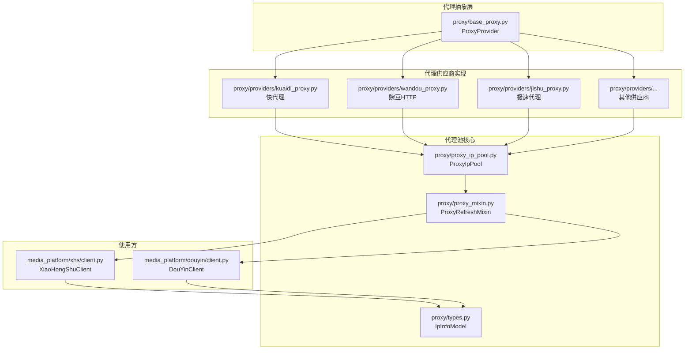

### 图表解释

#### 1. 整体概述

- 代理模块由抽象接口层、供应商实现层、代理池核心层和使用方四层组成
- 模块负责为各平台爬虫提供动态 IP 代理服务，以规避目标站点的频率限制和 IP 封禁策略
- 各层之间职责清晰，形成从代理获取到代理使用的完整链路

#### 2. 关键元素说明

- **`ProxyProvider`**：抽象基类，定义代理供应商的统一接口，所有具体供应商必须实现此接口
- **代理供应商实现**：`kuaidl_proxy.py`、`wandou_proxy.py`、`jishu_proxy.py` 等，负责从第三方代理服务商 API 获取代理 IP 列表
- **`ProxyIpPool`**：代理池核心类，维护可用代理 IP 的队列，提供获取、释放、淘汰代理的统一入口
- **`ProxyRefreshMixin`**：混入类，为客户端提供自动刷新过期代理的能力，客户端通过继承此类获得代理生命周期管理功能
- **`IpInfoModel`**：数据模型，封装代理 IP 的元数据（IP 地址、端口、过期时间、协议类型等）
- **使用方**：`XiaoHongShuClient`、`DouYinClient` 等平台 HTTP 客户端，在发起请求前从代理池获取代理配置

#### 3. 关键流程/关系说明

1. 各供应商实现类从第三方 API 拉取代理 IP，将原始数据转换为 `IpInfoModel` 对象后注入 `ProxyIpPool`
2. 平台客户端在发起 HTTP 请求前，通过 `ProxyRefreshMixin` 从 `ProxyIpPool` 获取当前可用代理
3. 若代理即将过期或请求失败，`ProxyRefreshMixin` 自动触发重新获取
4. `ProxyIpPool` 与供应商之间是聚合关系：一个代理池可以对接多个供应商，按优先级或负载均衡策略选择来源

#### 4. 关键技术解释

- 该模块采用抽象工厂模式管理多供应商接入：新增代理服务商时只需实现 `ProxyProvider` 接口并注册到代理池
- Mixin 模式使得代理刷新逻辑可以无侵入地注入到各平台客户端，避免在每个客户端中重复编写代理管理代码
- 代理池内部通常采用队列加定时淘汰机制，结合异步锁保证并发场景下的线程安全

#### 5. 设计意图

- **为什么要这样设计**：将代理获取、管理、使用的职责完全隔离，供应商层只负责从外部拉取，代理池只负责内部调度，客户端只负责使用
- **解决了什么痛点**：避免了代理逻辑与平台请求逻辑耦合，更换代理服务商时不需要修改客户端代码
- **带来了什么好处**：代理来源可以动态扩展，代理策略可以独立调整，平台客户端代码无需任何改动
- **如果不这样会怎样**：代理逻辑分散在各平台客户端中，更换代理服务商或调整代理策略时需要修改所有客户端文件

---

## 5. 缓存模块结构图

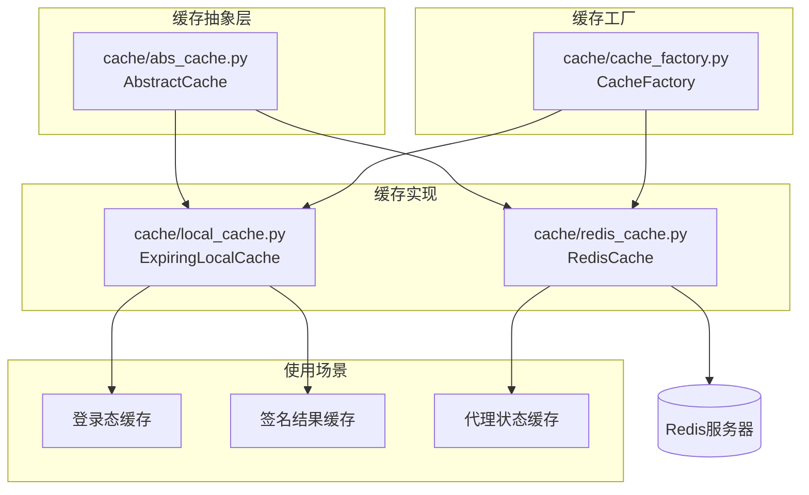

### 图表解释

#### 1. 整体概述

- 缓存模块由抽象接口层、工厂层和实现层组成，提供本地内存缓存和分布式 Redis 缓存两种后端
- 模块用于临时存储登录态、签名结果、代理状态等高频访问且允许失效的数据
- 通过抽象层隔离具体后端，使得业务代码无需关心缓存部署方式

#### 2. 关键元素说明

- **`AbstractCache`**：抽象基类，定义缓存的通用操作接口（`get`、`set`、`delete`、`exists` 等）
- **`CacheFactory`**：工厂类，根据配置决定实例化本地缓存还是 Redis 缓存
- **`ExpiringLocalCache`**：本地内存缓存实现，基于 Python 字典实现键值存储，支持 TTL 自动过期，数据仅存于当前进程内存中
- **`RedisCache`**：分布式缓存实现，基于 Redis 协议与外部 Redis 服务器通信，支持跨进程、跨机器共享缓存数据
- **使用场景**：登录态缓存（减少重复登录）、签名结果缓存（避免重复计算签名）、代理状态缓存（记录代理可用性）

#### 3. 关键流程/关系说明

1. 系统启动时，`CacheFactory` 读取配置中的 `cache_type` 参数，决定创建 `ExpiringLocalCache` 实例还是 `RedisCache` 实例
2. 上层模块（如登录模块、签名模块）通过工厂获取缓存实例后，直接调用抽象接口读写数据
3. 登录态和签名结果通常写入本地缓存，因为生命周期与单进程绑定
4. 代理状态通常写入 Redis，因为多个爬虫进程需要共享代理可用性信息

#### 4. 关键技术解释

- 该模块采用工厂模式实现缓存后端的无缝切换，上层代码只依赖 `AbstractCache` 接口
- `ExpiringLocalCache` 内部通常基于 `dict` 加后台清理线程（或惰性清理）实现 TTL，适合单机、低延迟场景
- `RedisCache` 通过 `redis-py` 或 `aioredis` 与 Redis 服务器通信，适合多机协作和持久化需求
- 两种实现的选择依据是一致性范围：本地缓存保证进程内一致性，Redis 保证分布式一致性

#### 5. 设计意图

- **为什么要这样设计**：用空间换时间，降低重复计算和重复请求的开销
- **解决了什么痛点**：登录态缓存避免每次启动都重新扫码登录；签名结果缓存避免重复调用 Playwright 计算签名（该操作耗时较高）；代理状态缓存减少对代理池的频繁查询
- **带来了什么好处**：开发环境可以使用零依赖的本地缓存，生产环境可以切换到 Redis，而业务代码完全无感知
- **如果不这样会怎样**：每次请求都重新计算签名、重新登录、重新查询代理状态，系统性能严重下降，且无法支持多进程协作

---

## 6. 数据库模块结构图

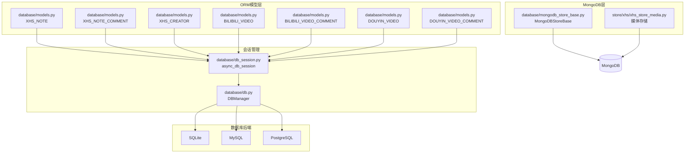

### 图表解释

#### 1. 整体概述

- 数据库模块涵盖 ORM 模型层、会话管理层、关系型数据库后端和 MongoDB 文档存储四个层次
- 模块负责将爬虫抓取的结构化数据持久化到 SQLite、MySQL 或 PostgreSQL
- 同时将媒体文件等非结构化数据存储到 MongoDB，形成关系型与文档型数据库的互补架构

#### 2. 关键元素说明

- **ORM 模型层**：`database/models.py` 中定义了各平台的数据表模型，如 `XHS_NOTE`（小红书笔记）、`XHS_NOTE_COMMENT`（评论）、`XHS_CREATOR`（作者）、`BILIBILI_VIDEO`、`DOUYIN_VIDEO` 等，每个模型对应一张关系型数据表
- **会话管理层**：`async_db_session`（`db_session.py`）提供异步数据库会话上下文管理器；`DBManager`（`db.py`）负责数据库连接的初始化、连接池管理和生命周期控制
- **关系型数据库后端**：支持 SQLite（轻量级、零配置）、MySQL（生产级、支持高并发）、PostgreSQL（高级特性、扩展性强）三种后端
- **MongoDB 层**：`MongoDBStoreBase` 提供 MongoDB 文档存储的基类封装，`xhs_store_media.py` 继承此类实现媒体文件的文档存储

#### 3. 关键流程/关系说明

1. 所有 ORM 模型通过 SQLAlchemy 的声明式基类定义，模型实例由平台爬虫创建后，通过 `async_db_session` 提交到数据库
2. `async_db_session` 内部管理事务边界（`begin`、`commit`、`rollback`），`DBManager` 在应用启动时根据配置创建对应引擎和连接池
3. MongoDB 侧不走 ORM，数据直接以 BSON 文档形式写入 MongoDB 集合
4. 媒体文件存储时通常将文件内容或文件路径作为文档字段写入

#### 4. 关键技术解释

- 该模块采用 SQLAlchemy 2.0 异步 ORM 进行关系型数据操作，`async_db_session` 基于 `async_sessionmaker` 实现，支持 `async with` 上下文语法，确保会话自动关闭和事务正确提交
- 多数据库后端的支持通过连接字符串加引擎工厂实现：同一套模型定义可以绑定到不同方言的引擎
- MongoDB 侧使用 `motor` 或 `pymongo` 的异步驱动，采用文档模型存储非结构化数据，避免了关系型数据库中 BLOB 字段的性能和容量限制

#### 5. 设计意图

- **为什么要这样设计**：统一数据持久化接口，同时保留后端灵活性，ORM 模型层屏蔽了 SQL 方言差异
- **解决了什么痛点**：业务代码无需关心底层是 SQLite 还是 PostgreSQL，会话管理层封装了事务和连接池细节，防止资源泄漏
- **带来了什么好处**：关系型数据库适合存储高度结构化的元数据，文档数据库适合存储变长、大体积的二进制内容，两者互补而非替代
- **如果不这样会怎样**：所有数据都放入关系型数据库会导致 BLOB 字段性能下降，所有数据都放入 MongoDB 会导致复杂查询和事务支持不足

---

## 7. 工具模块结构图

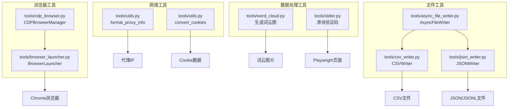

### 图表解释

#### 1. 整体概述

- 工具模块按职责划分为浏览器工具、文件工具、网络工具和数据处理工具四类
- 模块为爬虫系统提供底层辅助能力，涵盖浏览器生命周期管理、异步文件写入、代理与 Cookie 格式化、验证码对抗和数据可视化
- 所有工具具有平台无关性，可被多个平台模块共享

#### 2. 关键元素说明

- **浏览器工具**：`CDPBrowserManager` 通过 Chrome DevTools Protocol 与浏览器进程通信，实现高级调试和页面控制；`BrowserLauncher` 封装浏览器启动参数和进程管理逻辑
- **文件工具**：`AsyncFileWriter` 提供异步文件写入能力，支持并发场景下的非阻塞 I/O；`CSVWriter` 和 `JSONWriter` 分别封装 CSV 和 JSON/JSONL 格式的序列化与写入逻辑
- **网络工具**：`format_proxy_info` 将各种格式的代理字符串统一转换为标准字典结构；`convert_cookies` 将 Cookie 字符串或字典转换为 `httpx`/`requests` 兼容的 CookieJar 格式
- **数据处理工具**：`word_cloud.py` 基于词频统计生成词云图片；`slider.py` 实现滑块验证码的自动识别与拖动逻辑，基于 Playwright 获取页面元素位置并模拟鼠标轨迹

#### 3. 关键流程/关系说明

1. `BrowserLauncher` 负责启动 Chrome 进程，`CDPBrowserManager` 在此基础上建立 CDP 会话，两者是组合关系
2. `AsyncFileWriter` 作为底层写入器，被 `CSVWriter` 和 `JSONWriter` 调用以完成具体格式的文件落盘
3. 网络工具函数通常由 `client.py` 在发起请求前调用，用于标准化代理配置和 Cookie 传递
4. `slider.py` 在登录流程中被 `login.py` 调用，当检测到滑块验证码时自动完成验证

#### 4. 关键技术解释

- `CDPBrowserManager` 使用 Chrome DevTools Protocol 通过 WebSocket 与浏览器通信，相比 Playwright 的高层 API，CDP 提供更细粒度的网络拦截、请求修改和性能监控能力
- `AsyncFileWriter` 基于 `aiofiles` 实现异步文件 I/O，避免在并发写入时阻塞事件循环
- `slider.py` 的验证码对抗通常采用图像识别加轨迹模拟方案：先通过截图和 CV 算法计算缺口位置，再通过贝塞尔曲线或随机扰动生成人类-like 的鼠标拖动轨迹，降低被行为检测识别的概率

#### 5. 设计意图

- **为什么要这样设计**：提取公共辅助逻辑，避免在各平台模块中重复实现
- **解决了什么痛点**：浏览器启动、文件写入、网络格式转换等操作具有平台无关性，集中放在 `tools/` 中可以提高代码复用率
- **带来了什么好处**：将滑块验证码对抗、词云生成等横切关注点从核心业务逻辑中剥离，使得平台模块专注于平台特异性逻辑
- **如果不这样会怎样**：每个平台模块都重复实现浏览器启动、文件写入等通用逻辑，代码冗余严重，且任何工具类 bug 的修复都需要修改多个文件

---

## 8. API模块结构图

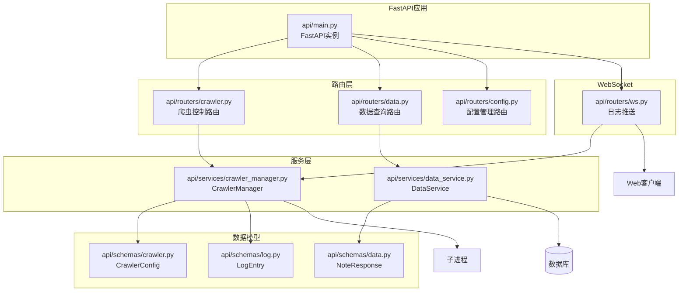

### 图表解释

#### 1. 整体概述

- API 模块基于 FastAPI 框架实现，由应用实例层、路由层、服务层、数据模型层和 WebSocket 层组成
- 模块为外部客户端提供 RESTful 接口和实时日志推送能力，使得爬虫系统可以通过 HTTP 请求远程控制和监控
- 分层设计保证了接口层、业务逻辑层和数据访问层的独立演进

#### 2. 关键元素说明

- **FastAPI 应用**：`api/main.py` 中的 FastAPI 实例，负责应用生命周期管理、中间件注册和全局异常处理
- **路由层**：`crawler.py` 提供爬虫任务控制接口（启动、停止、状态查询）；`data.py` 提供已抓取数据的查询接口；`config.py` 提供运行时配置管理接口；`ws.py` 提供 WebSocket 连接，用于实时推送日志
- **服务层**：`CrawlerManager` 负责将 HTTP 请求转换为爬虫任务调度，通常通过创建子进程执行爬虫；`DataService` 负责从数据库或存储文件中查询数据并返回给路由层
- **数据模型层**：`CrawlerConfig`（爬虫配置 schema）、`NoteResponse`（笔记数据响应 schema）、`LogEntry`（日志条目 schema），基于 Pydantic 实现请求校验和响应序列化
- **外部依赖**：`CrawlerManager` 通过子进程调用爬虫核心；`DataService` 查询数据库；WebSocket 向 Web 客户端推送实时日志流

#### 3. 关键流程/关系说明

1. 客户端发送 HTTP 请求到 FastAPI 应用，应用根据 URL 路径将请求分发到对应路由
2. `crawler.py` 收到启动请求后，调用 `CrawlerManager` 创建子进程运行爬虫
3. `data.py` 收到查询请求后，调用 `DataService` 从数据库读取数据并封装为 `NoteResponse` 返回
4. `ws.py` 建立 WebSocket 连接后，从爬虫子进程的标准输出或日志队列中读取日志，通过 WebSocket 帧实时推送给前端

#### 4. 关键技术解释

- 该模块采用 MVC 分层模式的变体：路由层对应 Controller，负责接收请求和返回响应；服务层对应 Service，负责业务逻辑编排；模型层对应 Model，负责数据校验和序列化
- FastAPI 的依赖注入系统使得服务层实例可以方便地在路由函数中注入和复用
- WebSocket 采用异步全双工通信，服务器可以主动推送数据而无需客户端轮询
- 子进程调度通常使用 `asyncio.create_subprocess_exec`，配合 `asyncio.Queue` 实现父子进程间的日志传递

#### 5. 设计意图

- **为什么要这样设计**：将爬虫系统从单机 CLI 工具扩展为可远程调用的服务
- **解决了什么痛点**：外部系统（如调度平台、数据 pipeline、前端管理后台）可以程序化地控制爬虫启停和获取结果，而无需直接操作服务器命令行
- **带来了什么好处**：WebSocket 日志推送解决了异步任务状态可见性问题，爬虫作为长时间运行的子进程，其执行进度和错误信息可以实时反馈给操作者
- **如果不这样会怎样**：爬虫系统只能本地命令行操作，无法接入自动化调度平台，任务执行状态对操作者不可见，运维效率低下

---

## 9. 配置模块结构图

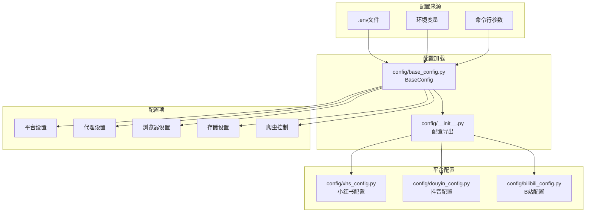

### 图表解释

#### 1. 整体概述

- 配置模块支持从 `.env` 文件、环境变量和命令行参数三个来源读取配置
- 模块通过基类统一解析后，按平台维度导出为独立的配置对象，供各平台爬虫和基础设施模块使用
- 多源加载机制保证了不同部署场景下的灵活性

#### 2. 关键元素说明

- **配置来源**：`.env` 文件（本地开发常用，键值对格式）、环境变量（容器化部署和 CI/CD 场景常用）、命令行参数（运行时动态覆盖，优先级最高）
- **配置加载层**：`BaseConfig`（`base_config.py`）负责多源配置的合并、类型转换和默认值处理；`config/__init__.py` 作为统一出口，将解析后的配置暴露给外部模块
- **平台配置**：`xhs_config.py`、`douyin_config.py`、`bilibili_config.py` 等，继承或组合 `BaseConfig`，定义各平台特有的参数（如搜索关键词、平台 ID、签名密钥）
- **配置项分类**：平台设置（目标平台、搜索参数）、代理设置（代理类型、代理池配置）、浏览器设置（无头模式、窗口大小、User-Agent）、存储设置（存储类型、文件路径、数据库连接串）、爬虫控制（并发数、重试次数、超时时间）

#### 3. 关键流程/关系说明

1. 应用启动时，`BaseConfig` 按优先级依次读取命令行参数、环境变量和 `.env` 文件，后读取的配置项覆盖先读取的同名项
2. 解析完成后，`config/__init__.py` 将通用配置和平台配置分别导出
3. 平台模块（如 `xhs/core.py`）导入 `xhs_config.py` 获取本平台参数
4. 基础设施模块（如 `proxy/`、`cache/`）导入 `BaseConfig` 中的通用配置

#### 4. 关键技术解释

- 该模块通常采用 `pydantic-settings` 或 `python-dotenv` 实现多源配置加载
- `pydantic-settings` 自动将环境变量名映射为配置类字段（如 `MEDIA_CRAWLER_PROXY_TYPE` 映射为 `BaseConfig.proxy_type`），并支持类型校验和默认值
- 命令行参数通过 `argparse` 或 `typer` 解析后，作为字典注入配置类
- 配置分层遵循通用配置在基类、平台配置在子类的原则，避免各平台配置文件中重复定义相同的字段

#### 5. 设计意图

- **为什么要这样设计**：将系统行为的外部化控制集中管理，使得同一套代码可以在不同环境和不同场景下通过修改配置而非修改代码来适配
- **解决了什么痛点**：开发时用 `.env` 文件方便调试，部署时用环境变量保证安全（避免敏感信息入仓），紧急时用命令行参数快速覆盖
- **带来了什么好处**：平台配置的独立文件使得各平台参数的演进互不干扰，新增平台时只需新增一个配置文件，无需改动现有配置结构
- **如果不这样会怎样**：配置硬编码在代码中，不同环境需要维护多套代码分支，敏感信息容易泄露到版本控制系统中

---

## 10. 模块依赖关系图

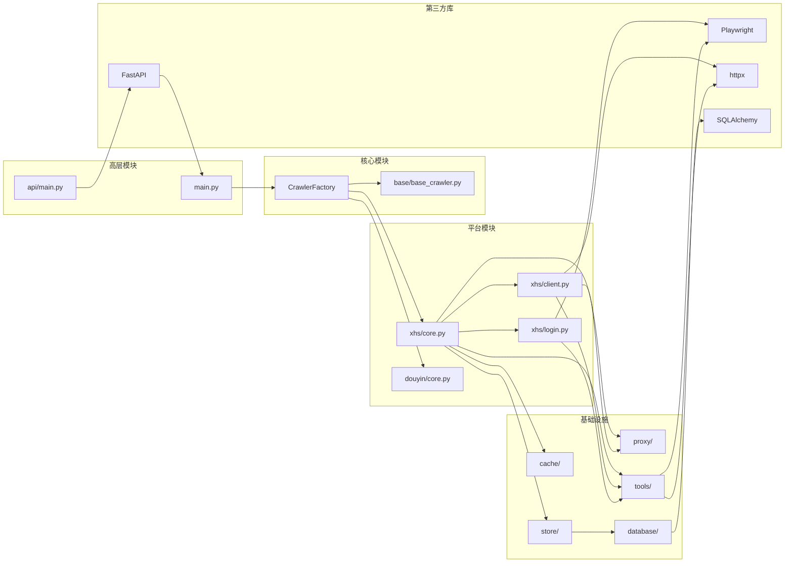

### 图表解释

#### 1. 整体概述

- 该图展示了项目各模块之间的依赖关系，按层次划分为高层模块、核心模块、平台模块、基础设施和第三方库五层
- 箭头方向表示依赖方向，清晰地展示了控制流从高层向底层传递、底层为高层提供服务的结构
- 整体呈现单向依赖特征，除 FastAPI 到 `main.py` 的反向调用外，不存在循环依赖

#### 2. 关键元素说明

- **高层模块**：`main.py`（CLI 入口）和 `api/main.py`（Web 入口），是系统的启动点和用户交互层
- **核心模块**：`base/base_crawler.py` 提供抽象接口；`CrawlerFactory` 负责根据配置创建对应平台的爬虫实例
- **平台模块**：以小红书（`xhs/core.py`、`xhs/client.py`、`xhs/login.py`）和抖音（`douyin/core.py`）为代表，包含平台特定的爬虫实现
- **基础设施**：`proxy/`（代理）、`cache/`（缓存）、`store/`（存储）、`database/`（数据库）、`tools/`（工具），为平台模块提供通用服务
- **第三方库**：Playwright（浏览器自动化）、httpx（异步 HTTP 客户端）、SQLAlchemy（ORM）、FastAPI（Web 框架）

#### 3. 关键流程/关系说明

1. `main.py` 依赖 `CrawlerFactory` 获取爬虫实例，`CrawlerFactory` 依赖 `base/base_crawler.py` 的抽象定义来创建具体平台实例
2. 平台模块内部，`core.py` 依赖 `client.py` 和 `login.py` 完成请求和认证；`core.py` 同时依赖基础设施模块
3. `client.py` 依赖代理模块和 `httpx` 库发送请求；`login.py` 依赖 Playwright 进行浏览器自动化
4. `store/` 依赖 `database/`，`database/` 依赖 SQLAlchemy，`tools/` 依赖 Playwright 和 httpx

#### 4. 关键技术解释

- 该依赖图体现了依赖倒置原则：高层模块不直接依赖低层模块，而是依赖抽象和工厂
- 第三方库的内聚使用：Playwright 被 `login.py` 和 `tools/` 共享，httpx 被 `client.py` 和 `tools/` 共享，说明这些库的能力被提取到工具层以避免重复封装
- `store/` 到 `database/` 的依赖表明存储模块在需要持久化时复用数据库模块的连接和会话管理能力

#### 5. 设计意图

- **为什么要这样设计**：控制耦合度和保证单向依赖，所有依赖箭头都从上指向下
- **解决了什么痛点**：层次化的依赖结构使得模块的影响范围可控，修改基础设施不会影响核心模块，修改平台模块不会影响高层模块
- **带来了什么好处**：通过将第三方库集中在底层模块使用，避免了上层代码与具体技术栈的强绑定，降低了未来替换技术方案的成本
- **如果不这样会怎样**：存在循环依赖时，模块之间的影响范围不可控，任何修改都可能引发连锁反应，编译和测试变得困难

---

## 11. 类继承关系图

### 图表解释

#### 1. 整体概述

- 该图展示了项目中核心抽象类与具体实现类之间的继承关系
- `AbstractCrawler`、`AbstractLogin`、`AbstractApiClient`、`AbstractStore` 四个抽象基类定义了爬虫系统的核心接口契约
- 各平台实现类通过继承这些基类获得统一的行为框架，同时扩展平台特有的方法

#### 2. 关键元素说明

- **`AbstractCrawler`**：抽象爬虫基类，定义 `start()`、`search()`、`launch_browser()` 三个抽象方法，是所有平台爬虫的父类
- **`AbstractLogin`**：抽象登录基类，定义 `begin()` 抽象方法，是所有平台登录模块的父类
- **`AbstractApiClient`**：抽象 API 客户端基类，定义 `request()` 抽象方法，是所有平台 HTTP 客户端的父类
- **`AbstractStore`**：抽象存储基类，定义 `store_content()` 抽象方法，是所有存储实现的父类
- **`XiaoHongShuCrawler`**：小红书爬虫实现，继承 `AbstractCrawler`，扩展了 `get_specified_notes()` 和 `get_creators_and_notes()`
- **`XiaoHongShuLogin`**：小红书登录实现，继承 `AbstractLogin`，扩展了二维码登录、手机号登录、Cookie 登录和登录状态检查
- **`XiaoHongShuClient`**：小红书 API 客户端实现，继承 `AbstractApiClient` 和 `ProxyRefreshMixin`，扩展了关键词搜索、笔记详情获取、评论获取和连接探测
- **`XhsCsvStoreImplement` / `XhsDbStoreImplement`**：小红书存储实现，分别继承 `AbstractStore`，实现 CSV 和数据库两种持久化方式
- **`ProxyRefreshMixin`**：代理刷新混入类，提供 `_refresh_proxy_if_expired()` 方法，供客户端在请求前检查并更换过期代理

#### 3. 关键流程/关系说明

1. 继承关系通过实线空心三角箭头表示，箭头指向父类
2. `XiaoHongShuCrawler` 继承 `AbstractCrawler`，必须实现 `start()`、`search()`、`launch_browser()`，同时可以调用父类定义的通用逻辑
3. `XiaoHongShuClient` 同时继承 `AbstractApiClient` 和 `ProxyRefreshMixin`，这是 Python 的多重继承：前者提供 API 请求接口，后者提供代理生命周期管理
4. `XhsCsvStoreImplement` 和 `XhsDbStoreImplement` 都继承 `AbstractStore`，说明同一平台支持多种存储后端，通过继承同一基类保证接口一致性

#### 4. 关键技术解释

- 该继承体系体现了模板方法模式和里氏替换原则：抽象基类定义了算法骨架，子类通过重写抽象方法填充具体实现，同时保留父类的控制逻辑
- `ProxyRefreshMixin` 的使用体现了 Mixin 模式：将横向功能从主继承链中剥离，通过多重继承组合到需要该功能的类中，避免了在 `AbstractApiClient` 中引入与代理相关的耦合
- Python 的抽象基类通过 `abc.ABC` 和 `@abstractmethod` 强制子类实现接口，在运行时若子类未实现抽象方法则会抛出 `TypeError`

#### 5. 设计意图

- **为什么要这样设计**：在统一接口契约下支持平台差异化扩展
- **解决了什么痛点**：抽象基类保证了所有平台实现具有相同的方法签名和行为预期，使得 `CrawlerFactory` 可以通过基类引用统一调度不同平台的实例
- **带来了什么好处**：子类扩展的方法允许平台根据自身 API 特性提供额外能力，而不会影响其他平台；Mixin 的引入解决了多重职责的代码复用问题
- **如果不这样会怎样**：没有抽象基类约束时，各平台实现的方法签名不一致，工厂类无法统一调度，代码复用率低，新增平台时需要大量修改现有代码

---

## 12. 包结构树状图

```mermaid
graph TD
    Root[MediaCrawler/]
    
    Root --> Base[base/]
    Base --> BC[base_crawler.py]
    
    Root --> MP[media_platform/]
    MP --> XHS[xhs/]
    XHS --> XHS1[core.py]
    XHS --> XHS2[client.py]
    XHS --> XHS3[login.py]
    XHS --> XHS4[field.py]
    XHS --> XHS5[exception.py]
    XHS --> XHS6[extractor.py]
    XHS --> XHS7[help.py]
    XHS --> XHS8[playwright_sign.py]
    XHS --> XHS9[xhs_sign.py]
    
    MP --> DY[douyin/]
    DY --> DY1[core.py]
    DY --> DY2[client.py]
    DY --> DY3[login.py]
    
    MP --> KS[kuaishou/]
    MP --> BILI[bilibili/]
    MP --> WB[weibo/]
    MP --> TB[tieba/]
    MP --> ZH[zhihu/]
    
    Root --> Store[store/]
    Store --> SX[xhs/]
    SX --> SX1[__init__.py]
    SX --> SX2[_store_impl.py]
    SX --> SX3[xhs_store_media.py]
    
    Root --> Cache[cache/]
    Cache --> CA1[cache_factory.py]
    Cache --> CA2[local_cache.py]
    Cache --> CA3[redis_cache.py]
    Cache --> CA4[abs_cache.py]
    
    Root --> Proxy[proxy/]
    Proxy --> P1[proxy_ip_pool.py]
    Proxy --> P2[proxy_mixin.py]
    Proxy --> P3[base_proxy.py]
    Proxy --> P4[types.py]
    Proxy --> PP[providers/]
    PP --> PP1[kuaidl_proxy.py]
    PP2[wandou_proxy.py]
    
    Root --> DB[database/]
    DB --> DB1[models.py]
    DB --> DB2[db_session.py]
    DB --> DB3[db.py]
    DB --> DB4[mongodb_store_base.py]
    
    Root --> Tools[tools/]
    Tools --> T1[cdp_browser.py]
    Tools --> T2[browser_launcher.py]
    Tools --> T3[async_file_writer.py]
    Tools --> T4[utils.py]
    Tools --> T5[word_cloud.py]
    
    Root --> API[api/]
    API --> A1[main.py]
    API --> AR[routers/]
    AR --> AR1[crawler.py]
    AR --> AR2[data.py]
    API --> AS[services/]
    AS --> AS1[crawler_manager.py]
    API --> ASC[schemas/]
    
    Root --> CFG[config/]
    CFG --> C1[base_config.py]
    CFG --> C2[xhs_config.py]
    
    Root --> Model[model/]
    Root --> Test[test/]
    Root --> Tests[tests/]
    Root --> Var[var.py]
    Root --> Main[main.py]
    Root --> Req[requirements.txt]
    Root --> PP2[pyproject.toml]
```

### 图表解释

#### 1. 整体概述

- 该图展示了 MediaCrawler 项目的完整目录树结构，从根目录出发按功能域划分为多个一级目录
- 每个一级目录下再按职责细分为二级文件或子目录
- 整个结构遵循按功能分层、按平台隔离的组织原则，使得代码的定位、维护和扩展都有明确的物理边界

#### 2. 关键元素说明

- **`base/`**：存放抽象基类定义（`base_crawler.py`），是系统的接口契约层
- **`media_platform/`**：平台实现目录，包含七个平台的子目录。以 `xhs/` 为例，包含 `core.py`（调度）、`client.py`（客户端）、`login.py`（登录）、`field.py`（枚举）、`exception.py`（异常）、`extractor.py`（提取）、`help.py`（辅助）、`playwright_sign.py`（浏览器签名）、`xhs_sign.py`（核心签名）。其他平台结构类似但文件数量可能不同
- **`store/`**：存储目录，按平台划分子目录（如 `xhs/`），每个子目录包含 `__init__.py`（工厂）、`_store_impl.py`（实现）、`xhs_store_media.py`（媒体存储）
- **`cache/`**：缓存目录，包含抽象类（`abs_cache.py`）、工厂（`cache_factory.py`）、本地实现（`local_cache.py`）、Redis 实现（`redis_cache.py`）
- **`proxy/`**：代理目录，包含代理池（`proxy_ip_pool.py`）、混入类（`proxy_mixin.py`）、抽象基类（`base_proxy.py`）、类型定义（`types.py`）和供应商子目录（`providers/`）
- **`database/`**：数据库目录，包含模型（`models.py`）、会话（`db_session.py`）、管理器（`db.py`）、MongoDB 基类（`mongodb_store_base.py`）
- **`tools/`**：工具目录，包含浏览器管理（`cdp_browser.py`、`browser_launcher.py`）、文件写入（`async_file_writer.py`）、网络工具（`utils.py`）、词云（`word_cloud.py`）
- **`api/`**：API 目录，包含入口（`main.py`）、路由（`routers/`）、服务（`services/`）、模型（`schemas/`）
- **`config/`**：配置目录，包含基类（`base_config.py`）和平台配置（`xhs_config.py` 等）
- **根目录文件**：`main.py`（CLI 入口）、`var.py`（全局变量）、`requirements.txt` / `pyproject.toml`（依赖管理）、`model/`（数据模型）、`test/` / `tests/`（测试）

#### 3. 关键流程/关系说明

1. 目录树的层级关系直接反映了模块的依赖关系：根目录文件导入 `base/` 和 `media_platform/`
2. `media_platform/` 下的平台目录导入 `proxy/`、`cache/`、`store/`、`database/`、`tools/` 和 `config/`
3. `store/` 在需要持久化时导入 `database/`，`api/` 导入 `main.py` 以复用 CLI 逻辑
4. 这种树状结构使得依赖方向与目录层级方向一致，避免了跨层级的混乱引用

#### 4. 关键技术解释

- 该目录结构采用 MVC 分层架构的物理映射：`base/` 和 `config/` 对应接口与配置层，`media_platform/` 对应业务逻辑层，`store/`、`database/`、`cache/`、`proxy/` 对应数据访问与基础设施层，`tools/` 对应公共工具层，`api/` 对应表现层
- Python 的包机制使得每个目录可以作为一个命名空间被导入，`store/xhs/__init__.py` 中的工厂函数可以通过 `from store.xhs import XhsStoreFactory` 的方式被外部调用，实现了模块的封装和接口收敛

#### 5. 设计意图

- **为什么要这样设计**：通过物理目录边界强化逻辑边界
- **解决了什么痛点**：将同一职责的文件放在同一目录下，降低了代码搜索成本；将平台特异性代码隔离在 `media_platform/<platform>/` 中
- **带来了什么好处**：新增平台时只需新建一个目录，不会污染现有代码；将基础设施代码集中在 `proxy/`、`cache/`、`store/` 等目录中，便于独立测试和复用；根目录保持精简，符合 Python 社区对项目结构的普遍预期
- **如果不这样会怎样**：文件随意散落在根目录中，职责边界模糊，新增平台时容易污染现有代码，自动化工具（如 linter、type checker、CI pipeline）的扫描和配置变得困难
