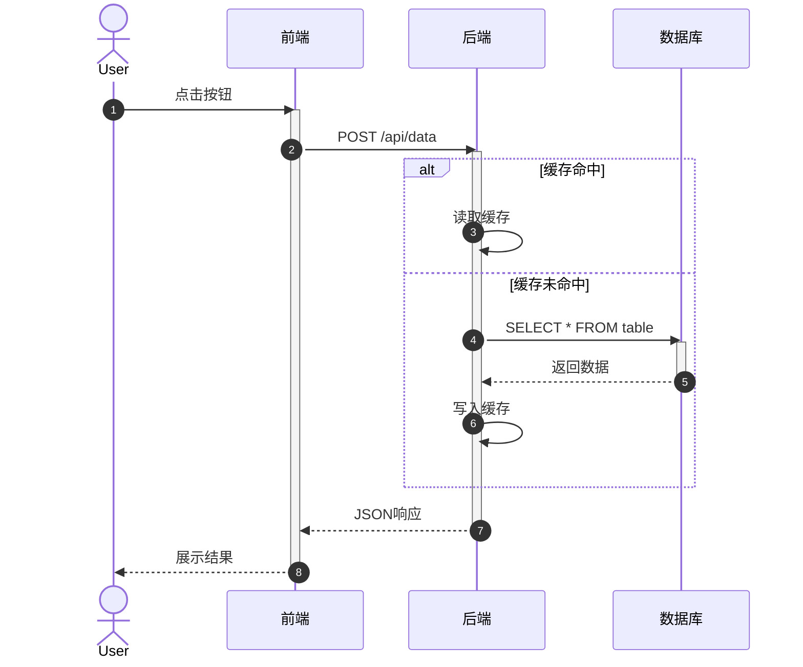
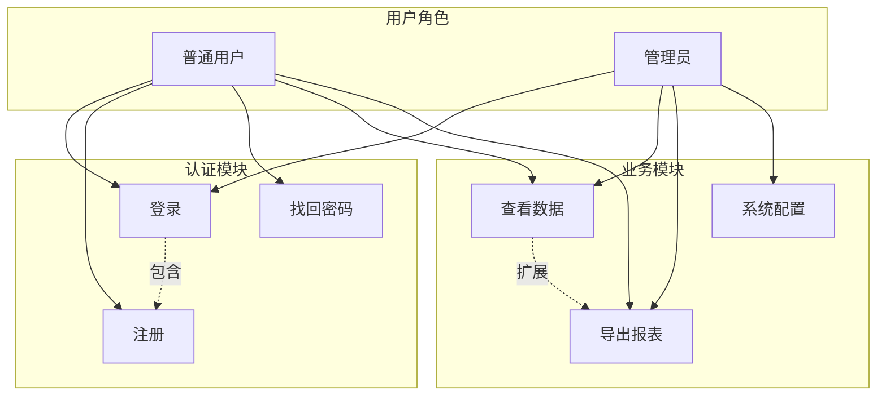
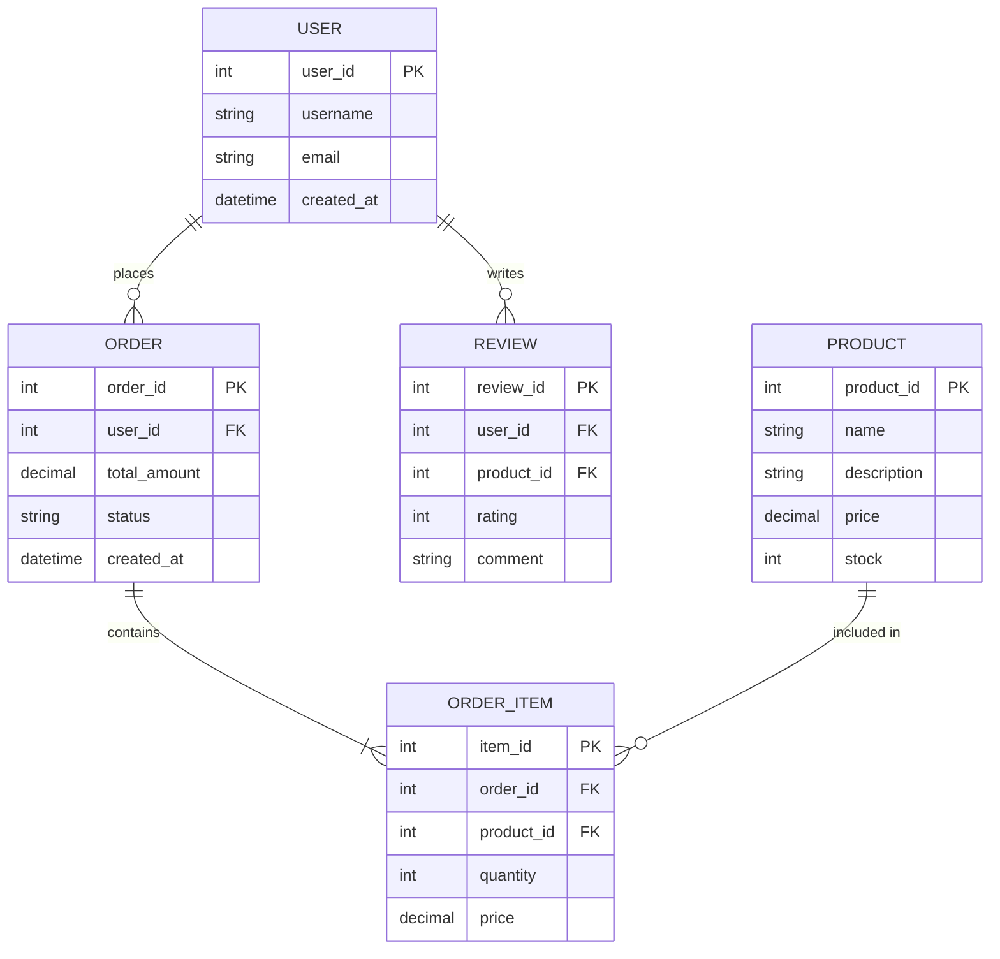
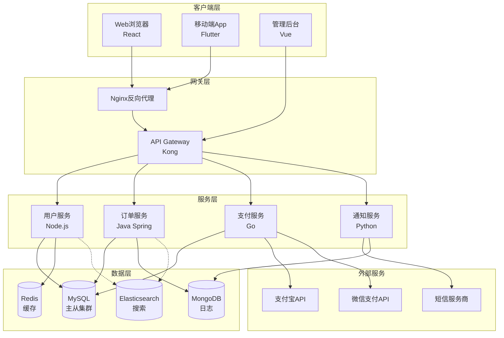
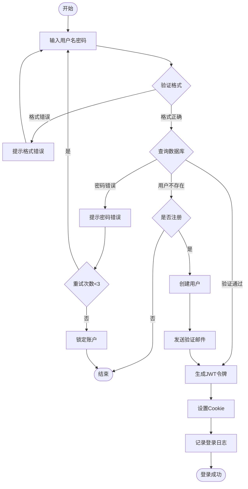
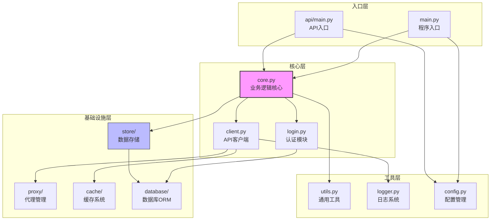
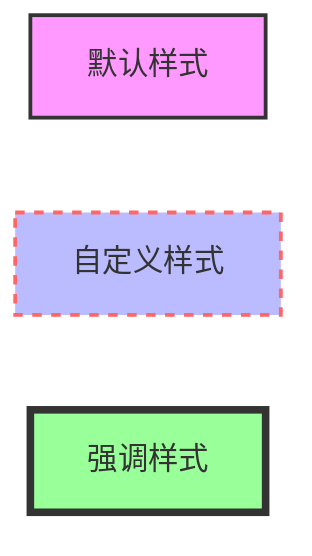
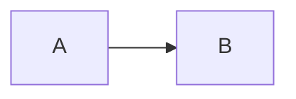
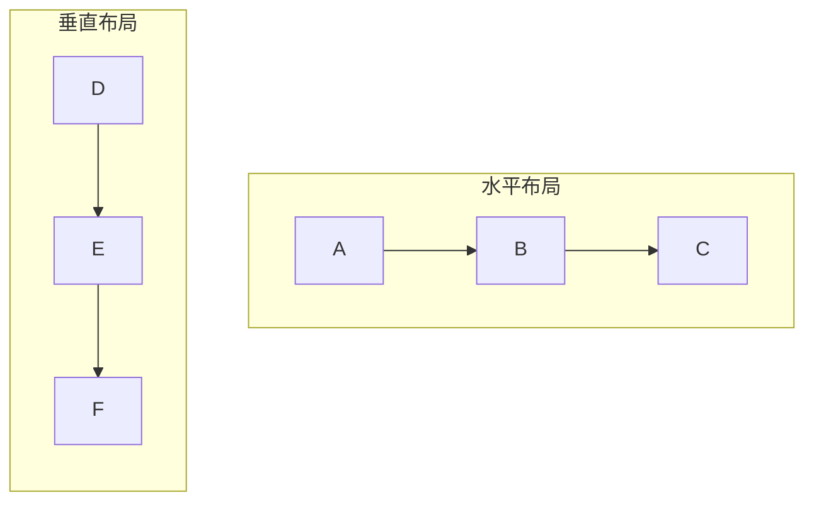

# Mermaid 语法参考

## 1. 时序图 (Sequence Diagram)

**关键语法**：
- `actor` / `participant`：定义参与者
- `->>`：实线箭头（请求）
- `-->>`：虚线箭头（返回）
- `activate` / `deactivate`：激活框
- `alt` / `else` / `end`：条件分支
- `loop` / `end`：循环
- `opt` / `end`：可选步骤
- `autonumber`：自动编号

## 2. 用例图 (Use Case Diagram)

**关键语法**：
- `subgraph`：分组
- `-->`：关联关系
- `-.包含.->`：包含关系（include）
- `-.扩展.->`：扩展关系（extend）

## 3. E-R图 (Entity Relationship Diagram)

**关键语法**：
- `||--o{`：关系类型（1对多）
- `PK`：主键
- `FK`：外键
- 关系类型：`||`（1）、`o|`（0或1）、`o{`（0或多）、`|{`（1或多）

## 4. 系统架构图 (Architecture Diagram)

**关键语法**：
- `subgraph`：层次分组
- `-->`：调用关系
- `-.->`：间接依赖
- `[文本]`：矩形节点
- `[(文本)]`：圆柱形（数据库）
- `((文本))`：圆形
- `{文本}`：菱形

## 5. 业务流程图 (Flowchart)

**关键语法**：
- `([文本])`：圆角矩形（开始/结束）
- `[文本]`：矩形（处理步骤）
- `{文本}`：菱形（判断）
- `-->|标签|`：带标签的箭头
- 方向：`TB`（上下）、`LR`（左右）、`RL`（右左）、`BT`（下上）

## 6. 模块结构图 (Module/Package Diagram)

**关键语法**：
- `subgraph`：模块分组
- `-->`：依赖/导入关系
- `style`：自定义样式
- ` `：换行

## 通用技巧

### 样式自定义

### 注释

### 子图方向

