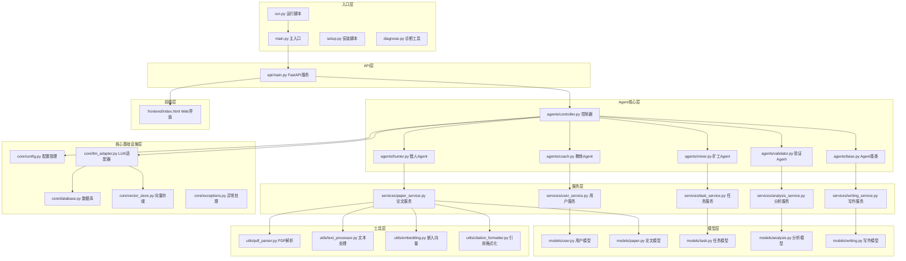

# Apricity-InnocoreAI 模块结构图

## 1. 整体模块结构

### 图表解释

#### 1. 整体概述
- 这张图讲的是：Apricity-InnocoreAI 项目的模块组织结构
- 解决什么问题：看清项目分层和各模块职责
- 核心看点：6层架构 + Agent协作模式

#### 2. 关键元素说明
- **入口层**：程序启动入口，包含主程序、运行脚本、安装和诊断工具
- **API层**：FastAPI 提供 HTTP 接口
- **Agent核心层**：5种 Agent 角色（控制器、教练、猎人、矿工、验证）+ 基类
- **服务层**：业务逻辑封装，对应用户、论文、任务、分析、写作5个领域
- **模型层**：数据模型定义
- **核心基础设施层**：配置、LLM适配、数据库、向量存储
- **工具层**：PDF解析、文本处理、嵌入向量、引用格式化
- **前端层**：Web 界面

#### 3. 关键流程/关系说明
1. 用户通过 main.py 或 API 入口进入系统
2. 控制器 Agent 协调其他 Agent 协作
3. 各 Agent 调用对应服务处理业务
4. 服务层操作模型层读写数据
5. 基础设施层提供底层支持（LLM、数据库、向量存储）

#### 4. 关键技术解释
- **多Agent协作**：控制器 + 4个角色Agent，模拟研究团队分工
- **分层架构**：入口→API→Agent→服务→模型→基础设施，职责清晰
- **向量存储**：用于论文检索和相似度匹配
- **LLM适配器**：封装不同大模型接口，便于切换

#### 5. 设计意图
- 为什么要这样设计：模拟真实学术研究团队的角色分工
- 解决了什么痛点：复杂任务拆解为多个Agent协作，降低单Agent负担
- 带来了什么好处：模块化清晰，新增Agent类型只需扩展基类
- 如果不这样会怎样：单Agent处理所有逻辑，代码臃肿，难以维护

---

*生成时间: 2026-05-14*
*模式: 深度*
*所属项目: Apricity-InnocoreAI*
*文件包含: 1 张图*
